## IMQA 3단계로 시작하기

1. **IMQA 사용 계정의 이메일 주소**와 **비밀번호**를 입력 후 [로그인]을 클릭합니다.

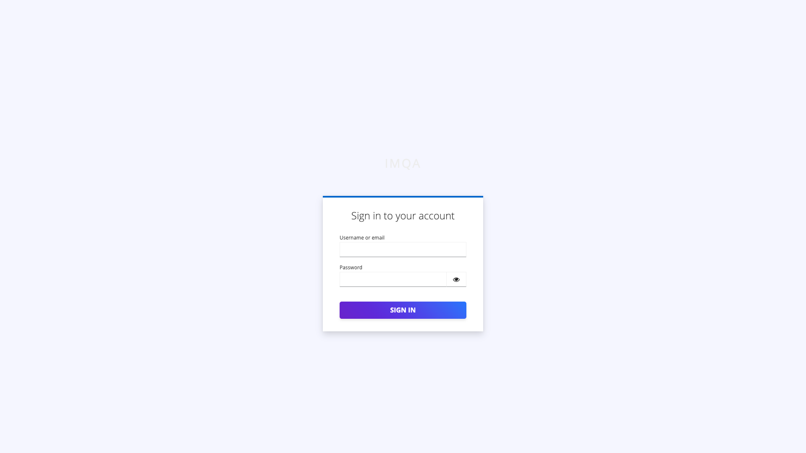
<Gha keyword="TIP" title="사용자 관리">
IMQA 사용자 관리를 통해 IMQA 사용자를 추가하고 관리할 수 있습니다. 사용자 관리에 대한 자세한 내용은 **IMQA 관리자 가이드 > 사용자 관리**를 참고하시거나, 관리자에게 문의해주세요.
</Gha>
2. **서비스 접근 권한이 있는 서비스 목록을 확인할 수 있습니다.**

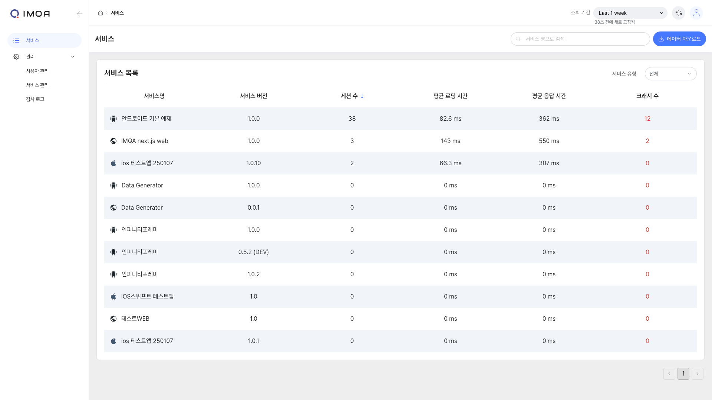
<Gha keyword="TIP" title="사용자 권한">
IMQA에는 서비스 접근 권한과 기능 접근 권한으로 구분된 권한 체계가 있습니다. 서비스 사용자는 소속 팀과 역할을 기반으로 각 권한을 상속받습니다. 사용자 권한에 대한 자세한 내용은 **IMQA 관리자 가이드 > 사용자 권한**을 참고하시거나, 관리자에게 문의해주세요.
</Gha>
3. **서비스 항목 클릭 시, 해당 서비스의 버전을 기준으로 **성능 대시보드**로 이동할 수 있습니다.**

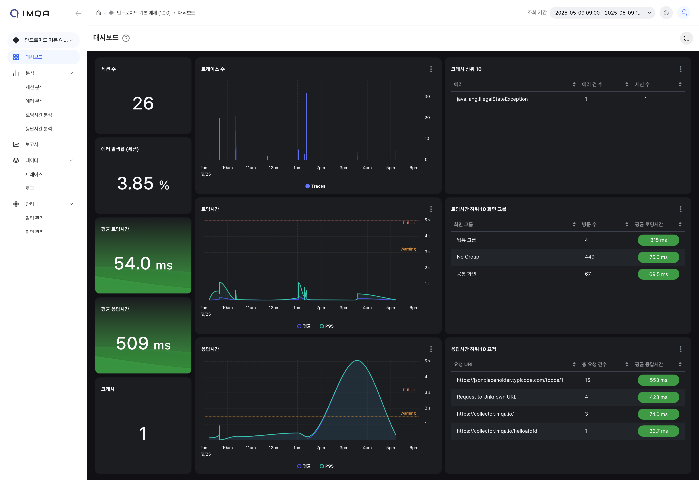

---

## 1. 서비스
---

IMQA 서비스에서 모바일 앱과 웹 서비스의 버전 별 성능을 실시간 또는 원하는 기간으로 파악할 수 있습니다.
서비스는 Android 앱, iOS 앱, Web 앱 등 애플리케이션 그룹 단위입니다. 각 애플리케이션의 버전은 데이터를 집계하고 분석하기 위한 최소 단위입니다. 즉, 모든 앱, 웹 애플리케이션의 버전 별 현황 파악을 한눈에 할 수 있습니다.


IMQA 서비스는 다음과 같이 구성됩니다.

❶ **툴바(서비스)**

❷ **서비스 목록**

---

### 툴 바


❶ **조회 조건**: 조회하고자 하는 기간을 선택할 수 있습니다. '최근 5분' 부터 '오늘' 등 빠른 버튼을 활용해 기간을 선택할 수 있으며, 'Custom' 으로 시작일시와 종료일시를 설정할 수 있습니다.
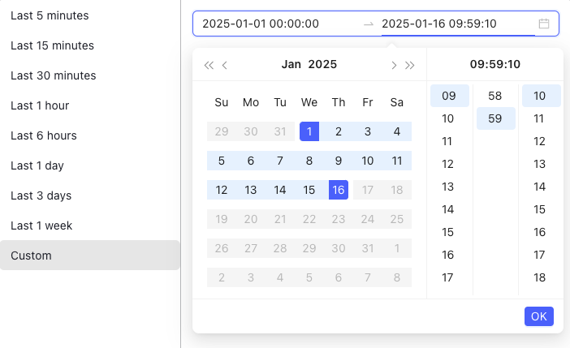

❷ **새로고침**: 현재 화면에 표시된 조회 결과 데이터를 새로고침합니다.

❸ **검색**: 원하는 키워드로 서비스를 조회할 수 있습니다. 조회하고자 하는 특정 서비스가 있을 경우 서비스 이름에 포함된 검색어를 입력합니다.

❹ **데이터 다운로드**: 현재 화면에 표시된 조회 결과를 `.xlsx`로 다운로드할 수 있습니다.

### 서비스 목록

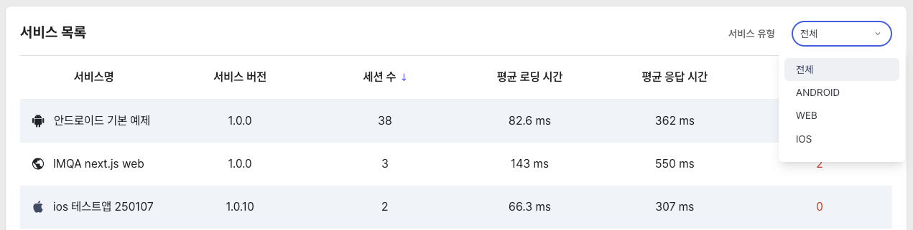

#### 필터

- **서비스 유형**: 전체, Android, iOS, WEB 유형으로 서비스 목록을 필터링합니다.

#### 서비스 목록

서비스 버전별 상태를 수치로 빠르게 파악할 수 있습니다. 기본은 세션 수(실행 수) 높은 순으로 정렬 됩니다.

- **서비스 명**: 등록한 서비스의 이름을 표시합니다.
- **서비스 버전**: 등록한 서비스의 버전을 표시합니다.
- **세션 수**: 조회 기간 동안 특정 서비스 버전이 실행된 수를 카운트합니다. 사용자 세션 수를 의미합니다.
- **평균 로딩시간**: 조회 기간 동안 특정 서비스 버전의 화면 로딩시간 평균입니다.
- **평균 응답시간**: 조회 기간 동안 특정 서비스 버전의 응답시간 평균입니다.
- **크래시 수**: 조회 기간 동안 특정 서비스 버전에서 발생한 에러를 카운트합니다.

서비스 항목 클릭 시, 해당 서비스의 버전을 기준으로 **성능 대시보드**로 이동할 수 있습니다.


---

## 2. 성능 대시보드
---

IMQA 성능 대시보드는 다양한 성능 지표 구성을 제공합니다. 대시보드를 통해 모바일 앱과 웹 서비스의 버전 별 성능을 실시간 또는 원하는 기간으로 파악할 수 있습니다. 애플리케이션 요약 정보와 주 성능 현황을 시계열 데이터로 확인할 수 있으며, 성능 하위 목록을 통해 빠르게 이슈 포인트를 파악할 수 있습니다.

<Gha keyword="WARNING" title="대시보드 임계치 설정">
대시보드의 각 지표별 임계치 설정 기능은 추후 업데이트 예정입니다. 현재는 IMQA 권고 고정된 임계치로 제공되고 있습니다.
</Gha>

<Gha keyword="WARNING" title="대시보드 상세 분석 연계 기능">
각 지표별 상세 분석 연계 기능은 추후 업데이트 예정입니다.
</Gha>


IMQA 성능 대시보드는 다음과 같이 구성됩니다.

❶ **툴바(성능 대시보드)**

❷ **앱 요약 정보**

❸ **시계열 성능 정보**

❹ **성능 하위 목록**

---

### 툴 바
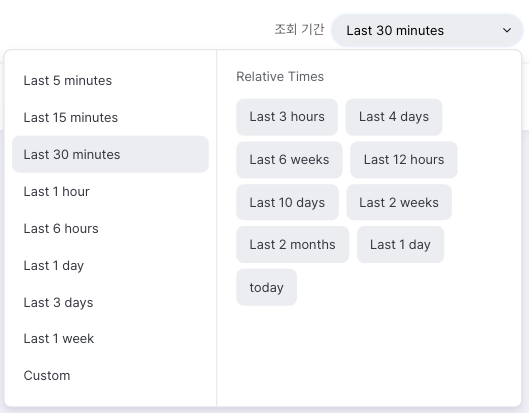

❶ **조회 조건**: 조회하고자 하는 기간을 선택할 수 있습니다. '최근 5분' 부터 '오늘' 등 빠른 버튼을 활용해 기간을 선택할 수 있으며, 'Custom' 으로 시작일시와 종료일시를 설정할 수 있습니다.


❷ **새로고침 간격**: 데이터의 새로고침 간격을 설정할 수 있습니다. '5초' 부터 '1일' 등 간격을 선택할 수 있으며, '자동 새로고침' 을 선택하면 설정한 간격으로 데이터를 새로고침 합니다.


❸ **화면 모드 변경**: 대시보드 화면을 light 모드 또는 dark 모드로 표시할 수 있습니다.

<Gha keyword="WARNING" title="모드 변경">
현재 화면 모드 변경 기능은 대시보드에서만 제공됩니다. 서비스 전체 변경은 추후 업데이트 예정입니다.
</Gha>

❹ **전체 화면**: 대시보드를 브라우저 전체 화면으로 표시할 수 있습니다. `esc` 키로 전체 화면을 해제합니다.

### 앱 요약 정보

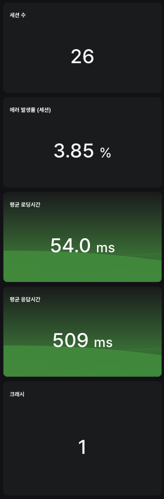
선택한 서비스 버전의 상태를 수치로 빠르게 파악할 수 있습니다.

- **세션 수**: 조회 기간 동안 해당 서비스 버전의 사용자 세션 수를 카운트합니다. 서비스가 실행된 수를 의미합니다.
- **에러 발생률 (세션)**: 조회 기간 동안 전체 사용자 세션 중 크래시가 있었던 세션의 비율입니다.
- **평균 로딩시간**: 조회 기간 동안 화면 로딩시간의 평균입니다.
- **평균 응답시간**: 조회 기간 동안 응답시간의 평균입니다.
- **크래시**: 조회 기간 동안 발생한 크래시를 카운트합니다.

**평균 로딩시간**과 **평균 응답시간** 지표의 경우, 아래의 임계치(성능 평가 기준)으로 색상 표시됩니다.


| 성능 지표/위험도 | 🟩 정상(초록색) | 🟨 경고(노란색)    | 🟥 위험(빨간색) |
| --------- | ---------- | ------------- | ---------- |
| 평균 로딩시간   | 3초 미만      | 3초 이상 5초 미만   | 5초 이상      |
| 평균 응답시간   | 1.5초 미만    | 1.5초 이상 3초 미만 | 3초 이상      |

### 시계열 성능 정보

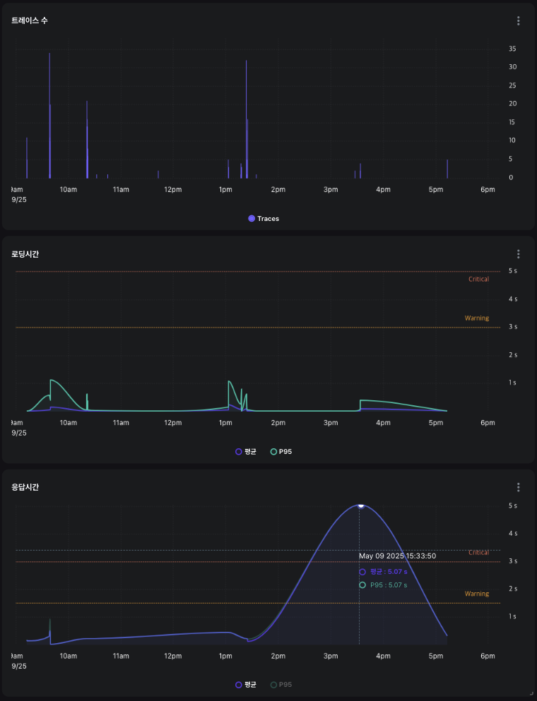

선택한 서비스 버전의 상태를 조회 기간 동안의 시계열 데이터로 확인하고, 변동 발생 시점을 감지할 수 있습니다. 평균 로딩시간과 평균 응답시간 지표의 경우, 임계치(성능 평가 기준)가 표시됩니다.

- **트레이스 수**: 서비스 내에서 발생한 액션 수를 시간대별 카운트합니다.
- **로딩시간**: 서비스 내 화면 로딩시간의 시간대별 평균입니다.
  - P95: 해당 시간대의 하위 5%의 평균
  - 평균: 해당 시간대의 전체 평균
- **응답시간**: 서비스 내 응답시간(XHR/Fetch)의 시간대별 평균입니다.
  - P95: 해당 시간대의 하위 5%의 평균
  - 평균: 해당 시간대의 전체 평균

### 성능 하위 목록
성능 하위 목록을 통해 빠르게 이슈 포인트를 파악할 수 있습니다. 평균 로딩시간과 평균 응답시간 지표의 경우, 아래의 임계치(성능 평가 기준)으로 색상 표시됩니다.

| 성능 지표/위험도 | 🟩 정상(초록색) | 🟨 경고(노란색)    | 🟥 위험(빨간색) |
| --------- | ---------- | ------------- | ---------- |
| 평균 로딩시간   | 3초 미만      | 3초 이상 5초 미만   | 5초 이상      |
| 평균 응답시간   | 1.5초 미만    | 1.5초 이상 3초 미만 | 3초 이상      |

#### 크래시 상위 10

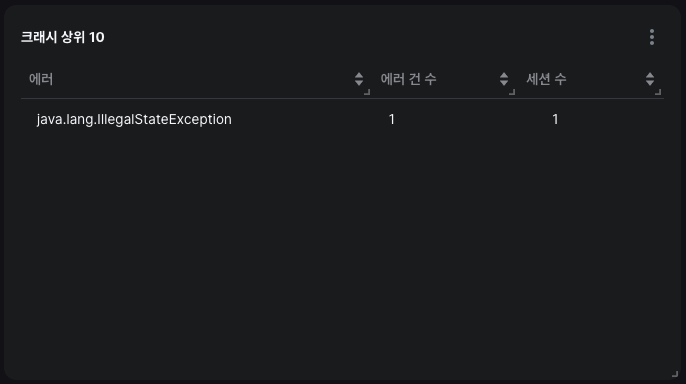

조회 기간 동안 가장 많이 발생한 크래시 10개를 표시합니다. 기본은 크래시 수 높은 순으로 정렬 됩니다.

- **에러**: 발생한 크래시의 유형 정보를 표시합니다. 동일 에러 유형으로 집계합니다.
- **에러 건 수**: 해당 에러가 발생한 수를 카운트합니다.
- **세션 수**: 해당 에러가 발생한 사용자의 세션 수를 카운트 합니다.

#### 로딩시간 하위 10 화면 그룹
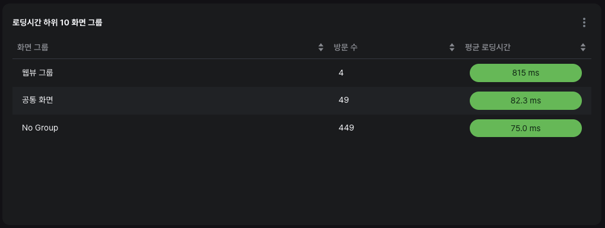
<Gha keyword="TIP" title="화면 그룹 기준 집계">IMQA에서 서비스 별 **화면 그룹 관리**를 통해 여러 화면을 주요 업무 단위 또는 메뉴 단위 등으로 그룹화하고, 집계/분석할 수 있습니다.</Gha>

<Gha keyword="NOTE" title="화면 그룹 관리">화면 그룹 단위로 집계하는 경우, 화면 그룹 생성 및 설정이 필요합니다. **화면 그룹 관리**에 대한 내용은 '관리 > 화면 그룹 관리' 를 참고하세요.</Gha>

- **화면 그룹**: IMQA에서 설정한 화면 그룹 이름을 표시합니다. 화면 그룹에 속하지 않은 화면은 `No Group`으로 집계됩니다.
- **방문 수**: 해당 화면 그룹에 속한 화면을 사용자가 요청한 수를 카운트합니다.
- **평균 로딩시간**: 해당 화면 그룹에 속한 화면의 로딩시간 평균입니다.

#### 응답시간 하위 10 요청
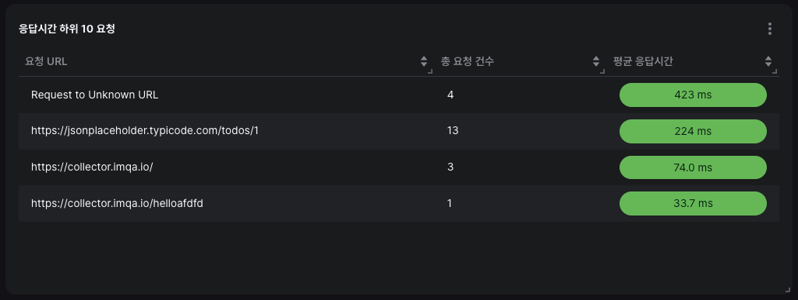
조회 기간 동안 가장 평균 응답시간이 느린 요청 URL 10개를 표시합니다. 기본은 평균 응답시간 높은 순으로 정렬 됩니다.

- **요청 URL**: 요청된 URL을 표시합니다. `http.url`을 의미합니다.
- **요청 건 수**: 해당 URL을 사용자가 요청한 수를 카운트합니다. URL 호출 수를 의미합니다.
- **평균 응답시간**: 해당 URL의 응답시간 평균입니다.

### 위젯 메뉴
- **시계열 성능 정보** 지표 > 위젯 메뉴에서, 지표 확대 보기가 가능합니다.
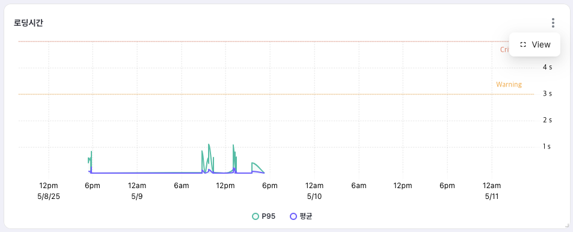
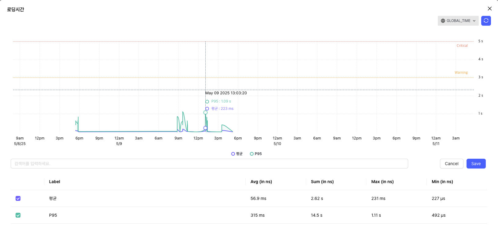
- **성능 하위 목록** 지표 > 위젯 메뉴에서, 지표 확대 보기와 CSV 다운로드가 가능합니다.
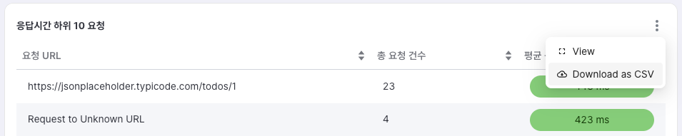


---

## 3. 분석
---

## 3-1. 세션 분석

IMQA 세션 분석은 사용자의 앱 실행 시작 시점부터 종료 시점까지의 흐름을 추적하고 다양한 지표 구성을 제공합니다. 하나의 세션은 여러 개의 트레이스로 구성되며, 트레이스는 앱 내에서 발생한 특정 행동을 나타내는 단위입니다. 화면 로딩, 앱 상태(Foreground, Background), 네트워크 요청/응답, 사용자 이벤트, 로그, 에러 등 다양한 유형을 제공합니다.

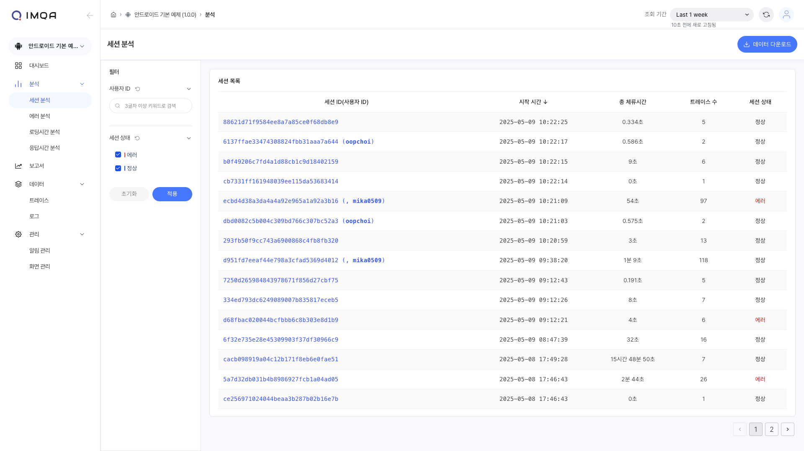

IMQA 세션 분석은 다음과 같이 구성됩니다.

❶ **툴바(세션 분석)**

❷ **필터**

❸ **세션 목록**

---

### 툴 바

❶ **조회 조건**: 조회하고자 하는 기간을 선택할 수 있습니다. '최근 5분' 부터 '오늘' 등 빠른 버튼을 활용해 기간을 선택할 수 있으며, 'Custom' 으로 시작일시와 종료일시를 설정할 수 있습니다.

❷ **새로고침**: 현재 화면에 표시된 조회 결과 데이터를 새로고침합니다.

❸ **데이터 다운로드**: 조회 결과를 `.xlsx`로 다운로드할 수 있습니다.

### 필터

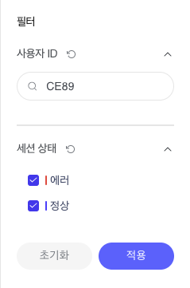

❶ 원하는 사용자 ID 정보로 세션을 조회할 수 있습니다. 조회하고자 하는 특정 사용자가 있을 경우 사용자 ID에 포함된 3글자 이상의 검색어를 입력합니다.

<Gha keyword="TIP" title="사용자 ID 설정">IMQA는 SDK, WebAgent를 통한 데이터 수집시 특정 사용자를 식별하기 위한 **사용자 ID** 정보를 설정할 수 있습니다. **사용자 ID 정보 설정**은 =='SDK Agent 설치 가이드 > Custom User ID 설정'== 을 참고하세요.</Gha>

❷ 세션 상태 필터를 통해 문제가 발생한 세션만 조회할 수 있습니다. 기본 '전체'로 설정되어 있습니다.

- **에러**: 해당 세션에 에러(Crash, ANR, Error)가 1건 이상
- **정상**: 그 외

❸ [적용]을 클릭하면 선택한 필터 기준으로 데이터가 조회됩니다.

### 세션 목록

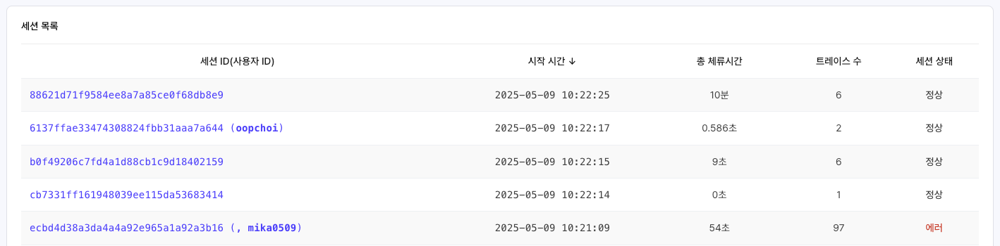
선택한 서비스 버전을 실행했던 사용자의 행동 흐름을 확인할 수 있습니다. 수집된 사용자 식별 정보, 앱 시작 시간, 총 체류 시간, 서비스 내에서 발생한 특정 액션 수, 세션 상태를 표시합니다. 이를 통해 이슈가 있었던 사용자의 행동 흐름을 빠르게 파악 가능하며, '세션 상세'로 이동하여 분석할 수 있습니다. 기본은 최근 시작 순으로 정렬 됩니다.

- **세션 ID(사용자 ID)**: IMQA가 특정 세션을 식별하기 위해 부여한 고유 키를 표시합니다. SDK, WebAgent에서 설정한 사용자의 ID 정보가 수집되었을 경우 추가 표시합니다.
- **시작 시간**: 해당 세션의 시작 시간을 표시합니다.
- **총 체류시간**: 해당 세션의 시작 시간부터 마지막 액션까지를 체류 시간으로 표시합니다.
- **트레이스 수**: 해당 세션에서 발생한 액션 수를 카운트합니다.
- **세션 상태**: 해당 세션의 문제 발생 여부를 표시합니다.
  - 에러: 해당 세션에 에러(Crash, ANR, Error)가 1건 이상
  - 정상: 그 외

세션 목록에서 특정 세션을 클릭하면 **세션 상세 (트레이스 목록)** 페이지로 이동할 수 있습니다.

### 세션 상세 (트레이스 목록)

특정 세션을 기준으로, 앱 실행 시작 시점부터 종료 시점까지 발생한 여러 액션을 트레이스로 확인할 수 있습니다.
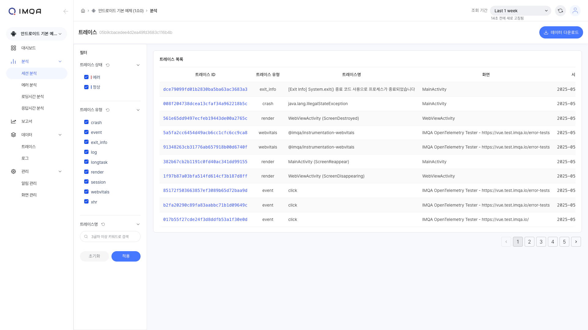

#### 필터


❶ 트레이스 상태 필터를 통해 문제가 발생한 트레이스만 조회할 수 있습니다. 기본 '전체'로 설정되어 있습니다.

- **에러**: Crash, ANR, Error
- **정상**: 그 외

❷ 트레이스 유형 필터를 통해 원하는 트레이스 유형만 조회할 수 있습니다. 기본 '전체'로 설정되어 있습니다.

- **xhr** `Android` `iOS` `Web`
- **render** `Android` `iOS` `Web`
- **error** `Web`
- **event** `Android` `iOS` `Web`
- **log** `Android` `Web`
- **crash** `Android` `iOS` 
- **anr** `Android` 
- **websocket** `Web`
- **webvitals** `Web`
- **visibility** `Web`
- **connectivity** `Web`
- **longtask** `Web`
- **route** `Web`
- **post-docs** `Web`

❸ 원하는 트레이스 이름을 조회할 수 있습니다. 조회하고자 하는 특정 정보가 있을 경우 트레이스 이름에 포함된 3글자 이상의 검색어를 입력합니다.

❹ [적용]을 클릭하면 선택한 필터 기준으로 데이터가 조회됩니다.

#### 트레이스 목록


선택한 세션에서 발생한 여러 액션을 트레이스로 확인할 수 있습니다. 트레이스 유형, 트레이스 이름, 액션이 발생한 화면, 액션 시작 시간, 액션이 수행된 시간, 상태를 표시합니다. 이를 통해 사용자의 서비스 이용 중 어떤 일들이 있었는지를 한눈에 확인할 수 있습니다. 기본은 최근 트레이스 순으로 정렬 됩니다.

- **트레이스 ID**: IMQA가 특정 액션을 식별하기 위해 부여한 고유 키를 표시합니다.
- **트레이스 유형**: 해당 트레이스의 유형을 표시합니다.
- **트레이스 명**: 해당 트레이스를 대표하는 정보를 표시합니다.
- **화면**: 해당 트레이스가 발생한 화면을 표시합니다.
- **시작 시간**: 해당 트레이스가 시작된 시간을 표시합니다.
- **소요 시간**: 해당 트레이스가 수행된 시간을 표시합니다.
- **트레이스 상태**: 해당 트레이스의 문제 발생 여부를 표시합니다.
  - 에러: Crash, ANR, Error
  - 정상: 그 외

트레이스 목록에서 특정 트레이스를 클릭하면 **트레이스 상세** 페이지로 이동할 수 있습니다.

<Gha keyword="NOTE" title="트레이스 상세 가이드">**트레이스 상세**에 대한 내용은 '데이터 > 트레이스 > 트레이스 상세' 를 참고하세요.</Gha>

---

## 3-2. 에러 분석

IMQA 에러 분석은 기간 내 서비스에서 발생한 크래시, ANR, 웹 에러를 통합적 관점에서 확인할 수 있습니다. 하나의 항목은 동일한 에러 유형, 메시지일 경우 같은 에러로 그룹핑 됩니다. 해당 에러가 발생한 건 수와 발생한 사용자 세션 수를 확인하여 서비스 영향도를 파악할 수 있습니다. Crash, ANR, Error 유형을 제공하며, 특정 에러를 기준으로 로그 분석 화면과 연결됩니다.

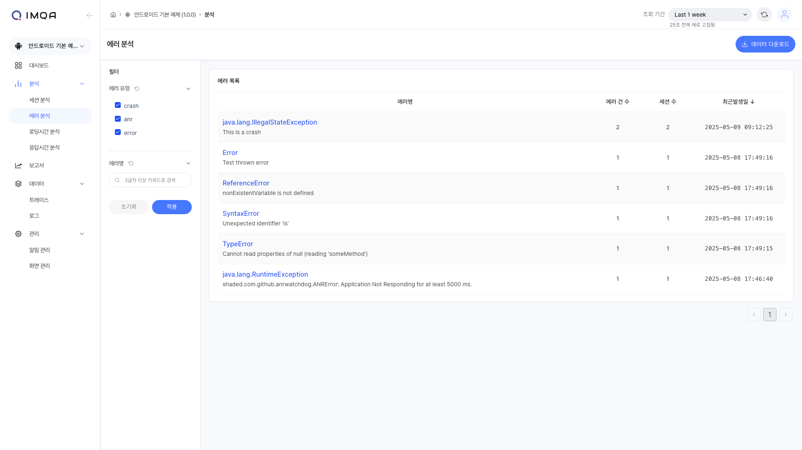

IMQA 에러 분석은 다음과 같이 구성됩니다.

❶ **툴바(에러 분석)**

❷ **필터**

❸ **에러 목록**

---

### 툴 바

❶ **조회 조건**: 조회하고자 하는 기간을 선택할 수 있습니다. '최근 5분' 부터 '오늘' 등 빠른 버튼을 활용해 기간을 선택할 수 있으며, 'Custom' 으로 시작일시와 종료일시를 설정할 수 있습니다.

❷ **새로고침**: 현재 화면에 표시된 조회 결과 데이터를 새로고침합니다.

❸ **데이터 다운로드**: 현재 화면에 표시된 조회 결과를 `.xlsx`로 다운로드할 수 있습니다.

<Gha keyword="WARNING" title="에러 분석 데이터 다운로드">
현재 에러 분석 [데이터 다운로드]는 화면에 표시된 1 페이지 단위로 제공됩니다.
</Gha>

### 필터

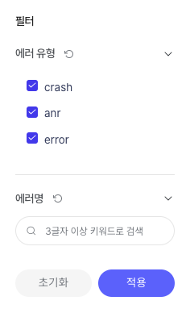

❶ 에러 유형 필터를 통해 원하는 에러 유형만 조회할 수 있습니다. 기본 '전체'로 설정되어 있습니다.
- **crash** `Android` `iOS`
- **anr** `Android`
- **error** `Web`

❷ 원하는 에러명(에러 유형)을 조회할 수 있습니다. 조회하고자 하는 특정 정보가 있을 경우 에러 유형에 포함된 3글자 이상의 검색어를 입력합니다.

❸ [적용]을 클릭하면 선택한 필터 기준으로 데이터가 조회됩니다.

### 에러 목록

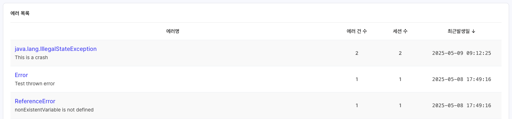
선택한 서비스 버전에서 발생한 에러를 확인할 수 있습니다. 에러명(에러 유형, 메시지), 에러 건 수, 세션 수, 최근발생일을 표시합니다. 이를 통해 서비스 영향도가 높은 에러를 빠르게 파악 가능하며, '에러 상세'로 이동하여 분석할 수 있습니다. 기본은 최근 발생일시 순으로 정렬 됩니다.

- **에러명**: 에러 유형과 메시지를 조합하여 집계 표시합니다. 동일한 에러 유형, 메시지일 경우 같은 에러로 그룹핑 됩니다.
- **에러 건 수**: 해당 에러가 발생한 수를 카운트합니다.
- **세션 수**: 해당 에러가 발생한 사용자 세션 수를 카운트합니다. 세션은 사용자의 앱 실행 시작 부터 종료 까지의 단위입니다.
- **최근발생일**: 해당 에러의 마지막 발생 일시를 표시합니다.

에러 목록에서 특정 에러를 클릭하면 **에러 상세 (로그 목록)** 페이지로 이동할 수 있습니다.

### 에러 상세 (로그 목록)

특정 에러를 기준으로, 발생 내역을 로그로 확인할 수 있습니다.

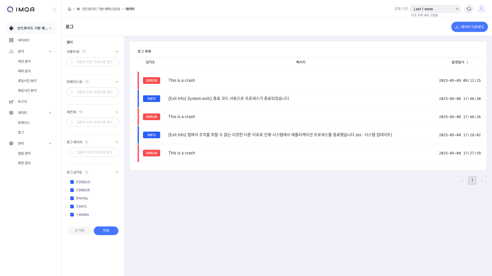

<Gha keyword="NOTE" title="로그 상세 가이드">**로그 목록**과 *로그 상세**에 대한 내용은 '데이터 > 로그' 를 참고하세요.</Gha>


---
## 3-3. 화면 분석

IMQA 화면 분석은 기간 내 사용자가 방문한 여러 화면의 성능을 통합적 관점에서 확인할 수 있습니다. 해당 화면의 방문 수와 평균 성능, 발생한 에러 건 수를 확인하여 화면별 성능 현황과 방문율에 따른 사용자 영향도를 파악할 수 있습니다.

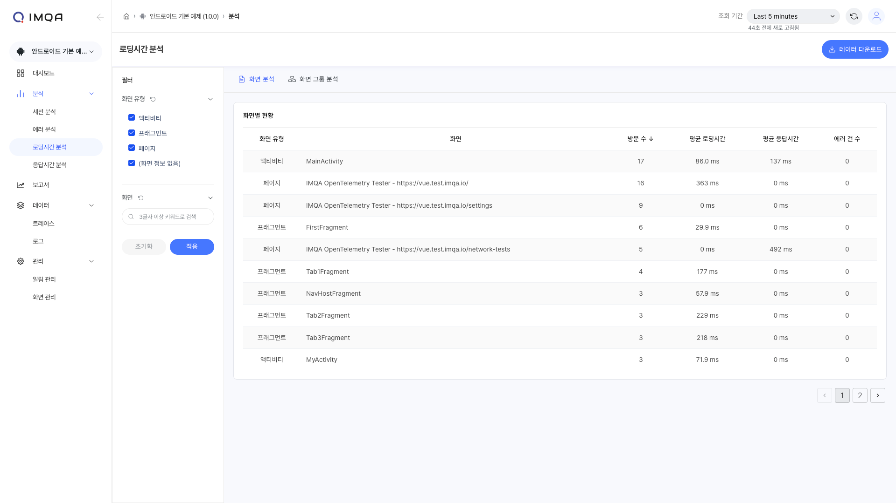

IMQA 화면 분석은 다음과 같이 구성됩니다.

❶ **툴바(화면 분석)**

❷ **필터**

❸ **화면별 현황**

---

### 툴 바

❶ **조회 조건**: 조회하고자 하는 기간을 선택할 수 있습니다. '최근 5분' 부터 '오늘' 등 빠른 버튼을 활용해 기간을 선택할 수 있으며, 'Custom' 으로 시작일시와 종료일시를 설정할 수 있습니다.

❷ **새로고침:** 현재 화면에 표시된 조회 결과 데이터를 새로고침합니다.

❸ **데이터 다운로드:** 현재 화면에 표시된 조회 결과를 `.xlsx`로 다운로드할 수 있습니다.

<Gha keyword="WARNING" title="화면 분석 데이터 다운로드">
현재 화면 분석 [데이터 다운로드]는 화면에 표시된 1 페이지 단위로 제공됩니다.
</Gha>

### 필터

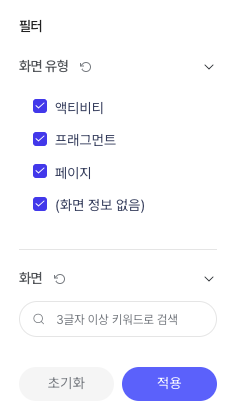

❶ 화면 유형 필터를 통해 원하는 화면 유형만 조회할 수 있습니다. 기본 '전체'로 설정되어 있습니다.

- **액티비티** `Android`
- **뷰** `iOS`
- **프래그먼트** `Android`
- **페이지** `Web`
- **(화면 정보 없음)**

<Gha keyword="NOTE" title="(화면 정보 없음)과 'No Screen'">IMQA는 SDK, WebAgent를 통한 데이터 수집시, 네이티브 화면과 웹 페이지 정보를 자동으로 수집합니다. `(화면 정보 없음)`은 성능 데이터 등이 수집되었으나, 화면의 정보를 수집하지 못한 경우 `No Screen`으로 구분한 화면을 의미합니다.</Gha>

❷ 조회하고자 하는 특정 화면이 있을 경우 화면 이름에 포함된 3글자 이상의 검색어를 입력합니다.

❸ [적용]을 클릭하면 선택한 필터 기준으로 데이터가 조회됩니다.

### 화면별 현황


선택한 서비스 버전에서 수집된 화면별 현황을 확인할 수 있습니다. 화면 유형, 화면 이름, 방문 수, 평균 로딩시간과 응답시간, 에러 건 수를 표시합니다. 이를 통해 사용자 영향도가 높은 화면을 빠르게 파악 가능합니다. 기본은 방문 수 높은 순으로 정렬 됩니다.

- **화면 유형**: 해당 화면의 유형을 표시합니다.
- **방문 수**: 해당 화면을 사용자가 요청한 수를 카운트합니다.
- **평균 로딩시간**: 해당 화면의 로딩시간 평균입니다.
- **평균 응답시간**: 해당 화면의 응답시간 평균입니다.
- **에러 건 수**: 해당 화면에서 발생한 Crash, ANR, Error 를 카운트합니다.

<Gha keyword="WARNING" title="화면 연계 분석">
화면 기준으로 상세 분석 연계 기능은 추후 업데이트 예정입니다.
</Gha>

---
## 3-4. 화면 그룹 분석

IMQA 화면 그룹 분석은 기간 내 주요 업무 단위 또는 메뉴 단위 등 화면 그룹 관점에서 확인할 수 있습니다. 해당 화면 그룹의 방문 수와 평균 성능, 발생한 에러 건 수를 확인하여 화면 그룹별 성능 현황과 방문율에 따른 사용자 영향도를 파악할 수 있습니다.

<Gha keyword="NOTE" title="화면 그룹 가이드">화면 그룹 단위로 집계하는 경우, 화면 그룹 생성 및 설정이 필요합니다. 화면 그룹 관리에 대한 내용은 **관리 > 화면 그룹 관리** 를 참고하세요.</Gha>

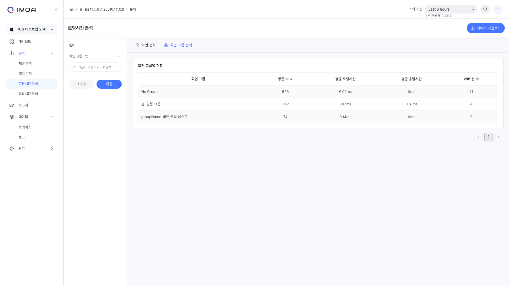

IMQA 화면 그룹 분석은 다음과 같이 구성됩니다.

❶ **툴바(화면 그룹 분석)**

❷ **필터**

❸ **화면 그룹별 현황**

---

### 툴 바

❶ **조회 조건:** 조회하고자 하는 기간을 선택할 수 있습니다. '최근 5분' 부터 '오늘' 등 빠른 버튼을 활용해 기간을 선택할 수 있으며, 'Custom' 으로 시작일시와 종료일시를 설정할 수 있습니다.

❷ **새로고침:** 현재 화면에 표시된 조회 결과 데이터를 새로고침합니다.

**❸ 데이터 다운로드:** 현재 화면에 표시된 조회 결과를 `.xlsx`로 다운로드할 수 있습니다. 

<Gha keyword="WARNING" title="화면 그룹 분석 데이터 다운로드">
현재 화면 그룹 분석 [데이터 다운로드]는 화면에 표시된 1 페이지 단위로 제공됩니다.
</Gha>

### 필터

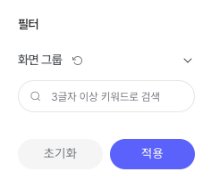

❶ 조회하고자 하는 특정 화면 그룹이 있을 경우 화면 그룹 이름에 포함된 3글자 이상의 검색어를 입력합니다.

❷ [적용]을 클릭하면 선택한 필터 기준으로 데이터가 조회됩니다.

### 화면 그룹별 현황

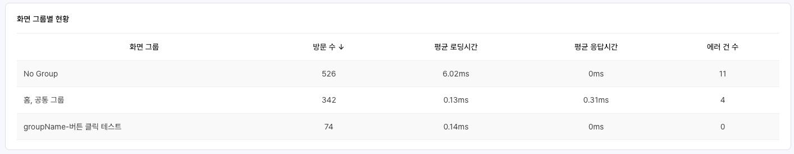

화면 그룹별 현황을 확인할 수 있습니다. 화면 그룹 이름, 방문 수, 평균 로딩시간과 응답시간, 에러 건 수를 표시합니다. 이를 통해 사용자 영향도가 높은 화면 그룹을 빠르게 파악 가능합니다. 기본은 방문 수 높은 순으로 정렬 됩니다.

- **화면 그룹**: IMQA에서 설정한 화면 그룹 이름을 표시합니다. 화면 그룹에 속하지 않은 화면은 `No Group`으로 집계됩니다.
- **방문 수**: 해당 화면 그룹에 속한 화면을 사용자가 요청한 수를 카운트합니다. 
- **평균 로딩시간**: 해당 화면 그룹에 속한 화면의 로딩시간 평균입니다.
- **평균 응답시간**: 해당 화면 그룹에 속한 화면의 응답시간 평균입니다.
- **에러 건 수**: 해당 화면 그룹에 속한 화면에서 발생한 Crash, ANR, Error 를 카운트합니다.

<Gha keyword="WARNING" title="화면 그룹 연계 분석">
화면 그룹 기준으로 상세 분석 연계 기능은 추후 업데이트 예정입니다.
</Gha>

---
## 3-5. 응답시간 분석

IMQA 응답시간 분석은 기간 내 서버로 데이터를 요청하고 응답받은 XHR/Fetch 성능을 확인 할 수 있습니다. 트레이스 데이터를 사용자의 세션 분석으로 연계하여 분석할 수 있습니다.

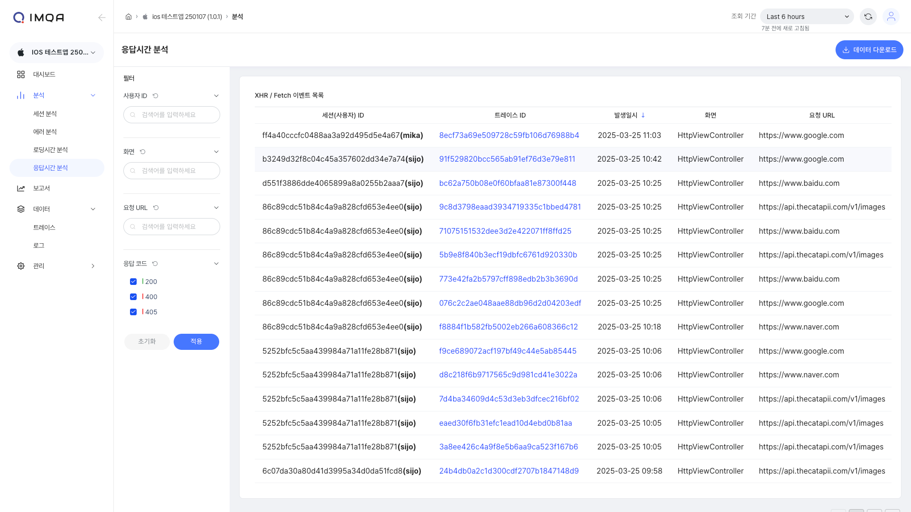

IMQA 응답시간 분석은 다음과 같이 구성됩니다.

❶ **툴바(응답시간 분석)**

❷ **필터**

❸ **XHR / Fetch 이벤트 목록**

---

### 툴 바

❶ **조회 조건:** 조회하고자 하는 기간을 선택할 수 있습니다. '최근 5분' 부터 '오늘' 등 빠른 버튼을 활용해 기간을 선택할 수 있으며, 'Custom' 으로 시작일시와 종료일시를 설정할 수 있습니다.

❷ **새로고침:** 현재 화면에 표시된 조회 결과 데이터를 새로고침합니다.

**❸ 데이터 다운로드:** 현재 화면에 표시된 조회 결과를 `.xlsx`로 다운로드할 수 있습니다. 

<Gha keyword="WARNING" title="응답시간 분석 데이터 다운로드">
현재 응답시간 분석 [데이터 다운로드]는 화면에 표시된 1 페이지 단위로 제공됩니다.
</Gha>

### 필터

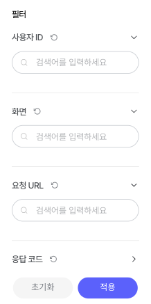

❶ 원하는 사용자 ID 정보로 API 요청을 조회할 수 있습니다. 조회하고자 하는 특정 사용자가 있을 경우 사용자 ID에 포함된 3글자 이상의 검색어를 입력합니다.

<Gha keyword="TIP" title="사용자 ID 설정">IMQA는 SDK, WebAgent를 통한 데이터 수집시 특정 사용자를 식별하기 위한 사용자 ID 정보를 설정할 수 있습니다. 사용자 ID 정보 설정은 'SDK Agent 설치 가이드 > Custom User ID 설정' 을 참고하세요.</Gha>

❷ 조회하고자 하는 특정 화면이 있을 경우 화면 이름에 포함된 3글자 이상의 검색어를 입력합니다.

❸ 조회하고자 하는 특정 요청 URL이 있을 경우 URL에 포함된 3글자 이상의 검색어를 입력합니다.

❹ 응답 코드 필터를 통해 특정 응답 코드만 조회할 수 있습니다. 기본 ‘전체’로 설정되어 있습니다.

❺ [적용]을 클릭하면 선택한 필터 기준으로 데이터가 조회됩니다.

### XHR / Fetch 이벤트 목록

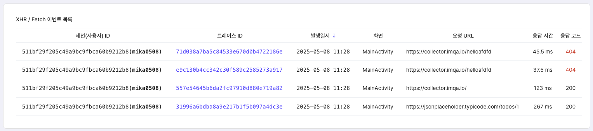

선택한 서비스 버전에서 수집된 XHR / Fetch 이벤트 성능 현황을 확인할 수 있습니다. 사용자 ID, 발생일시, 화면, 요청 URL, 응답시간과 응답 코드를 표시합니다. 이를 통해 성능 저하가 발생한 요청을 빠르게 파악 가능합니다. 기본은 최근 발생일시 순으로 정렬 됩니다.

- **세션 ID(사용자 ID)**: IMQA가 특정 세션을 식별하기 위해 부여한 고유 키를 표시합니다. SDK, WebAgent에서 설정한 사용자의 ID 정보가 수집되었을 경우 추가 표시합니다.
- **트레이스 ID**: IMQA가 특정 액션을 식별하기 위해 부여한 고유 키를 표시합니다.
- **발생일시**: 해당 요청의 발생시간을 표시합니다.
- **화면**: 해당 요청이 발생한 화면 정보를 표시합니다.
- **요청 URL**: 요청 URL을 표시합니다. `http.url`을 의미합니다.
- **응답 시간**: 해당 요청의 응답까지 걸린 시간을 표시합니다.
- **응답 코드**: 해당 요청의 응답 코드 정보를 표시합니다. 4xx, 5xx인 경우 빨간색으로 표시됩니다.

XHR / Fetch 이벤트 목록에서 특정 트레이스 ID 를 클릭하면 **트레이스 상세** 페이지를 표시합니다.

### XHR / Fetch 이벤트 상세 (트레이스 상세)
특정 XHR / Fetch 이벤트를 기준으로, 시작 시점부터 종료 시점까지 상세 분석이 가능합니다.

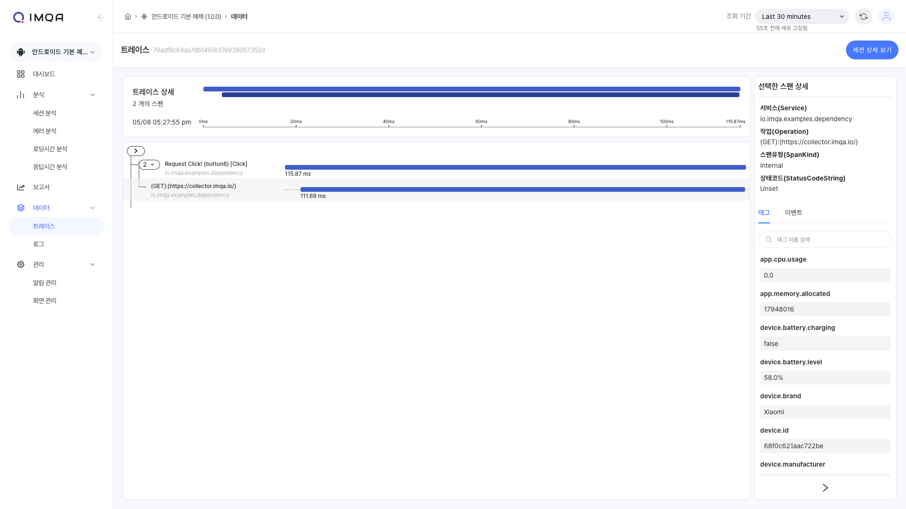

<Gha keyword="NOTE" title="트레이스 상세 가이드">**트레이스 상세**에 대한 내용은 '데이터 > 트레이스 > 트레이스 상세' 를 참고하세요.</Gha>


---

## 4. 보고서
---

IMQA 보고서로 원하는 조회 기간과 집계 지표를 선택하여 보고서를 생성하고 다운로드할 수 있습니다. 정기적인 기간 데이터 집계로 내부 업무 공유 및 성과 보고 등에 활용할 수 있습니다. 집계 결과를 `.zip` 또는 `.xlsx`로 다운로드할 수 있습니다.

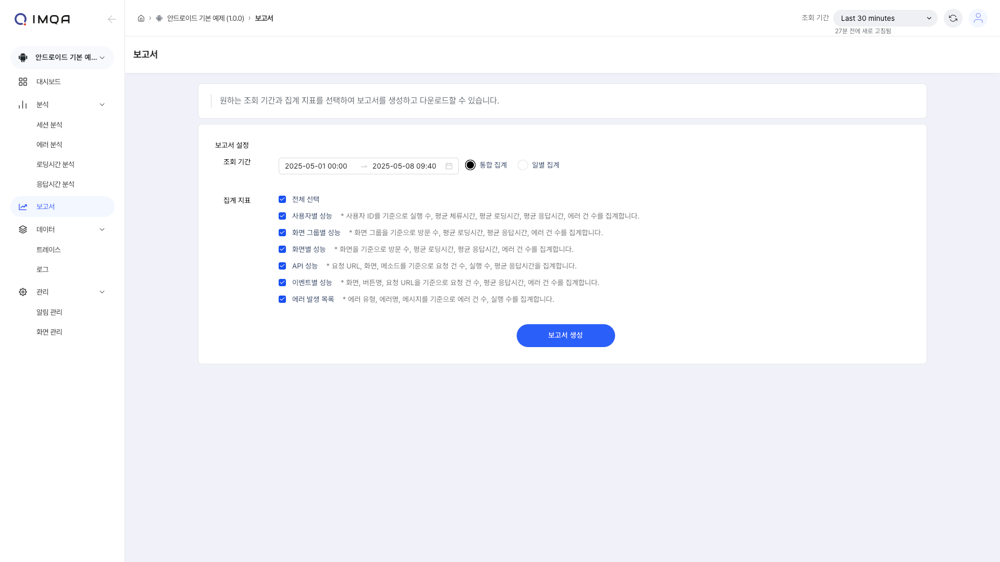

IMQA 보고서는 다음과 같이 구성됩니다.

❶ **보고서 설정**

---

### 보고서 설정
보고서 데이터 조회 기간을 시작일시~종료일시로 설정할 수 있습니다. 집계한 데이터를 통합된  `.xlsx` 파일로 생성하거나, 일자별로 분리된  `.xlsx` 파일로 생성할 수 있습니다.

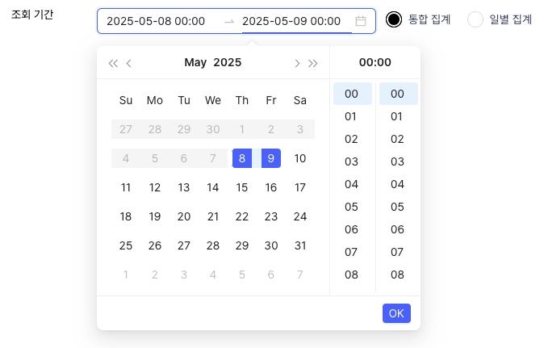

❶ **조회 기간:** 조회하고자 하는 기간을 선택할 수 있습니다. 시작일시와 종료일시를 설정할 수 있으며, 시간의 경우 '시작시간 이상 종료시간 미만'으로 동작됩니다.

❷ **통합 집계/일별 집계:** 보고서 생성 시, 통합 또는 일별 집계로 설정할 수 있습니다.
- **통합 집계**: 선택한 기간의 데이터를 하나의 `.xlsx` 파일로 통합하여 생성합니다.
- **일별 집계**: 선택한 기간의 데이터를 일별 `.xlsx` 파일로 분리하여 생성합니다. `.zip` 으로 다운로드 됩니다.

**❸ 집계 지표:** 집계할 지표를 선택합니다. 사용자 ID, 화면 그룹 등 다양한 기준을 선택할 수 있습니다.

❹ 보고서 설정이 완료되면 [보고서 생성] 버튼을 클릭합니다.

<Gha keyword="TIP" title="보고서 생성">
보고서 생성 시, 약 1~2분 이내 또는 조회 기간에 따라 그 이상의 시간이 소요될 수 있습니다. 페이지를 이동하는 경우, 보고서 생성이 취소되므로 잠시만 기다려 주세요.
</Gha>

#### | Android / iOS 집계 지표
Android와 iOS 서비스 유형에서 OS별, 디바이스별, 통신사별, 사용자 별 등 여러 집계 지표를 설정할 수 있습니다.

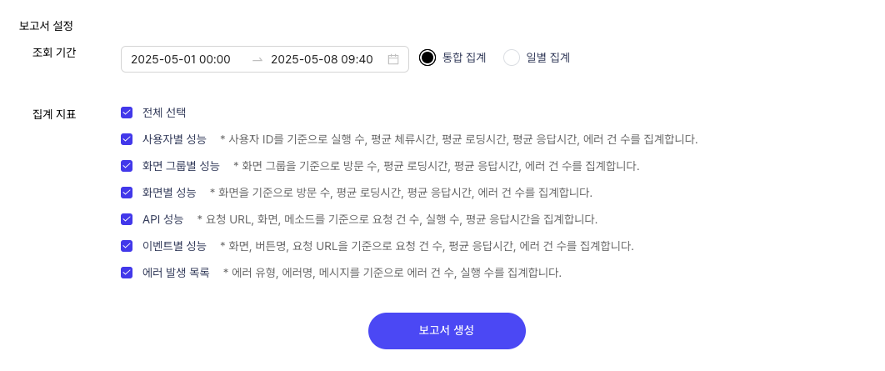
<Gha keyword="TIP" title="사용자 ID 기준 집계">IMQA는 SDK, WebAgent를 통한 데이터 수집시 특정 사용자를 식별하기 위한 사용자 ID 정보를 설정할 수 있습니다. 사용자 ID 정보 설정은 'SDK Agent 설치 가이드 > Custom User ID 설정' 을 참고하세요.</Gha>

<Gha keyword="TIP" title="화면 그룹 기준 집계">IMQA에서 서비스 별 **화면 그룹 관리**를 통해 여러 화면을 주요 업무 단위 또는 메뉴 단위 등으로 그룹화하고, 집계/분석할 수 있습니다.</Gha>

#### | Web 집계 지표
Web 서비스 유형에서 디바이스별, 브라우저별, 사용자별, 화면 그룹별 등 여러 집계 지표를 설정할 수 있습니다.

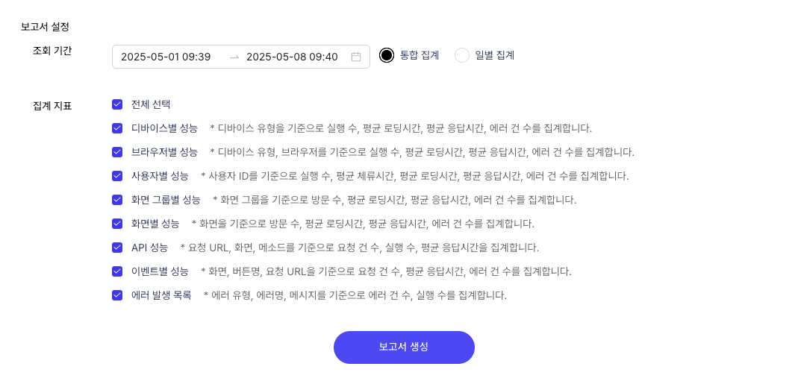

<Gha keyword="TIP" title="사용자 ID 기준 집계">IMQA는 SDK, WebAgent를 통한 데이터 수집시 특정 사용자를 식별하기 위한 사용자 ID 정보를 설정할 수 있습니다. 사용자 ID 정보 설정은 'SDK Agent 설치 가이드 > Custom User ID 설정' 을 참고하세요.</Gha>

<Gha keyword="TIP" title="화면 그룹 기준 집계">IMQA에서 서비스 별 **화면 그룹 관리**를 통해 여러 화면을 주요 업무 단위 또는 메뉴 단위 등으로 그룹화하고, 집계/분석할 수 있습니다.</Gha>

### 보고서 다운로드
보고서 생성이 완료되면 `.zip` 또는 `.xlsx`  파일이 자동으로 다운로드 됩니다.

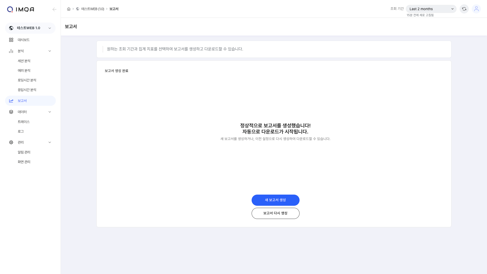

- [새 보고서 생성] 버튼 클릭 시, 다시 보고서 설정 화면으로 이동합니다.
- [보고서 다시 생성] 버튼 클릭 시, 이전 보고서 설정을 유지하여 다시 보고서 설정 화면으로 이동합니다.

---

## 5. 데이터
---

## 5-1. 트레이스

IMQA 트레이스는 앱 내에서 발생한 다양한 행동 (이하 액션) 데이터를 탐색하고 분석할 수 있습니다.
화면 로딩, 앱 상태(Foreground, Background), 네트워크 요청/응답, 사용자 이벤트, 로그, 에러 등 다양한 액션 유형을 확인할 수 있으며, 트레이스에서 있었던 작업 단위도 확인할 수 있습니다. 트레이스와 스팬 데이터를 사용자의 세션 분석으로 연계하여 분석할 수 있습니다.

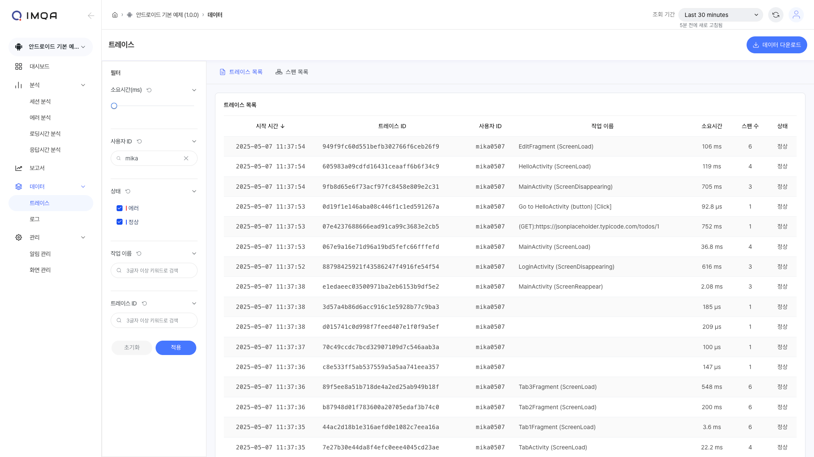

IMQA 트레이스는 다음과 같이 구성됩니다.

❶ **툴바(트레이스 분석)**

❷ **필터**

❸ **트레이스 목록**

---

### 툴 바

❶ **조회 조건:** 조회하고자 하는 기간을 선택할 수 있습니다. '최근 5분' 부터 '오늘' 등 빠른 버튼을 활용해 기간을 선택할 수 있으며, 'Custom' 으로 시작일시와 종료일시를 설정할 수 있습니다.

❷ **새로고침:** 현재 화면에 표시된 조회 결과 데이터를 새로고침합니다.

**❸ 데이터 다운로드:** 조회 결과를 `.xlsx`로 다운로드할 수 있습니다. 트레이스 목록은 한 번에 최대 50만건까지 다운로드할 수 있습니다.

### 필터

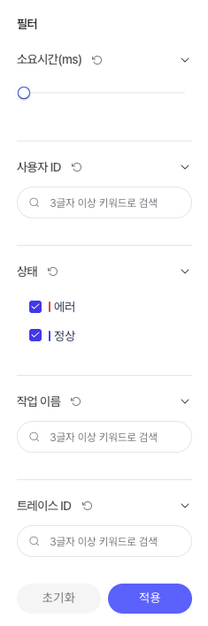

❶ 트레이스와 스팬의 소요시간 범위를 선택할 수 있습니다. 기본은 '전체'로 설정되어 있으며, 0ms 부터 최대 10,000ms 까지 범위를 설정할 수 있습니다.

❷ 원하는 사용자 ID 정보로 트레이스와 스팬을 조회할 수 있습니다. 조회하고자 하는 특정 사용자가 있을 경우 사용자 ID에 포함된 3글자 이상의 검색어를 입력합니다.

<Gha keyword="TIP" title="사용자 ID 설정">IMQA는 SDK, WebAgent를 통한 데이터 수집시 특정 사용자를 식별하기 위한 사용자 ID 정보를 설정할 수 있습니다. 사용자 ID 정보 설정은 'SDK Agent 설치 가이드 > Custom User ID 설정' 을 참고하세요.</Gha>

❸ 상태 필터를 통해 문제가 발생한 트레이스만 조회할 수 있습니다. 기본 '전체'로 설정되어 있습니다.

- **에러**: Crash, ANR, Error
- **정상**: 그 외

❹ 원하는 작업 이름을 조회할 수 있습니다. 조회하고자 하는 특정 정보가 있을 경우 작업 이름에 포함된 3글자 이상의 검색어를 입력합니다.

❺ 그 외 다양한 필터를 설정할 수 있습니다.

❻ [적용]을 클릭하면 선택한 필터 기준으로 데이터가 조회됩니다.

### 트레이스 목록


사용자의 행동 흐름에서 발생한 여러 액션을 트레이스로 확인할 수 있습니다. 트레이스별 소요 시간 등을 표시합니다. 이를 통해 사용자의 서비스 이용 중 어떤 일들이 있었는지를 한눈에 확인할 수 있습니다. 기본은 최근 시작 된 트레이스 순으로 정렬 됩니다.

- **시작 시간**: 해당 트레이스의 시작시간을 표시합니다.
- **트레이스 ID**: IMQA가 특정 액션을 식별하기 위해 부여한 고유 키를 표시합니다.
- **사용자 ID**: SDK, WebAgent에서 설정한 사용자의 ID 정보가 수집되었을 경우 표시합니다.
- **작업 이름**: 해당 트레이스를 대표하는 정보를 표시합니다.
- **소요시간**: 해당 트레이스의 소요시간을 표시합니다.
- **스팬 수**: 해당 트레이스에 포함된 스팬(이하 작업 단위)수를 카운트합니다.
- **상태**: 해당 트레이스의 문제 발생 여부를 표시합니다.
  - 에러: Crash, ANR, Error
  - 정상: 그 외

트레이스 목록에서 특정 트레이스를 클릭하면 **트레이스 상세** 페이지로 이동할 수 있습니다.

### 일반 트레이스 상세

특정 액션을 기준으로, 시작 시점부터 종료 시점까지 상세 분석이 가능합니다. 하나의 트레이스는 여러 스팬(트레이스에서 발생한 특정 작업 단위. 데이터를 표현하는 최소 단위) 트리로 구성됩니다. 해당 트레이스가 발생한 사용자의 세션으로 연계하여 이동할 수 있습니다.


- 원하는 스팬 단위를 선택하면 **스팬 상세** 정보가 표시됩니다.
- [세션 상세 보기]를 클릭하면 해당 트레이스가 수집된 사용자의 **세션 상세(트레이스 목록)**으로 이동할 수 있습니다.
  

#### 트레이스 요약


트레이스 요약을 통해 해당 트레이스에서 발생한 작업 단위의 시작 종료 시점을 빠르게 파악할 수 있습니다.

#### 스팬 상세 정보


선택한 스팬과 함께 수집된 다양한 속성 정보를 확인할 수 있습니다. 속성 정보를 통해 해당 사용자의 상태를 정확하게 파악할 수 있습니다.

### 이슈 트레이스 상세

Crash, ANR, Error 문제가 발생한 트레이스의 상세 정보를 통해 로그까지 분석할 수 있습니다.

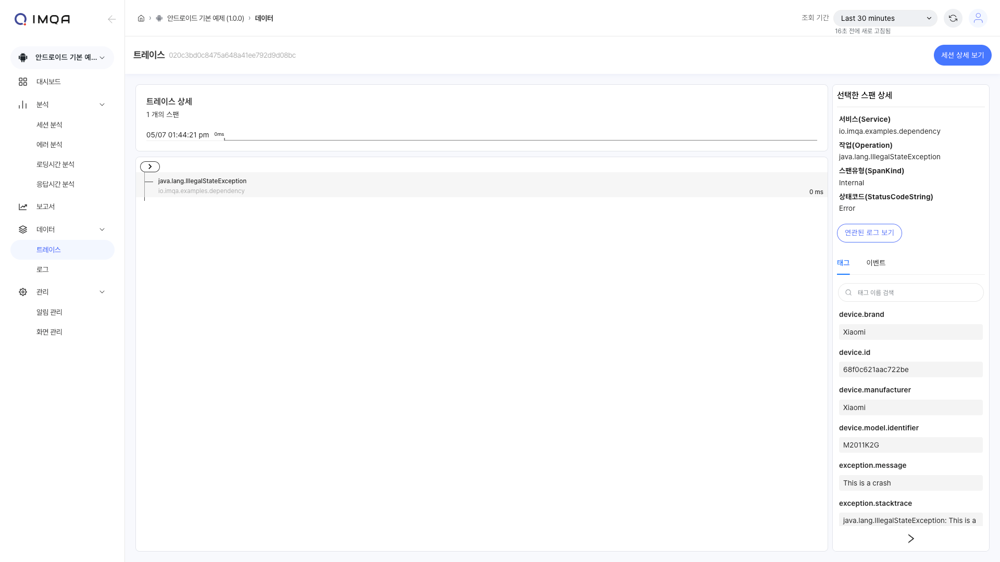

- 원하는 스팬 단위를 선택하면 **스팬 상세** 정보가 표시됩니다.
- [세션 상세 보기]를 클릭하면 해당 트레이스가 수집된 사용자의 **세션 상세(트레이스 목록)**으로 이동할 수 있습니다.
- [연관된 로그 보기]를 클릭하면 해당 트레이스와 같이 수집된 **로그 상세**로 이동할 수 있습니다.

#### 이슈 스팬 상세 정보


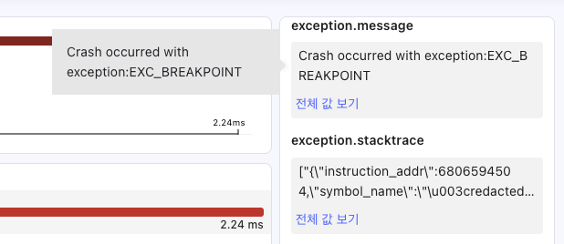

선택한 에러 상태 스팬과 함께 수집된 다양한 속성 정보를 확인할 수 있습니다. 속성 정보를 통해 해당 사용자의 상태를 정확하게 파악할 수 있습니다.

---
## 5-2. 스팬

IMQA 스팬은 앱 내에서 발생한 다양한 트레이스를 스팬(작업) 단위로 확인할 수 있습니다. 트레이스와 스팬 데이터를 사용자의 세션 분석으로 연계하여 분석할 수 있습니다.

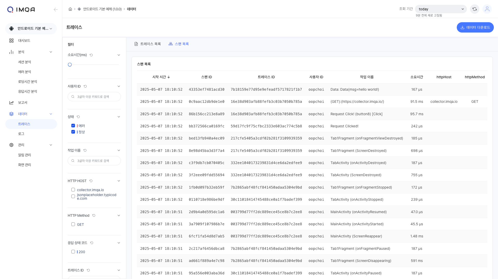

IMQA 스팬은 다음과 같이 구성됩니다.

❶ **툴바(스팬 분석)**

❷ **필터**

❸ **스팬 목록**

---

### 툴 바

❶ **조회 조건:** 조회하고자 하는 기간을 선택할 수 있습니다. '최근 5분' 부터 '오늘' 등 빠른 버튼을 활용해 기간을 선택할 수 있으며, 'Custom' 으로 시작일시와 종료일시를 설정할 수 있습니다.

❷ **새로고침:** 현재 화면에 표시된 조회 결과 데이터를 새로고침합니다.

**❸ 데이터 다운로드:** 조회 결과를 `.xlsx`로 다운로드할 수 있습니다. 스팬 목록은 한 번에 최대 50만건까지 다운로드할 수 있습니다.

### 필터

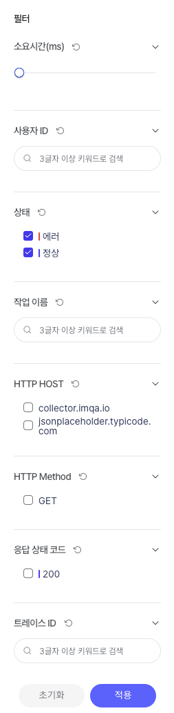

❶ 트레이스와 스팬의 소요시간 범위를 선택할 수 있습니다. 기본은 '전체'로 설정되어 있으며, 0ms 부터 최대 10,000ms 까지 범위를 설정할 수 있습니다.

❷ 원하는 사용자 ID 정보로 트레이스와 스팬을 조회할 수 있습니다. 조회하고자 하는 특정 사용자가 있을 경우 사용자 ID에 포함된 3글자 이상의 검색어를 입력합니다.

<Gha keyword="TIP" title="사용자 ID 설정">IMQA는 SDK, WebAgent를 통한 데이터 수집시 특정 사용자를 식별하기 위한 사용자 ID 정보를 설정할 수 있습니다. 사용자 ID 정보 설정은 'SDK Agent 설치 가이드 > Custom User ID 설정' 을 참고하세요.</Gha>

❸ 상태 필터를 통해 문제가 발생한 스팬만 조회할 수 있습니다. 기본 '전체'로 설정되어 있습니다.

- **에러**: Crash, ANR, Error
- **정상**: 그 외

❹ 원하는 작업 이름을 조회할 수 있습니다. 조회하고자 하는 특정 정보가 있을 경우 작업 이름에 포함된 3글자 이상의 검색어를 입력합니다.

❺ 그 외 다양한 필터를 설정할 수 있습니다.

❻ [적용]을 클릭하면 선택한 필터 기준으로 데이터가 조회됩니다.

### 스팬 목록

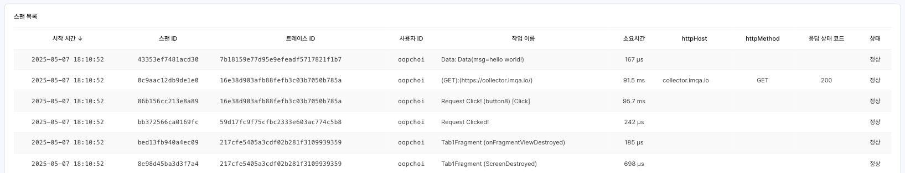

사용자의 행동 흐름에서 발생한 여러 액션을 스팬 단위로 확인할 수 있습니다. 스팬별 소요 시간 등을 표시합니다. 이를 통해 사용자의 서비스 이용 중 어떤 일들이 있었는지를 한눈에 확인할 수 있습니다. 기본은 최근 시작 된 스팬 순으로 정렬 됩니다.

- **시작 시간**: 해당 스팬의 시작시간을 표시합니다.
- **스팬 ID**: IMQA가 특정 작업을 식별하기 위해 부여한 고유 키를 표시합니다.
- **사용자 ID**: SDK, WebAgent에서 설정한 사용자의 ID 정보가 수집되었을 경우 표시합니다.
- **작업 이름**: 해당 스팬을 대표하는 정보를 표시합니다.
- **소요시간**: 해당 스팬의 소요시간을 표시합니다.
- **httpHost**: (해당 스팬이 XHR인 경우) 호스트 정보를 표시합니다.
- **httpMethod**: (해당 스팬이 XHR인 경우) 메소드 정보를 표시합니다.
- **응답 상태 코드**: (해당 스팬이 XHR인 경우) 응답 코드 정보를 표시합니다.
- **상태**: 해당 스팬의 문제 발생 여부를 표시합니다.
  - 에러: Crash, ANR, Error
  - 정상: 그 외

스팬 목록에서 특정 스팬을 클릭하면 **트레이스 상세** 페이지로 이동할 수 있습니다.
<Gha keyword="NOTE" title="트레이스 상세 가이드">**트레이스 상세**에 대한 내용은 '데이터 > 트레이스 > 트레이스 상세' 를 참고하세요.</Gha>

---
## 5-3. 로그

IMQA 로그는 애플리케이션 내부 동작에 대해 보다 상세하게 분석할 수 있는 정보를 제공합니다. Crash, ANR, Error 와 같은 문제가 발생했거나, 비즈니스 로직 상에서 추가 정보를 수집하기 위한 커스텀 로그 정보를 확인할 수 있습니다. 로그 데이터를 사용자의 **세션 분석으로 연계하여 분석**할 수 있습니다.

<Gha keyword="TIP" title="커스텀 로그 설정">IMQA는 SDK, WebAgent를 통한 데이터 수집시 비즈니스 로직 상에서 추가 정보를 수집하기 위한 로그 정보를 추가 수집 설정할 수 있습니다. 커스텀 로그 설정은 **SDK, Agent 설치 가이드**를 참고하세요.</Gha>

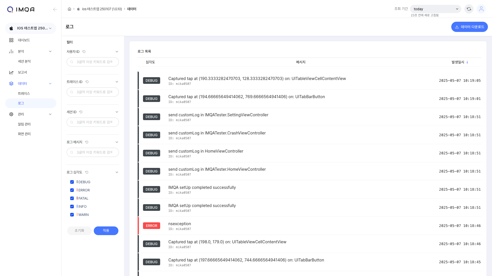

IMQA 로그는 다음과 같이 구성됩니다.

**❶ 툴바(로그)**

**❷ 필터** 

**❸ 로그 목록**

---
### 툴 바

**❶ 조회 조건:** 조회하고자 하는 기간을 선택할 수 있습니다. '최근 5분' 부터 '오늘' 등 빠른 버튼을 활용해 기간을 선택할 수 있으며, 'Custom' 으로 시작일시와 종료일시를 설정할 수 있습니다.

**❷ 새로고침:** 현재 화면에 표시된 조회 결과 데이터를 새로고침합니다. 

**❸ 데이터 다운로드:** 현재 화면에 표시된 조회 결과를 `.xlsx`로 다운로드할 수 있습니다.

<Gha keyword="WARNING" title="로그 데이터 다운로드">
현재 로그 [데이터 다운로드]는 화면에 표시된 1 페이지 단위로 제공됩니다.
</Gha>

### 필터

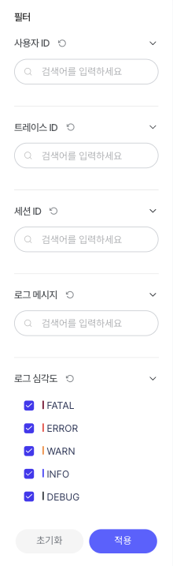

❶ 원하는 사용자 ID 정보로 로그를 조회할 수 있습니다. 조회하고자 하는 특정 사용자가 있을 경우 사용자 ID에 포함된 3글자 이상의 검색어를 입력합니다.

<Gha keyword="TIP" title="사용자 ID 설정">
IMQA는 SDK, WebAgent를 통한 데이터 수집시 특정 사용자를 식별하기 위한 사용자 ID 정보를 설정할 수 있습니다. 사용자 ID 정보 설정은 '**SDK / Agent 설치 가이드 > Custom User ID 설정**' 을 참고하세요.
</Gha>

❷ 조회하고자 하는 특정 메시지가 있을 경우 메시지에 포함된 3글자 이상의 검색어를 입력합니다.

❸ 그 외 다양한 필터를 설정할 수 있습니다.

❹ [적용]을 클릭하면 선택한 필터 기준으로 데이터가 조회됩니다.

### 로그 목록

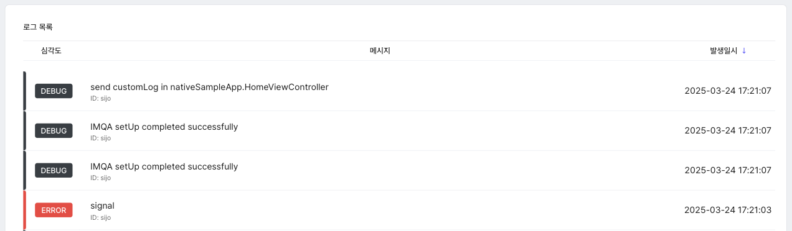

서비스와 사용자의 환경에서 수집한 여러 로그 정보를 확인할 수 있습니다. 기본은 최근 발생일시 순으로 정렬 됩니다.

- **심각도**: 해당 로그의 심각도를 표시합니다.
- **메시지**: 에러 유형과 메시지를 조합하여 표시합니다. 사용자 ID가 설정된 환경에서 수집된 로그일 경우 사용자 ID 정보를 함께 표시합니다.
- **발생일시**: 해당 로그의 발생 일시를 표시합니다.

로그 목록에서 특정 로그를 클릭하면 **로그 상세** 페이지로 이동할 수 있습니다.

### 로그 상세 정보

수집된 로그 메시지와 스택 트레이스, 다양한 속성 정보 확인이 가능합니다. 해당 로그가 수집된 사용자의 세션으로 연계하여 이동할 수 있습니다.

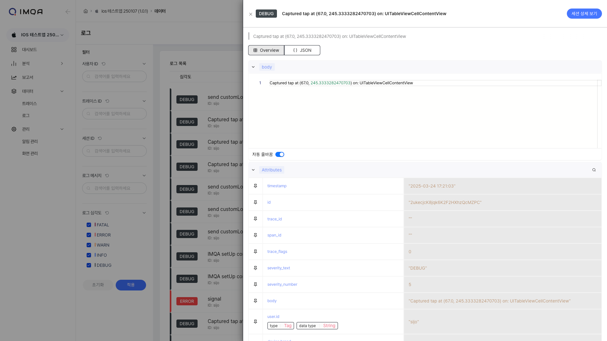

- **Overview**: 수집된 로그 메시지와 스택 트레이스*, Attribute 정보를 확인할 수 있습니다.
- **Attributes(속성 정보)**: 로그와 함께 수집된 다양한 속성의 값들을 확인할 수 있다.
- **stacktrace(스택 트레이스 정보)**: 오류 및 예외의 경우, 스택 트레이스 정보를 확인할 수 있습니다.
<Gha keyword="TIP" title="매핑 파일을 통한 난독화된 정보 가독화(Decoding)">
IMQA 매핑 파일 관리를 통해 서비스~서비스 버전별 매핑 파일을 업로드하여 ProGuard, Symbolication 등이 적용된 서비스에서 클래스 명과 함수 명을 가독화할 수 있습니다. 매핑 파일 업로드 이후부터 수집되는 난독화 정보를 가독화 하여 저장합니다. 매핑 파일 관리에 대한 자세한 내용은 **IMQA 관리자 가이드 > 서비스 관리**를 참고하시거나, 관리자에게 문의해주세요.
</Gha>

- [세션 상세 보기]를 클릭하면 해당 트레이스가 수집된 사용자의 **세션 상세(트레이스 목록)**으로 이동할 수 있습니다.


---

## 6. 관리
---
<Gha keyword="NOTE" title="(특정 서비스) 관리 메뉴 및 기능 접근 권한">
<p>IMQA의 특정 서비스 관리 메뉴는 모든 역할 사용자가 접근할 수 있으나, 관리 기능은 `MANAGER` 역할 이상의 권한 사용자에게만 제공됩니다.</p>
<ul>
  <li>- **알림 관리**: 모든 역할 사용자가 접근할 수 있으나, `MANAGER` 이상 역할 사용자만 관리할 수 있습니다.</li>
  <li>- **화면 관리**: 모든 역할 사용자가 접근할 수 있으나, `MANAGER` 이상 역할 사용자만 관리할 수 있습니다.</li>
</ul>
</Gha>
<Gha keyword="WARNING" title="관리 기능(WRITE) 사용 권한 제어">
접근 권한(READ) 과 관리 기능 사용(WRITE) 구분 제어는 추후 업데이트 예정입니다. 현재 **접근 권한(READ)이 있는 사용자는 관리 기능(WRITE)도 사용 가능**합니다.
</Gha>

## 6-1. 알림 관리

IMQA 알림 관리를 통해 서비스 지표에 따른 임계치를 설정하여 서비스의 상태와 위험 상황을 인지할 수 있습니다. IMQA 알림 발생 시, Webhook 방식 등을 설정하여 원하는 수신처에서 알림을 받을 수 있습니다.

<Gha keyword="TIP" title="IMQA 알림 방법">
IMQA에서 등록한 알림 정책에 의한 알림 발생시, Webhook, 이메일 등의 방법으로 알림을 받을 수 있습니다. 현재 Webhook 방식으로 알림을 받을 수 있으며, 다른 알림 방법은 추후 업데이트 예정입니다.
</Gha>


IMQA 알림 관리는 다음과 같이 구성됩니다.

**❶ 툴바(알림 관리)**

**❷ 알림 정책 목록**

---

### 툴 바

**❶ 새로운 알림 정책:** 새 알림 정책을 추가합니다.

### 알림 정책 추가

알림 관리 페이지 오른쪽 상단의 [+ 새로운 알림 정책] 버튼을 클릭하면 알림 정책을 추가할 수 있는 팝업이 표시됩니다.

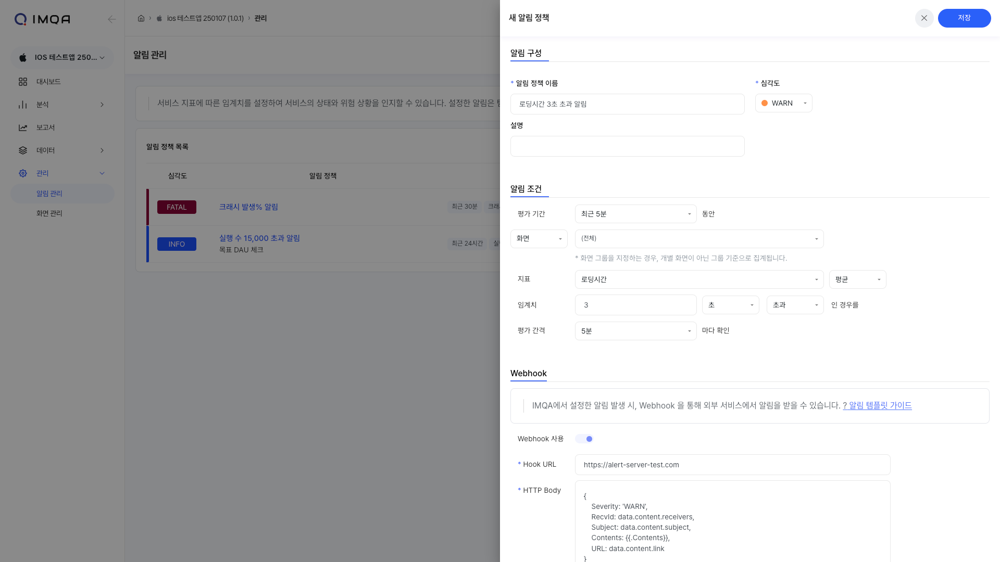

❶ 알림 정책 이름과 설명을 입력합니다. 알림의 심각도를 설정합니다.

❷ 알림 조건을 설정합니다. 평가 기간, 대상 화면(화면 그룹), 지표, 임계치, 평가 간격을 설정할 수 있습니다.

❸ Webhook 알림을 위한 정보를 입력합니다.

❹ 최대 알림 횟수와 초기화 기준을 설정할 수 있습니다.

❺ 정보 작성이 완료되면 [저장] 버튼을 클릭합니다.

#### 알림 조건 설정

IMQA에서 다양한 조건을 설정하여 알림을 받을 수 있습니다.

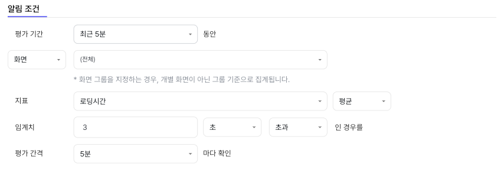

- **평가 기간**: 평가 대상 데이터 조회 범위를 설정합니다. 최근 5분, 최근 10분, 최근 30분 등으로 설정할 수 있습니다.
    
- **화면/화면그룹**: 특정 화면 또는 화면 그룹의 데이터만 평가하도록 설정합니다. 화면 그룹을 지정하는 경우, 개별 화면 단위가 아닌 화면 그룹 기준으로 집계됩니다.
    
- **지표/임계치**: 평가할 지표, 임계치, 단위 기준을 설정합니다.
    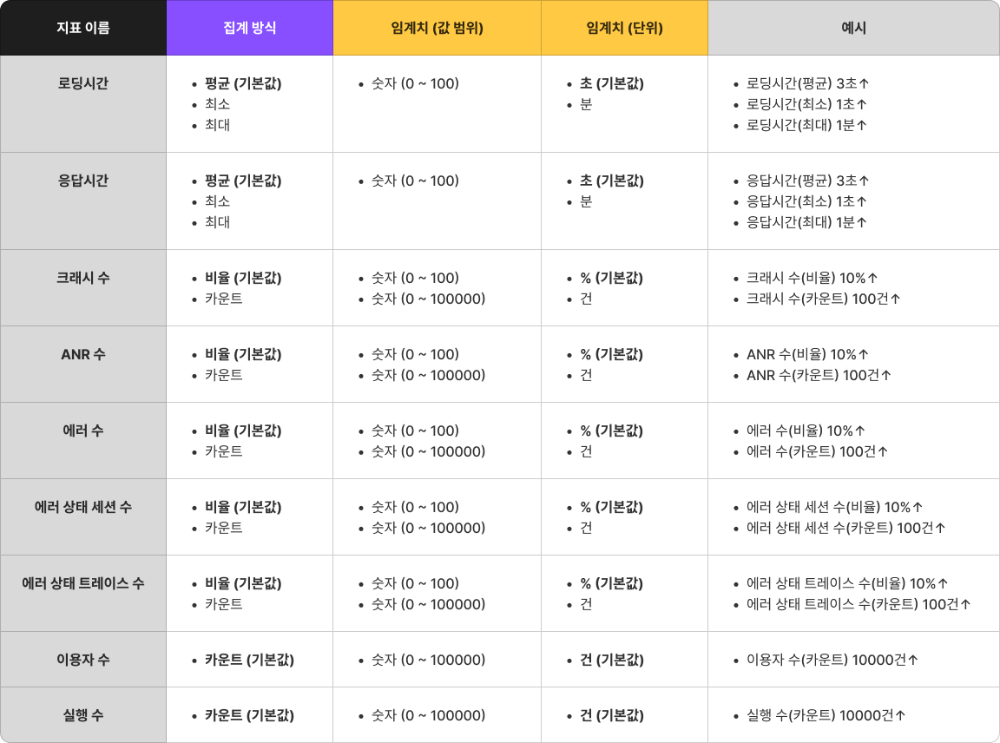
    
- **평가 간격**: 알림 조건에 맞는 데이터를 지정된 간격으로 평가합니다. 5분, 10분, 30분 등으로 설정할 수 있습니다.

#### Webhook 알림 방법

IMQA에서 설정한 알림 발생시, Webhook으로 외부 서비스에서 알림을 받을 수 있습니다.

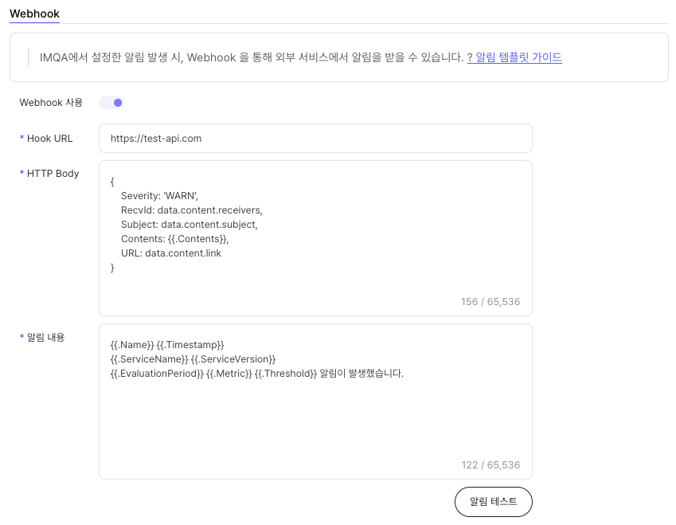

❶ ‘Webhook 사용’을 선택합니다.

❷ 알림 수신처에서 생성한 Hook URL을 입력합니다.

❸ Webhook으로 전송할 HTTP Body를 키-값 형태로 입력합니다.

❹ HTTP Body에 보낼 알림 내용을 알림 템플릿 가이드를 참고하여 작성합니다.

❺ [알림 테스트] 버튼을 클릭하여 입력한 Hook URL로 알림 발송 테스트가 가능합니다.
- 응답 코드가 0 또는 400 이상인 경우, 테스트 알림 발송 실패 메시지가 표시됩니다.

### 📌 알림 템플릿 가이드

알림 내용 구성 요소와 텍스트, html 예시를 참고해주세요.

| 이름                          | 이름                | 설명                                                                                             |
| --------------------------- | ----------------- | ---------------------------------------------------------------------------------------------- |
| `{{.Content}}`                | 내용                | [알림내용]에서 만들어진 템플릿이 치환되는 값                                                                      |
| `{{.ServiceName}}`            | 서비스 이름            |                                                                                                |
| `{{.ServiceVersion}}`         | 서비스 버전            |                                                                                                |
| `{{.ID}}`                     | 알림 아이디            |                                                                                                |
| `{{.Name}}`                   | 알림 정책 이름          |                                                                                                |
| `{{.Severity}}`               | 알림 심각도            |                                                                                                |
| `{{.Description}}`            | 알림 설명             |                                                                                                |
| `{{.Timestamp}}`              | 발생일시              | yyyy-MM-dd hh:mm:ss                                                                            |
| `{{.Metric}}`                 |                   | 지표                                                                                             |
| `{{.Threshold}}`              |                   | 임계치                                                                                            |
| `{{.EvaluationPeriod}}`       |                   | 평가 기간                                                                                          |
| `{{range.Result}}...{{end}}` | *알림 발생 결과에 대한 반복문 | 알림 하나 당 여러 개의 화면을 지정할 수 있어, 알림 결과는 배열. `{{.ScreenName}}`, `{{.ResultValue}}` 는 예시와 같이 반드시 포함되어야 함. |
| `{{.ScreenName}}`             | *화면 이름            |                                                                                                |
| `{{.ResultValue}}`            | *결과값              |                                                                                                |

**텍스트 예시**

```yaml
서비스이름: {{.ServiceName}}
서비스버전: {{.ServiceVersion}}
아이디: {{.ID}}  이름: {{.Name}} 심각도: {{.Severity}}
설명: {{.Description}}
발생시각: {{.Timestamp}}
알림지표: {{.Metric}}  임계치: {{.Threshold}}
평가기간: {{.EvaluationPeriod}} 
{{range .Result}}
화면이름: {{.ScreenName}}
결과값: {{.ResultValue}} 
{{end}}
```

**HTML 예시**

```html
<!DOCTYPE html>
<html>
<head>
    <title> IMQA Alarm </title>
</head>
<body>
    <h1>Alarm</h1>
	서비스이름: {{.ServiceName}}
	서비스버전: {{.ServiceVersion}}
	아이디: {{.ID}}  이름: {{.Name}} 심각도: {{.Severity}}
	설명: {{.Description}}
	발생시각: {{.Timestamp}}
	알람지표: {{.Metric}}  임계치: {{.Threshold}}
	평가기간: {{.EvaluationPeriod}} 
    <ul>
        {{range .Result}}
        <li>
            <p>화면이름: {{.ScreenName}}</p>
            <p>결과값: {{.ResultValue}}</p>
        </li>
        {{end}}
    </ul>
</body>
</html>
```

#### 최대 알림 설정

IMQA에서 설정한 알림 발생시, 동일한 알림에 대해 발송되는 최대 횟수를 제한할 수 있습니다.

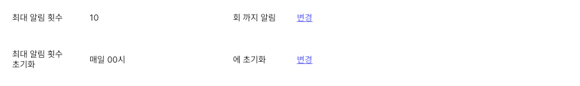

- **최대 알림 횟수**: 동일한 알림에 대해 기본 10회까지 발송합니다. 원하는 횟수로 변경할 수 있습니다.
- **최대 알림 횟수 초기화**: 동일 알림 발송 횟수를 지정된 시간에 초기화합니다. 기본 매일 00시에 초기화하며, 원하는 시간으로 변경할 수 있습니다.

### 알림 정책 목록

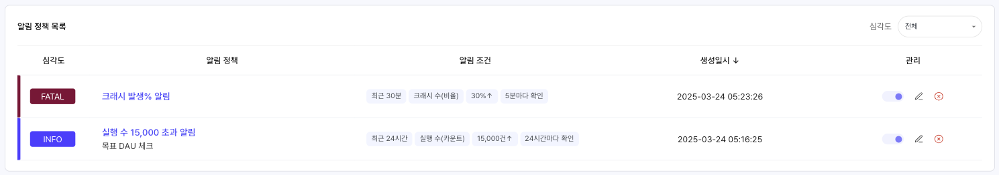

#### 필터

- **심각도**: 전체, 심각도에 따라 알림 목록을 필터링합니다.

#### 알림 정책 목록

현재 등록된 IMQA 알림 정책을 확인할 수 있습니다. 기본은 최근 생성일시 순으로 정렬 됩니다.

- **알림 조건**: 설정한 알림 정책에 대한 요약 정보를 표시합니다. 평가 기간, 지표(집계 방식), 임계치(단위)(초과/미만), 평가 간격 순으로 표시됩니다.
- **관리**: 알림 정책을 활성화/비활성화 하거나 수정, 삭제할 수 있습니다.
    - [비활성화] 버튼 클릭시, 해당 알림 정책이 비활성화됩니다. 다시 클릭하면 활성화할 수 있습니다.
    - [수정] 아이콘 클릭 시, 해당 **알림 정책 정보** 팝업이 표시됩니다. 정보 확인 후 [수정]하거나 [삭제]할 수 있습니다.
    - [삭제] 아이콘 클릭 시, 해당 알림 정책을 삭제할 수 있습니다.

<Gha keyword="TIP" title="알림 활성화/비활성화 설정">
IMQA에서는 등록된 알림 정책 중 일시적으로 사용 하지 않을 정책을 비활성화할 수 있습니다. 이벤트 또는 릴리즈 기간 등 일시적으로 사용할 알림 정책에 활용할 수 있습니다. 알림 정책은 최대 10개까지 활성화 할 수 있습니다.
</Gha>

### 알림 정책 정보

알림 정책의 기본 정보와 알림 조건, 알림 방법을 확인할 수 있습니다. 알림 정책 정보를 수정하거나 삭제할 수 있습니다.

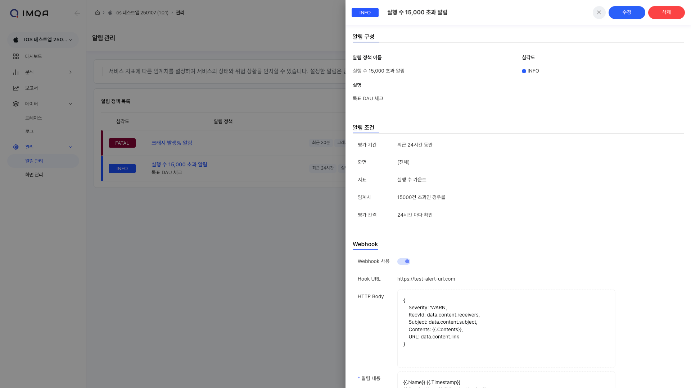

#### 툴 바

- [닫기] 아이콘 클릭 및 바깥 영역을 클릭하면 알림 정책 정보 팝업을 닫습니다.
- [수정] 버튼 클릭 시, 해당 알림 정책의 정보를 수정할 수 있습니다.
- [삭제] 버튼 클릭 시, 해당 알림 정책을 삭제할 수 있습니다.

#### 기본 정보

알림 정책 추가 시 입력한 알림 정책 이름, 심각도, 설명 정보가 표시됩니다.

#### 알림 조건

설정한 알림 조건 정보가 표시됩니다.

#### 알림 방법

설정한 알림 방법에 대한 정보가 표시됩니다.

### 알림 정책 수정

알림 정책 정보를 수정할 수 있습니다.

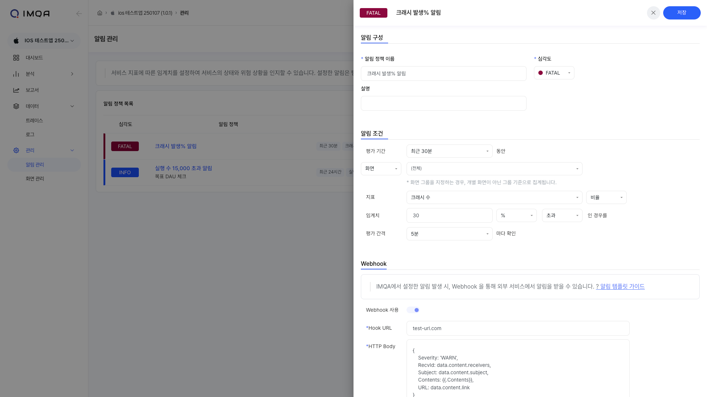


---
## 6-2. 화면 관리 

IMQA로 수집된 여러 화면 정보 중, IMQA 화면 관리를 통해 IMQA에서 표시할 이름(별명)을 설정하거나, 화면 그룹으로 묶어 집계 기준으로 사용하도록 관리할 수 있습니다.

<Gha keyword="TIP" title="화면 관리에서의 화면 목록">
화면 관리 페이지에서 화면 목록은 표시 이름(별명) 또는 화면 그룹을 설정한 **관리된 화면 목록이 표시**됩니다. **CSV 업로드** 기능을 사용하여 화면 관리를 시작할 수 있습니다.
</Gha>

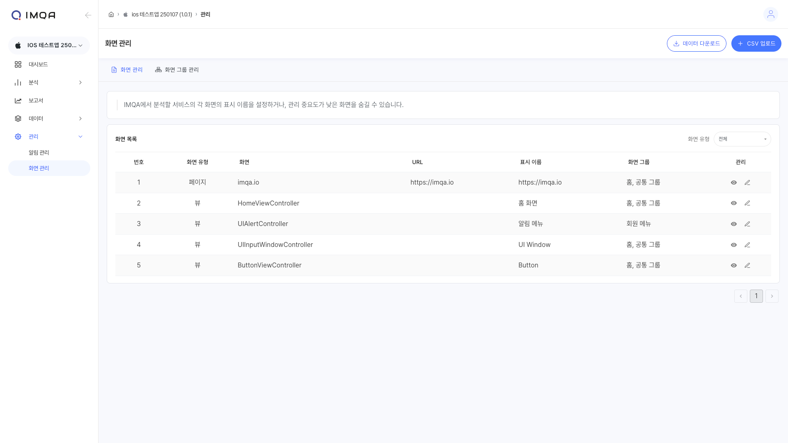

IMQA 화면 관리는 다음과 같이 구성됩니다.

**❶ 툴바(화면 관리)**

**❷ 화면 목록**

---

### 툴 바

**❶** 데이터 다운로드: 현재 화면에 표시된 조회 결과를 `.xlsx`로 다운로드할 수 있습니다. 

❷ CSV 업로드: CSV 파일 업로드를 통해 수집된 전체 화면을 대상으로, 관리할 화면의 표시 이름과 화면 그룹을 일괄 관리할 수 있습니다.

### CSV 업로드

화면 관리 페이지 오른쪽 상단의 [+ CSV 업로드] 버튼을 클릭하면 CSV 파일을 업로드할 수 있는 팝업이 표시됩니다.


❶ **최근 화면 목록** [CSV 다운로드]를 클릭하면 `.csv` 파일을 저장합니다.

❷ CSV 파일을 열면 현재까지 IMQA로 수집된 전체 화면 목록이 표시됩니다.

❸ 이미 설정된 정보가 있는 화면의 경우, CSV 파일 내 `current_alias_name` 컬럼에 현재 표시 이름과 `current_screen_group` 컬럼에 현재 화면 그룹명이 표시됩니다.

❹ CSV 파일 내 `expect_alias_name`에 표시할 화면 이름과 `expect_screen_group`에 설정할 화면 그룹명을 입력합니다.

❺ 정보 작성이 완료되면 `CSV UTF-8` 형식으로 저장합니다. CSV 업로드 팝업에서 [파일 선택] 후, [업로드] 버튼을 클릭합니다.

<Gha keyword="NOTE" title="CSV 업로드를 통해 화면을 관리하는 경우, 아래의 내용을 참고해 주세요.">
<p>1. 기존 생성한 화면 그룹이 있고, 해당 화면 그룹에 설정하려는 경우 **동일한 화면 그룹명**으로 입력해 주세요. 기존 화면 그룹명과 일치하지 않을 경우, 새로운 화면 그룹이 생성됩니다.</p>
<p>2. `expect_alias_name` 컬럼과 `expect_screen_group` 컬럼에 변경 내용이 있을 경우에만 화면 에 적용 되며, 다른 정보성 컬럼의 변경 내용은 적용되지 않습니다.</p>
<p>3. 각 화면 행을 비교하여 적용되므로, CSV 파일 내 정렬 변경 또는 행 삭제 등으로 인한 영향은 없습니다.</p>
</Gha>

### 화면 목록

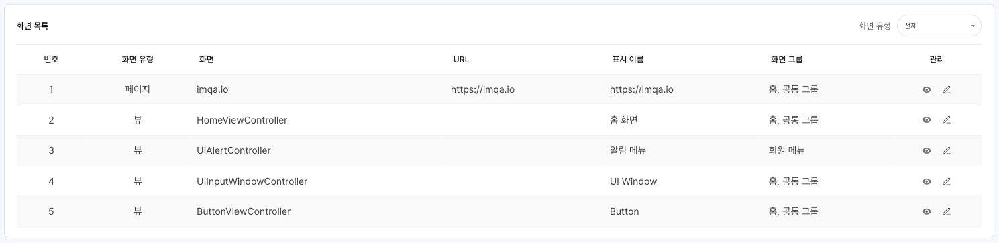

#### 필터

- **화면 유형**: 전체, 화면 유형에 따라 화면 목록을 필터링합니다.

#### 화면 목록

현재 관리된 화면의 표시 이름과 화면 그룹 정보를 확인할 수 있습니다. 기본은 최근 생성일시 순으로 정렬 됩니다.

- **관리**: 화면 숨김/보기를 설정하거나 화면 관리 정보를 수정할 수 있습니다.

<Gha keyword="TIP" title="화면 보기/숨김 설정">
IMQA에서는 관리된 화면 중 더 이상 관리 하지 않을 화면을 숨길 수 있습니다. 중요하지 않은 화면 등 비활성화에 활용할 수 있습니다.
</Gha>

<Gha keyword="WARNING" title="화면 숨김 설정">
화면 숨김 설정에 따른 데이터 수집, 집계, 화면 목록에서 표시/숨김 기능은 추후 업데이트 예정입니다.
</Gha>


### 화면 수정

화면의 관리 정보를 수정할 수 있습니다. 표시 이름을 재설정하거나, 소속 화면 그룹을 재설정할 수 있습니다.

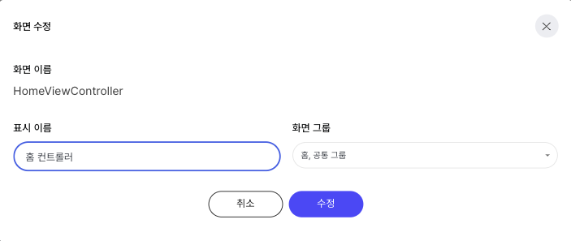


---
## 6-3. 화면 그룹 관리

IMQA 화면 그룹 관리를 통해 주요 업무 단위 또는 메뉴 단위 등 여러 화면을 그룹으로 관리할 수 있습니다. 화면 그룹 단위로 소속 화면을 설정할 수 있습니다.


IMQA 화면 그룹 관리는 다음과 같이 구성됩니다.

**❶ 툴바(화면 그룹 관리)**

**❷ 화면 그룹 목록**

---

### 툴 바

**❶ CSV 업로드:** CSV 파일 업로드를 통해 수집된 전체 화면을 대상으로, 관리할 화면의 표시 이름과 화면 그룹을 일괄 관리할 수 있습니다.
❷ **새로운 화면 그룹**: 새 화면 그룹을 등록합니다.

### 화면 그룹 추가

화면 관리> 화면 그룹 관리 페이지 오른쪽 상단의 [+ 새로운 화면 그룹] 버튼을 클릭하면 화면 그룹을 추가할 수 있는 팝업이 표시됩니다.


❶ 화면 그룹 이름과 설명을 입력합니다.

❷ 정보 작성이 완료되면 [추가] 버튼을 클릭합니다.

### 화면 그룹 목록

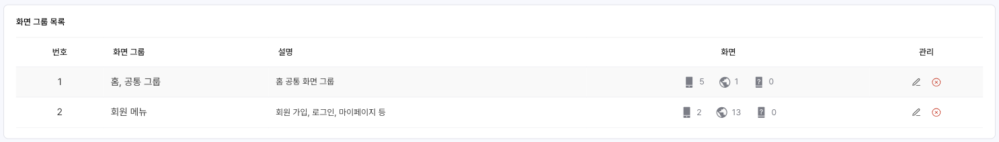

<Gha keyword="WARNING" title="(No Group)의 표시">
`(No Group)`은 화면 그룹 목록에 표시되지 않습니다.
</Gha>

#### 화면 그룹 목록

현재 등록된 화면 그룹과 소속 화면 수를 확인할 수 있습니다. 기본은 최근 생성일시 순으로 정렬 됩니다.

- **화면**: 해당 화면 그룹에 속한 화면 수를 화면 유형으로 구분하여 표시합니다.
- **관리**: 화면 그룹을 수정하거나 삭제할 수 있습니다.
    - [수정] 아이콘 클릭 시, 해당 **화면 그룹 정보** 팝업이 표시됩니다. 정보 확인 후 [수정]하거나 [삭제]할 수 있습니다.
    - [삭제] 아이콘 클릭 시, 해당 화면 그룹을 삭제할 수 있습니다.

### 화면 그룹 정보

화면 그룹의 기본 정보와 소속 화면 목록을 확인할 수 있습니다. 화면 그룹 정보를 수정하거나 삭제할 수 있습니다.

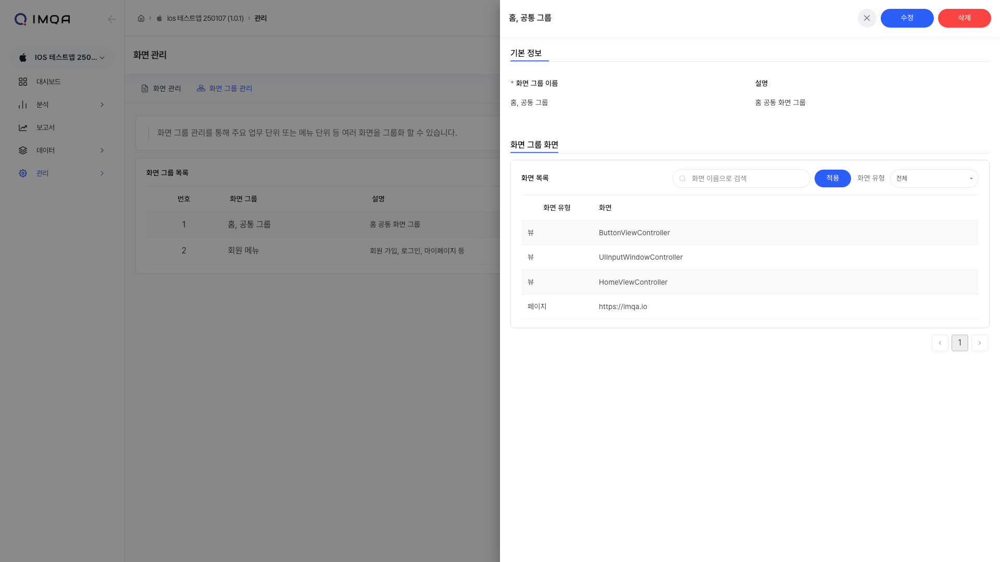

#### 툴 바

- [닫기] 아이콘 클릭 및 바깥 영역을 클릭하면 팀 정보 팝업을 닫습니다.
- [수정] 버튼 클릭 시, 해당 화면 그룹의 정보를 수정할 수 있습니다.
- [삭제] 버튼 클릭 시, 해당 화면 그룹을 삭제할 수 있습니다.

#### 기본 정보

화면 그룹 이름, 설명 정보가 표시됩니다.

#### 화면 그룹 화면

화면 그룹에 속한 화면 목록이 표시됩니다. 각 화면은 하나의 화면 그룹에만 속할 수 있습니다.

### 화면 그룹 수정

화면 그룹의 기본 정보를 수정할 수 있습니다. 소속 화면을 설정할 수 있습니다.


❶ **화면 그룹** **이름**과 **설명**을 변경할 수 있습니다.

❷ 화면 그룹 화면을 설정합니다. 화면 이름으로 검색하거나, 화면 유형으로 필터링할 수 있습니다. 이미 다른 화면 그룹에 속한 화면은 설정할 수 없습니다.

❸ 정보 수정이 완료되면 [저장] 버튼을 클릭합니다.


---

## 7. 글로벌 관리
---
<Gha keyword="NOTE" title="글로벌 관리 메뉴 접근 권한">
<p>IMQA의 글로벌 관리 메뉴는 MANAGER 이상의 권한 사용자에게만 제공됩니다.</p>
<ul>
  <li>- **사용자 관리**: `ADMIN` 역할 사용자만 접근할 수 있습니다.</li>
  <li>- **서비스 관리**: `MANAGER`, `ADMIN` 역할 사용자만 접근할 수 있습니다.</li>
  <li>- **감사 로그**: `ADMIN` 역할 사용자만 접근할 수 있습니다.</li>
</ul>
</Gha>
<Gha keyword="TIP" title="글로벌 관리">
글로벌 관리 기능에 대한 자세한 내용은 **IMQA 관리자 가이드**를 참고하시거나, 관리자에게 문의해주세요.
</Gha>