## IMQA 5단계로 시작하기

1. **관리자 계정** 또는 **관리 권한 계정의 이메일 주소**와 **비밀번호**를 입력 후 [로그인]을 클릭합니다.

2. **IMQA에서 분석할 새로운 서비스를 등록하고 발급된 `서비스 키`를 확인합니다.**

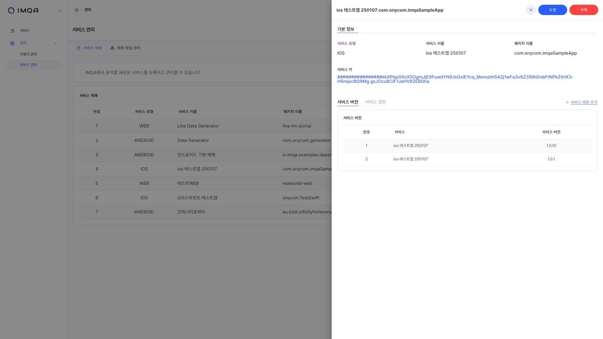

3. **IMQA SDK 설치 시, Android / iOS 서비스로 생성한 `서비스 키`를 사용하여 설치합니다.**
<Gha keyword="NOTE" title="IMQA Mobile SDK 설치">
IMQA는 Android SDK, iOS SDK, WebAgent는 각각 환경의 특성에 맞는 데이터를 수집합니다. Android / iOS 서비스 등록 후 발급된 `서비스 키`를 사용하여 SDK를 설치하세요.
</Gha>
4. **IMQA WebAgent 설치 시, IMQA Mobile SDK와 연동 또는 웹 브라우저 환경을 계측하는 경우에 따라 Web 서비스로 생성한 `패키지 이름`, `서비스 버전`, `서비스 키`를 사용하여 설치합니다.**
<Gha keyword="NOTE" title="IMQA WebAgent로 Mobile SDK와 연동 또는 웹 브라우저 환경을 계측하는 경우">
IMQA Mobile SDK와 연동시, 웹 브라우저 환경 계측에 따라 네이티브 SDK에서 전달한 정보를 자동으로 연계하거나, 별도 설정이 필요합니다. 자세한 내용은 **IMQA WebAgent 설치 가이드 > 옵션 상세 설명** 섹션을 참고해주세요.
</Gha>
5. **설치 후 서비스 목록에서 데이터가 정상적으로 수집되는 것을 확인하실 수 있습니다!**

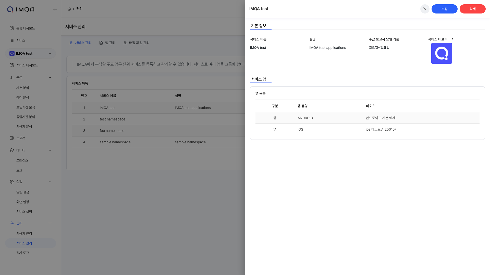

---

## 글로벌 관리
---
<Gha keyword="NOTE" title="글로벌 관리 메뉴 접근 권한">

IMQA의 글로벌 관리 메뉴는 MANAGER 이상의 권한 사용자에게만 제공됩니다.

<ul>
  <li>- **사용자 관리**: `ADMIN` 역할 사용자만 접근할 수 있습니다.</li>
  <li>- **서비스 관리**: `MANAGER`, `ADMIN` 역할 사용자만 접근할 수 있습니다.</li>
  <li>- **감사 로그**: `ADMIN` 역할 사용자만 접근할 수 있습니다.</li>
</ul>
</Gha>

## 1. 사용자 관리

IMQA 사용자 관리를 통해 IMQA 사용자를 조회하고 관리할 수 있습니다. 사용자별 권한을 소속 팀과 역할에 따라 기본 설정할 수 있습니다.

IMQA 사용자 관리는 다음과 같이 구성됩니다.

**❶ 툴바(사용자 관리)**

**❷ 사용자 목록**

---

### 툴 바

**❶ 새로운 사용자:** 새 사용자를 등록합니다.

### 사용자 추가

사용자 관리 페이지 오른쪽 상단의 [+ 새로운 사용자] 버튼을 클릭하면 사용자를 추가할 수 있는 팝업이 표시됩니다.

<Gha keyword="TIP" title="사용자 권한">
IMQA에는 서비스 접근 권한과 기능 접근 권한으로 구분된 권한 체계가 있습니다. 서비스 사용자는 소속 팀과 역할을 기반으로 각 권한을 상속받습니다. 팀은 서비스 접근 권한을 사용자에게 부여합니다. 역할은 기능 접근 권한을 사용자에게 부여합니다.
</Gha>

<Gha keyword="NOTE" title="(기본 팀)">
`(기본 팀)`은 모든 서비스의 접근 권한을 가질 수 있습니다.
</Gha>

❶ 사용자의 소속 **팀**을 설정합니다. 기본은 `(기본 팀)`으로 설정되어 있습니다.

❷ 이메일 주소와 이름을 입력합니다. 이메일 주소는 로그인 ID로 사용됩니다.

❸ 사용자의 역할을 설정합니다. 역할에 따라 할당된 기능별 권한이 자동 설정됩니다.
- **ADMIN**: 대부분의 리소스와 관리 메뉴 접근 및 기능 사용이 가능합니다.
- **MANAGER**: 서비스별 관리 메뉴에 접근 및 기능 사용이 가능합니다.
- **USER**: 권한이 있는 서비스에 접근 가능하나, 관리 메뉴 접근 및 기능 사용은 불가능합니다.

❹ 정보 작성이 완료되면 [추가] 버튼을 클릭합니다.

### 📌 사용자 권한

사용자별 권한은 사용자의 소속 팀과 역할에 설정된 권한으로 기본 설정됩니다.
<Gha keyword="NOTE" title="팀-역할-사용자 권한 요약">
<h5>**1. 팀 단위로 서비스 접근 권한을 설정할 수 있습니다.**</h5>

 - 팀 단위에는 기능 접근에 대한 설정 기능을 제공하지 않습니다.

<h5>**2. 역할 단위에는 기능 접근 권한이 사전 정의되어 있습니다.**</h5>

 - 역할 단위에는 서비스 접근에 대한 설정 기능을 제공하지 않습니다.

 - 현재 역할을 새로 생성하거나 역할별 권한은 수정이 되지 않습니다.

<h5>**3. 사용자 단위로 팀과 역할을 설정할 수 있습니다.**</h5>

 - 사용자는 기본 `(기본 팀)`으로 소속되며, `(기본 팀)`은 모든 서비스의 접근 권한을 가지고 있습니다.

 - 사용자의 소속 팀을 설정하면 팀에 설정된 서비스 접근 권한을 자동 설정합니다.

 - 사용자가 복수의 팀에 설정된 경우 각 팀에 설정된 서비스 접근 권한을 병합합니다.

 - 사용자의 역할을 설정하면 역할에 설정된 기능 접근 권한을 자동 설정합니다.

<h5>**4. 사용자 단위로 소속 팀과 역할에 지정된 권한을 상속받아야 합니다.**</h5>

 - 현재 사용자에게 별도 서비스 접근 권한과 기능 접근 권한을 설정할 수 없습니다.

</Gha>

#### 팀에 따른 서비스 접근 권한

IMQA는 여러 사용자를 팀으로 관리할 수 있습니다. 팀 단위로 서비스 접근 권한을 설정하여 같은 소속 사용자들의 권한을 일괄 관리하기 용이합니다.

#### 역할별 기능 권한

IMQA는 역할에 따라 메뉴 및 기능 접근 권한을 구분하여 제공하고 있습니다. 아래의 역할별 기능 권한을 참고하세요.

<Gha keyword="WARNING" title="관리 기능 사용 권한(WRITE) 제어">
접근 권한(READ) 과 관리 기능 사용(WRITE) 구분 제어는 추후 업데이트 예정입니다. 현재 접근 권한(READ)이 있는 사용자는 관리 기능(WRITE)도 사용 가능합니다.
</Gha>

| 구분     | 리소스     | USER | MANAGER      | ADMIN        |
| ------ | ------- | ---- | ------------ | ------------ |
| 분석     | 세션 분석   | READ | READ         | READ         |
|        | 에러 분석   | READ | READ         | READ         |
|        | 로딩시간 분석 | READ | READ         | READ         |
|        | 응답시간 분석 | READ | READ         | READ         |
|        | 사용자 분석  | READ | READ         | READ         |
| 보고서    | 보고서     | READ | READ         | READ         |
| 데이터    | 트레이스    | READ | READ         | READ         |
|        | 로그      | READ | READ         | READ         |
| 관리     | 알림 관리   | READ | READ / WRITE | READ / WRITE |
|        | 화면 관리   | READ | READ / WRITE | READ / WRITE |
| 글로벌 관리 | 사용자 관리  |      |              | READ / WRITE |
|        | 서비스 관리  |      | READ         | READ / WRITE |
|        | 감사 로그   |      |              | READ         |

### 사용자 목록

#### 필터

- **팀**: 전체, 소속 팀으로 사용자 목록을 필터링합니다.
- **역할**: 전체, ADMIN 등 역할로 사용자 목록을 필터링합니다.

#### 사용자 목록

현재 등록된 IMQA 서비스 사용자를 확인할 수 있습니다. 기본은 최근 생성일시 순으로 정렬 됩니다.

- **관리**: 사용자를 수정하거나 삭제할 수 있습니다.
	- [수정] 아이콘 클릭 시, 해당 **사용자 정보** 팝업이 표시됩니다. 정보 확인 후 [수정]하거나 [삭제]할 수 있습니다.
	- [삭제] 아이콘 클릭 시, 해당 사용자를 삭제할 수 있습니다.

### 사용자 정보

사용자의 기본 정보와 사용자의 현재 권한을 확인할 수 있습니다. 사용자 정보를 수정하거나 삭제할 수 있습니다.

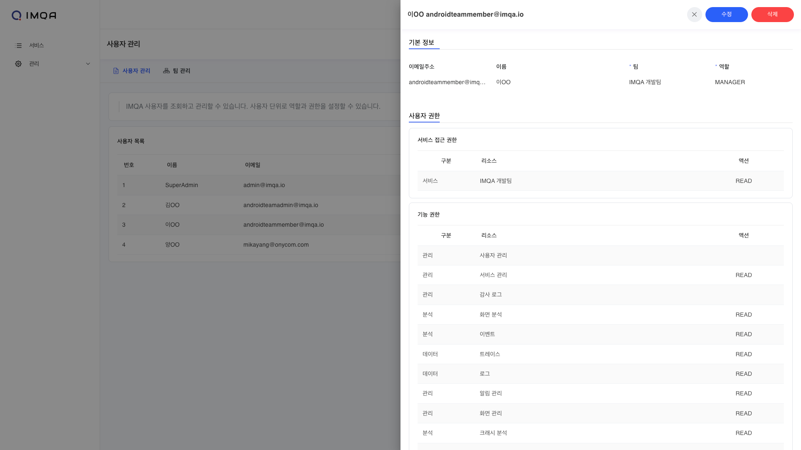

#### 툴 바

- [닫기] 아이콘 클릭 및 바깥 영역을 클릭하면 사용자 정보 팝업을 닫습니다.
- [수정] 버튼 클릭 시, 해당 사용자의 정보를 수정할 수 있습니다.
- [삭제] 버튼 클릭 시, 해당 사용자를 삭제할 수 있습니다.

#### 기본 정보

사용자 추가 시 입력한 이메일주소, 이름, 팀, 역할 정보가 표시됩니다.

#### 사용자 권한

사용자의 소속 팀과 역할에서 상속받은 사용자 권한 정보가 표시됩니다.

- **구분**: 메뉴 또는 기능의 분류
- **리소스**: 서비스 또는 메뉴 이름
- **액션**: 해당 리소스의 권한 정보
	- `(없음)`: 권한 없음
	- READ: 메뉴 또는 서비스 보기 권한
	- WRITE: 관리 기능 사용 권한 (예: 생성/수정/삭제)

### 사용자 수정

사용자의 기본 정보를 수정할 수 있습니다. 팀과 역할 변경 시 변경되는 사용자 권한을 미리 확인할 수 있습니다.

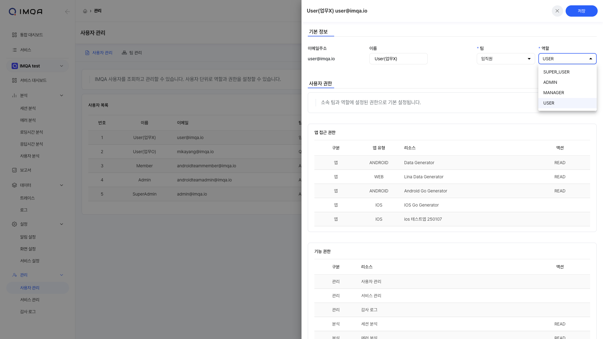

❶ 사용자의 **이름**을 변경할 수 있습니다. **이메일 주소**는 변경이 불가합니다.

❷ 사용자의 비밀번호를 변경할 수 있습니다.

❸ 사용자의 팀을 설정합니다. 소속 팀에 따라 할당된 서비스 접근 권한을 미리 확인할 수 있습니다.

❹ 사용자의 역할을 설정합니다. 역할에 따라 할당된 기능별 권한을 미리 확인할 수 있습니다.

❺ 정보 수정이 완료되면 [저장] 버튼을 클릭합니다.

---

## 2. 팀 관리

IMQA 팀 관리를 통해 여러 사용자를 팀으로 관리할 수 있습니다. 팀 단위로 서비스 접근 권한을 설정할 수 있습니다.

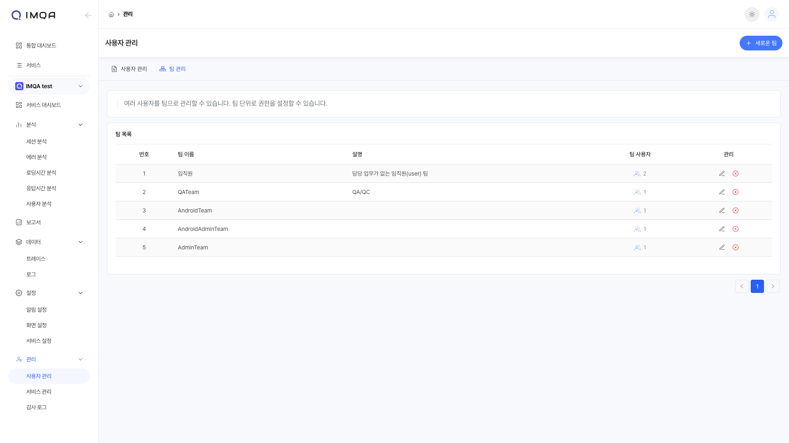

IMQA 팀 관리는 다음과 같이 구성됩니다.

**❶ 툴바(팀 관리)**

**❷ 팀 목록**

---

### 툴 바

**❶ 새로운 팀:** 새 팀을 등록합니다.

### 팀 추가

사용자 관리> 팀 관리 페이지 오른쪽 상단의 [+ 새로운 팀] 버튼을 클릭하면 팀을 추가할 수 있는 팝업이 표시됩니다.

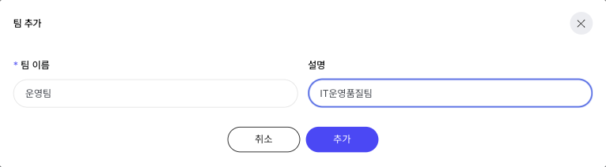

<Gha keyword="TIP" title="사용자 권한">
IMQA에는 서비스 접근 권한과 기능 접근 권한으로 구분된 권한 체계가 있습니다. 서비스 사용자는 소속 팀과 역할을 기반으로 각 권한을 상속받습니다. 팀은 서비스 접근 권한을 사용자에게 부여합니다. 역할은 기능 접근 권한을 사용자에게 부여합니다.
</Gha>

❶ 팀 이름과 설명을 입력합니다.

❷ 정보 작성이 완료되면 [추가] 버튼을 클릭합니다.

### 팀 목록

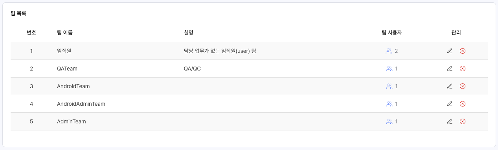

<Gha keyword="WARNING" title="(기본 팀)의 표시">
`(기본 팀)`은 팀 목록에 표시되지 않습니다.
</Gha>

#### 팀 목록

현재 등록된 IMQA 팀과 팀 소속 사용자 수를 확인할 수 있습니다. 기본은 최근 생성일시 순으로 정렬 됩니다.

- **관리**: 팀을 수정하거나 삭제할 수 있습니다.
    - [수정] 아이콘 클릭 시, 해당 **팀 정보** 팝업이 표시됩니다. 정보 확인 후 [수정]하거나 [삭제]할 수 있습니다.
    - [삭제] 아이콘 클릭 시, 해당 팀을 삭제할 수 있습니다.

### 팀 정보

팀의 기본 정보와 팀의 현재 권한을 확인할 수 있습니다. 팀 정보를 수정하거나 삭제할 수 있습니다.

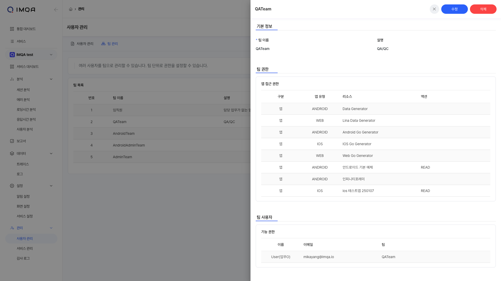

#### 툴 바

- [닫기] 아이콘 클릭 및 바깥 영역을 클릭하면 팀 정보 팝업을 닫습니다.
- [수정] 버튼 클릭 시, 해당 팀의 정보를 수정할 수 있습니다.
- [삭제] 버튼 클릭 시, 해당 팀을 삭제할 수 있습니다.

#### 기본 정보

팀 이름, 설명 정보가 표시됩니다.

#### 팀 권한

팀이 가진 서비스 접근 권한 정보가 표시됩니다.

- **구분**: 메뉴 또는 기능의 분류
- **리소스**: 서비스 또는 메뉴 이름
- **액션**: 해당 리소스의 권한 정보
    - 서비스 보기 권한

#### 팀 사용자

팀에 소속된 사용자 목록이 표시됩니다. 사용자는 여러 팀에 속할 수 있습니다.

### 팀 수정

팀의 기본 정보를 수정할 수 있습니다. 팀의 서비스 접근을 설정하거나, 소속 팀 사용자를 설정할 수 있습니다.

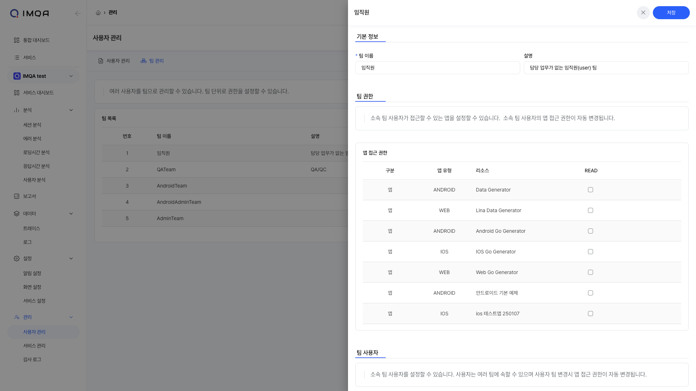

❶ 팀의 **이름**과 **설명**을 변경할 수 있습니다.

❷ 팀의 서비스 접근 권한을 설정합니다. 소속 팀 사용자의 서비스 접근 권한이 자동 변경됩니다.

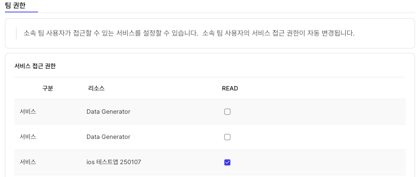

❸ 팀의 사용자를 설정합니다. 해당 사용자의 서비스 접근 권한이 자동 변경됩니다.

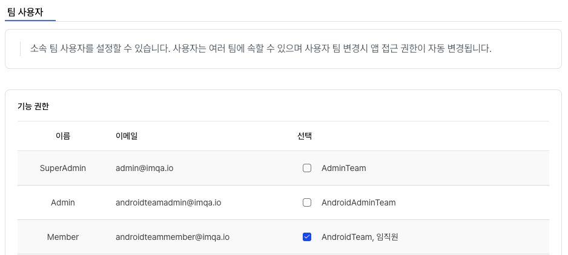

❹ 정보 수정이 완료되면 [저장] 버튼을 클릭합니다.

---

## 3. 서비스 관리

IMQA 서비스 관리를 통해 IMQA에서 분석할 새로운 서비스를 등록하고 관리할 수 있습니다. 서비스 단위로 서비스 버전을 관리할 수 있습니다.

IMQA 서비스 관리는 다음과 같이 구성됩니다.

**❶ 툴바(서비스 관리)**

**❷ 서비스 목록**

---

### 툴 바

**❶ 새로운 서비스:** 새 서비스를 등록합니다.

### 서비스 등록

서비스 관리 페이지 오른쪽 상단의 [+ 새로운 서비스] 버튼을 클릭하면 서비스를 추가할 수 있는 팝업이 표시됩니다.

#### | Android / iOS

<Gha keyword="NOTE" title="IMQA Mobile SDK 설치">
IMQA는 Android SDK, iOS SDK, WebAgent는 각각 환경의 특성에 맞는 데이터를 수집합니다. Android / iOS 서비스 등록 후 발급된 `서비스 키`를 사용하여 SDK를 설치하세요.
</Gha>

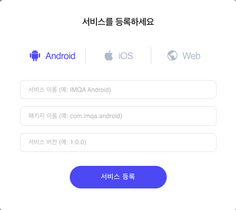

❶ **서비스 이름**과 **패키지 이름**을 입력합니다. 패키지 이름은 `Application ID` 또는 `Bundle ID` 로 입력해 주세요.

<Gha keyword="TIP" title="Android / iOS 서비스 생성시의 패키지 이름">
**IMQA는 모바일 앱에서 수집한 데이터를 식별하기 위해 패키지 이름을 사용합니다. **실제 앱 패키지 이름**으로 등록해 주세요. 패키지 이름에는 a-z, A-Z, 0-9, -, _, .만 입력할 수 있습니다. 
</Gha>

❷ 서비스 버전을 입력합니다.

<Gha keyword="NOTE" title="서비스 버전">
IMQA에서는 서비스 버전을 구분하여 데이터를 관리할 수 있습니다. 모바일 앱의 릴리즈 버전, 테스트 버전 등 여러 서비스 버전을 기준으로 데이터를 그룹화하고, 집계/분석할 수 있습니다.
</Gha>

❸ 정보 작성이 완료되면 [서비스 등록] 버튼을 클릭합니다.

#### | Web

<Gha keyword="NOTE" title="IMQA WebAgent로 Mobile SDK와 연동 또는 웹 브라우저 환경을 계측하는 경우">
IMQA Mobile SDK와 연동시, 웹 브라우저 환경 계측에 따라 네이티브 SDK에서 전달한 정보를 자동으로 연계하거나, 별도 Web 서비스로 생성한 `패키지 이름`, `서비스 버전`, `서비스 키` 설정이 필요합니다. 자세한 내용은 **IMQA WebAgent 설치 가이드 > 옵션 상세 설명** 섹션을 참고해주세요.
</Gha>

❶ **서비스 이름**과 **패키지 이름**을 입력합니다. **패키지 이름**은 WebAgent에서 서비스를 구분짓는 값으로, 아래의 포맷에 맞게 입력해 주세요.

<Gha keyword="TIP" title="Web 서비스 생성시의 패키지 이름">
**IMQA는 웹 브라우저에서 수집한 데이터를 식별하기 위해 패키지 이름을 사용합니다. **WebAgent 설치시 `serviceName`으로 사용할 이름**으로 등록해 주세요. 패키지 이름에는 a-z, A-Z, 0-9, -, _, .만 입력할 수 있습니다.
</Gha>

❷ 서비스 버전을 입력합니다.

<Gha keyword="NOTE" title="서비스 버전">
IMQA에서는 서비스 버전을 구분하여 데이터를 관리할 수 있습니다. 웹 서비스의 릴리즈 버전, 테스트 버전 등 여러 서비스 버전을 기준으로 데이터를 그룹화하고, 집계/분석할 수 있습니다. **IMQA Agent 설치 시 동일한 서비스 버전 정보가 필요합니다.**
</Gha>

❸ 정보 작성이 완료되면 [서비스 등록] 버튼을 클릭합니다.

### 서비스 목록

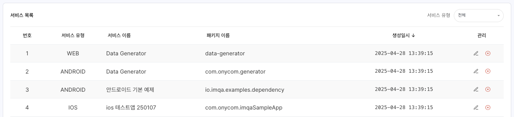

#### 필터

- **서비스 유형**: 전체, Android, iOS, Web 유형으로 서비스 목록을 필터링합니다.

#### 서비스 목록

현재 등록된 IMQA 서비스를 확인할 수 있습니다. 기본은 최근 생성일시 순으로 정렬 됩니다.

- **관리**: 서비스를 수정하거나 삭제할 수 있습니다.
	- [수정] 아이콘 클릭 시, 해당 **서비스 정보** 팝업이 표시됩니다. 정보 확인 후 [수정]하거나 [삭제]할 수 있습니다.
	- [삭제] 아이콘 클릭 시, 해당 서비스를 삭제할 수 있습니다.

### 서비스 정보

서비스의 기본 정보와 서비스 키, 현재 추가된 서비스 버전을 확인할 수 있습니다. 서비스 정보를 수정하거나 삭제할 수 있습니다.

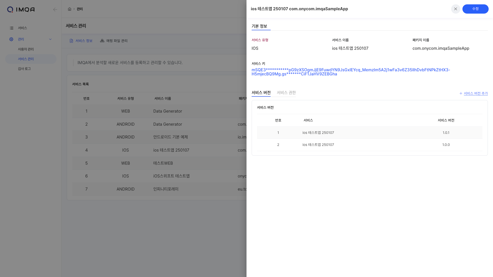

#### 툴 바

- [닫기] 아이콘 클릭 및 바깥 영역을 클릭하면 서비스 정보 팝업을 닫습니다.
- [수정] 버튼 클릭 시, 해당 서비스의 정보를 수정할 수 있습니다.
- [삭제] 버튼 클릭 시, 해당 서비스를 삭제할 수 있습니다.

#### 기본 정보

- 서비스 등록 시 설정한 서비스 유형, 입력한 서비스 이름, 패키지 이름 정보가 표시됩니다.
- 서비스 등록 시 생성된 서비스 키 정보가 표시됩니다.

#### 서비스 버전

해당 서비스에 등록된 서비스 버전을 확인할 수 있습니다. 현재 사용하고 있는 서비스 버전과 사용하지 않는 서비스 버전을 구분할 수 있습니다.

❶ [+ 서비스 버전 추가] 버튼을 클릭하면 서비스 버전을 추가할 수 있는 팝업이 표시됩니다.

❷ 서비스 이름을 확인하고 서비스 버전을 입력합니다.

<Gha keyword="NOTE" title="서비스 버전">
IMQA에서는 서비스 버전을 구분하여 데이터를 관리할 수 있습니다. 웹 서비스의 릴리즈 버전, 테스트 버전 등 여러 서비스 버전을 기준으로 데이터를 그룹화하고, 집계/분석할 수 있습니다.
</Gha>

❸ 정보 작성이 완료되면 [추가] 버튼을 클릭합니다.

❹ 등록한 서비스 버전을 확인할 수 있습니다.

#### 서비스 권한

해당 서비스에 접근 권한을 가진 팀을 확인할 수 있습니다. 현재 어떤 팀이 서비스에 접근할 수 있는지를 파악할 수 있습니다. `(기본 팀)`은 모든 서비스의 접근 권한을 가지고 있습니다.

<Gha keyword="TIP" title="서비스 접근 권한 관리">
**사용자 관리 > 팀 관리 > 팀 수정** 에서 서비스 접근 권한을 [추가/수정/삭제] 할 수 있습니다.
</Gha>

### 서비스 수정

서비스의 기본 정보를 수정하거나 서비스 버전을 관리할 수 있습니다.

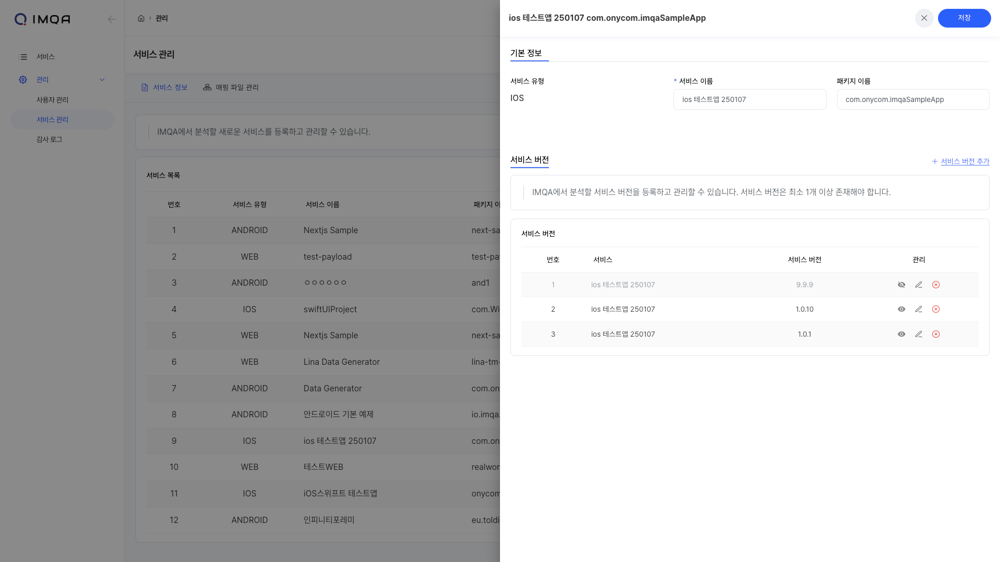

❶ **서비스의 이름**과 **패키지 이름** 정보를 변경할 수 있습니다. **서비스 유형**은 변경이 불가합니다.
<Gha keyword="WARNING" title="패키지 이름 변경">
**IMQA는 모바일 앱과 웹 브라우저에서 수집한 데이터를 식별하기 위해 패키지 이름을 사용합니다. 패키지 이름을 변경하면 이전 패키지 이름으로 저장된 데이터가 조회되지 않을 수 있습니다. **실제 앱 패키지 이름** 및 **WebAgent 설치시 `serviceName`으로 사용할 이름**으로 변경해 주세요. 패키지 이름에는 a-z, A-Z, 0-9, -, _, .만 입력할 수 있습니다.
</Gha>

❷ 서비스 버전을 추가하거나 수정, 삭제할 수 있습니다.

❸ 정보 수정이 완료되면 [저장] 버튼을 클릭합니다.

#### 서비스 버전 관리

서비스 수정 단계에서 IMQA에서 분석할 서비스 버전을 등록하고 관리할 수 있습니다.

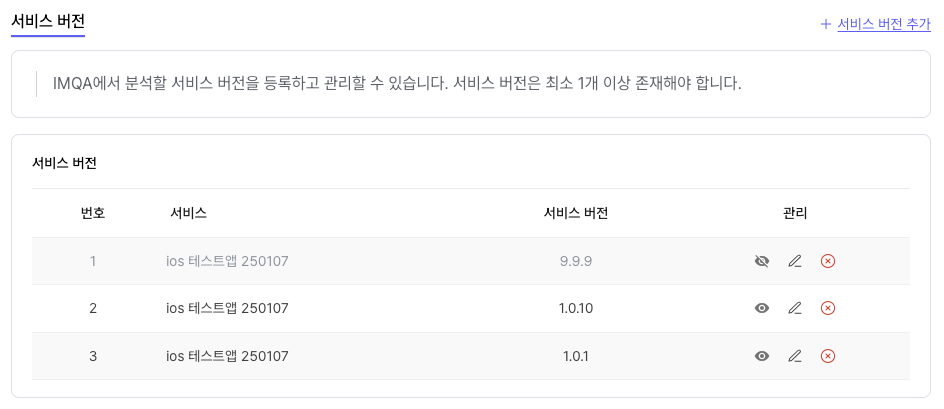

❶ [+ 서비스 버전 추가] 버튼을 클릭하면 서비스 버전을 추가할 수 있는 팝업이 표시됩니다.

❷ 등록한 서비스 버전을 수정, 삭제할 수 있습니다. 

❸ 등록한 서비스 버전을 숨길 수 있습니다.

<Gha keyword="NOTE" title="서비스 버전 보기/숨김 설정">
IMQA에서는 등록된 서비스 버전 중 더 이상 관리하지 않을 버전을 숨길 수 있습니다. 지원이 끝난 서비스 버전 또는 개발 버전 등의 비활성화에 활용할 수 있습니다. 서비스 버전 숨김 설정시, 서비스 목록 등에서 표시되지 않습니다. 현재 서비스 버전 보기/숨김 처리는 서비스 버전의 “표시여부” 설정 기능이며, 해당 서비스 버전의 데이터 수집 비활성화 등의 기능으로 동작하지 않습니다.
</Gha>

---

## 4. 매핑 파일 관리

IMQA 매핑 파일 관리를 통해 서비스~서비스 버전별 매핑 파일을 업로드하여 ProGuard, Symbolication 등이 적용된 서비스에서 클래스 명과 함수 명을 가독화할 수 있습니다. 

<Gha keyword="NOTE" title="지원되는 난독화 종류 및 업로드 파일 크기 제한">

IMQA는 현재 서비스 유형별 아래의 역난독화를 지원하고 있습니다. 난독화 종류는 지속적으로 업데이트 예정입니다.

<ul>
  <li>- **Android**: ProGuard, Allatori, Source Map(웹뷰)</li>
  <li>- **iOS**: dSYM, Source Map(웹뷰)</li>
  <li>- **Web**: Source Map</li>
</ul>

매핑 파일 업로드 시, 200MB 이하의 매핑 파일만 업로드할 수 있습니다. 제한 용량 이상의 파일 업로드는 support@imqa.io 로 문의해 주세요.

</Gha>
<Gha keyword="TIP" title="매핑 파일의 적용 시점">
ProGuard, dSYM 등의 경우, 매핑 파일 업로드 이후부터 수집되는 난독화 정보를 가독화 하여 저장합니다.업로드 한 매핑 파일 적용에 다소 시간이 소요될 수 있으며, 스택 트레이스 조회 시점에 난독화 정보로 보여질 수 있습니다. 
Source Map의 경우, 수집된 웹 에러 스택 트레이스 정보 조회 시 파일명이 일치하는 소스맵 파일을 즉시 적용합니다.
</Gha>

<Gha keyword="TIP" title="최신 앱 버전의 매핑 파일 관리">
최신 앱 버전이 릴리즈 된 경우, 해당 버전의 역난독화를 위해 **신규 서비스 버전의 매핑 파일을 추가 등록**해 주세요.
</Gha>

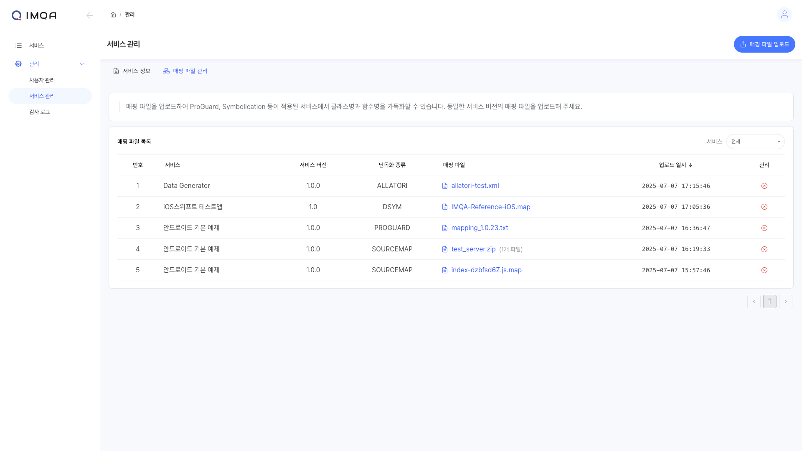

IMQA 매핑 파일 관리는 다음과 같이 구성됩니다.

❶ **툴바(매핑 파일 관리)**

**❷ 매핑 파일 목록**

---
### 툴 바

**❶ 매핑 파일 업로드:** 새 매핑 파일을 업로드할 수 있습니다. 

### 매핑 파일 업로드

서비스 관리 > 매핑 파일 관리 페이지 오른쪽 상단의 [+ 매핑 파일 업로드] 버튼을 클릭하면 매핑 파일을 업로드할 수 있는 팝업이 표시됩니다.

❶ **서비스 이름**과 **서비스 버전**을 선택합니다.

❷ **난독화 종류**를 선택합니다.

<Gha keyword="TIP" title="난독화 종류">
IMQA에서는 난독화 종류를 구분하여 매핑 파일을 관리할 수 있습니다. 모바일 앱의 버전에 사용한 난독화 종류(솔루션)의 매핑 파일을 업로드 해야 하며, 동일한 서비스 버전에 여러 매핑 파일이 업로드 되어있을 경우, **가장 최신 매핑 파일을 가독화(Decoding) 로직에 사용**합니다.
</Gha>

❸ 난독화 종류에 맞는 **매핑 파일**을 선택합니다.

#### | Android ProGuard

Android의 Build 과정에서 생성된 ProGuard 매핑 파일을 업로드할 수 있습니다. ‘mapping.txt’, ‘map.txt’ 등 `.txt` 파일을 업로드해 주세요.

<Gha keyword="WARNING" title="매핑 파일을 통한 난독화된 정보 가독화(Decoding)">
매핑 파일 업로드 이후부터 수집되는 난독화 정보를 가독화 하여 저장합니다. 업로드 한 매핑 파일 적용에 다소 시간이 소요될 수 있으며, 스택 트레이스 조회 시점에 난독화 정보로 보여질 수 있습니다. 
</Gha>

#### | Android Allatori

Android의 Build 과정에서 생성된 Allatori 매핑 파일을 업로드할 수 있습니다. ‘mapping.xml’ 등 `.xml` 파일을 업로드해 주세요.

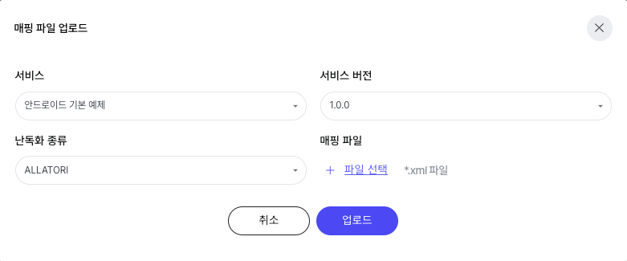
<Gha keyword="WARNING" title="매핑 파일을 통한 난독화된 정보 가독화(Decoding)">
매핑 파일 업로드 이후부터 수집되는 난독화 정보를 가독화 하여 저장합니다. 업로드 한 매핑 파일 적용에 다소 시간이 소요될 수 있으며, 스택 트레이스 조회 시점에 난독화 정보로 보여질 수 있습니다. 
</Gha>

#### | iOS dSYM

iOS의 Build 과정에서 생성된 dSYM 파일을 업로드할 수 있습니다. ‘dSYM’ 패키지 안의 `바이너리 파일` 에 `.map` 확장자를 붙여 업로드해 주세요.
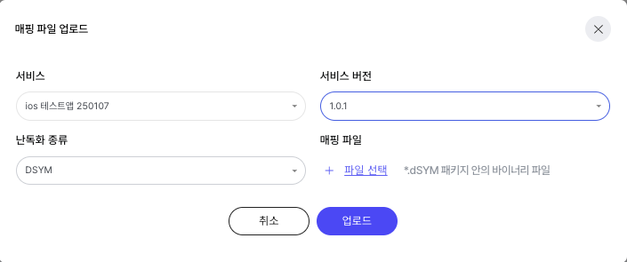

- `.dSYM` 파일 [패키지 내용 보기] → Contents > Resources > DWARF > `(바이너리 파일)` > (사본생성) > `(바이너리 파일)` 이름 수정 > `(바이너리 파일).map` 업로드

<Gha keyword="NOTE" title="(바이너리 파일).map">
IMQA에서는 정보 보안을 위해 허용되는 확장자 외 파일 업로드를 제한하고 있습니다. dSYM 바이너리 파일의 경우, `(바이너리 파일).map` 로 확장자를 확인하고 있습니다.
</Gha>

<Gha keyword="WARNING" title="매핑 파일을 통한 난독화된 정보 가독화(Decoding)">
매핑 파일 업로드 이후부터 수집되는 난독화 정보를 가독화 하여 저장합니다. 업로드 한 매핑 파일 적용에 다소 시간이 소요될 수 있으며, 스택 트레이스 조회 시점에 난독화 정보로 보여질 수 있습니다. 
</Gha>

#### | 공통 Source Map

Android, iOS 하이브리드 앱(웹뷰) 또는 Web 에서 수집된 웹 에러 스택 트레이스에서, 원본 소스 코드 위치를 파악할 수 있습니다.   
웹 Bundler 로 생성한 js.map 파일을 단일 업로드 또는 압축한 zip 파일로 업로드할 수 있습니다. ‘index.js.map’, ‘imqa-sourcemap.zip’ 과 같이 `.map` 또는 `.zip`  파일을 업로드해 주세요.

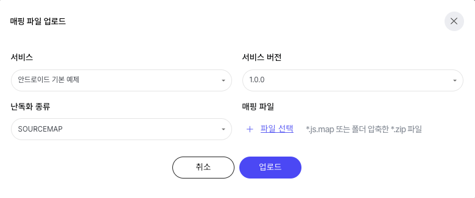

- `*.js.map`  업로드
-  `*.zip`  업로드

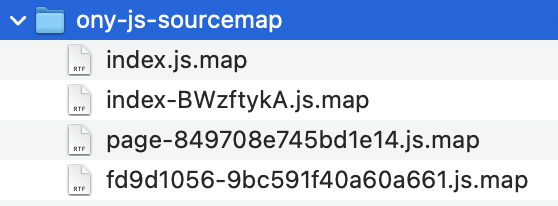

<Gha keyword="NOTE" title="매핑 파일을 통한 난독화된 정보 가독화(Decoding)">
Source Map의 경우, 수집된 웹 에러 스택 트레이스 정보 조회 시 파일명이 일치하는 소스맵 파일을 즉시 적용합니다. 
</Gha>

### 매핑 파일 목록

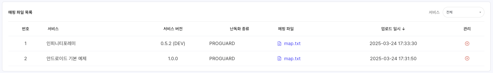

#### 필터

- **서비스**: 전체, 특정 서비스로 매핑 파일 목록을 필터링합니다.

#### 매핑 파일 목록

현재 등록된 매핑 파일 목록을 확인할 수 있습니다. 기본은 최근 업로드 일시 순으로 정렬 됩니다.

- **매핑 파일**: 매핑 파일명을 클릭 시, 해당 파일을 로컬에 저장할 수 있습니다.
- **관리**: 매핑 파일을 삭제할 수 있습니다.
    - [삭제] 아이콘 클릭 시, 해당 매핑 파일을 삭제할 수 있습니다.

---
## 5. 감사 로그

IMQA 감사 로그를 통해 IMQA 사용자들의 로그인, 기능 사용 이력을 확인할 수 있습니다.

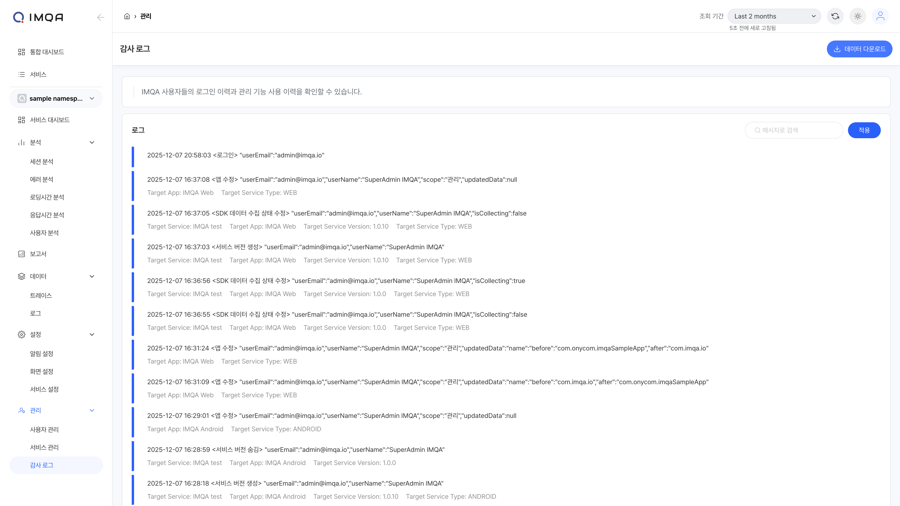

IMQA 감사 로그는 다음과 같이 구성됩니다.

**❶ 툴바(감사 로그)**

**❷ 로그 목록**

---
### 툴 바

**❶ 조회 조건:** 조회하고자 하는 기간을 선택할 수 있습니다. '최근 5분' 부터 '오늘' 등 빠른 버튼을 활용해 기간을 선택할 수 있으며, 'Custom' 으로 시작일시와 종료일시를 설정할 수 있습니다.

**❷ 새로고침:** 현재 화면에 표시된 조회 결과 데이터를 새로고침합니다.

**❸ 데이터 다운로드:** 현재 화면에 표시된 조회 결과를 `.csv`로 다운로드할 수 있습니다.

### 감사 로그 목록

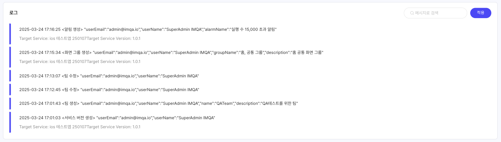

#### 필터

조회하고자 하는 특정 로그 메시지가 있을 경우 메시지에 포함된 3글자 이상의 검색어를 입력합니다. [적용]을 클릭하면 선택한 필터 기준으로 데이터가 조회됩니다.

#### 감사 로그 목록

- **메시지**: IMQA 사용자의 로그인, 관리 기능 사용 내용을 메시지로 표시합니다.
    - 발생일시
    - 이벤트
        - 로그인
        - 데이터 다운로드
        - 로컬(특정 서비스) 관리 기능
        - 글로벌 관리 기능
    - 부가 정보
        - 이벤트별 상세 정보
        - 대상 서비스
        - 대상 서비스 버전