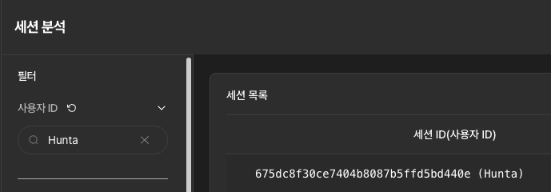

<Gha keyword="TIP" title="IMQA 서비스 추가 > 앱 추가 > 키 발급">
IMQA 관리 계정 로그인 후 **관리 > 서비스 관리** 메뉴에서 새로운 서비스를 추가합니다. **관리 > 앱 관리** 메뉴에서 해당 서비스에 새로운 앱을 등록하고 발급된 `앱 키`를 확인합니다. 등록한 `서비스 이름`과 `앱 키`를 사용하여 설치하세요. 
</Gha>

## IMQA Android SDK 지원 사양

| 항목 | 요구사항 |
|------|---------|
| Java version | 1.8 이상 |
| min SDK | 21 이상 (26 미만은 디슈가링 적용 필요) |
| compile SDK (= target SDK) | 34 이상 |
| Support Language | Java, Kotlin |
| Gradle | 8.0 이상 |
| Gradle Plugin (AGP) | 8.0 이상 |

## IMQA Android SDK 설치

IMQA SDK는 애플리케이션의 런타임에 데이터를 수집하기 위해 설계되었습니다. 아래 방법을 따라 SDK를 설치하세요.

### 1. Gradle 설정

IMQA Android SDK는 Maven 저장소를 통해 제공됩니다. 프로젝트의 Gradle 설정 파일에서 SDK를 추가합니다.

#### 1-1. 프로젝트 수준의 `build.gradle` 또는 `settings.gradle`

Maven을 이용시 Groovy 또는 Kotlin DSL을 사용하는 경우 각각 아래와 같이 Maven 저장소를 추가합니다.

**Groovy DSL**

```groovy
allprojects {
  repositories {
    mavenCentral() 
  }
}
```

**Kotlin DSL**

```kotlin
repositories {
  mavenCentral()  
}
```

#### 1-2. 모듈(app) 수준의 `build.gradle`

Maven 이용시 애플리케이션의 `dependencies` 섹션에 IMQA SDK를 추가합니다.

**Groovy DSL**

```groovy
dependencies {
  implementation 'io.imqa:imqa-android-sdk:1.1.4'
}
```

**Kotlin DSL**

```kotlin
dependencies {
  implementation("io.imqa:imqa-android-sdk:1.1.4")
}
```

> [!TIP]
> **버전은 SDK의 최신 버전을 입력하세요.**

#### 1-3. aar 파일 직접 설치

애플리케이션 디렉토리 하위에 libs 디렉토리를 생성하고 imqa-android-sdk-버전-release.aar 파일을 복사 후 dependencies 섹션에 IMQA SDK를 추가합니다.

**Groovy DSL**

```groovy
dependencies {
  implementation files('libs/imqa-android-sdk-1.1.4-release.aar')
}
```

**Kotlin DSL**

```kotlin
dependencies {
  implementation(files("libs/imqa-android-sdk-1.1.4-release.aar"))
}
```

#### 1-4. Desugaring 적용

minSdkVersion 이 26 미만인 경우 디슈가링을 활성화해야합니다.

**Groovy DSL**

```groovy
compileOptions {
  ...
  coreLibraryDesugaringEnabled true
}
dependencies {
    // For AGP 7.4+
    coreLibraryDesugaring 'com.android.tools:desugar_jdk_libs:2.0.3'
    // For AGP 7.3
    // coreLibraryDesugaring 'com.android.tools:desugar_jdk_libs:1.2.3'
    // For AGP 4.0 to 7.2
    // coreLibraryDesugaring 'com.android.tools:desugar_jdk_libs:1.1.9'
}
```

**Kotlin DSL**

```kotlin
compileOptions {
  ...
  isCoreLibraryDesugaringEnabled = true
}
dependencies {
    // For AGP 7.4+
    coreLibraryDesugaring("com.android.tools:desugar_jdk_libs:2.0.3")
    // For AGP 7.3
    // coreLibraryDesugaring("com.android.tools:desugar_jdk_libs:1.2.3")
    // For AGP 4.0 to 7.2
    // coreLibraryDesugaring("com.android.tools:desugar_jdk_libs:1.1.9")
}
```

### 2. Application 클래스 설정

IMQA SDK는 `Application` 클래스에 초기화 코드를 추가하여 동작합니다. `Application` 클래스의 `onCreate()` 메서드에서 다음을 설정하세요.

1. **Application 클래스 추가**
애플리케이션의 `AndroidManifest.xml` 파일에 `android:name` 속성을 설정하여 `Application` 클래스를 지정합니다. 기존에 `Application` 클래스가 이미 존재하는 경우 이 단계를 생략할 수 있습니다.

```xml
<application
    android:name=".Application"
    ...
>
</application>
```

2. **SDK 초기화 코드 작성**
`Application` 클래스의 `onCreate()` 메서드에 다음 코드를 추가합니다:

**Kotlin**

```kotlin
import io.imqa.sdk.core.IMQA
import io.imqa.sdk.core.IMQAOption
import io.imqa.sdk.core.Environment

class Application : android.app.Application() {
    override fun onCreate() {
        super.onCreate()

        val options = IMQAOption()
        options.setDefault()
        options.setCollectorURL("여기에 url을 입력해주세요.")
        options.setServiceKey("여기에 service key를 입력해주세요.")
        options.setSampleRate("샘플링 비율(0.0~1.0) 값을 입력해주세요.") // default=1.0
        options.setServiceNameSpace("Namespace"); 
        options.setRemoteCollectionControlEnable(true)
        //options.setEnvironment(Environment.DEVELOPMENT);
        //options.setUserEventEnable(true)

        IMQA.setup(options)
        IMQA.initialize(this.applicationContext, this)
    }
}
```

**Java**

```java
import io.imqa.sdk.core.IMQA;
import io.imqa.sdk.core.IMQAOption;
import io.imqa.sdk.core.Environment;

public class Application extends android.app.Application {
    @Override
    public void onCreate() {
        super.onCreate();

        IMQAOption options = new IMQAOption();
        options.setDefault();
        options.setCollectorURL("여기에 url을 입력해주세요.");
        options.setServiceKey("여기에 service key를 입력해주세요.");
        options.setSampleRate("샘플링 비율(0.0~1.0) 값을 입력해주세요."); // default=1.0
        options.setServiceNameSpace("Namespace"); 
        options.setRemoteCollectionControlEnable(true)
        //options.setEnvironment(Environment.DEVELOPMENT);        
        //options.setUserEventEnable(true)
        
        IMQA.setup(options);
        IMQA.initialize(this.getApplicationContext(), this);
    }
}
```

- `setCollectorURL`: 데이터를 수집할 서버의 URL을 입력합니다.
- `setServiceKey`: 발급받은 앱키를 입력합니다.  
   (관리 > 앱 관리 > 앱키)  
- (option) `setSampleRate`: 샘플링 비율을 입력합니다. 샘플링 디폴트 값은 1.0(100%) 입니다.
  - 0.0~1.0 사이의 값을 입력합니다. (0.0 : 수집 안함, 1.0 : 100% 수집)
- `setServiceNameSpace`: 대시보드 서비스 추가시 입력한 namespace를 넣어주세요.  
   (관리 > 서비스 관리 > 서비스 이름) 또는 (관리 > 앱 관리 > 서비스)
- (option)`setEnvironment`: 배포 환경 설정 (default: .PRODUCTION)
- (option)`setUserEventEnable`: 클릭이벤트 자동 수집 설정(XML UI 지원) (default=false)
- (option)`setRemoteCollectionControlEnable`: 원격 수집 제어 활성화 설정 (default=false)  
  - SDK는 api로 전달된 서버 설정에 따라 적용됩니다.
  - On/Off (default=on)
  - 전송 실패 시 자동 중지 정책 (defalut=false)
  - 자동 중지 정책 실패 횟수 기준(defalut=5)

### 3. Https 설정

1. **Retrofit, OkHttp 설정**

Retrofit, OkHttp 기반의 네트워크 요청의 XHR 데이터를 수집하기 위해 네트워크 요청 시 다음과 같이 HttpInterceptor를 추가해 주세요.

**Kotlin**

```kotlin
import io.imqa.sdk.network.interceptor.HttpInterceptor

val client = OkHttpClient.Builder()
    .addInterceptor(HttpInterceptor())
    .build()

val retrofit = Retrofit.Builder()
    .baseUrl("https://api.example.com/")
    .client(client)
    .addConverterFactory(GsonConverterFactory.create())
    .build()
```

**Java**

```java
import io.imqa.sdk.network.interceptor.HttpInterceptor;

OkHttpClient client = new OkHttpClient.Builder()
    .addInterceptor(new HttpInterceptor())
    .build();

Retrofit retrofit = new Retrofit.Builder()
    .baseUrl("https://api.example.com/")
    .client(client)
    .addConverterFactory(GsonConverterFactory.create())
    .build();
```

2. **HttpURLConnection 설정**

HttpURLConnection 기반의 네트워크 요청의 XHR 데이터를 수집하기 위해 네트워크 요청 시 다음과 같이 추가해 주세요.

**Kotlin**

```kotlin
import io.imqa.sdk.network.urlconnection.ConnectionWrapper

// HttpURLConnection(HttpsURLConnection) 객체를 ConnectionWrapper 로 감쌈
var url : URL = URL("https://some.host.com")
var conn = ConnectionWrapper.wrap(url.openConnection() as HttpURLConnection)
```

**Java**

```java
import io.imqa.sdk.network.urlconnection.ConnectionWrapper;

// HttpsURLConnection(HttpsURLConnection) 객체를 ConnectionWrapper 로 감쌈
URL url = new URL("https://some.host.com");
HttpURLConnection conn = 
    ConnectionWrapper.wrap((HttpURLConnection) url.openConnection());
```

3. **Ktor 설정**   

3-1. OkHttp 엔진 사용시  

Ktor의 OkHttp 엔진을 사용하는 경우 네트워크 요청의 XHR 데이터를 수집하기 위해 네트워크 요청 시 다음과 같이 추가해 주세요.

**Kotlin**

```kotlin
import io.imqa.sdk.network.interceptor.HttpInterceptor

val client = HttpClient(OkHttp) {
    engine {
        config {
            //타임아웃 등 기존 세팅
            connectTimeout(2, TimeUnit.SECONDS)
            readTimeout(2, TimeUnit.SECONDS)
            writeTimeout(2, TimeUnit.SECONDS)

            //Interceptor 추가
            addInterceptor(HttpInterceptor())
        }
    }
    install(Logging)

    install(ContentNegotiation) {
        json(Json { ignoreUnknownKeys = true })
    }
}
```
3-2. Android 엔진 사용시  

imqa-android-sdk-extension-버전-release.aar 파일을 복사 후 dependencies 섹션에 IMQA SDK Extensions를 추가합니다.

**Groovy DSL**

```groovy
dependencies {
  implementation files('libs/imqa-android-sdk-1.1.4-release.aar') //IMQA SDK
  //IMQA SDK Extensions 추가
  implementation files('libs/imqa-android-sdk-extensions-1.0.1-release.aar') 
  //implementation 'io.imqa:imqa-android-sdk-extensions:1.0.1' //Maven 사용시 
}
```

**Kotlin DSL**

```kotlin
dependencies {
  implementation(files("libs/imqa-android-sdk-1.1.4-release.aar")) //IMQA SDK
  //IMQA SDK Extensions 추가 
  implementation(files("libs/imqa-android-sdk-extensions-1.0.1-release.aar")) 
  //implementation ("io.imqa:imqa-android-sdk-extensions:1.0.1") //Maven 사용시 
}
```

Ktor의 Android 엔진을 사용하는 경우 네트워크 요청의 XHR 데이터를 수집하기 위해 기존 클라이언트 설정에 다음과 같이 추가해 주세요.  

```kotlin
import io.imqa.sdk.extensions.ktor.IMQAKtorIntercept

    val client = HttpClient(Android) {
        //기존 설정
        install(Logging)
        install(ContentNegotiation) {
            json(Json { ignoreUnknownKeys = true })
        }
        //IMQA Ktor Intercept Plugin
        install(IMQAKtorIntercept.Plugin) 
    }
```

### 4. 설치 검증

IMQA가 정상적으로 동작하는지 확인하기 위해 샘플 오류를 발생시켜 로그가 전송되는지 확인합니다.
아래 코드를 애플리케이션의 적절한 위치에 추가하여 테스트합니다.

**Kotlin**

```kotlin
import androidx.appcompat.app.AppCompatActivity
import android.os.Bundle
import java.lang.Exception
import io.imqa.sdk.log.IMQALog

class MainActivity : AppCompatActivity() {
    override fun onCreate(savedInstanceState: Bundle?) {
        super.onCreate(savedInstanceState)

        try {
            throw Exception("테스트 오류")
        } catch (e: Exception) {
            IMQALog.error("TestTag", "This is a test error", e)
        }
    }
}
```

**Java**

```java
import androidx.appcompat.app.AppCompatActivity;
import android.os.Bundle;
import java.lang.Exception;
import io.imqa.sdk.log.IMQALog;

public class MainActivity extends AppCompatActivity {
    @Override
    protected void onCreate(Bundle savedInstanceState) {
        super.onCreate(savedInstanceState);

        try {
            throw new Exception("테스트 오류");
        } catch (Exception e) {
            IMQALog.error("TestTag", "This is a test error", e);
        }
    }
}
```

## IMQA Android SDK 설정

### 커스텀 사용자 ID 설정

커스텀 사용자 ID를 지정하여 특정 사용자의 세션 분석 시 활용할 수 있습니다.
일반적으로 로그인 성공 시 "사용자 아이디(또는 사번)"을 넣어주고, 로그아웃 성공 시 빈문자열("")을 설정해서 세션 분석을 진행합니다. `IMQA.initialize` 호출 이후에 실행되어야 정상적으로 동작합니다.

**Kotlin**

```kotlin
import io.imqa.sdk.core.IMQA

IMQA.custom.setupUserId("customer-user-id")
```

**Java**

```java
import io.imqa.sdk.core.IMQA;

IMQA.getCustomAttributes().setupUserId("customer-user-id");
```


### 커스텀 이벤트 전송

특정 버튼이나 탭 버튼을 클릭 시 이벤트가 발생했음을 알리는 기능입니다.

> `IMQA.sendClickEvent(view: View, isNetworkRequest: Boolean = false)`
> - view : 클릭 대상, isNetworkRequest : 데이터 조회 여부

단순히 화면 이동을 위한 버튼 클릭 시 이벤트 알림을 다음과 같이 전송할 수 있습니다.  

**Kotlin**

```kotlin
import io.imqa.sdk.core.IMQA

val intent = Intent(this, HelloActivity::class.java)
binding.button.setOnClickListener { 
    IMQA.sendClickEvent(binding.button, false)
    //IMQA.sendClickEvent("button_name", false) //버튼 이름을 직접 입력시

    startActivity(intent)     
}

```

**Java**

```java
import io.imqa.sdk.core.IMQA;

Intent intent = new Intent(this, HelloActivity.class);
binding.button.setOnClickListener(v -> {
    IMQA.sendClickEvent(binding.button, false);
    //IMQA.sendClickEvent("button_name", false) //버튼 이름을 직접 입력시
    
    startActivity(intent);
});

```

버튼 클릭 시 서버로 데이터 조회를 할 경우 다음과 같이 전송할 수 있습니다.

**Kotlin**

```kotlin
binding.button.setOnClickListener {
    IMQA.sendClickEvent(it, true)
    service.getHello().enqueue(object : retrofit2.Callback<Data> {
        override fun onFailure(call: Call<Data>, t: Throwable) {
            t.printStackTrace()
        }

        override fun onResponse(call: Call<Data>, response: Response<Data>) {
            response.body()?.let { data ->
                IMQALog.debug("MainActivity", "Data: $data")
            }
        }
    })
}
```

**Java**

```java
binding.button.setOnClickListener(new View.OnClickListener() {
    @Override
    public void onClick(View v) {
        IMQA.sendClickEvent(v, true);
        service.getHello().enqueue(new Callback<Data>() {
            @Override
            public void onResponse(Call<Data> call, Response<Data> response) {
                Data data = response.body();
                if (data != null) {
                    IMQALog.debug("MainActivity", "Data: " + data.toString());
                }
            }

            @Override
            public void onFailure(Call<Data> call, Throwable t) {
                t.printStackTrace();
            }
        });
    }
});
```

#### 이벤트 자동 계측
이벤트 자동 수집은 
options.setUserEventEnable(true) 추가시 수집됩니다.
IMQA.sendClickEvent() 와 같이 사용시 이벤트가 중복으로 수집될 수 있습니다.  
자동 수집 옵션이 활성화되었을때 특정 View를 클릭 이벤트 수집 대상에서 제외하려면
android:tag="imqa_ignore" 로 설정하면 해당 View는 자동 수집에서 무시됩니다.

> IMQAOption options = new IMQAOption();  
> options.setDefault();  
> ... 생략 ...  
> options.setUserEventEnable(true);  

### 웹뷰 페이지 세션 연결

네이티브 앱의 세션과 웹뷰 내 페이지 세션을 하나로 결합하기 위해 `webView.loadUrl(serverUrl)` 호출전 `JavaScriptInjector.injectSession(view)` 코드를 사용하여 연결해야 합니다.

<Gha keyword="TIP" title="하이브리드 앱(WebView 사용)에서의 IMQA 설정">
IMQA Android SDK, iOS SDK, WebAgent는 각각 환경의 특성에 맞는 데이터를 수집합니다.
</Gha>

**Kotlin**

```kotlin
import io.imqa.sdk.feature.webview.JavaScriptInjector

// ... 생략 ...
JavaScriptInjector.injectSession(webView)
webView.loadUrl(serverUrl)
// ... 생략 ...
```

**Java**

```java
import io.imqa.sdk.feature.webview.JavaScriptInjector;

// ... 생략 ...
JavaScriptInjector.injectSession(webView);
webView.loadUrl(serverUrl);
// ... 생략 ...
```

### Cordova Library Webview 설정
Cordova 라이브러리를 사용하는 경우 Webview를 다음과 같이 설정해야 합니다.

#### Cordova Library `build.gradle`  

```groovy
    compileOnly(files("libs/imqa-android-sdk-1.1.0-release.aar"))
```

#### Webview Interface 설정
`JavaScriptInjector.injectSession(view)` 코드를 사용하여 연결해야 합니다.

```java
protected void init() {
   appView = makeWebView();
   createViews();
   if (!appView.isInitialized()) {
       appView.init(cordovaInterface, pluginEntries, preferences);
   }
   cordovaInterface.onCordovaInit(appView.getPluginManager());

   // WebView Interface 삽입 
   WebView realWebView = (WebView) ((SystemWebViewEngine) appView.getEngine()).getView();
   JavaScriptInjector.injectSession(realWebView);


   String volumePref = preferences.getString("DefaultVolumeStream", "");
   if ("media".equals(volumePref.toLowerCase(Locale.ENGLISH))) {
       setVolumeControlStream(AudioManager.STREAM_MUSIC);
   }
}
```
### Fragment 라이프사이클

Fragment의 라이프사이클 이벤트(onCreate, onStart, onResume 등)를 자동으로 계측하여 화면 진입/이탈 시점을 추적할 수 있습니다.

#### Fragment 이름 지정
기본적으로 화면명은 f.javaClass.simpleName을 기반으로 자동 지정됩니다.
단, 난독화 환경에서 클래스명이 변경되거나, 명시적으로 다른 이름을 사용하고 싶은 경우에는 @RumScreenName 어노테이션을 통해 화면명을 직접 지정할 수 있습니다.

```kotlin
import io.imqa.sdk.annotations.RumScreenName

@RumScreenName("MyFragment")
class MyFragment : Fragment() {
    ...
}
```

```java
import io.imqa.sdk.annotations.RumScreenName;

@RumScreenName("MyFragment")
class MyFragment extends Fragment {
    ...
}
```

#### Fragment 이름 난독화
난독화 도구에 따라 `f.javaClass.simpleName` 기반의 화면명이 변경될 수 있습니다. RumScreenName 사용하지 않고 ProGuard/R8을 사용하는 경우에는 아래 규칙을 추가하여 Fragment 클래스 이름을 보존해 주세요.
단, ProGuard/R8 외의 다른 난독화 도구를 사용하는 경우 이름 보존 방식이 다를 수 있으므로 해당 도구의 가이드에 따라 별도 설정이 필요합니다.

**ProGuard**

```kotlin
-keepnames class * extends androidx.fragment.app.Fragment 
```

Fragment 단위의 계측이 불필요한 경우, 초기화 시 옵션을 통해 비활성화할 수 있습니다.

```kotlin
options.setFragmentLifecycleEnabled(false) 
```

### 사용자 커스텀 로깅

필요한 경우 SDK의 IMQALog API를 사용하여 사용자 로그를 수집할 수 있습니다. 로그 레벨은 debug, info, warn, error로 다음과 같이 사용하실 수 있습니다.

<Gha keyword="WARNING" title="사용자 커스텀 로깅시 주의사항">
사용자 커스텀 로깅 기능은 꼭 필요한 경우에 사용해 주세요. 무분별하게 너무 많은 로그를 남기면 앱에 성능 저하를 일으킬 수 있습니다. 또한, 수집 데이터가 늘어나므로 저장소 용량이 커질 수 있습니다.
</Gha>

<Gha keyword="TIP" title="서비스에서의 중요한 로직과 거래 추적">
문제 패턴과 예외 확인을 위한 커스텀 메시지를 남기고 식별할 수 있습니다.
</Gha>

**Kotlin**

```kotlin
import io.imqa.sdk.log.IMQALog

IMQALog.debug("TAG", "message")
IMQALog.info("TAG", "message")
IMQALog.warn("TAG", "message")
IMQALog.error("TAG", "message", RuntimeException("exception"))
```

**Java**

```java
import io.imqa.sdk.log.IMQALog;

IMQALog.debug("TAG", "message");
IMQALog.info("TAG", "message");
IMQALog.warn("TAG", "message");
IMQALog.error("TAG", "message", new RuntimeException("exception"));
```

## API 참조

### IMQA

SDK의 메인 객체입니다.

#### setup(option: IMQAOption): IMQA

SDK 옵션을 설정합니다.

**매개변수:**
- `option`: IMQAOption - SDK 설정 옵션 객체

**반환값:**
- `IMQA` - IMQA 객체

**Kotlin**

```kotlin
val option = IMQAOption()
option.setDefault()
option.setCollectorURL("https://collector.example.com")
option.setServiceKey("your-service-key")

IMQA.setup(option)
```

**Java**

```java
IMQAOption option = new IMQAOption();
option.setDefault();
option.setCollectorURL("https://collector.example.com");
option.setServiceKey("your-service-key");

IMQA.setup(option);
```

#### initialize(context: Context, application: Application)

SDK를 초기화합니다. `setup()` 호출 후 `Application.onCreate()`에서 호출해야 합니다.

**매개변수:**
- `context`: Context - 애플리케이션 컨텍스트
- `application`: Application - 애플리케이션 인스턴스

**Kotlin**

```kotlin
class MyApplication : Application() {
    override fun onCreate() {
        super.onCreate()
        val option = IMQAOption()
        // ... 옵션 설정 ...
        
        IMQA.setup(option)
        IMQA.initialize(this.applicationContext, this)
    }
}
```

**Java**

```java
public class MyApplication extends Application {
    @Override
    public void onCreate() {
        super.onCreate();
        IMQAOption option = new IMQAOption();
        // ... 옵션 설정 ...
        
        IMQA.setup(option);
        IMQA.initialize(this.getApplicationContext(), this);
    }
}
```

#### sendClickEvent(view: View, isNetworkRequest: Boolean = false)

View 객체의 클릭 이벤트를 전송합니다.

**매개변수:**
- `view`: View - 클릭된 View 객체
- `isNetworkRequest`: Boolean - 네트워크 요청 포함 여부 (기본값: false)

**Kotlin**

```kotlin
button.setOnClickListener { view ->
    IMQA.sendClickEvent(view, false)
}
```

**Java**

```java
button.setOnClickListener(v -> {
    IMQA.sendClickEvent(v, false);
});
```

#### sendClickEvent(viewName: String, isNetworkRequest: Boolean = false)

커스텀 이름으로 클릭 이벤트를 전송합니다.

**매개변수:**
- `viewName`: String - 클릭 이벤트의 커스텀 이름
- `isNetworkRequest`: Boolean - 네트워크 요청 포함 여부 (기본값: false)

**Kotlin**

```kotlin
button.setOnClickListener {
    IMQA.sendClickEvent("커스텀 버튼명", false)
}
```

**Java**

```java
button.setOnClickListener(v -> {
    IMQA.sendClickEvent("커스텀 버튼명", false);
});
```

#### custom: CustomAttributes

사용자 속성을 설정하기 위한 CustomAttributes 객체입니다.

**Kotlin**

```kotlin
IMQA.custom.setupUserId("customer-user-id")
```

**Java**

```java
IMQA.getCustomAttributes().setupUserId("customer-user-id");
```

#### getOption(): IMQAOption

현재 설정된 IMQAOption 객체를 반환합니다.

**반환값:**
- `IMQAOption` - 설정된 옵션 객체


### IMQAOption

SDK 설정을 관리하는 클래스입니다.

#### 생성자

**IMQAOption()**

새 IMQAOption 인스턴스를 생성합니다.

**Kotlin**

```kotlin
val option = IMQAOption()
```

**Java**

```java
IMQAOption option = new IMQAOption();
```

#### 설정 메서드

**setDefault(): IMQAOption**

기본 설정을 적용합니다.

**반환값:**
- `IMQAOption` - IMQAOption 객체

**Kotlin**

```kotlin
val option = IMQAOption()
option.setDefault()
```

**Java**

```java
IMQAOption option = new IMQAOption();
option.setDefault();
```

**setCollectorURL(url: String): IMQAOption**

데이터 수집 서버 URL을 설정합니다.

**매개변수:**
- `url`: String - 수집 서버 URL

**반환값:**
- `IMQAOption` - IMQAOption 객체

**Kotlin**

```kotlin
option.setCollectorURL("https://collector.example.com")
```

**Java**

```java
option.setCollectorURL("https://collector.example.com");
```

**setServiceKey(key: String): IMQAOption**

서비스 키를 설정합니다.

**매개변수:**
- `key`: String - 서비스 키

**반환값:**
- `IMQAOption` - IMQAOption 객체

**Kotlin**

```kotlin
option.setServiceKey("your-service-key")
```

**Java**

```java
option.setServiceKey("your-service-key");
```

**setSampleRate(rate: Double)**

샘플링 비율을 설정합니다. (0.0 ~ 1.0) 디폴트 값은 1.0(100%) 입니다.

**매개변수:**
- `rate`: Double - 샘플링 비율 (0.0: 0%, 1.0: 100%)

**Kotlin**

```kotlin
option.setSampleRate(0.5) // 50% 샘플링
option.setSampleRate(1.0) // 100% 샘플링
```

**Java**

```java
option.setSampleRate(0.5); // 50% 샘플링
option.setSampleRate(1.0); // 100% 샘플링
```

**setServiceNameSpace(nameSpace: String)**

서비스 네임스페이스를 설정합니다.

**매개변수:**
- `nameSpace`: String - 네임스페이스

**Kotlin**

```kotlin
option.setServiceNameSpace("production")
```

**Java**

```java
option.setServiceNameSpace("production");
```

**setEnvironment(environment: Environment)**

환경 타입을 설정합니다. 디폴트 값은 PRODUCTION 입니다.

**매개변수:**
- `environment`: Environment - DEVELOPMENT 또는 PRODUCTION

**Kotlin**

```kotlin
import io.imqa.sdk.core.Environment

option.setEnvironment(Environment.PRODUCTION)
option.setEnvironment(Environment.DEVELOPMENT)
```

**Java**

```java
import io.imqa.sdk.core.Environment;

option.setEnvironment(Environment.PRODUCTION);
option.setEnvironment(Environment.DEVELOPMENT);
```

**setRemoteCollectionControlEnable(enable: Boolean)**

원격 컬렉션 제어 기능을 활성화/비활성화합니다. 
디폴트 값은 false(비활성화) 입니다.

**매개변수:**
- `enable`: Boolean - 활성화 여부

**Kotlin**

```kotlin
option.setRemoteCollectionControlEnable(true)
```

**Java**

```java
option.setRemoteCollectionControlEnable(true);
```

**setUserEventEnable(value: Boolean)**

사용자 이벤트(클릭) 추적을 활성화/비활성화합니다. 디폴트 값은 false(비활성화) 입니다.

**매개변수:**
- `value`: Boolean - 활성화 여부

**Kotlin**

```kotlin
option.setUserEventEnable(true)
```

**Java**

```java
option.setUserEventEnable(true);
```

**setActivityLifecycleEnabled(value: Boolean): IMQAOption**

Activity 라이프사이클 추적을 활성화/비활성화합니다.
디폴트 값은 true(활성화) 입니다.

**매개변수:**
- `value`: Boolean - 활성화 여부

**반환값:**
- `IMQAOption` - IMQAOption 객체

**Kotlin**

```kotlin
option.setActivityLifecycleEnabled(true)
```

**Java**

```java
option.setActivityLifecycleEnabled(true);
```

**setFragmentLifecycleEnabled(value: Boolean): IMQAOption**

Fragment 라이프사이클 추적을 활성화/비활성화합니다.
디폴트 값은 true(활성화) 입니다.

**매개변수:**
- `value`: Boolean - 활성화 여부

**반환값:**
- `IMQAOption` - IMQAOption 객체

**Kotlin**

```kotlin
option.setFragmentLifecycleEnabled(true)
```

**Java**

```java
option.setFragmentLifecycleEnabled(true);
```

**setDeviceIdEnable(value: Boolean)**

디바이스 ID 수집을 활성화/비활성화합니다.
디폴트 값은 true(활성화) 입니다.

**매개변수:**
- `value`: Boolean - 활성화 여부

**Kotlin**

```kotlin
option.setDeviceIdEnable(true)
```

**Java**

```java
option.setDeviceIdEnable(true);
```

**setAdvancedNetworkCapture(isCapture: Boolean)**

HTTP 요청 body 수집을 활성화/비활성화합니다.
디폴트 값은 false(비활성화) 입니다.

**매개변수:**
- `isCapture`: Boolean - 수집 여부

**Kotlin**

```kotlin
option.setAdvancedNetworkCapture(true)
```

**Java**

```java
option.setAdvancedNetworkCapture(true);
```

**setXhrRequestHeaderEnable(value: Boolean)**

HTTP 요청 헤더 수집을 활성화/비활성화합니다.
디폴트 값은 false(비활성화) 입니다.

**매개변수:**
- `value`: Boolean - 활성화 여부

**Kotlin**

```kotlin
option.setXhrRequestHeaderEnable(true)
```

**Java**

```java
option.setXhrRequestHeaderEnable(true);
```

**setXhrResponseHeaderEnable(value: Boolean)**

HTTP 응답 헤더 수집을 활성화/비활성화합니다.
디폴트 값은 false(비활성화) 입니다.

**매개변수:**
- `value`: Boolean - 활성화 여부

**Kotlin**

```kotlin
option.setXhrResponseHeaderEnable(true)
```

**Java**

```java
option.setXhrResponseHeaderEnable(true);
```

**setAnrDetectionEnable(value: Boolean)**

ANR(Application Not Responding) 탐지를 활성화/비활성화합니다.
디폴트 값은 true(활성화) 입니다.

**매개변수:**
- `value`: Boolean - 활성화 여부

**Kotlin**

```kotlin
option.setAnrDetectionEnable(true)
```

**Java**

```java
option.setAnrDetectionEnable(true);
```

**setSharedSession(flag: Boolean)**

웹뷰 세션 공유를 활성화/비활성화합니다.
디폴트 값은 true(활성화) 입니다.

**매개변수:**
- `flag`: Boolean - 활성화 여부

**Kotlin**

```kotlin
option.setSharedSession(true)
```

**Java**

```java
option.setSharedSession(true);
```

**setMinSupportedApiLevel(apiLevel: Int)**

지원하는 Min Api Level 설정합니다.
디폴트 값은 SDK의 minSDK의 21(Android 5.0) 입니다.
설정한 값 미만의 API Level의 디바이스는 IMQA 기능이 비활성화 됩니다.
디슈가링을 활성화하지 못하는 경우는 이 값을 26으로 조정해야 합니다.

**매개변수:**
- `apiLevel`: Int - 최소 지원할 API 레벨

**Kotlin**

```kotlin
option.setMinSupportedApiLevel(26)
```

**Java**

```java
option.setMinSupportedApiLevel(26);
```

#### 조회 메서드

**getCollectorURL(): String**

설정된 수집 서버 URL을 반환합니다.

**반환값:**
- `String` - 수집 서버 URL

**Kotlin**

```kotlin
val url = option.getCollectorURL()
```

**Java**

```java
String url = option.getCollectorURL();
```

**getServiceKey(): String**

설정된 서비스 키를 반환합니다.

**반환값:**
- `String` - 서비스 키

**Kotlin**

```kotlin
val key = option.getServiceKey()
```

**Java**

```java
String key = option.getServiceKey();
```

**getSampleRate(): Double**

설정된 샘플링 비율을 반환합니다.

**반환값:**
- `Double` - 샘플링 비율 (0.0 ~ 1.0)

**Kotlin**

```kotlin
val rate = option.getSampleRate()
```

**Java**

```java
double rate = option.getSampleRate();
```

**getServiceNameSpace(): String**

설정된 네임스페이스를 반환합니다.

**반환값:**
- `String` - 네임스페이스

**Kotlin**

```kotlin
val namespace = option.getServiceNameSpace()
```

**Java**

```java
String namespace = option.getServiceNameSpace();
```

**getEnvironment(): String**

설정된 환경 타입을 반환합니다.

**반환값:**
- `String` - "development" 또는 "production"

**Kotlin**

```kotlin
val env = option.getEnvironment()
```

**Java**

```java
String env = option.getEnvironment();
```
**isIMQAEnabled(): Boolean**

IMQA 기능 활성화 여부를 반환합니다.
수집, 전송 기능 활성화 여부를 반환합니다.

**반환값:**
- `Boolean` - 활성화 여부

**Kotlin**

```kotlin
val isEnabled = option.isIMQAEnabled()
```

**Java**

```java
boolean isEnabled = option.isIMQAEnabled();
```


**isUserEventEnable(): Boolean**

사용자 이벤트 추적 활성화 여부를 반환합니다.

**반환값:**
- `Boolean` - 활성화 여부

**Kotlin**

```kotlin
val isEnabled = option.isUserEventEnable()
```

**Java**

```java
boolean isEnabled = option.isUserEventEnable();
```

**getActivityLifecycleEnabled(): Boolean**

Activity 라이프사이클 추적 활성화 여부를 반환합니다.

**반환값:**
- `Boolean` - 활성화 여부

**Kotlin**

```kotlin
val isEnabled = option.getActivityLifecycleEnabled()
```

**Java**

```java
boolean isEnabled = option.getActivityLifecycleEnabled();
```

**getFragmentLifecycleEnabled(): Boolean**

Fragment 라이프사이클 추적 활성화 여부를 반환합니다.

**반환값:**
- `Boolean` - 활성화 여부

**Kotlin**

```kotlin
val isEnabled = option.getFragmentLifecycleEnabled()
```

**Java**

```java
boolean isEnabled = option.getFragmentLifecycleEnabled();
```

**isDeviceIdEnable(): Boolean**

디바이스 ID 수집 활성화 여부를 반환합니다.

**반환값:**
- `Boolean` - 활성화 여부

**Kotlin**

```kotlin
val isEnabled = option.isDeviceIdEnable()
```

**Java**

```java
boolean isEnabled = option.isDeviceIdEnable();
```

**getAdvancedNetworkCapture(): Boolean**

HTTP 요청 body 수집 활성화 여부를 반환합니다.

**반환값:**
- `Boolean` - 활성화 여부

**Kotlin**

```kotlin
val isEnabled = option.getAdvancedNetworkCapture()
```

**Java**

```java
boolean isEnabled = option.getAdvancedNetworkCapture();
```

**getXhrRequestHeaderEnable(): Boolean**

HTTP 요청 헤더 수집 활성화 여부를 반환합니다.

**반환값:**
- `Boolean` - 활성화 여부

**Kotlin**

```kotlin
val isEnabled = option.getXhrRequestHeaderEnable()
```

**Java**

```java
boolean isEnabled = option.getXhrRequestHeaderEnable();
```

**getXhrResponseHeaderEnable(): Boolean**

HTTP 응답 헤더 수집 활성화 여부를 반환합니다.

**반환값:**
- `Boolean` - 활성화 여부

**Kotlin**

```kotlin
val isEnabled = option.getXhrResponseHeaderEnable()
```

**Java**

```java
boolean isEnabled = option.getXhrResponseHeaderEnable();
```

**isAnrDetectionEnable(): Boolean**

ANR 탐지 활성화 여부를 반환합니다.

**반환값:**
- `Boolean` - 활성화 여부

**Kotlin**

```kotlin
val isEnabled = option.isAnrDetectionEnable()
```

**Java**

```java
boolean isEnabled = option.isAnrDetectionEnable();
```

**getSharedSession(): Boolean**

웹뷰 세션 공유 활성화 여부를 반환합니다.

**반환값:**
- `Boolean` - 활성화 여부

**Kotlin**

```kotlin
val isEnabled = option.getSharedSession()
```

**Java**

```java
boolean isEnabled = option.getSharedSession();
```

**getSendTelemetry(): Boolean**

텔레메트리 전송 활성화 여부를 반환합니다.

**반환값:**
- `Boolean` - 활성화 여부

**Kotlin**

```kotlin
val isEnabled = option.getSendTelemetry()
```

**Java**

```java
boolean isEnabled = option.getSendTelemetry();
```

**isRemoteCollectionControlEnable(): Boolean**

원격 컬렉션 제어 활성화 여부를 반환합니다.

**반환값:**
- `Boolean` - 활성화 여부

**Kotlin**

```kotlin
val isEnabled = option.isRemoteCollectionControlEnable()
```

**Java**

```java
boolean isEnabled = option.isRemoteCollectionControlEnable();
```

**getMinSupportedApiLevel(): Int**

지원하는 Min Api Level을 반환합니다.

**반환값:**
- `Int` - 최소 지원할 API 레벨

**Kotlin**

```kotlin
val apiLevel = option.getMinSupportedApiLevel()
```

**Java**

```java
int apiLevel = option.getMinSupportedApiLevel();
```

### CustomAttributes

사용자 속성을 설정하는 데이터 클래스입니다.

#### setupUserId(s: String)

사용자 ID를 설정합니다.

**매개변수:**
- `s`: String - 사용자 ID

**Kotlin**

```kotlin
// 로그인 시
IMQA.custom.setupUserId("user123")
// 로그아웃 시
IMQA.custom.setupUserId("")
```

**Java**

```java
// 로그인 시
IMQA.getCustomAttributes().setupUserId("user123");
// 로그아웃 시
IMQA.getCustomAttributes().setupUserId("");
```

#### setAttribute(key: String,value: String)
사용자 정의 attribute 추가합니다.  
사용자 attribute는 key 앞에 "custom."이 자동으로 추가됩니다.  
     * ex) setAttribute("age", "30")  
     *     → custom.age = 30  

**매개변수:**
- `key`: String - 속성 키 (custom. 접두사 자동 추가)
- `value`: String - 속성 값

**Kotlin**

```kotlin
IMQA.custom.setAttribute("key", "value")
```

**Java**

```java
IMQA.getCustomAttributes().setAttribute("key", "value");
```

#### removeAttribute(key: String)
사용자 정의 attribute 삭제합니다.

**매개변수:**
- `key`: String - 속성 키 (custom. 없이 입력)

**Kotlin**

```kotlin
IMQA.custom.removeAttribute("key")
```

**Java**

```java
IMQA.getCustomAttributes().removeAttribute("key");
```

### IMQALog

로그를 전송하는 객체입니다.

#### debug(tag: String, message: String)

DEBUG 레벨 로그를 전송합니다.

**매개변수:**
- `tag`: String - 로그 태그
- `message`: String - 로그 메시지

**Kotlin**

```kotlin
IMQALog.debug("MyTag", "Debug message")
```

**Java**

```java
IMQALog.debug("MyTag", "Debug message");
```

#### info(tag: String, message: String)

INFO 레벨 로그를 전송합니다.

**매개변수:**
- `tag`: String - 로그 태그
- `message`: String - 로그 메시지

**Kotlin**

```kotlin
IMQALog.info("MyTag", "Info message")
```

**Java**

```java
IMQALog.info("MyTag", "Info message");
```

#### warn(tag: String, message: String)

WARN 레벨 로그를 전송합니다.

**매개변수:**
- `tag`: String - 로그 태그
- `message`: String - 로그 메시지

**Kotlin**

```kotlin
IMQALog.warn("MyTag", "Warning message")
```

**Java**

```java
IMQALog.warn("MyTag", "Warning message");
```

#### error(tag: String, message: String, throwable: Throwable? = null)

ERROR 레벨 로그를 전송합니다.

**매개변수:**
- `tag`: String - 로그 태그
- `message`: String - 로그 메시지
- `throwable`: Throwable? - 예외 객체 (선택)

**Kotlin**

```kotlin
try {
    // some code
} catch (e: Exception) {
    IMQALog.error("MyTag", "Error occurred", e)
}
```

**Java**

```java
try {
    // some code
} catch (Exception e) {
    IMQALog.error("MyTag", "Error occurred", e);
}
```

### 네트워크 인터셉터

#### HttpInterceptor

OkHttp 클라이언트에 네트워크 추적을 위한 인터셉터를 추가합니다.

**Kotlin**

```kotlin
import io.imqa.sdk.network.interceptor.HttpInterceptor

val client = OkHttpClient.Builder()
    .addInterceptor(HttpInterceptor())
    .build()
```

**Java**

```java
import io.imqa.sdk.network.interceptor.HttpInterceptor;

OkHttpClient client = new OkHttpClient.Builder()
    .addInterceptor(new HttpInterceptor())
    .build();
```

#### ConnectionWrapper

HttpURLConnection을 래핑하여 네트워크 추적을 수행합니다.

**Kotlin**

```kotlin
import io.imqa.sdk.network.urlconnection.ConnectionWrapper

val url = URL("https://example.com/api")
val connection = ConnectionWrapper.wrap(url.openConnection() as HttpURLConnection)
```

**Java**

```java
import io.imqa.sdk.network.urlconnection.ConnectionWrapper;

URL url = new URL("https://example.com/api");
HttpURLConnection connection = 
    ConnectionWrapper.wrap((HttpURLConnection) url.openConnection());
```

### Annotation

#### @RumScreenName

Fragment에 화면 이름을 지정하는 어노테이션입니다.

**Kotlin**

```kotlin
import io.imqa.sdk.annotations.RumScreenName

@RumScreenName("CustomScreenName")
class MyFragment : Fragment() {
    // ...
}
```

**Java**

```java
import io.imqa.sdk.annotations.RumScreenName;

@RumScreenName("CustomScreenName")
class MyFragment extends Fragment {
    // ...
}
```

어노테이션을 사용하지 않으면 Fragment의 클래스명이 화면 이름으로 사용됩니다.

### IMQA Extensions

확장 기능을 제공하는 객체입니다.

#### IMQAKtorIntercept.Plugin

Ktor Android Engine의 네트워크 추적 플러그인을 추가합니다.

**Kotlin**

```kotlin
import io.imqa.sdk.extensions.ktor.IMQAKtorIntercept
import io.ktor.client.HttpClient
import io.ktor.client.engine.android.Android

val client = HttpClient(Android) {
    install(IMQAKtorIntercept.Plugin)
}
```
