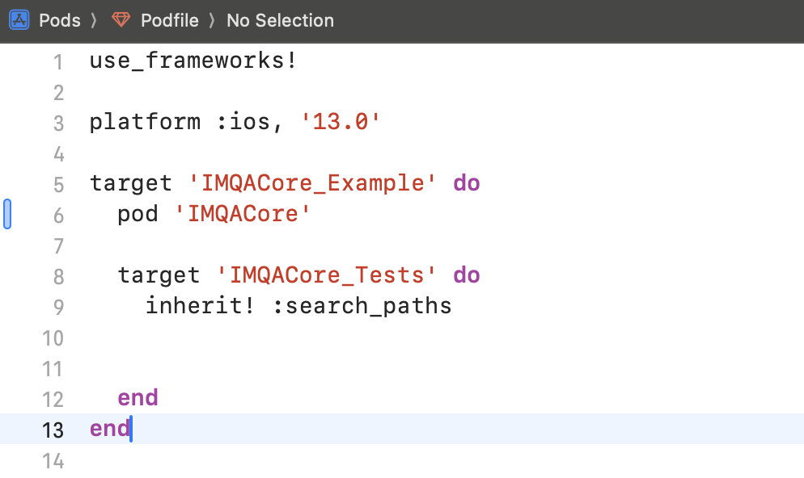

<Gha keyword="TIP" title="서비스 키 발급">
IMQA 관리 계정 로그인 후 **글로벌 관리 > 서비스 관리**에서 **새로운 서비스를 등록하고 발급된 `서비스 키`를** 사용하여 설치하세요.
</Gha>

## 개요
IMQA iOS SDK는 iOS 애플리케이션을 위한 강력한 성능 모니터링 솔루션입니다. 이 문서는 설치 및 설정 방법에 대한 종합적인 가이드를 제공합니다.

## 필수 요구사항
- Xcode 12.0 이상
- iOS 12.0 이상
- Swift 5.0 이상

## 설치 방법

### 방법 1: XCFramework 설치

1. **프로젝트에 XCFramework 추가**
   - IMQA iOS SDK XCFramework를 Xcode 프로젝트로 드래그 앤 드롭
   - "Copy items if needed" 옵션 체크
   - 메인 타겟에 추가


2. **SDK 설정**
```swift
import IMQACore

@main
class AppDelegate: UIResponder, UIApplicationDelegate {
    func application(_ application: UIApplication, 
                    didFinishLaunchingWithOptions launchOptions: [UIApplication.LaunchOptionsKey: Any]?) -> Bool {
        
        let endpoint = IMQA.Endpoints(
            collectorURL: "수집기 URL"
        )
        
        let serviceKey = "서비스 키"
        
        let option = IMQA.Options(
            serviceKey: serviceKey,
            endpoints: endpoint,
            sampleRate: 1.0
        )
        
        do {
            try IMQA
                .setup(options: option)
                .start()
        } catch {
            print("IMQA SDK 초기화 실패: \(error.localizedDescription)")
        }
        
        return true
    }
}
```

### 방법 2: CocoaPods 설치

1. **Podfile에 추가**
```ruby
use_frameworks!

target 'YourApp' do
  pod 'IMQACore'
end
```



2. **의존성 설치**
```bash
pod install
```

## 설정

### 엔드포인트
- `collectorURL`: 프로덕션 환경 URL
- `developmentBaseURL`: 개발 환경 URL (선택사항)

### 옵션
- `serviceKey`: 고유 서비스 키
- `sampleRate`: 샘플링 비율 (0.0 ~ 1.0)
  - 0.0: 수집 안함
  - 1.0: 100% 수집 (기본값)

### 커스텀 사용자 ID
```swift
IMQA.setUserId(id: "사용자_식별자")
```


## 모범 사례
1. SDK를 `AppDelegate`의 `didFinishLaunchingWithOptions`에서 초기화
2. 개발 및 프로덕션 환경에 맞는 URL 사용
3. 세션 추적을 위한 의미 있는 사용자 ID 설정
4. SDK 초기화 오류 모니터링

## 지원
추가 지원이나 질문이 있으시면 IMQA 지원팀에 문의해 주세요.

## Release Note