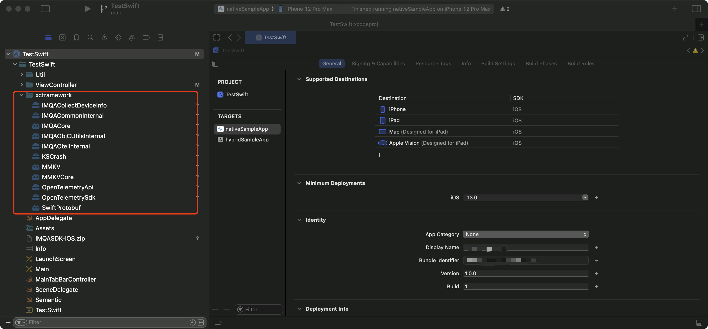

<Gha keyword="TIP" title="서비스 키 발급">
IMQA 관리 계정 로그인 후 **글로벌 관리 > 서비스 관리**에서 **새로운 서비스를 등록하고 발급된 `서비스 키`를** 사용하여 설치하세요.
</Gha>

## 개요
IMQA iOS SDK는 iOS 애플리케이션을 위한 강력한 성능 모니터링 솔루션입니다. 이 문서는 설치 및 설정 방법에 대한 종합적인 가이드를 제공합니다.

## 필수 요구사항
- iOS 12.0 이상

## 설치 방법

### 방법 1: XCFramework 설치

1. **프로젝트에 XCFramework 추가**
   - IMQA iOS SDK XCFramework를 Xcode 프로젝트로 넣으세요
   - "Copy items if needed" 옵션 체크
   - 메인 타겟에 추가하세요



2. **SDK 설정**
```swift
import IMQACore

@main
class AppDelegate: UIResponder, UIApplicationDelegate {
    
    func application(
        _ application: UIApplication,
        didFinishLaunchingWithOptions launchOptions: 
        [UIApplication.LaunchOptionsKey: Any]?
    ) -> Bool {
        
        let endpoint = IMQA.Endpoints(collectorURL: "수집기 URL")
        let serviceKey = "서비스 키"
        
        let option = IMQA.Options(
            serviceKey: serviceKey,
            endpoints: endpoint,
            sampleRate: 1.0
        )
        
        IMQA
            .setup(options: option, isDebug: true)
            .start()
        
        return true
    }
}
```

### 방법 2: CocoaPods 설치

1. **Podfile에 추가**
```ruby
use_frameworks!

target 'YourApp' do
  pod 'IMQACore'
end
```

2. **의존성 설치**
```bash
pod install
```

### 방법 3: Swift Package Manager 설치

**Package 주소**
```ruby
https://github.com/idlerecord/imqa-ios-sdk-spm
```

## 설정

### 엔드포인트
- `collectorURL`: 프로덕션 환경 URL

### 옵션
- `serviceKey`: 고유 서비스 키
- `sampleRate`: 샘플링 비율 (0.0 ~ 1.0)
  - 0.0: 수집 안함
  - 1.0: 100% 수집 (기본값)

### 커스텀 사용자 ID
```swift
IMQA.setUserId(id: "사용자_식별자")

IMQA.getUserId()
```

### 커스텀 로그
 ```swift
IMQA.customLog(level: .debug, message: "로그 내용")
```

### 클릭 이벤트를 감지
 ```swift
 //자동으로 수집이 됩니다. 이후 swiftUI를 대비하여 만듬
IMQA.sendClickEvent(buttonName: "버튼 이름", buttonClassName: "버튼 클래스 이름")
```


## 웹뷰 페이지 세션 연결

네이티브 앱의 세션과 웹뷰 내 페이지 세션을 하나로 결합하기 위해 다음과 같이 setSharedSession() 설정과 WKWebView에 코드를 사용하여 WebView data를 연결해야 합니다.

<Gha keyword="TIP" title="하이브리드 앱(WebView 사용)에서의 IMQA 설정">
IMQA Android SDK, iOS SDK, WebAgent는 각각 환경의 특성에 맞는 데이터를 수집합니다. 
**iOS 앱의 웹뷰를 통해 웹 페이지가 호출되는 경우**, 하나의 사용자 세션으로 연결하고 WebView 데이터를 수집하려면 `WKWebViewConfiguration` 설정이 필요합니다.
</Gha>

Web에서 session을 공유할지 여부를 설정합니다. true로 설정하면 session을 공유하고 false이면 공유하지 않습니다. default는 ture입니다.

```swift
IMQA.setSharedSession(session: Bool)
```

WebView data 수집하려면 WKWebView에 javascript 를 추가해야 합니다. 두가지 방법이 있습니다.

### 1. WKWebView를 코드로 initialize할 경우
```swift
let config = WKWebViewConfiguration()        
let view = WKWebView(frame: .zero, configuration: config)
```

### 2. xib로 WKWebView를 initialize할 경우
```swift
let request = URLRequest(url: URL(string: "https://example.com/")!)
IMQA.setWebviewConfiguration(
    userContentController: wkWebView.configuration.userContentController
)
wkWebView.load(request)
```

## Objective-C 프로젝트 통합

프로젝트가 오직 Objective-C로만 구성된 경우, Swift 코드 연동을 위해 아래 절차를 따라 주세요.

1. **`SwiftRuntimeLoader.swift` 파일을 생성합니다.**
2. **브리징 헤더를 생성할 것인지 묻는 창이 나타나면 "Don't create"를 선택합니다.**
3. **`SwiftRuntimeLoader.swift` 파일에 아래 내용을 추가합니다**

```swift
import Foundation
@objc class SwiftRuntimeLoader: NSObject {}
```

> 이 클래스는 Swift 런타임이 프로젝트에 로드되도록 보장하는 역할을 합니다.

4. **AppDelegate에서 IMQA를 초기화하려면 다음 코드를 추가하세요.**

```c
#import "AppDelegate.h"
#import "IMQACore/IMQACore-Swift.h"

@interface AppDelegate ()
@end

@implementation AppDelegate

- (BOOL)application:(UIApplication *)application 
    didFinishLaunchingWithOptions:(NSDictionary *)launchOptions {
    
    IMQAEndpoints *endpoints = [[IMQAEndpoints alloc] 
        initWithCollectorURL:@"collector 주소"];
    
    IMQAOptions *options = [[IMQAOptions alloc] 
        initWithServiceKey:@"서비스키" 
        endpoints:endpoints 
        sampleRate:1.0];
    
    [[IMQA setupWithOptions:options isDebug:YES] start];
    
    return YES;
}
@end
```

> 위 코드는 IMQA SDK를 Objective-C 프로젝트에 통합하고 초기화하는 기본 흐름을 보여줍니다.

## 모범 사례
1. SDK를 `AppDelegate`의 `didFinishLaunchingWithOptions`에서 초기화
2. 개발 및 프로덕션 환경에 맞는 URL 사용
3. 세션 추적을 위한 의미 있는 사용자 ID 설정
4. SDK 초기화 오류 모니터링

## 지원
추가 지원이나 질문이 있으시면 IMQA 지원팀에 문의해 주세요.

## Release Notes