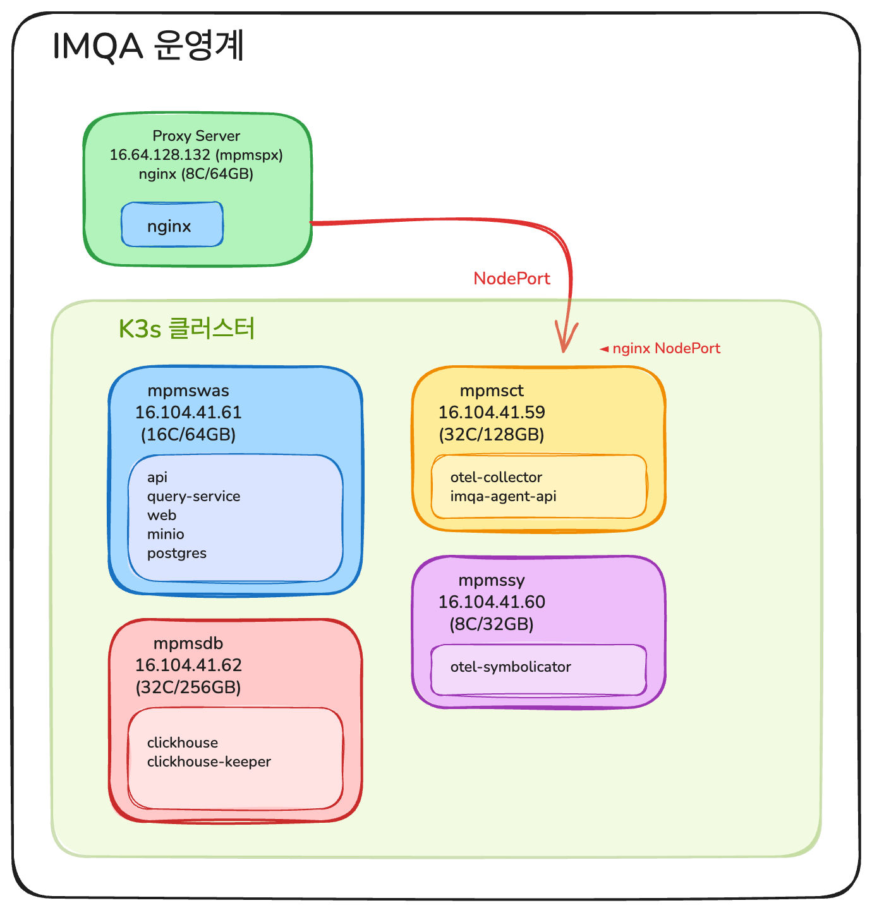
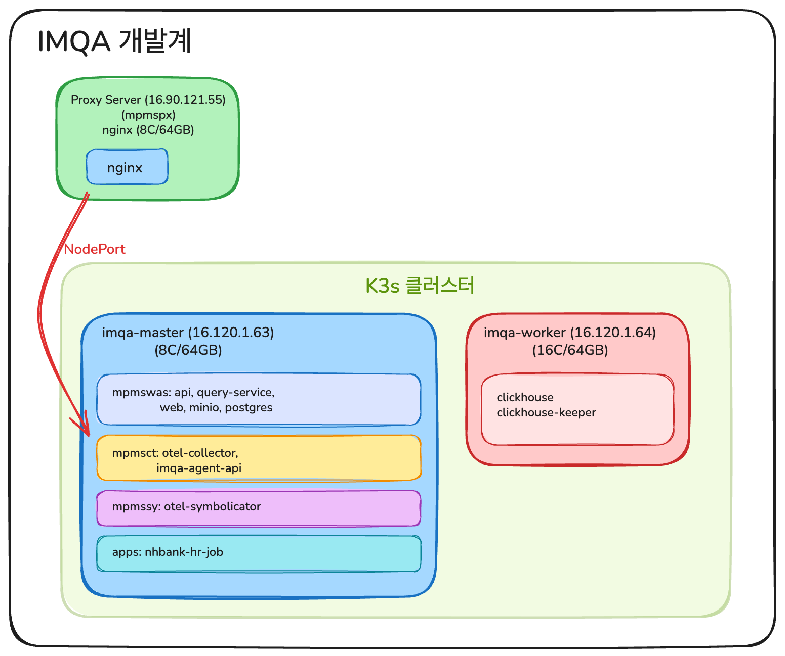
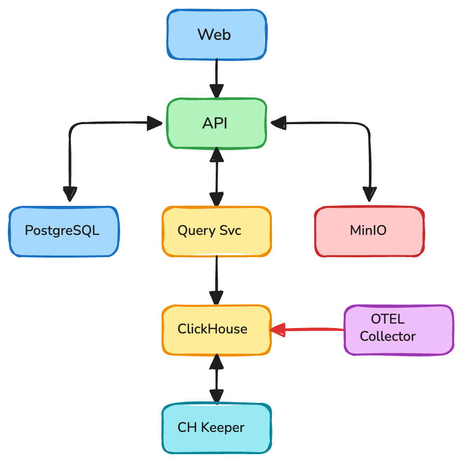
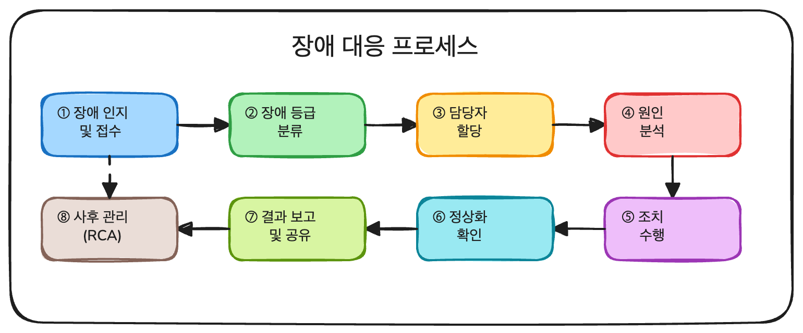

| **항목** | **내용**             |
| ------ | ------------------ |
| 문서명    | IMQA 시스템 장애대응 매뉴얼  |
| 버전     | 1.0.0              |
| 작성일    | 2025-12-11         |
| 대상 시스템 | 농협은행 IMQA 모니터링 시스템 |
| 작성자    | 박은천                |

## 1. 개요

### 1.1 목적

본 매뉴얼은 농협은행 폐쇄망 환경에서 운영되는 IMQA 모니터링 시스템의 장애 발생 시 신속하고 체계적인 대응을 위한 절차와 방법을 정의합니다.

### 1.2 적용 범위

- IMQA 애플리케이션 서비스 (API, Web, Query Service)
- 데이터 수집 서비스 (OTEL Collector, Symbolicator)
- 데이터베이스 (PostgreSQL, ClickHouse)
- 스토리지 (MinIO)
- 인프라 (K3s 클러스터)

### 1.3 용어 정의

| **용어**      | **설명**                            |
| ----------- | --------------------------------- |
| K3s         | 경량화된 Kubernetes 배포판 (폐쇄망 환경용)     |
| Pod         | Kubernetes에서 가장 작은 배포 단위          |
| Deployment  | 무상태 애플리케이션 배포 리소스                 |
| StatefulSet | 상태 유지 애플리케이션 배포 리소스 (DB 등)        |
| PVC         | Persistent Volume Claim (영구 스토리지) |
| Namespace   | Kubernetes 리소스 격리 단위              |

---

## 2. 시스템 구성

### 2.1 서버 구성 현황

#### 2.1.1 운영계 (Production)

| **분류**       | **VM명**      | **호스트명** | **노드명**           | **계정명** | **파일시스템**     | **CPU** | **MEM** | **DISK** | **OS**   | **IP**        |
| ------------ | ------------ | -------- | ----------------- | ------- | ------------- | ------- | ------- | -------- | -------- | ------------- |
| proxy        | nbmpmslowb01 | mpmspx   | \-                | mpmspx  | /home/mpmspx  | 8C      | 64GB    | 1TB      | RHEL 9.4 | 16.64.128.132 |
| api          | nbmpmskows01 | mpmswas  | imqa-api          | mpmswas | /home/mpmswas | 16C     | 64GB    | 1TB      | RHEL 9.4 | 16.104.41.61  |
| collector    | nbmpmskoap01 | mpmsct   | imqa-collector    | mpmsct  | /home/mpmsct  | 32C     | 128GB   | 512GB    | RHEL 9.4 | 16.104.41.59  |
| symbolicator | nbmpmskoap02 | mpmssy   | imqa-symbolicator | mpmssy  | /home/mpmssy  | 8C      | 32GB    | 512GB    | RHEL 9.4 | 16.104.41.60  |
| clickhouse   | nbmpmskodb01 | mpmsdb   | imqa-clickhouse   | mpmsdb  | /home/mpmsdb  | 32C     | 256GB   | 10TB     | RHEL 9.4 | 16.104.41.62  |

**운영계 서비스 리소스 할당:**

| **호스트** | **서비스**           | **request.mem** | **limit.mem** | **request.cpu** | **limit.cpu** | **PV** |
| ------- | ----------------- | --------------- | ------------- | --------------- | ------------- | ------ |
| mpmspx  | nginx             | \-              | \-            | \-              | \-            | \-     |
| mpmswas | api               | 8Gi             | 16Gi          | 2               | 4             | \-     |
| mpmswas | query-service     | 8Gi             | 16Gi          | 3               | 6             | \-     |
| mpmswas | web               | 4Gi             | 8Gi           | 2               | 4             | \-     |
| mpmswas | minio             | 512Mi           | 8Gi           | 0.2             | 2             | 300GB  |
| mpmswas | postgres          | 4Gi             | 16Gi          | 1               | 4             | 50GB   |
| mpmsct  | otel-collector    | 32Gi            | 96Gi          | 12              | 24            | \-     |
| mpmsct  | imqa-agent-api    | 128Mi           | 256Mi         | 0.1             | 0.5           | \-     |
| mpmssy  | otel-symbolicator | 8Gi             | 24Gi          | 3               | 7             | \-     |
| mpmsdb  | clickhouse        | 200Gi           | 230Gi         | 24              | 30            | 8.5TB  |
| mpmsdb  | clickhouse-keeper | 4Gi             | 12Gi          | 2               | 3             | 20GB   |

#### 2.1.2 개발계 (Development)

| **분류**     | **VM명**      | **호스트명**              | **노드명**     | **계정명**               | **파일시스템**                                 | **CPU** | **MEM** | **DISK**              | **OS**   | **IP**       |
| ---------- | ------------ | --------------------- | ----------- | --------------------- | ----------------------------------------- | ------- | ------- | --------------------- | -------- | ------------ |
| proxy      | nbmpmsltwb01 | mpmspx                | \-          | mpmspx                | /home/mpmspx                              | 8C      | 64GB    | 512GB                 | RHEL 9.4 | 16.90.121.55 |
| api        | nbmpmsktws01 | mpmswas/mpmsct/mpmssy | imqa-master | mpmswas/mpmsct/mpmssy | /home/mpmswas, /home/mpmsct, /home/mpmssy | 8C      | 64GB    | 512GB (200+150+150GB) | RHEL 9.4 | 16.120.1.63  |
| clickhouse | nbmpmsktdb01 | mpmsdb                | imqa-worker | mpmsdb                | /home/mpmsdb                              | 16C     | 64GB    | 1TB                   | RHEL 9.4 | 16.120.1.64  |

**개발계 서비스 리소스 할당:**

| **호스트**     | **서비스**           | **request.mem** | **limit.mem** | **request.cpu** | **limit.cpu** | **PV** |
| ----------- | ----------------- | --------------- | ------------- | --------------- | ------------- | ------ |
| mpmspx      | nginx             | \-              | \-            | \-              | \-            | \-     |
| imqa-master | api               | 3Gi             | \-            | 1               | \-            | \-     |
| imqa-master | otel-collector    | 10Gi            | \-            | 1.5             | \-            | \-     |
| imqa-master | otel-symbolicator | 4Gi             | \-            | 0.5             | \-            | \-     |
| imqa-master | query-service     | 3Gi             | \-            | 1               | \-            | \-     |
| imqa-master | web               | 1.5Gi           | \-            | 0.5             | \-            | \-     |
| imqa-master | minio             | 512Mi           | \-            | 0.2             | \-            | 50GB   |
| imqa-master | postgres          | 6Gi             | \-            | 0.5             | \-            | 50GB   |
| imqa-master | imqa-agent-api    | 128Mi           | 256Mi         | 0.1             | 0.5           | \-     |
| imqa-master | nhbank-hr-job     | 256Mi           | 512Mi         | 0.1             | 0.5           | \-     |
| imqa-worker | clickhouse        | 40Gi            | \-            | 8               | \-            | 800GB  |
| imqa-worker | clickhouse-keeper | 4Gi             | \-            | 1               | \-            | 20GB   |

### 2.2 아키텍처 개요

#### 운영계 아키텍처




#### 개발계 아키텍처




### 2.3 네임스페이스별 서비스 구성

| **네임스페이스** | **서비스**           | **유형**      | **포트**                | **설명**            |
| ---------- | ----------------- | ----------- | --------------------- | ----------------- |
| apps       | api               | Deployment  | 8000                  | IMQA API 서버       |
| apps       | web               | Deployment  | 3000                  | IMQA 웹 프론트엔드      |
| apps       | query-service     | Deployment  | 8080                  | 쿼리 처리 서비스         |
| apps       | nhbank-hr-job     | CronJob     | \-                    | NH은행 인사정보 동기화     |
| collector  | otel-collector    | Deployment  | 4317, 4318 (NodePort) | 데이터 수집기           |
| collector  | imqa-agent-api    | Deployment  | 13133 (NOdePort)      | 에이전트 API          |
| collector  | otel-symbolicator | Deployment  | 8081                  | 심볼릭케이터            |
| database   | postgresql        | StatefulSet | 5432                  | PostgreSQL DB     |
| database   | clickhouse        | StatefulSet | 8123, 9000            | ClickHouse DB     |
| database   | clickhouse-keeper | StatefulSet | 9181                  | ClickHouse Keeper |
| minio      | minio             | StatefulSet | 9000, 9001            | 오브젝트 스토리지         |

### 2.4 서비스 의존 관계




---

## 3. 장애 대응 체계

### 3.1 장애 등급 분류

| **등급** | **분류** | **설명**    | **대응 시간**  | **예시**                |
| ------ | ------ | --------- | ---------- | --------------------- |
| 1등급    | 긴급     | 전체 서비스 중단 | 즉시 (1시간이내) | 클러스터 전체 장애, 전체 노드 다운  |
| 2등급    | 심각     | 주요 서비스 장애 | 2시간 이내     | API 서버 중단, DB 접속 불가   |
| 3등급    | 경고     | 일부 기능 장애  | 4시간 이내     | 데이터 수집 지연, 일부 Pod 재시작 |
| 4등급    | 주의     | 성능 저하     | 24시간 이내    | 응답 시간 증가, 리소스 사용량 증가  |

### 3.2 장애 대응 프로세스




### 3.3 역할 및 책임

| **역할**    | **담당 업무**                 | **연락처**                   |
| --------- | ------------------------- | ------------------------- |
| 장애 관리자    | 장애 접수, 등급 분류, 담당자 배정      | 박은천 팀장 (010-4215-6420)    |
| 인프라 담당    | K3s 클러스터, 노드, 네트워크 관리     | 현신일 주임연구원 (010-4054-9665) |
| 애플리케이션 담당 | API, Web, 수집기 서비스 관리      | 전현정 주임연구원 (010-9118-3704) |
| DB 담당     | PostgreSQL, ClickHouse 관리 | 최현수 주임연구원 (010-9968-5709) |
| 운영 담당     | 모니터링, 일상 점검               | 양윤화 차장 (010-5423-5124)    |

---


## 4. 장애 유형별 대응 절차

### 4.0 서버 접속 정보

#### 운영계 서버 접속

```bash
# Proxy 서버 (mpmspx)
# API 서버 (mpmswas)
# Collector 서버 (mpmsct)
# Symbolicator 서버 (mpmssy)
# ClickHouse 서버 (mpmsdb)
```

#### 개발계 서버 접속

```bash
# Master 서버 (imqa-master) - API/Collector/Symbolicator 통합
  # 또는 mpmsct@, mpmssy@, mpmswas@
# Worker 서버 (imqa-worker) - ClickHouse (mpmsdb)
```

### 4.1 서비스 접속 불가

#### 증상

- IMQA 웹 페이지 접속 불가
- API 요청 타임아웃 발생

#### 점검 순서

```bash
# 1. K3s 클러스터 상태 확인
kubectl get nodes

# 2. 모든 네임스페이스의 Pod 상태 확인
kubectl get pods -A

# 3. Ingress 상태 확인
kubectl get ingress -A

# 4. 서비스 엔드포인트 확인
kubectl get endpoints -n apps
```

#### 조치 방법

```bash
# Pod 상태가 비정상인 경우 재시작
kubectl rollout restart deployment/api -n apps
kubectl rollout restart deployment/web -n apps

# Ingress Controller 재시작 (Traefik)
kubectl rollout restart deployment/traefik -n kube-system
```

### 4.2 Pod CrashLoopBackOff

#### 증상

- Pod 상태가 CrashLoopBackOff
- Pod가 반복적으로 재시작됨

#### 점검 순서

```bash
# 1. Pod 상태 상세 확인
kubectl describe pod <POD_NAME> -n <NAMESPACE>

# 2. Pod 로그 확인
kubectl logs <POD_NAME> -n <NAMESPACE>

# 3. 이전 컨테이너 로그 확인 (재시작된 경우)
kubectl logs <POD_NAME> -n <NAMESPACE> --previous

# 4. 이벤트 확인
kubectl get events -n <NAMESPACE> --sort-by='.lastTimestamp'
```

#### 조치 방법

```bash
# ConfigMap/Secret 확인 및 재생성
kubectl get configmap -n <NAMESPACE>
kubectl get secret -n <NAMESPACE>

# 리소스 제한 확인 (OOMKilled 인 경우)
kubectl describe pod <POD_NAME> -n <NAMESPACE> | grep -A 5 "Limits"

# Pod 강제 삭제 후 재생성
kubectl delete pod <POD_NAME> -n <NAMESPACE> --force --grace-period=0
```

### 4.3 데이터 수집 중단

#### 증상

- IMQA 대시보드에 새로운 데이터가 표시되지 않음
- 수집 지연 알림 발생

#### 점검 순서

```bash
# 1. OTEL Collector 상태 확인
kubectl get pods -n collector
kubectl logs -l app=otel-collector -n collector --tail=100

# 2. ClickHouse 연결 확인
kubectl exec -it clickhouse-0 -n database -- \
  clickhouse-client --query "SELECT 1"

# 3. 수집기 메트릭 확인
kubectl exec -it <OTEL_COLLECTOR_POD> -n collector -- \
  curl -s localhost:8888/metrics | grep otelcol
```

#### 조치 방법

```bash
# OTEL Collector 재시작
kubectl rollout restart deployment/otel-collector -n collector
kubectl rollout restart deployment/otel-symbolicator -n collector

# ClickHouse 연결 확인 및 재시작
kubectl rollout restart statefulset/clickhouse -n database
```

### 4.4 스토리지 용량 부족

#### 증상

- Pod 생성 실패 (Pending 상태)
- 데이터 저장 오류 발생

#### 점검 순서

```bash
# 1. PVC 목록 확인
kubectl get pvc -A

# 2. 노드 디스크 사용량 확인
df -h

# 3. PVC 실제 사용량 확인 (Pod 내부에서 df 명령 실행)
# PostgreSQL
kubectl exec -it postgresql-0 -n database -- df -h /var/lib/postgresql/data

# ClickHouse
kubectl exec -it clickhouse-0 -n database -- df -h /var/lib/clickhouse

# ClickHouse Keeper
kubectl exec -it clickhouse-keeper-0 -n database -- df -h /var/lib/clickhouse-keeper

# MinIO
kubectl exec -it minio-0 -n minio -- df -h /data
```

#### 조치 방법

```bash
# 불필요한 이미지 정리
crictl images
crictl rmi --prune

# 로그 파일 정리
journalctl --vacuum-time=7d

# ClickHouse 데이터 정리 (보관 기간 조정)
kubectl exec -it clickhouse-0 -n database -- \
  clickhouse-client --query "
    ALTER TABLE otel.traces DELETE 
    WHERE timestamp < now() - INTERVAL 30 DAY
  "
```

---

## 5. 서비스별 재기동 절차

> **참고**: 서버 접속은 HiWare를 통해 수행합니다.

### 5.0 K3s 노드 및 서비스 재기동

> **⚠️ 주의**: K3s 서비스(systemctl) 명령은 **루트(root) 계정**으로 실행해야 합니다.

#### 운영계 노드별 K3s 서비스 재기동

**mpmswas 노드 (16.104.41.61) - Master 노드**

```bash
# K3s 서비스 상태 확인
systemctl status k3s

# K3s 서비스 재시작
systemctl restart k3s

# K3s 로그 확인
journalctl -u k3s -f --no-pager
```

**mpmsct 노드 (16.104.41.59) - Agent 노드**

```bash
# K3s Agent 서비스 상태 확인
systemctl status k3s

# K3s Agent 서비스 재시작
systemctl restart k3s

# K3s Agent 로그 확인
journalctl -u k3s -f --no-pager
```

**mpmssy 노드 (16.104.41.60) - Agent 노드**

```bash
# K3s Agent 서비스 재시작
systemctl restart k3s
```

**mpmsdb 노드 (16.104.41.62) - Agent 노드**

```bash
# K3s Agent 서비스 재시작
systemctl restart k3s
```

#### 개발계 노드별 K3s 서비스 재기동

**imqa-master 노드 (16.120.1.63) - Master 노드**

```bash
# K3s 서비스 상태 확인
systemctl status k3s

# K3s 서비스 재시작
systemctl restart k3s
```

**imqa-worker 노드 (16.120.1.64) - Agent 노드**

```bash
# K3s Agent 서비스 재시작
systemctl restart k3s

# K3s Agent 서비스 재시작
systemctl restart k3s
```

#### Nginx (Proxy) 재기동

```bash
# 운영계 Proxy 서버
# Nginx 상태 확인
systemctl --user status nginx

# Nginx 설정 테스트
~/.local/nginx/sbin/nginx -t -c ~/.local/nginx/conf/nginx.conf

# Nginx 재시작
systemctl --user restart nginx

# Nginx 로그 확인
tail -f -n 100 ~/data/log/ningx_error.log
```

### 5.1 전체 서비스 재기동 (순서 중요)

장애 복구 시 서비스 의존 관계에 따라 순차적으로 재기동해야 합니다.

```bash
#!/bin/bash
# 전체 서비스 재기동 스크립트
# 실행 전 K3s 클러스터 상태 확인 필수

echo "=== IMQA 서비스 전체 재기동 시작 ==="

# 1단계: 데이터베이스 재기동
echo "[1/7] 데이터베이스 재기동..."
kubectl rollout restart statefulset/postgresql -n database
kubectl rollout status statefulset/postgresql -n database --timeout=300s

kubectl rollout restart statefulset/clickhouse-keeper -n database
kubectl rollout status statefulset/clickhouse-keeper -n database --timeout=300s

kubectl rollout restart statefulset/clickhouse -n database
kubectl rollout status statefulset/clickhouse -n database --timeout=300s

# 2단계: 스토리지 재기동
echo "[2/7] 스토리지(MinIO) 재기동..."
kubectl rollout restart statefulset/minio -n minio
kubectl rollout status statefulset/minio -n minio --timeout=300s

# 3단계(1): PostgreSQL 마이그레이션
echo "[3/7] PostgreSQL 마이그레이션 실행..."
kubectl delete job/postgres-migrate -n database --ignore-not-found
kubectl create job postgres-migrate --from=cronjob/postgres-migrate -n database 2>/dev/null || \
  kubectl apply -f k8s/database/postgres-migrate-job.yaml -n database
kubectl wait --for=condition=complete job/postgres-migrate -n database --timeout=300s

# 3단계(2): PostgreSQL 초기 데이터 시드
kubectl delete job/postgres-seed -n database --ignore-not-found
kubectl create job postgres-seed --from=cronjob/postgres-seed -n database 2>/dev/null || \
  kubectl apply -f k8s/database/postgres-seed-job.yaml -n database
kubectl wait --for=condition=complete job/postgres-seed -n database --timeout=300s

# 4단계: ClickHouse 스키마 마이그레이션
echo "[4/7] ClickHouse 스키마 마이그레이션 실행..."
kubectl delete job/otel-schema-migrator -n database --ignore-not-found
kubectl create job otel-schema-migrator --from=cronjob/otel-schema-migrator -n database 2>/dev/null || \
  kubectl apply -f k8s/database/otel-schema-migrator-job.yaml -n database
kubectl wait --for=condition=complete job/otel-schema-migrator -n database --timeout=300s

# 5단계: 수집기 서비스 재기동
echo "[5/7] 수집기 서비스 재기동..."
kubectl rollout restart deployment/otel-collector -n collector
kubectl rollout restart deployment/otel-symbolicator -n collector
kubectl rollout restart deployment/imqa-agent-api -n collector
kubectl rollout status deployment/otel-collector -n collector --timeout=300s

# 6단계: 쿼리 서비스 재기동
echo "[6/7] 쿼리 서비스 재기동..."
kubectl rollout restart deployment/query-service -n apps
kubectl rollout status deployment/query-service -n apps --timeout=300s

# 7단계: API/Web 서비스 재기동
echo "[7/7] API/Web 서비스 재기동..."
kubectl rollout restart deployment/api -n apps
kubectl rollout restart deployment/web -n apps
kubectl rollout status deployment/api -n apps --timeout=300s
kubectl rollout status deployment/web -n apps --timeout=300s

echo "=== IMQA 서비스 전체 재기동 완료 ==="

# 상태 확인
kubectl get pods -A | grep -v "Running\|Completed"
```

### 5.2 개별 서비스 재기동

#### API 서비스

```bash
# 재기동
kubectl rollout restart deployment/api -n apps

# 상태 확인
kubectl rollout status deployment/api -n apps

# 로그 확인
kubectl logs -l app=api -n apps --tail=100 -f
```

#### Web 서비스

```bash
# 재기동
kubectl rollout restart deployment/web -n apps

# 상태 확인
kubectl rollout status deployment/web -n apps

# 로그 확인
kubectl logs -l app=web -n apps --tail=100 -f
```

#### Query Service

```bash
# 재기동
kubectl rollout restart deployment/query-service -n apps

# 상태 확인
kubectl rollout status deployment/query-service -n apps

# 로그 확인
kubectl logs -l app=query-service -n apps --tail=100 -f
```

#### OTEL Collector

```bash
# 운영계: mpmsct 노드 (16.104.41.59)에서 실행
# 재기동
kubectl rollout restart deployment/otel-collector -n collector

# 상태 확인
kubectl rollout status deployment/otel-collector -n collector

# 로그 확인
kubectl logs -l app=otel-collector -n collector --tail=100 -f
```

#### OTEL Symbolicator

```bash
# 운영계: mpmssy 노드 (16.104.41.60)
# 재기동
kubectl rollout restart deployment/otel-symbolicator -n collector

# 상태 확인
kubectl rollout status deployment/otel-symbolicator -n collector

# 로그 확인
kubectl logs -l app=otel-symbolicator -n collector --tail=100 -f
```

#### IMQA Agent API

```bash
# 운영계: mpmsct 노드 (16.104.41.59)에서 실행
# 재기동
kubectl rollout restart deployment/imqa-agent-api -n collector

# 상태 확인
kubectl rollout status deployment/imqa-agent-api -n collector

# 로그 확인
kubectl logs -l app=imqa-agent-api -n collector --tail=100 -f
```

#### NH은행 HR Job (CronJob)

```bash
# CronJob 상태 확인
kubectl get cronjob -n apps

# 수동 실행 (필요시)
kubectl create job --from=cronjob/imqa-nhbank-hr-job -n apps

# Job 로그 확인
kubectl logs -l job-name=imqa-nhbank-hr-job -n apps
```

### 5.3 StatefulSet 재기동 (데이터베이스)

#### PostgreSQL

```bash
# 운영계: mpmswas 노드 (16.104.41.61)에서 실행
# 재기동 (데이터 유실 없음)
kubectl rollout restart statefulset/postgresql -n database

# 상태 확인
kubectl rollout status statefulset/postgresql -n database

# 연결 테스트
kubectl exec -it postgresql-0 -n database -- \
  psql -U postgres -c "SELECT version();"

# 로그 확인
kubectl logs postgresql-0 -n database --tail=100
```

#### ClickHouse

```bash
# 운영계: mpmsdb 노드 (16.104.41.62)
# ClickHouse Keeper 먼저 재기동
kubectl rollout restart statefulset/clickhouse-keeper -n database
kubectl rollout status statefulset/clickhouse-keeper -n database

# ClickHouse 재기동
kubectl rollout restart statefulset/clickhouse -n database
kubectl rollout status statefulset/clickhouse -n database

# 연결 테스트
kubectl exec -it clickhouse-0 -n database -- \
  clickhouse-client --query "SELECT version()"

# 로그 확인
kubectl logs clickhouse-0 -n database --tail=100
```

#### MinIO

```bash
# 재기동
kubectl rollout restart deployment/minio -n minio

# 상태 확인
kubectl rollout status deployment/minio -n minio

# 헬스체크
kubectl exec -it minio-0 -n minio -- \
  curl -s http://localhost:9000/minio/health/live

# 로그 확인
kubectl logs minio-0 -n minio --tail=100
```

---

## 6. 데이터베이스 장애 복구

### 6.1 PostgreSQL 복구

#### 연결 불가 시

```bash
# 1. Pod 상태 확인
kubectl describe pod postgresql-0 -n database

# 2. 서비스 엔드포인트 확인
kubectl get endpoints postgresql -n database

# 3. PVC 상태 확인
kubectl get pvc -n database | grep postgresql

# 4. 강제 재시작 (데이터 손실 없음)
kubectl delete pod postgresql-0 -n database
```

#### 데이터 손상 시

```bash
# 1. PostgreSQL Pod 쉘 접속
kubectl exec -it postgresql-0 -n database -- bash

# 2. 데이터 디렉토리 확인
ls -la /var/lib/postgresql/data/

# 3. PostgreSQL 복구 모드 진입 (필요시)
pg_ctl -D /var/lib/postgresql/data stop
pg_resetwal -f /var/lib/postgresql/data  # 최후의 수단
pg_ctl -D /var/lib/postgresql/data start
```

#### 백업에서 복구

```bash
# 1. 백업 파일 복사 (외부에서)
kubectl cp backup.sql postgresql-0:/tmp/backup.sql -n database

# 2. 복구 실행
kubectl exec -it postgresql-0 -n database -- \
  psql -U postgres -d apidb -f /tmp/backup.sql
```

### 6.2 ClickHouse 복구

#### 연결 불가 시

```bash
# 1. Keeper 상태 확인 (먼저)
kubectl get pods -l app.kubernetes.io/name=clickhouse-keeper -n database

# 2. ClickHouse 상태 확인
kubectl describe pod clickhouse-0 -n database

# 3. 재시작 순서
kubectl delete pod clickhouse-keeper-0 -n database
sleep 30
kubectl delete pod clickhouse-0 -n database
```

#### 테이블 복구

```bash
# 1. 시스템 테이블 조회
kubectl exec -it clickhouse-0 -n database -- \
  clickhouse-client --query "SHOW DATABASES"

# 2. 테이블 목록 확인
kubectl exec -it clickhouse-0 -n database -- \
  clickhouse-client --query "SHOW TABLES FROM otel"

# 3. 손상된 파트 확인
kubectl exec -it clickhouse-0 -n database -- \
  clickhouse-client --query "
    SELECT database, table, name, active 
    FROM system.parts 
    WHERE active = 0
  "

# 4. 테이블 최적화
kubectl exec -it clickhouse-0 -n database -- \
  clickhouse-client --query "OPTIMIZE TABLE otel.traces FINAL"
```

### 6.3 MinIO 복구

#### 연결 불가 시

```bash
# 1. Pod 상태 확인
kubectl describe pod minio-0 -n minio

# 2. 헬스체크
kubectl exec -it minio-0 -n minio -- \
  curl -I http://localhost:9000/minio/health/live

# 3. 재시작
kubectl delete pod minio-0 -n minio
```

#### 버킷 복구

```bash
# 1. MinIO 클라이언트 설정
kubectl exec -it minio-0 -n minio -- mc alias set local http://localhost:9000 minio djslzja0080

# 2. 버킷 목록 확인
kubectl exec -it minio-0 -n minio -- mc ls local/

# 3. 버킷 재생성 (필요시)
kubectl exec -it minio-0 -n minio -- mc mb local/imqa
```

---

## 7. 네트워크 장애 대응

### 7.1 내부 통신 장애

#### 서비스 간 통신 확인

```bash
# 1. DNS 확인
kubectl run -it --rm debug --image=busybox --restart=Never -- \
  nslookup api.apps.svc.cluster.local

# 2. 서비스 연결 테스트
kubectl run -it --rm debug --image=curlimages/curl --restart=Never -- \
  curl -v http://api.apps.svc.cluster.local:8000/health

# 3. Pod 간 통신 테스트
kubectl exec -it <SOURCE_POD> -n <NAMESPACE> -- \
  wget -qO- http://<TARGET_SERVICE>.<TARGET_NAMESPACE>.svc.cluster.local:<PORT>
```

#### CoreDNS 문제 해결

```bash
# 1. CoreDNS 상태 확인
kubectl get pods -n kube-system -l k8s-app=kube-dns

# 2. CoreDNS 로그 확인
kubectl logs -n kube-system -l k8s-app=kube-dns

# 3. CoreDNS 재시작
kubectl rollout restart deployment/coredns -n kube-system
```

### 7.2 Ingress 장애

#### Traefik (K3s 기본 Ingress)

```bash
# 1. Traefik 상태 확인
kubectl get pods -n kube-system -l app.kubernetes.io/name=traefik

# 2. Ingress 리소스 확인
kubectl get ingress -A

# 3. Traefik 로그 확인
kubectl logs -n kube-system -l app.kubernetes.io/name=traefik

# 4. Traefik 재시작
kubectl rollout restart deployment/traefik -n kube-system
```

### 7.3 외부 연결 장애 (폐쇄망 환경)

```bash
# 1. 노드 네트워크 상태 확인
ip addr show
ip route show

# 2. 방화벽 규칙 확인
sudo iptables -L -n

# 3. K3s 서비스 상태 확인
systemctl status k3s
```

---

## 8. 모니터링 및 점검

### 8.1 정기 점검 항목

```bash
#!/bin/bash
# 정기 점검 스크립트

echo "=========================================="
echo "IMQA 시스템 정기 점검 - $(date)"
echo "=========================================="

echo ""
echo "=== 1. 노드 상태 ==="
kubectl get nodes -o wide

echo ""
echo "=== 2. Pod 상태 ==="
kubectl get pods -A | grep -v "Running\|Completed"

echo ""
echo "=== 3. 리소스 사용량 ==="
kubectl top nodes 2>/dev/null || echo "metrics-server 미설치"
kubectl top pods -A 2>/dev/null || echo "metrics-server 미설치"

echo ""
echo "=== 4. PVC 상태 ==="
kubectl get pvc -A

echo ""
echo "=== 5. 디스크 사용량 ==="
df -h | grep -E "^/dev|Filesystem"

echo ""
echo "=== 6. 최근 이벤트 (Warning) ==="
kubectl get events -A --field-selector type=Warning --sort-by='.lastTimestamp' | tail -10

echo ""
echo "=== 7. 서비스 헬스체크 ==="
# API 헬스체크
API_POD=$(kubectl get pods -n apps -l app=api -o jsonpath='{.items[0].metadata.name}')
if [ -n "$API_POD" ]; then
  kubectl exec $API_POD -n apps -- wget -qO- http://localhost:8000/health 2>/dev/null && echo "API: OK" || echo "API: FAIL"
fi

# PostgreSQL 연결
PG_POD=$(kubectl get pods -n database -l app.kubernetes.io/name=postgresql -o jsonpath='{.items[0].metadata.name}')
if [ -n "$PG_POD" ]; then
  kubectl exec $PG_POD -n database -- psql -U postgres -c "SELECT 1" 2>/dev/null && echo "PostgreSQL: OK" || echo "PostgreSQL: FAIL"
fi

# ClickHouse 연결
CH_PWD=$(kubectl get secret clickhouse-secret -n database -o jsonpath='{.data.CLICKHOUSE_DEFAULT_PASSWORD}' | base64 -d)
kubectl exec clickhouse-0 -n database -- clickhouse-client --user default --password "$CH_PWD" --query "SELECT 1" 2>/dev/null && echo "ClickHouse: OK" || echo "ClickHouse: FAIL"

echo ""
echo "=========================================="
echo "점검 완료"
echo "=========================================="
```

| **점검 항목** | **점검 방법**                       | **정상 기준**  |
| --------- | ------------------------------- | ---------- |
| 로그 파일 크기  | `journalctl --disk-usage`       | 10GB 미만    |
| PVC 사용량   | 아래 스크립트 참조                      | 80% 미만     |
| 이미지 정리    | `crictl images`                 | 미사용 이미지 제거 |
| 인증서 만료    | `kubectl get secret -A -o yaml` | 30일 이상 잔여  |
| 백업 상태     | 백업 파일 확인                        | 최근 7일 이내   |

#### PVC 사용량 확인 스크립트

> **참고**: `kubectl get pvc -A`는 PVC 목록만 표시하고 실제 사용량은 표시하지 않습니다.
Pod 내부에서 `df` 명령을 실행하여 확인해야 합니다.

```bash
#!/bin/bash
# PVC 사용량 확인 스크립트

echo "=== PVC 사용량 확인 ==="
echo ""

# PostgreSQL
echo "--- PostgreSQL (database/postgresql-0) ---"
kubectl exec -it postgresql-0 -n database -- df -h /var/lib/postgresql/data 2>/dev/null || echo "  (접근 불가)"
echo ""

# ClickHouse
echo "--- ClickHouse (database/clickhouse-0) ---"
kubectl exec -it clickhouse-0 -n database -- df -h /var/lib/clickhouse 2>/dev/null || echo "  (접근 불가)"
echo ""

# ClickHouse Keeper
echo "--- ClickHouse Keeper (database/clickhouse-keeper-0) ---"
kubectl exec -it clickhouse-keeper-0 -n database -- df -h /var/lib/clickhouse-keeper 2>/dev/null || echo "  (접근 불가)"
echo ""

# MinIO
echo "--- MinIO (minio/minio-0) ---"
kubectl exec -it minio-0 -n minio -- df -h /data 2>/dev/null || echo "  (접근 불가)"
echo ""

echo "=== 확인 완료 ==="
```

| **점검 항목** | **점검 방법**       | **조치 사항**   |
| --------- | --------------- | ----------- |
| K3s 버전 확인 | `k3s --version` | 보안 패치 적용 검토 |
| 이미지 버전    | 배포된 이미지 태그 확인   | 취약점 패치 검토   |
| 리소스 사용 추이 | 메트릭 수집 및 분석     | 용량 증설 검토    |
| 장애 발생 이력  | 장애 로그 분석        | 재발 방지 대책 수립 |

---

## 9. 비상 연락망

### 9.1 내부 연락망

| **순번** | **역할**    | **담당자** | **연락처** | **비고**  |
| ------ | --------- | ------- | ------- | ------- |
| 1      | 장애 관리자    | \-      | \-      | 1차 연락   |
| 2      | 인프라 담당    | \-      | \-      | 서버/네트워크 |
| 3      | 애플리케이션 담당 | \-      | \-      | 서비스     |
| 4      | DB 담당     | \-      | \-      | 데이터베이스  |

### 9.2 외부 연락망

| **순번** | **업체명** | **담당자** | **연락처**       | **지원 범위**                    |
| ------ | ------- | ------- | ------------- | ---------------------------- |
| 1      | 어니컴     | 현신일     | 010-4054-9665 | 인프라 지원, 애플리케이션 기술 지원         |
| 2      | 어니컴     | 박은천     | 010-4215-6420 | 장애 접수, 등급 분류, 담당자 배정, IMQA문의 |

---

## 10. 부록

### 10.1 서버 접속 Quick Reference

<Gha keyword="NOTE">
> **참고**: 서버 접속은 통합 접근 및 계정관리 시스템 통해 수행합니다.
</Gha>

#### 운영계 서버 목록

| **분류**       | **VM명**      | **호스트명** | **노드명**           | **IP**        | **계정**  |
| ------------ | ------------ | -------- | ----------------- | ------------- | ------- |
| proxy        | nbmpmslowb01 | mpmspx   | \-                | 16.64.128.132 | mpmspx  |
| api          | nbmpmskows01 | mpmswas  | imqa-api          | 16.104.41.61  | mpmswas |
| collector    | nbmpmskoap01 | mpmsct   | imqa-collector    | 16.104.41.59  | mpmsct  |
| symbolicator | nbmpmskoap02 | mpmssy   | imqa-symbolicator | 16.104.41.60  | mpmssy  |
| clickhouse   | nbmpmskodb01 | mpmsdb   | imqa-clickhouse   | 16.104.41.62  | mpmsdb  |

#### 개발계 서버 목록

| **분류**     | **VM명**      | **호스트명**              | **노드명**     | **IP**       | **계정**                |
| ---------- | ------------ | --------------------- | ----------- | ------------ | --------------------- |
| proxy      | nbmpmsltwb01 | mpmspx                | \-          | 16.90.121.55 | mpmspx                |
| api        | nbmpmsktws01 | mpmswas/mpmsct/mpmssy | imqa-master | 16.120.1.63  | mpmswas/mpmsct/mpmssy |
| clickhouse | nbmpmsktdb01 | mpmsdb                | imqa-worker | 16.120.1.64  | mpmsdb                |

### 10.2 주요 명령어 Quick Reference

```bash
# ============================================
# 클러스터 상태 확인
# ============================================
kubectl get nodes                    # 노드 상태
kubectl get pods -A                  # 전체 Pod 상태
kubectl get pods -A -o wide          # 상세 Pod 상태 (노드 정보 포함)

# ============================================
# 서비스 재시작
# ============================================
kubectl rollout restart deployment/<NAME> -n <NS>
kubectl rollout restart statefulset/<NAME> -n <NS>
kubectl rollout status deployment/<NAME> -n <NS>

# ============================================
# 로그 확인
# ============================================
kubectl logs <POD> -n <NS>              # 현재 로그
kubectl logs <POD> -n <NS> -f           # 실시간 로그
kubectl logs <POD> -n <NS> --previous   # 이전 컨테이너 로그
kubectl logs -l app=<LABEL> -n <NS>     # 라벨로 로그 조회

# ============================================
# 디버깅
# ============================================
kubectl describe pod <POD> -n <NS>
kubectl exec -it <POD> -n <NS> -- /bin/sh
kubectl get events -n <NS> --sort-by='.lastTimestamp'

# ============================================
# Pod 관리
# ============================================
kubectl delete pod <POD> -n <NS>                          # 정상 삭제
kubectl delete pod <POD> -n <NS> --force --grace-period=0 # 강제 삭제

# ============================================
# K3s 서비스 관리 (root 계정 필요)
# ============================================
# Master 노드 (운영계: mpmswas, 개발계: imqa-master)
systemctl status k3s
systemctl restart k3s
journalctl -u k3s -f

# Agent 노드 (운영계: mpmsct, mpmssy, mpmsdb / 개발계: imqa-worker)
systemctl status k3s-agent
systemctl restart k3s-agent
journalctl -u k3s-agent -f

# ============================================
# Nginx (Proxy 서버, root 계정 필요)
# ============================================
systemctl status nginx
systemctl restart nginx
nginx -t                                  # 설정 테스트
tail -f /var/log/nginx/error.log         # 에러 로그
```

### 10.3 운영계 서비스별 재기동 Quick Reference

```bash
# ============================================
# 운영계 전체 서비스 재기동 순서
# ============================================

# 1. mpmsdb 노드 (16.104.41.62) - 데이터베이스

kubectl rollout restart statefulset/postgresql -n database
kubectl rollout restart statefulset/clickhouse-keeper -n database
kubectl rollout restart statefulset/clickhouse -n database

# 2. mpmswas 노드 (16.104.41.61) - MinIO

kubectl rollout restart deployment/minio -n minio

# 3. mpmsct 노드 (16.104.41.59) - 수집기 + Agent API

kubectl rollout restart deployment/otel-collector -n collector
kubectl rollout restart deployment/imqa-agent-api -n collector

# 4. mpmssy 노드 (16.104.41.60) - 심볼릭케이터

kubectl rollout restart deployment/otel-symbolicator -n collector

# 5. mpmswas 노드 (16.104.41.61) - API/Web/Query

kubectl rollout restart deployment/query-service -n apps
kubectl rollout restart deployment/api -n apps
kubectl rollout restart deployment/web -n apps
```

### 10.4 네임스페이스별 서비스 목록

```bash
# apps 네임스페이스
kubectl get all -n apps

# collector 네임스페이스
kubectl get all -n collector

# database 네임스페이스
kubectl get all -n database

# minio 네임스페이스
kubectl get all -n minio
```

### 10.5 설정 파일 백업

```bash
#!/bin/bash
# 설정 백업 스크립트

BACKUP_DIR="/backup/k8s-config-$(date +%Y%m%d)"
mkdir -p $BACKUP_DIR

# ConfigMaps 백업
for ns in apps collector database minio; do
  kubectl get configmap -n $ns -o yaml > $BACKUP_DIR/configmaps-$ns.yaml
done

# Secrets 백업 (민감 정보 주의)
for ns in apps collector database minio; do
  kubectl get secret -n $ns -o yaml > $BACKUP_DIR/secrets-$ns.yaml
done

# PVC 정보 백업
kubectl get pvc -A -o yaml > $BACKUP_DIR/pvc-all.yaml

echo "백업 완료: $BACKUP_DIR"
```

### 10.6 장애 대응 체크리스트

#### 장애 발생 시

- [ ] 장애 인지 시각 기록
- [ ] 장애 현상 상세 기록
- [ ] 영향 범위 파악
- [ ] 장애 등급 분류
- [ ] 담당자 통보
- [ ] 원인 분석 시작

#### 장애 조치 중

- [ ] 조치 내용 시간순 기록
- [ ] 조치 결과 확인
- [ ] 서비스 정상화 확인
- [ ] 사용자 영향 확인

#### 장애 복구 후

- [ ] 복구 완료 시각 기록
- [ ] 정상화 최종 확인
- [ ] 관련자 통보
- [ ] 장애 보고서 작성
- [ ] RCA(Root Cause Analysis) 수행
- [ ] 재발 방지 대책 수립

### 10.7 장애 보고서 양식

```txt
# 장애 보고서

## 개요
- 장애 일시: YYYY-MM-DD HH:MM ~ HH:MM (총 X시간 X분)
- 장애 등급: X등급
- 영향 범위: 

## 장애 내용
- 현상: 
- 원인: 

## 조치 내역
| 시각 | 조치 내용 | 담당자 | 결과 |
| ---- | --------- | ------ | ---- |
|      |           |        |      |

## 영향 분석
- 서비스 영향: 
- 데이터 영향: 
- 사용자 영향: 

## 재발 방지 대책
1. 
2. 
3. 

## 첨부
- 로그 파일
- 스크린샷
```

---

## 문서 이력

| **버전** | **일자**     | **작성자** | **변경 내용** |
| ------ | ---------- | ------- | --------- |
| 1.0    | 2025-12-11 | 박은천     | 최초 작성     |

---

**본 매뉴얼은 서비스 연속성 관리지침에 따라 정기적으로 검토 및 갱신되어야 합니다.**

