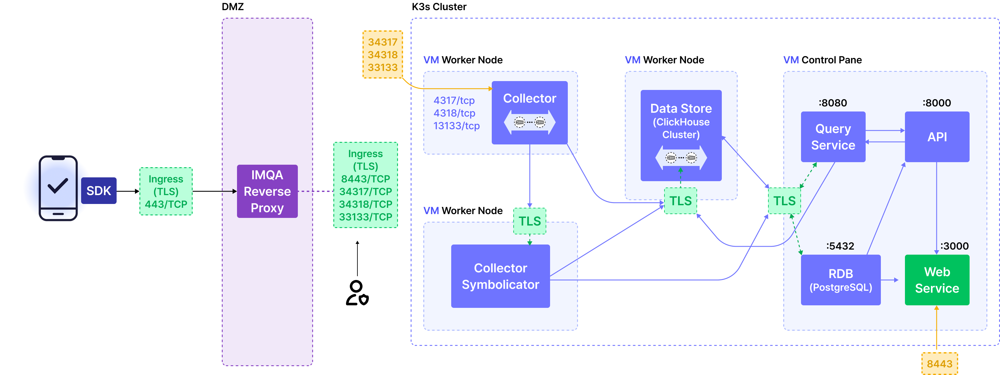

<Intro>
이 문서는 DMZ 환경의 VM에 IMQA Proxy를 설치하는 방법을 설명합니다.
네트워크가 격리된 환경에서 RPM 패키지를 직접 가져가 설치하는 시나리오를 기준으로 합니다.
</Intro>



## 사전 준비

### 필요한 파일 목록

다음 파일들을 준비합니다:

| 파일명 | 설명 |
|--------|------|
| `nginx-1.28.0-1.el9.ngx.x86_64.rpm` | nginx 웹서버 패키지 |
| `logrotate-3.18.0-8.el9.x86_64.rpm` | 로그 로테이션 패키지 |
| `proxy-default.tar.gz` | 설정 파일 아카이브 (본 프로젝트) |

### 설정 파일 아카이브 생성

인터넷이 되는 환경에서 본 프로젝트를 아카이브합니다:

```bash
# 프로젝트 디렉토리에서
cd /path/to/proxy-default
tar -czvf proxy-default.tar.gz --exclude='.git' .
```

### DMZ VM 요구사항

- OS: RHEL 9
- 아키텍처: x86_64
- 사용자 계정: 일반 사용자 (예: `mpmspx`)
- 필요한 root 권한 작업:
  - `loginctl enable-linger` (선택사항: 로그아웃 후에도 서비스 유지)
  - `setcap` (선택사항: 1024 미만 포트 사용 시)
- 네트워크 접근
  - 프록시 서버(source) 에서 IMQA Cluster 의 `imqa-collector` Node의 NodePort (destination: `34318`, `33133`) 접근 가능해야함
---

## RPM 패키지 전송

### 파일 전송

USB, SCP, SFTP 등을 통해 다음 파일들을 DMZ VM으로 전송합니다:

```bash
# 예시: SCP를 사용한 전송 (외부 네트워크에서)
scp nginx-1.28.0-1.el9.ngx.x86_64.rpm mpmspx@dmz-vm:/tmp/
scp logrotate-3.18.0-8.el9.x86_64.rpm mpmspx@dmz-vm:/tmp/
scp proxy-default.tar.gz mpmspx@dmz-vm:/tmp/
```

또는 USB 드라이브를 통해 전송:

```bash
# USB 마운트 (root 권한 필요)
sudo mount /dev/sdb1 /mnt/usb

# 파일 복사
cp /mnt/usb/nginx-1.28.0-1.el9.ngx.x86_64.rpm /tmp/
cp /mnt/usb/logrotate-3.18.0-8.el9.x86_64.rpm /tmp/
cp /mnt/usb/proxy-default.tar.gz /tmp/

# USB 언마운트
sudo umount /mnt/usb
```

---

## 사용자 계정 설정

### 사용자 계정 확인

```bash
# 현재 사용자 확인
whoami

# 홈 디렉토리 확인
echo $HOME
```

### `linger` 활성화

사용자가 로그아웃해도 서비스가 계속 실행되도록 linger를 활성화합니다.

<Gha keyword="NOTE" title="참고">
이 작업은 root 권한이 필요합니다.
</Gha>

```bash
# root 권한으로 실행 (또는 sudo 사용)
sudo loginctl enable-linger $(whoami)

# 활성화 확인
loginctl show-user $(whoami) | grep Linger
# 출력: Linger=yes
```

### 홈 디렉토리 권한 설정

```bash
# 홈 디렉토리 권한 확인 및 설정
chmod 755 ~
```

---

## `nginx` 설치

<Gha keyword="NOTE" title="참고">
root 권한 유무에 따라 설치 방법이 다릅니다. 해당하는 섹션을 따라 진행하세요.
</Gha>

### 옵션 A: root 권한이 있는 경우 (권장)

root 권한이 있으면 RPM을 직접 설치하고 바이너리만 복사하면 됩니다.

```bash
# RPM 직접 설치
sudo rpm -ivh /tmp/nginx-1.28.0-1.el9.ngx.x86_64.rpm

# 또는 dnf/yum 사용 (의존성 자동 해결)
sudo dnf install /tmp/nginx-1.28.0-1.el9.ngx.x86_64.rpm -y
```

설치 후 바이너리를 사용자 디렉토리로 복사:

```bash
# nginx 실행 파일 디렉토리 생성
mkdir -p ~/.local/nginx/sbin

# nginx 바이너리 복사
cp /usr/sbin/nginx ~/.local/nginx/sbin/

# 실행 권한 확인
chmod +x ~/.local/nginx/sbin/nginx

# 설치 확인
~/.local/nginx/sbin/nginx -v
# 출력: nginx version: nginx/1.28.0
```

<Gha keyword="TIP" title="참고">
시스템에 설치된 `nginx`를 그대로 사용할 수도 있지만, 사용자 레벨 `systemd` 서비스로 관리하려면 바이너리를 복사하는 것이 좋습니다.
</Gha>

설치가 완료되면 [4.3 mime.types 파일 확인](#43-mimetypes-파일-확인)으로 이동하세요.

---

### 옵션 B: root 권한이 없는 경우

비루트 사용자 환경에서는 RPM을 직접 설치할 수 없으므로, rpm2cpio를 사용하여 바이너리를 추출합니다.

```bash
# 작업 디렉토리 생성
mkdir -p ~/rpm-extract
cd ~/rpm-extract

# RPM 패키지에서 파일 추출
rpm2cpio /tmp/nginx-1.28.0-1.el9.ngx.x86_64.rpm | cpio -idmv
```

추출된 파일 구조 확인:

```bash
# 추출된 파일 확인
find . -type f -name "nginx*"
```

예상 출력:

```text
./usr/sbin/nginx
./etc/nginx/nginx.conf
...
```

nginx 바이너리 복사:

```bash
# nginx 실행 파일 디렉토리 생성
mkdir -p ~/.local/nginx/sbin

# nginx 바이너리 복사
cp ~/rpm-extract/usr/sbin/nginx ~/.local/nginx/sbin/

# 실행 권한 부여
chmod +x ~/.local/nginx/sbin/nginx

# 설치 확인
~/.local/nginx/sbin/nginx -v
# 출력: nginx version: nginx/1.28.0
```

---

### `mime.types` 파일 확인

```bash
# mime.types가 시스템에 있는지 확인
ls -la /etc/nginx/mime.types

# 없는 경우 (rpm2cpio로 설치한 경우) 복사
if [ ! -f /etc/nginx/mime.types ]; then
    mkdir -p ~/.local/nginx/conf
    cp ~/rpm-extract/etc/nginx/mime.types ~/.local/nginx/conf/
fi
```

### 포트 바인딩 권한 설정 (선택사항)

80, 443 포트를 사용하려면 추가 권한이 필요합니다.

#### 옵션 A: setcap 사용 (권장) - root 권한 필요

```bash
sudo setcap 'cap_net_bind_service=+ep' ~/.local/nginx/sbin/nginx

# 확인
getcap ~/.local/nginx/sbin/nginx
# 출력: /home/mpmspx/.local/nginx/sbin/nginx cap_net_bind_service=ep
```

#### 옵션 B: 고포트 사용 (root 권한 불필요)

- 80 포트 대신 8080 사용
- 443 포트 대신 8443 사용
- 설정 파일에서 포트 번호 변경 필요 (7.3절 참조)

---

## `logrotate` 설치

<Gha keyword="NOTE" title="참고">
root 권한 유무에 따라 설치 방법이 다릅니다. 해당하는 섹션을 따라 진행하세요.
</Gha>

### 옵션 A: root 권한이 있는 경우 (권장)

```bash
# RPM 직접 설치
sudo rpm -ivh /tmp/logrotate-3.18.0-8.el9.x86_64.rpm

# 또는 dnf/yum 사용 (의존성 자동 해결)
sudo dnf install /tmp/logrotate-3.18.0-8.el9.x86_64.rpm -y
```

설치 후 바이너리를 사용자 디렉토리로 복사:

```bash
# logrotate 실행 파일 디렉토리 생성
mkdir -p ~/.local/logrotate/sbin

# logrotate 바이너리 복사
cp /usr/sbin/logrotate ~/.local/logrotate/sbin/

# 실행 권한 확인
chmod +x ~/.local/logrotate/sbin/logrotate

# 설치 확인
~/.local/logrotate/sbin/logrotate --version
# 출력: logrotate 3.18.0
```

설치가 완료되면 [5.3 작업 디렉토리 정리](#53-작업-디렉토리-정리)로 이동하세요.

---

### 옵션 B: root 권한이 없는 경우

```bash
cd ~/rpm-extract

# RPM 패키지에서 파일 추출
rpm2cpio /tmp/logrotate-3.18.0-8.el9.x86_64.rpm | cpio -idmv
```

logrotate 바이너리 복사:

```bash
# logrotate 실행 파일 디렉토리 생성
mkdir -p ~/.local/logrotate/sbin

# logrotate 바이너리 복사
cp ~/rpm-extract/usr/sbin/logrotate ~/.local/logrotate/sbin/

# 실행 권한 부여
chmod +x ~/.local/logrotate/sbin/logrotate

# 설치 확인
~/.local/logrotate/sbin/logrotate --version
# 출력: logrotate 3.18.0
```

---

### 작업 디렉토리 정리

```bash
# rpm2cpio로 추출한 경우에만 실행
rm -rf ~/rpm-extract

# RPM 파일 정리
rm -f /tmp/*.rpm
```

---

## 디렉토리 구조 생성

### 설정 파일 아카이브 해제

```bash
cd ~

# 아카이브 해제
tar -xzvf /tmp/proxy-default.tar.gz

# 아카이브 파일 삭제
rm -f /tmp/proxy-default.tar.gz
```

### 디렉토리 구조 확인

```bash
# 디렉토리 구조 확인
tree -a -L 4 --dirsfirst ~/{data,.local,.config}
```

예상 출력:

```text
/home/mpmspx/data
├── cache/
├── log/
│   └── archive/
└── temp/
    ├── client_body/
    ├── fastcgi/
    ├── proxy/
    ├── scgi/
    └── uwsgi/
/home/mpmspx/.local
├── logrotate/
│   ├── conf/
│   │   ├── conf.d/
│   │   │   └── nginx
│   │   └── logrotate.conf
│   ├── run/
│   └── sbin/
│       └── logrotate
└── nginx/
    ├── conf/
    │   ├── conf.d/
    │   │   └── imqa-proxy.conf
    │   └── nginx.conf
    ├── run/
    └── sbin/
        └── nginx
/home/mpmspx/.config
└── systemd/
    └── user/
        ├── logrotate.service
        ├── logrotate.timer
        └── nginx.service
```

### 디렉토리 권한 설정

```bash
# 권한 설정
chmod -R 755 ~/data ~/.local ~/.config
```

---

## 설정 파일 배치

### `$HOME` 변수 치환

nginx와 logrotate는 환경변수를 직접 해석하지 못하므로, 설정 파일의 `$HOME`을 실제 경로로 변경합니다.

```bash
# nginx 설정 파일에서 $HOME 치환
find ~/.local/nginx/conf -name "*.conf" -exec sed -i "s|\$HOME|$HOME|g" {} \;

# logrotate 설정 파일에서 $HOME 치환
find ~/.local/logrotate/conf -type f -exec sed -i "s|\$HOME|$HOME|g" {} \;
```

### `IMQA_SERVER_IP` 설정

IMQA 서버 IP 주소를 환경에 맞게 설정합니다:

```bash
# IMQA 서버 IP 주소 설정 (실제 IP로 변경)
IMQA_SERVER_IP="16.120.1.63"

find ~/.local/nginx/conf -name "*.conf" -exec sed -i "s|\$IMQA_SERVER_IP|$IMQA_SERVER_IP|g" {} \;
```

### 포트 설정 (옵션 B 선택 시)

root 권한 없이 고포트를 사용하는 경우:

```bash
# HTTP 80 → 8080
sed -i 's/listen 80;/listen 8080;/g' ~/.local/nginx/conf/conf.d/imqa-proxy.conf

# HTTPS 443 → 8443
sed -i 's/listen 443 ssl;/listen 8443 ssl;/g' ~/.local/nginx/conf/conf.d/imqa-proxy.conf
```

### `SSL` 인증서 설정 (HTTPS 사용 시)

SSL 인증서가 있는 경우 경로를 설정합니다:

```bash
# SSL 인증서 경로 설정
SSL_CERT_PATH="/path/to/your/server.crt"
SSL_KEY_PATH="/path/to/your/server.key"

sed -i "s|/path/to/server.crt|$SSL_CERT_PATH|g" ~/.local/nginx/conf/conf.d/imqa-proxy.conf
sed -i "s|/path/to/server.key|$SSL_KEY_PATH|g" ~/.local/nginx/conf/conf.d/imqa-proxy.conf
```

<Gha keyword="NOTE" title="참고">
HTTPS를 사용하지 않는 경우 SSL 서버 블록을 주석 처리하거나 삭제할 수 있습니다.
</Gha>

### `mime.types` 경로 설정 (필요 시)

시스템에 `/etc/nginx/mime.types`가 없는 경우:

```bash
# mime.types를 로컬에 복사했다면 경로 변경
sed -i "s|include       /etc/nginx/mime.types;|include       $HOME/.local/nginx/conf/mime.types;|g" ~/.local/nginx/conf/nginx.conf
```

### 설정 파일 검증

```bash
# nginx 설정 문법 검사
~/.local/nginx/sbin/nginx -t -c ~/.local/nginx/conf/nginx.conf -p ~/.local/nginx

# 예상 출력:
# nginx: the configuration file /home/mpmspx/.local/nginx/conf/nginx.conf syntax is ok
# nginx: configuration file /home/mpmspx/.local/nginx/conf/nginx.conf test is successful
```

---

## systemd 서비스 설정

### systemd 데몬 리로드

```bash
systemctl --user daemon-reload
```

### 서비스 활성화

```bash
# nginx 서비스 활성화
systemctl --user enable nginx.service

# logrotate 타이머 활성화
systemctl --user enable logrotate.timer
```

---

## 서비스 시작 및 확인

### nginx 시작

```bash
# nginx 서비스 시작
systemctl --user start nginx.service

# 상태 확인
systemctl --user status nginx.service
```

예상 출력:

```systemd
● nginx.service - nginx HTTP Server (User Level)
     Loaded: loaded (/home/mpmspx/.config/systemd/user/nginx.service; enabled; preset: disabled)
     Active: active (running) since ...
```

### logrotate 타이머 시작

```bash
# logrotate 타이머 시작
systemctl --user start logrotate.timer

# 타이머 상태 확인
systemctl --user status logrotate.timer

# 예약된 타이머 목록 확인
systemctl --user list-timers
```

### 동작 확인

```bash
# nginx 프로세스 확인
ps aux | grep nginx

# 포트 리스닝 확인
ss -tlnp | grep nginx

# HTTP 테스트 (로컬에서)
curl -I http://localhost:80
# 또는 고포트 사용 시
curl -I http://localhost:8080
```

### 로그 확인

```bash
# nginx 에러 로그 확인
tail -f ~/data/log/nginx_error.log

# nginx 접근 로그 확인
tail -f ~/data/log/nginx_access.log

# systemd 서비스 로그 확인
journalctl --user -u nginx.service -f
```

---

## 트러블슈팅

### Permission denied 오류

#### 포트 바인딩 실패

```bash
nginx: [emerg] bind() to 0.0.0.0:80 failed (13: Permission denied)
```

**해결 방법**:

1. setcap으로 권한 부여 (4.5절 옵션 A)
2. 고포트(8080/8443) 사용 (7.3절)

#### 로그 파일 생성 실패

```bash
nginx: [emerg] open() "/home/user/data/log/nginx_error.log" failed (13: Permission denied)
```

**해결 방법**:

```bash
chmod -R 755 ~/data
```

#### PID 파일 생성 실패

```bash
nginx: [emerg] open() "/home/user/.local/nginx/run/nginx.pid" failed (13: Permission denied)
```

**해결 방법**:

```bash
chmod -R 755 ~/.local/nginx/run
```

### 서비스 관련 오류

#### 서비스가 로그아웃 후 중지됨

```bash
# linger 상태 확인
loginctl show-user $(whoami) | grep Linger

# Linger=no인 경우 활성화 (root 권한 필요)
sudo loginctl enable-linger $(whoami)
```

#### systemd 서비스 인식 안됨

```bash
# daemon-reload 실행
systemctl --user daemon-reload

# 서비스 파일 위치 확인
ls -la ~/.config/systemd/user/
```

### nginx 설정 오류

```bash
# 설정 파일 문법 검사
~/.local/nginx/sbin/nginx -t -c ~/.local/nginx/conf/nginx.conf -p ~/.local/nginx

# $HOME이 치환되지 않은 경우
grep '\$HOME' ~/.local/nginx/conf/*.conf ~/.local/nginx/conf/conf.d/*.conf
# 결과가 있으면 7.1절 다시 실행
```

### logrotate 수동 테스트

```bash
# 디버그 모드로 실행 (실제 로테이션 없이 테스트)
~/.local/logrotate/sbin/logrotate -d -s ~/.local/logrotate/run/logrotate.state ~/.local/logrotate/conf/logrotate.conf

# 강제 로테이션 실행
~/.local/logrotate/sbin/logrotate -f -s ~/.local/logrotate/run/logrotate.state ~/.local/logrotate/conf/logrotate.conf
```

### 연결 테스트

```bash
# IMQA 서버 연결 테스트 (DMZ에서 내부 서버로)
curl -v http://IMQA_SERVER_IP:34318
curl -v http://IMQA_SERVER_IP:33133
```

---

## 부록: 설정 파일 요약

### 디렉토리 구조

```text
$HOME/
├── data/
│   ├── cache/                          # 프록시 캐시
│   ├── log/                            # 로그 파일
│   │   └── archive/                    # 로테이션된 로그
│   └── temp/                           # 임시 파일
│       ├── client_body/
│       ├── fastcgi/
│       ├── proxy/
│       ├── scgi/
│       └── uwsgi/
├── .local/
│   ├── nginx/
│   │   ├── sbin/nginx                  # nginx 실행 파일
│   │   ├── conf/
│   │   │   ├── nginx.conf              # 메인 설정
│   │   │   └── conf.d/
│   │   │       └── imqa-proxy.conf     # 프록시 설정
│   │   └── run/                        # PID 파일
│   └── logrotate/
│       ├── sbin/logrotate              # logrotate 실행 파일
│       ├── conf/
│       │   ├── logrotate.conf          # 메인 설정
│       │   └── conf.d/
│       │       └── nginx               # nginx 로그 설정
│       └── run/                        # state 파일
└── .config/
    └── systemd/
        └── user/
            ├── nginx.service
            ├── logrotate.service
            └── logrotate.timer
```

### 주요 포트

| 서비스 | 기본 포트 | 대체 포트 (고포트) | 설명 |
|--------|-----------|-------------------|------|
| HTTP | 80 | 8080 | HTTP 프록시 |
| HTTPS | 443 | 8443 | HTTPS 프록시 |
| IMQA Main | 34318 | - | 업스트림 (내부) |
| IMQA Config | 33133 | - | 업스트림 (내부) |

### 설정 파일

프록시 서버(source) 에서 IMQA Cluster 의 `imqa-collector` Node의 NodePort (destination: `34318`, `33133`) 접근 가능해야함


```nginx
# Upstream definitions
upstream imqa_main {
    keepalive 2;
    keepalive_timeout 60;
    keepalive_requests 500;

    server $IMQA_SERVER_IP:34318;
}

upstream imqa_config {
    keepalive 2;
    keepalive_timeout 60;
    keepalive_requests 500;

    server $IMQA_SERVER_IP:33133;
}

server {
    server_name _;  # Accept any hostname
    listen 80;

    # Client settings
    client_max_body_size 100M;

    # Error pages
    error_page 400 401 403 404 500 502 503 504 /50x.html;
    location = /50x.html {
        root /usr/share/nginx/html/;
    }

    # Logging
    access_log $HOME/data/log/nginx_access.log main;
    error_log $HOME/data/log/nginx_error.log;

    # /v2 경로는 33133 포트로 프록시 (GET: /health, POST: /v2, OPTIONS: preflight)
    location /v2 {
        limit_except GET POST OPTIONS {
            deny all;
        }
        proxy_pass http://imqa_config;
        proxy_http_version 1.1;
        proxy_set_header Host $host;
        proxy_set_header X-Real-IP $remote_addr;
        proxy_set_header X-Forwarded-For $proxy_add_x_forwarded_for;
        proxy_set_header X-Forwarded-Proto $scheme;
        proxy_set_header Connection "";
    }

    # 나머지 모든 요청은 34318 포트로 프록시 (POST: /v1/traces, /v1/logs, /v1/metrics, OPTIONS: preflight)
    location / {
        limit_except POST OPTIONS {
            deny all;
        }
        proxy_pass http://imqa_main;
        proxy_http_version 1.1;
        proxy_set_header Host $host;
        proxy_set_header X-Real-IP $remote_addr;
        proxy_set_header X-Forwarded-For $proxy_add_x_forwarded_for;
        proxy_set_header X-Forwarded-Proto $scheme;
        proxy_set_header Connection "";
    }
}
```

### 주요 명령어

```bash
# nginx 관리
systemctl --user start nginx.service
systemctl --user stop nginx.service
systemctl --user restart nginx.service
systemctl --user status nginx.service

# logrotate 관리
systemctl --user start logrotate.timer
systemctl --user stop logrotate.timer
systemctl --user status logrotate.timer

# 설정 검사
~/.local/nginx/sbin/nginx -t -c ~/.local/nginx/conf/nginx.conf -p ~/.local/nginx

# 로그 확인
tail -f ~/data/log/nginx_error.log
tail -f ~/data/log/nginx_access.log
```
