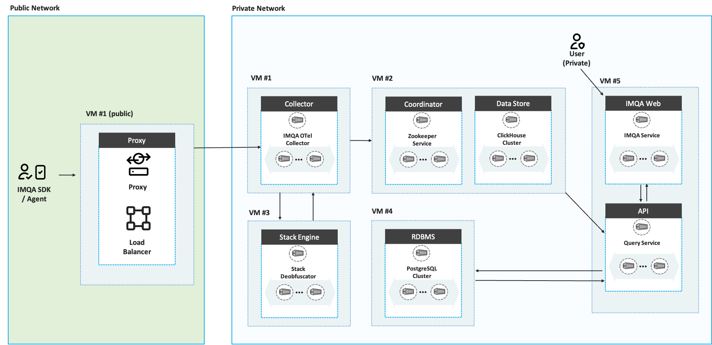

## 서버 요구 표준 사양

|Server| Specification | Description |
| --- | --- | --- |
| Proxy (VM\#1 public) | 4Core CPU, 8GB RAM, 128GB Storage, RHEL 8.4 또는 Ubuntu 20.04 이상  | 표준 사양 |
| Data Processor (VM\#1) | 8Core CPU, 32GB RAM, 128GB Storage, RHEL 8.4 또는 Ubuntu 20.04 이상  | 표준 사양 |
| Data Store (VM\#2) | 8Core CPU, 32GB RAM, 4000GB Storage, RHEL 8.4 또는 Ubuntu 20.04 이상  | 30일 데이터 보관 기준, 이하 표준 사양임 (사용량에 따라 실제 필요 저장공간은 늘어나거나 줄어들 수 있음) |
| RDBMS (VM\#3) | 4Core CPU, 16GB RAM, 128GB Storage, RHEL 8.4 또는 Ubuntu 20.04 이상  | 표준 사양 |
| Stack Engine (VM\#4) | 8Core CPU, 32GB RAM, 128GB Storage, RHEL 8.4 또는 Ubuntu 20.04 이상  | 표준 사양 |
| Web Server (VM\#5) | 8Core CPU, 32GB RAM, 128GB Storage, RHEL 8.4 또는 Ubuntu 20.04 이상  | 표준 사양 |

## 네트워크 트래픽 증가 및 용량 고려사항

### 스토리지 용량 고려사항

- 웹브라우저 기준 1건의 요청당 적게는 1개의 span, 많게는 10개 이상의 span이 발생함
- 1GB당 3M spans 저장 가능

### 트래픽 관련 고려사항

- 1span 당 최소 2kB 이상 최대 30kB 이하의 데이터 발생
- 1분당 1GB 이상의 트래픽 발생 시, 추가적인 로드밸런싱 된 VM을 구성하여 트래픽 분산이 필요함

## 네트워크 보안 정책

### 네트워크 분리

Proxy (VM#1)만 public 네트워크에 노출 다른 모든 VM은 private 네트워크에 위치

사용자 요구에 따라 네트워크 보안 정책을 변경 및 수정할 수 있습니다.

| 구간                           | 방화벽 정책                                                                                | 비고                                                       |
| ---------------------------- | ------------------------------------------------------------------------------------- | -------------------------------------------------------- |
| Internet -> 외부망              | FROM Any Source (port ANY), TO VM (External), Dest. port 80(TCP), 443(TCP)           | \-                                                       |
| 외부망 \-> 내부망                 | FROM VM#1 (External), TO VM#1 (Internal), Dest. port 4318(TCP)                       | \-                                                       |
| 내부망 -> 내부망 (VM간)           | FROM VMs (Internal), TO VMs (Internal), Dest. port all (TCP/UDP)                      | \-                                                       |
| PC -> 내부망 (VM)               | FROM User (Internal), TO VM#5 (Internal), Dest. port all (TCP)               | 내부 접속에도 포트 접근 제한이 필요한 경우 기술 협의 필요 (구성에 따라 port가 변할 수 있음), 단, 기본 구성의 경우 80(TCP), 443(TCP), DataStore:8123(TCP), DataStore:9000(TCP), DataProcessor:4317(TCP), DataProcessor:4318(TCP), DataProcessorInternalMetric:8888(TCP), DataProcessorSpanMetrics:8889(TCP), DataProcessorZPages:55679(TCP), RDBMS:5432(TCP), WebAuth:3567(TCP), WebApp:3301(TCP), WebApi:8080(TCP), WebApi:8085(TCP) 포트의 개방이 필요  |

### 방화벽 정책 구성

- Proxy (VM\#1 private):
  - 인바운드: HTTP(80), HTTPS(443) 포트만 허용
  - 아웃바운드: 내부 서버와의 통신에 필요한 포트만 허용
- Data Processor (VM\#1):
  - 인바운드: Proxy와의 통신 포트만 허용
  - 아웃바운드: Data Store, RDBMS와의 통신 포트 허용
- Data Store (VM\#2):
  - 인바운드: Data Processor, Stack Engine과의 통신 포트만 허용
  - 아웃바운드: 제한적 허용 (업데이트 등 필수적인 경우만)
- RDBMS (VM\#3):
  - 인바운드: Data Processor, Stack Engine, Web Server와의 통신 포트만 허용
  - 아웃바운드: 제한적 허용
- Stack Engine (VM\#4):
  - 인바운드: Data Processor, Web Server와의 통신 포트만 허용
  - 아웃바운드: Data Store, RDBMS와의 통신 포트 허용
- Web Server (VM\#5):
  - 인바운드: Proxy로부터의 통신 포트만 허용
  - 아웃바운드: Stack Engine, RDBMS와의 통신 포트 허용

## 로그 수집 및 모니터링

IMQA 서비스로 설치 인프라의 로그 수집 및 모니터링 기능을 제공합니다.

### 모니터링 대상

- 각 VM의 시스템 리소스 (CPU, 메모리, 스토리지, 네트워크)
- 애플리케이션 로그 및 성능 메트릭
- 네트워크 트래픽 및 연결 상태

{/* ## 데이터 관리 및 백업 */}

### 데이터 저장

- Data Store (VM#2): 주요 지표, 스팬 데이터 저장 (30일 보관 기준)
- RDBMS (VM#3): 구조화된 데이터 저장 (사용자, 서비스 및 메타데이터 등)

{/* ### 백업 정책

- 증분 백업: 일일
- 백업 데이터는 별도의 스토리지에 저장 */}

## 인증 및 권한 관리

- 인증 및 권한 관리는 사용자 요구에 따라 구성 가능
- SAML, OAuth, 기타 인증 방식 등 다양한 인증 방식 지원
- 멀티테넌시 지원
- RBAC 최소 권한 원칙 적용
