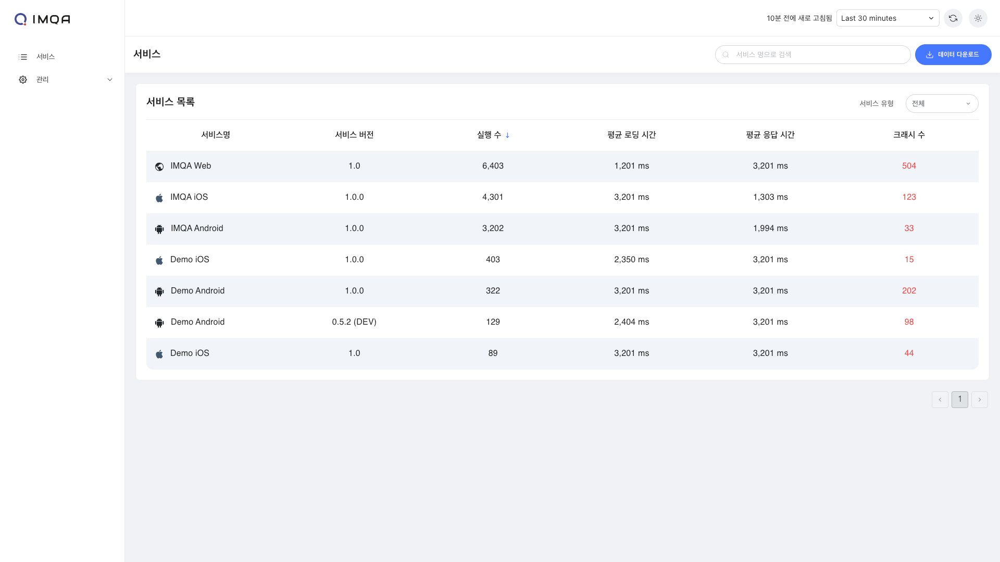
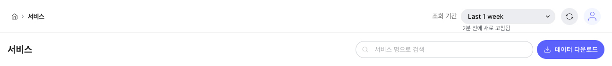
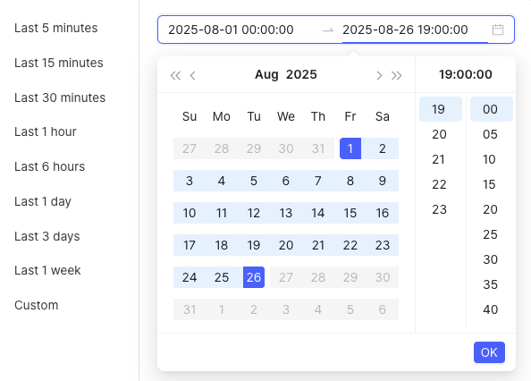

# 서비스

IMQA 서비스에서 모바일 앱과 웹 서비스의 버전 별 성능을 실시간 또는 원하는 기간으로 파악할 수 있습니다.
서비스는 Android 앱, iOS 앱, Web 앱 등 애플리케이션 그룹 단위입니다. 각 애플리케이션의 버전은 데이터를 집계하고 분석하기 위한 최소 단위입니다. 즉, 모든 앱, 웹 애플리케이션의 버전 별 현황 파악을 한눈에 할 수 있습니다.

IMQA 서비스는 다음과 같이 구성됩니다.

❶ **툴바(서비스)**

❷ **서비스 목록**

---

## 1. 툴 바

❶ **조회 조건**: 조회하고자 하는 기간을 선택할 수 있습니다. '최근 5분' 부터 '오늘' 등 빠른 버튼을 활용해 기간을 선택할 수 있으며, 'Custom' 으로 시작일시와 종료일시를 설정할 수 있습니다.

❷ **새로고침**: 현재 화면에 표시된 조회 결과 데이터를 새로고침합니다.

❸ **검색**: 원하는 키워드로 서비스를 조회할 수 있습니다. 조회하고자 하는 특정 서비스가 있을 경우 서비스 이름에 포함된 검색어를 입력합니다.

❹ **데이터 다운로드**: 현재 화면에 표시된 조회 결과를 `.xlsx`로 다운로드할 수 있습니다.

## 2. 서비스 목록

### 필터

- **서비스 유형**: 전체, Android, iOS, WEB 유형으로 서비스 목록을 필터링합니다.

### 서비스 목록

서비스 버전별 상태를 수치로 빠르게 파악할 수 있습니다. 기본은 실행 수 높은 순으로 정렬 됩니다.

- **서비스 명**: 등록한 서비스의 이름을 표시합니다.
- **서비스 버전**: 등록한 서비스의 버전을 표시합니다.
- **실행 수**: 조회 기간 동안 특정 서비스 버전이 실행된 수를 카운트합니다.
- **평균 로딩시간**: 조회 기간 동안 특정 서비스 버전의 화면 로딩시간 평균입니다.
- **평균 응답시간**: 조회 기간 동안 특정 서비스 버전의 응답시간 평균입니다.
- **크래시 수**: 조회 기간 동안 특정 서비스 버전에서 발생한 크래시를 카운트합니다.

서비스 항목 클릭 시, 해당 서비스의 버전을 기준으로 **성능 대시보드**로 이동할 수 있습니다.
