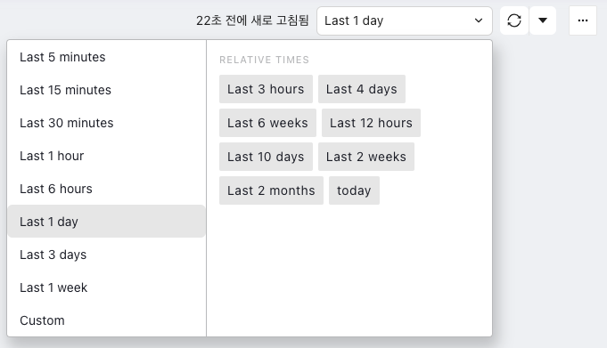
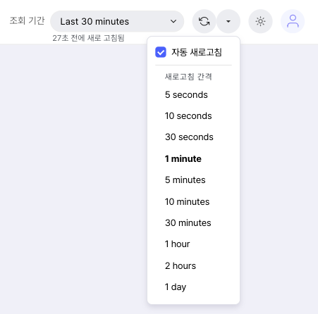
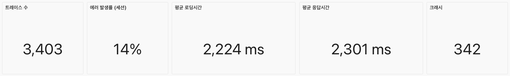
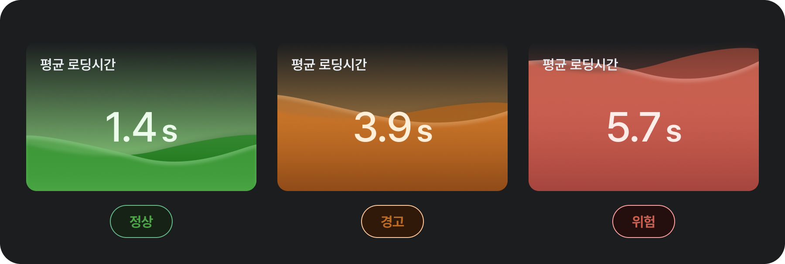

# 성능 대시보드

IMQA 성능 대시보드는 다양한 성능 지표 구성을 제공합니다. 대시보드를 통해 모바일 앱과 웹 서비스의 버전 별 성능을 실시간 또는 원하는 기간으로 파악할 수 있습니다. 애플리케이션 요약 정보와 주 성능 현황을 시계열 데이터로 확인할 수 있으며, 성능 하위 목록을 통해 빠르게 이슈 포인트를 파악할 수 있습니다.

IMQA 성능 대시보드는 다음과 같이 구성됩니다.

❶ **툴바(성능 대시보드)**

❷ **앱 요약 정보**

❸ **시계열 성능 정보**

❹ **성능 하위 목록**

---

## 1. 툴 바

❶ **조회 조건**: 조회하고자 하는 기간을 선택할 수 있습니다. '최근 5분' 부터 '오늘' 등 빠른 버튼을 활용해 기간을 선택할 수 있으며, 'Custom' 으로 시작일시와 종료일시를 설정할 수 있습니다.

❷ **새로고침 간격**: 데이터의 새로고침 간격을 설정할 수 있습니다. '5초' 부터 '1일' 등 간격을 선택할 수 있으며, '자동 새로고침' 을 선택하면 설정한 간격으로 데이터를 새로고침 합니다.

❸ **전체 화면**: 대시보드를 브라우저 전체 화면으로 표시할 수 있습니다. `esc` 키로 전체 화면을 해제합니다.

## 2. 앱 요약 정보

선택한 서비스 버전의 상태를 수치로 빠르게 파악할 수 있습니다.

- **트레이스 수**: 조회 기간 동안 발생한 특정 행동(액션)을 카운트합니다.
- **에러 발생률 (세션)**: 조회 기간 동안 전체 사용자 세션 중 에러가 있었던 세션의 비율입니다.
- **평균 로딩시간**: 조회 기간 동안 화면 로딩시간의 평균입니다.
- **평균 응답시간**: 조회 기간 동안 응답시간의 평균입니다.
- **크래시**: 조회 기간 동안 발생한 크래시를 카운트합니다.

## 3. 시계열 성능 정보

선택한 서비스 버전의 상태를 조회 기간 동안의 시계열 데이터로 확인하고, 변동 발생 시점을 감지할 수 있습니다.

- **세션 수**: 서비스 내에서 발생한 사용자의 서비스 실행 수를 시간대별 카운트합니다.
- **로딩시간**: 서비스 내 화면 로딩시간의 시간대별 평균입니다.
  - P95: 해당 시간대의 하위 5%의 평균
  - 평균: 해당 시간대의 전체 평균
- **응답시간**: 서비스 내 응답시간(XHR/Fetch)의 시간대별 평균입니다.
  - P95: 해당 시간대의 하위 5%의 평균
  - 평균: 해당 시간대의 전체 평균

## 4. 성능 하위 목록

성능 하위 목록을 통해 빠르게 이슈 포인트를 파악할 수 있습니다.

### 크래시 상위 10

조회 기간 동안 가장 많이 발생한 크래시 10개를 표시합니다. 기본은 크래시 수 높은 순으로 정렬 됩니다.

- **에러**: 발생한 크래시의 유형 정보를 표시합니다. 동일 에러 유형으로 집계합니다.
- **에러 건 수**: 해당 에러가 발생한 수를 카운트합니다.
- **세션 수**: 해당 에러가 발생한 사용자의 세션 수를 카운트 합니다.

### 로딩시간 하위 10 화면 그룹

<Gha keyword="TIP" title="화면 그룹 기준 집계">IMQA에서 서비스 별 **화면 그룹 관리**를 통해 여러 화면을 주요 업무 단위 또는 메뉴 단위 등으로 그룹화하고, 집계/분석할 수 있습니다.</Gha>

<Gha keyword="CAUTION" title="화면 그룹 관리">**화면 그룹 관리** 기능은 업데이트 예정입니다. 현재 모든 화면은 하나의 화면 그룹으로 매핑됩니다.</Gha>

- **화면 그룹**: IMQA에서 설정한 화면 그룹 이름을 표시합니다. 화면 그룹에 속하지 않은 화면은 `공백`으로 집계됩니다.
- **방문 수**: 해당 화면 그룹에 속한 화면을 사용자가 요청한 수를 카운트합니다. 화면 조회 수를 의미합니다.
- **평균 로딩시간**: 해당 화면 그룹에 속한 화면의 로딩시간 평균입니다.

### 응답시간 하위 10 요청

조회 기간 동안 가장 평균 응답시간이 느린 요청 URL 10개를 표시합니다. 기본은 평균 응답시간 높은 순으로 정렬 됩니다.

- **요청 URL**: 요청된 URL을 표시합니다. `http.url`을 의미합니다.
- **요청 건 수**: 해당 URL을 사용자가 요청한 수를 카운트합니다. URL 호출 수를 의미합니다.
- **평균 응답시간**: 해당 URL의 응답시간 평균입니다.
