# 세션 분석

IMQA 세션 분석은 사용자의 앱 실행 시작 시점부터 종료 시점까지의 흐름을 추적하고 다양한 지표 구성을 제공합니다. 하나의 세션은 여러 개의 트레이스로 구성되며, 트레이스는 앱 내에서 발생한 특정 행동 (이하 액션)을 나타내는 단위입니다.
화면 로딩, 앱 상태(Foreground, Background), 네트워크 요청/응답, 사용자 이벤트, 로그, 에러 등 다양한 액션 유형을 제공합니다. 특히, 에러 액션은 크래시 로그 분석 화면과 연결됩니다.

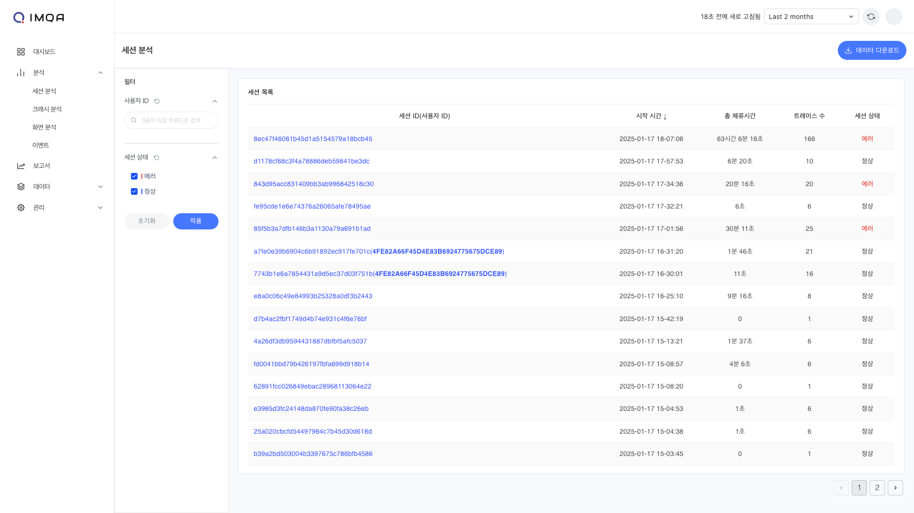

IMQA 세션 분석은 다음과 같이 구성됩니다.

❶ **툴바(세션 분석)**
❷ **필터**
❸ **세션 목록**

---

## 1. 툴 바

❶ **조회 조건**: 조회하고자 하는 기간을 선택할 수 있습니다. '최근 5분' 부터 '오늘' 등 빠른 버튼을 활용해 기간을 선택할 수 있으며, 'Custom' 으로 시작일시와 종료일시를 설정할 수 있습니다.
❷ **새로고침**: 현재 화면에 표시된 조회 결과 데이터를 새로고침합니다.
❸ **데이터 다운로드**: 현재 화면에 표시된 조회 결과를 `.xlsx`로 다운로드할 수 있습니다.

## 2. 필터

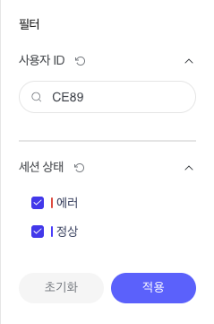

❶ 원하는 사용자 ID 정보로 세션을 조회할 수 있습니다. 조회하고자 하는 특정 사용자가 있을 경우 사용자 ID에 포함된 3글자 이상의 검색어를 입력합니다.

> [!TIP] 사용자 ID 설정
> IMQA는 SDK, WebAgent를 통한 데이터 수집시 특정 사용자를 식별하기 위한 **사용자 ID** 정보를 설정할 수 있습니다. **사용자 ID 정보 설정**은 =='SDK Agent 설치 가이드 > Custom User ID 설정'== 을 참고하세요.

❷ 세션 상태 필터를 통해 문제가 발생한 세션만 조회할 수 있습니다. 기본 '전체'로 설정되어 있습니다.

- **에러**: 해당 세션에 에러 트레이스(Crash, ANR, Error, 4xx 5xx 응답 XHR)가 1건 이상
- **정상**: 그 외

❸ [적용]을 클릭하면 선택한 필터 기준으로 데이터가 조회됩니다.

## 3. 세션 목록

선택한 서비스 버전을 실행했던 사용자의 행동 흐름을 확인할 수 있습니다. 수집된 사용자 식별 정보, 앱 시작 시간, 총 체류 시간, 서비스 내에서 발생한 특정 액션 수, 세션 상태를 표시합니다. 이를 통해 이슈가 있었던 사용자의 행동 흐름을 빠르게 파악 가능하며, '세션 상세'로 이동하여 분석할 수 있습니다. 기본은 최근 시작 순으로 정렬 됩니다.

- **세션 ID(사용자 ID)**: IMQA가 특정 세션을 식별하기 위해 부여한 고유 키를 표시합니다. SDK, WebAgent에서 설정한 사용자의 ID 정보가 수집되었을 경우 추가 표시합니다.
- **시작 시간**: 해당 세션의 시작 시간을 표시합니다.
- **총 체류시간**: 해당 세션의 시작 시간부터 마지막 액션까지를 체류 시간으로 표시합니다.
- **트레이스 수**: 해당 세션에서 발생한 액션 수를 카운트합니다.
- **세션 상태**: 해당 세션의 문제 발생 여부를 표시합니다.
  - 에러: 해당 세션에 에러 트레이스(Crash, ANR, Error, 4xx 5xx 응답 XHR)가 1건 이상
  - 정상: 그 외

세션 목록에서 특정 세션을 클릭하면 **세션 상세 (트레이스 목록)** 페이지로 이동할 수 있습니다.

## 4. 세션 상세 (트레이스 목록)

특정 세션을 기준으로, 앱 실행 시작 시점부터 종료 시점까지 발생한 여러 액션을 트레이스로 확인할 수 있습니다.

### 필터

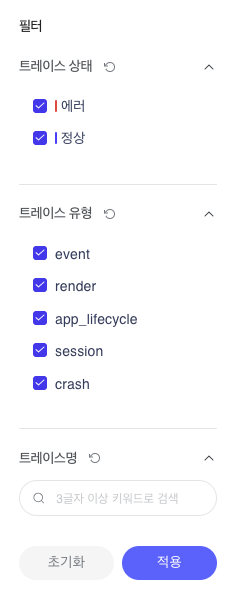

❶ 트레이스 상태 필터를 통해 문제가 발생한 트레이스만 조회할 수 있습니다. 기본 '전체'로 설정되어 있습니다.

- **에러**: Crash, ANR, Error, 4xx 5xx 응답 XHR
- **정상**: 그 외

❷ 트레이스 유형 필터를 통해 원하는 트레이스 유형만 조회할 수 있습니다. 기본 '전체'로 설정되어 있습니다.

- **session** `Android` `iOS`
- **render** `Android` `iOS`
- **xhr**
- **event** `Android` `iOS`
- **crash** `Android` `iOS`
- **anr** `Android`
- **log**
- **app_lifecycle** `Android` `iOS`
- **documentLoad** `Web`
- **fetch** `Web`
- **visibility** `Web`
- **long-task** `Web`
- **error** `Web`
- **user-interaction** `Web`

❸ 원하는 트레이스 이름을 조회할 수 있습니다. 조회하고자 하는 특정 정보가 있을 경우 트레이스 이름에 포함된 3글자 이상의 검색어를 입력합니다.
❹ [적용]을 클릭하면 선택한 필터 기준으로 데이터가 조회됩니다.

### 트레이스 목록

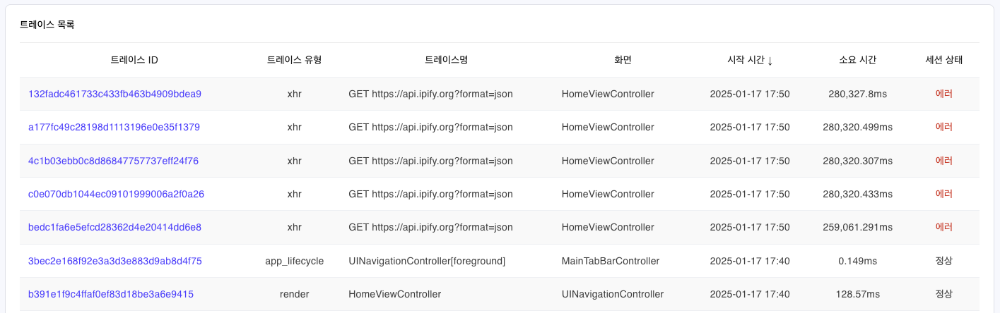
선택한 세션에서 발생한 여러 액션을 트레이스로 확인할 수 있습니다. 트레이스 유형, 트레이스 이름, 액션이 발생한 화면, 액션 시작 시간, 액션이 수행된 시간, 상태를 표시합니다. 이를 통해 사용자의 서비스 이용 중 어떤 일들이 있었는지를 한눈에 확인할 수 있습니다. 기본은 최근 트레이스 순으로 정렬 됩니다.

- **트레이스 ID**: IMQA가 특정 액션을 식별하기 위해 부여한 고유 키를 표시합니다.
- **트레이스 유형**: 해당 트레이스의 유형을 표시합니다.
- **트레이스 명**: 해당 트레이스를 대표하는 정보을 표시합니다.
- **화면**: 해당 트레이스가 발생한 화면을 표시합니다.
- **시작 시간**: 해당 트레이스가 시작된 시간을 표시합니다.
- **소요 시간**: 해당 트레이스가 수행된 시간을 표시합니다.
- **트레이스 상태**: 해당 트레이스의 문제 발생 여부를 표시합니다.
  - 에러: Crash, ANR, Error, 4xx 5xx 응답 XHR
  - 정상: 그 외

트레이스 목록에서 특정 트레이스를 클릭하면 **트레이스 상세** 페이지로 이동할 수 있습니다.

> [!EXAMPLE] 트레이스 상세 가이드
> **트레이스 상세**에 대한 내용은 '데이터 > 트레이스 > 트레이스 상세' 를 참고하세요.

---

# 크래시 분석

IMQA 크래시 분석은 기간 내 서비스에서 발생한 비정상 종료, ANR, 에러를 통합적 관점에서 확인할 수 있습니다. 하나의 항목은 동일한 에러 유형, 메시지일 경우 같은 에러로 그룹핑 됩니다. 해당 에러가 발생한 건 수와 발생한 사용자 세션 수를 확인하여 서비스 영향도를 파악할 수 있습니다.
Exception, ANR, consoleError, 4xx 5xx 응답 XHR 에러 유형을 제공하며, 특정 크래시 기준 로그 분석 화면과 연결됩니다.

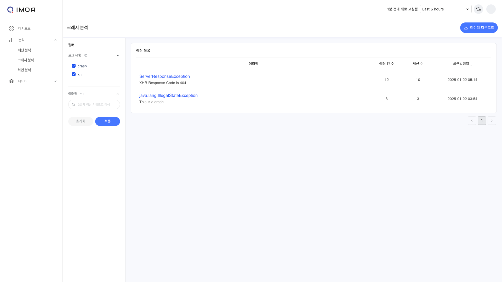

IMQA 크래시 분석은 다음과 같이 구성됩니다.

❶ **툴바(크래시 분석)**
❷ **필터**
❸ **에러 목록**

---

## 1. 툴 바

❶ **조회 조건**: 조회하고자 하는 기간을 선택할 수 있습니다. '최근 5분' 부터 '오늘' 등 빠른 버튼을 활용해 기간을 선택할 수 있으며, 'Custom' 으로 시작일시와 종료일시를 설정할 수 있습니다.
❷ **새로고침**: 현재 화면에 표시된 조회 결과 데이터를 새로고침합니다.
❸ **데이터 다운로드**: 현재 화면에 표시된 조회 결과를 `.xlsx`로 다운로드할 수 있습니다.

## 2. 필터

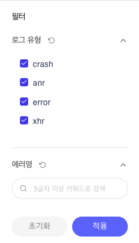

❶ 에러 유형 필터를 통해 원하는 에러 유형만 조회할 수 있습니다. 기본 '전체'로 설정되어 있습니다.

- **crash**
- **anr** `Android`
- **error**
- **xhr**

❷ 원하는 에러명을 조회할 수 있습니다. 조회하고자 하는 특정 정보가 있을 경우 에러명에 포함된 3글자 이상의 검색어를 입력합니다.
❸ [적용]을 클릭하면 선택한 필터 기준으로 데이터가 조회됩니다.

## 3. 에러 목록

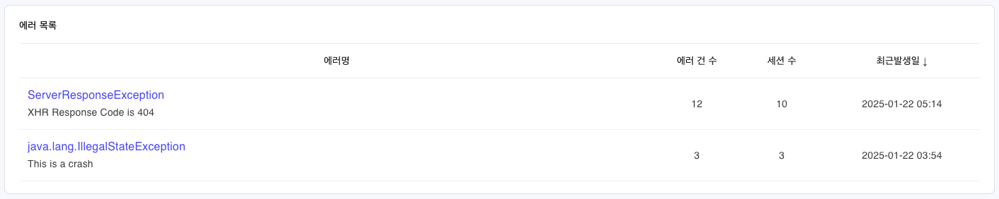
선택한 서비스 버전에서 발생한 에러를 확인할 수 있습니다. 에러명(에러 유형, 메시지), 에러 건 수, 세션 수, 최근발생일을 표시합니다. 이를 통해 서비스 영향도가 높은 에러를 빠르게 파악 가능하며, '에러 상세'로 이동하여 분석할 수 있습니다. 기본은 최근 발생일시 순으로 정렬 됩니다.

- **에러명**: 에러 유형과 메시지를 조합하여 집계 표시합니다. 동일한 에러 유형, 메시지일 경우 같은 에러로 그룹핑 됩니다.
- **에러 건 수**: 해당 에러가 발생한 수를 카운트합니다.
- **세션 수**: 해당 에러가 발생한 사용자 세션 수를 카운트합니다. 세션은 사용자의 앱 실행 시작 부터 종료 까지의 단위입니다.
- **최근발생일**: 해당 에러의 마지막 발생 일시를 표시합니다.

에러 목록에서 특정 에러를 클릭하면 **에러 상세 (로그 목록)** 페이지로 이동할 수 있습니다.

## 4. 에러 상세 (로그 목록)

특정 에러를 기준으로, 발생 내역을 로그로 확인할 수 있습니다.
==이미지교체필요(특정 에러로 조회한 예)==
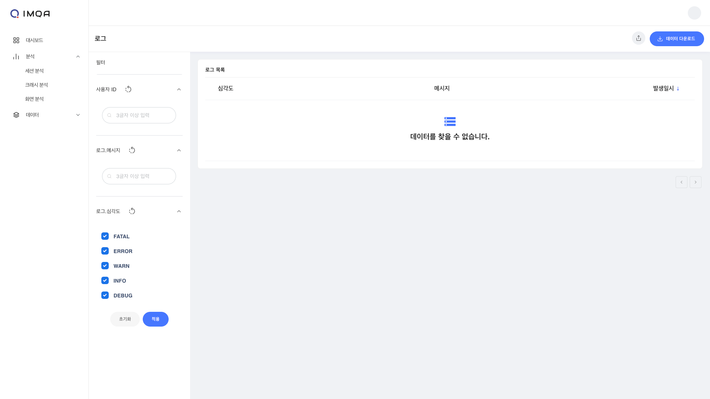

### 필터

==이미지교체필요==
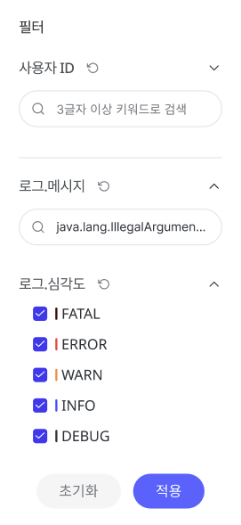

❶ 원하는 사용자 ID 정보로 로그를 조회할 수 있습니다. 조회하고자 하는 특정 사용자가 있을 경우 사용자 ID에 포함된 3글자 이상의 검색어를 입력합니다.
❷ 원하는 로그 메시지를 조회할 수 있습니다. 조회하고자 하는 특정 정보가 있을 경우 메시지에 포함된 3글자 이상의 검색어를 입력합니다.
❸ 심각도 유형 필터를 통해 원하는 상태의 로그만 조회할 수 있습니다. 기본 '전체'로 설정되어 있습니다.

- **FATAL**
- **ERROR**
- **WARN**
- **INFO**
- **DEBUG**

❹ [적용]을 클릭하면 선택한 필터 기준으로 데이터가 조회됩니다.

### 로그 목록

==이미지교체필요==
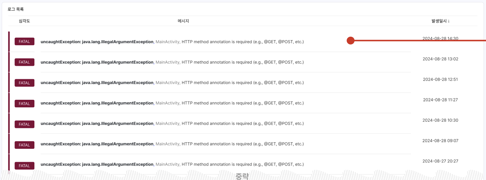
선택한 통합 에러 기준으로 사용자에게 발생한 여러 에러를 로그로 확인할 수 있습니다. 심각도, 로그 메시지, 발생한 시간을 표시합니다. 이를 통해 여러 사용자의 서비스 이용 중 발생한 이슈를 한눈에 확인할 수 있습니다. 기본은 최근 발생일시 순으로 정렬 됩니다.

- **심각도**: 해당 로그의 심각도를 표시합니다.
- **메시지**: 해당 로그의 메시지를 표시합니다.
- **발생일시**: 해당 로그가 기록된 시점을 표시합니다.

로그 목록에서 특정 로그를 클릭하면 **로그 상세** 페이지를 확인할 수 있습니다.

> [!EXAMPLE] 로그 상세 가이드
> **로그 상세**에 대한 내용은 '데이터 > 로그 > 로그 상세' 를 참고하세요.

---

# 화면 분석

IMQA 화면 분석은 기간 내 사용자가 방문한 여러 화면의 성능을 통합적 관점에서 확인할 수 있습니다. 해당 화면의 방문 수와 평균 성능, 발생한 에러 건 수를 확인하여 화면별 성능 현황과 방문율에 따른 사용자 영향도를 파악할 수 있습니다.
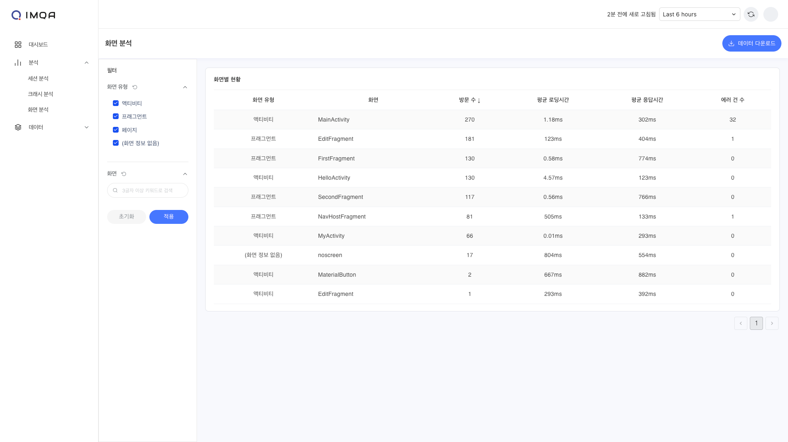

IMQA 화면 분석은 다음과 같이 구성됩니다.

❶ **툴바(화면 분석)**
❷ **필터**
❸ **화면별 현황**

---

## 1. 툴 바

❶ **조회 조건**: 조회하고자 하는 기간을 선택할 수 있습니다. '최근 5분' 부터 '오늘' 등 빠른 버튼을 활용해 기간을 선택할 수 있으며, 'Custom' 으로 시작일시와 종료일시를 설정할 수 있습니다.
❷ **새로고침**: 현재 화면에 표시된 조회 결과 데이터를 새로고침합니다.
❸ **데이터 다운로드**: 현재 화면에 표시된 조회 결과를 `.xlsx`로 다운로드할 수 있습니다.

## 2. 필터

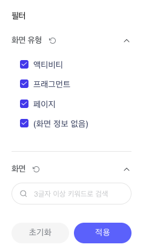

❶ 화면 유형 필터를 통해 원하는 화면 유형만 조회할 수 있습니다. 기본 '전체'로 설정되어 있습니다.

- **액티비티** `Android`
- **뷰** `iOS`
- **프래그먼트** `Android`
- **페이지**
- **(화면 정보 없음)**

> [!QUOTE] (화면 정보 없음)과 'No Screen'
> IMQA는 SDK, WebAgent를 통한 데이터 수집시, 네이티브 화면과 웹 페이지 정보를 자동으로 수집합니다. **(화면 정보 없음)**은 성능 데이터 등이 수집되었으나, 화면의 정보를 수집하지 못한 경우 'No Screen'으로 구분한 화면을 의미합니다.

❷ 원하는 화면명을 조회할 수 있습니다. 조회하고자 하는 특정 화면이 있을 경우 화면 이름에 포함된 3글자 이상의 검색어를 입력합니다.
❸ [적용]을 클릭하면 선택한 필터 기준으로 데이터가 조회됩니다.

## 3. 화면별 현황

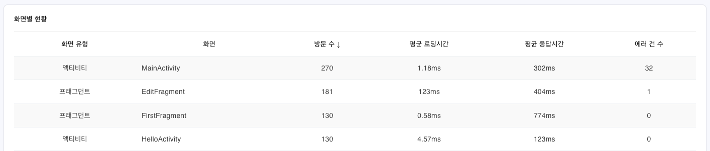
선택한 서비스 버전에서 수집된 화면별 현황을 확인할 수 있습니다. 화면 유형, 화면 이름, 방문 수, 평균 로딩시간과 응답시간, 에러 건 수를 표시합니다. 이를 통해 사용자 영향도가 높은 화면을 빠르게 파악 가능합니다. 기본은 방문 수 높은 순으로 정렬 됩니다.

- **화면 유형**: 해당 화면의 유형을 표시합니다.
- **방문 수**: 해당 화면을 사용자가 요청한 수를 카운트합니다. 화면 조회 수를 의미합니다.
- **평균 로딩시간**: 해당 화면의 로딩시간 평균입니다.
- **평균 응답시간**: 해당 화면의 응답시간 평균입니다.
- **에러 건 수**: 해당 화면에서 발생한 에러 수를 카운트합니다.
