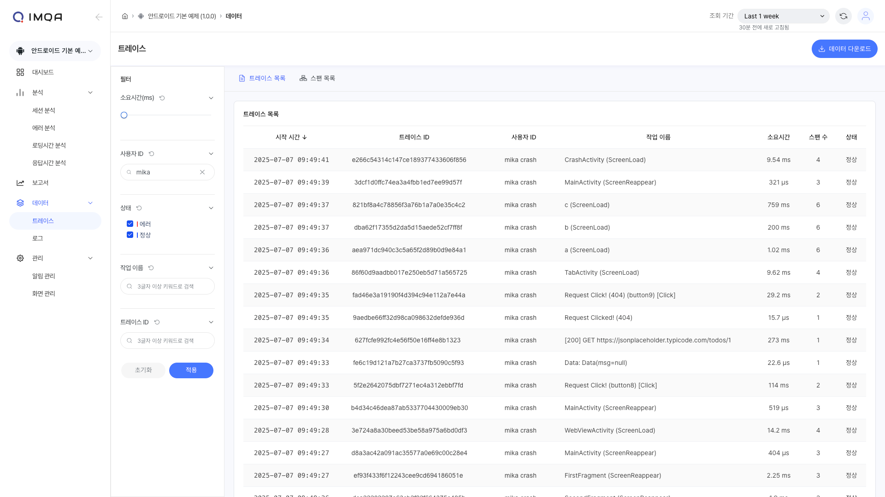
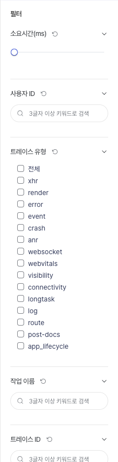
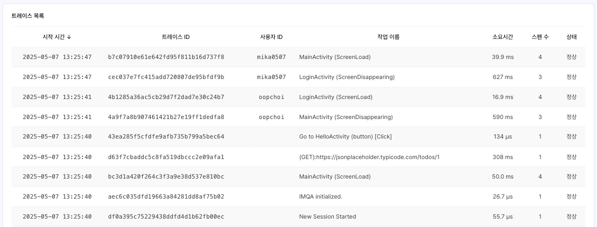
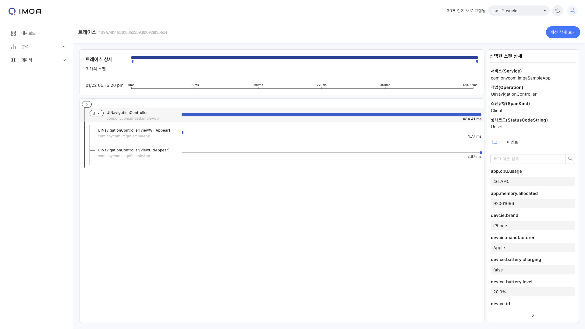
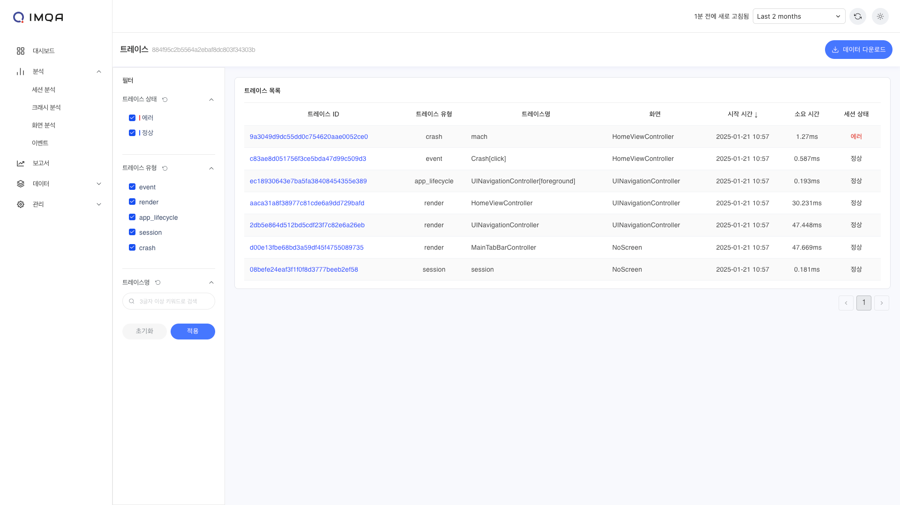
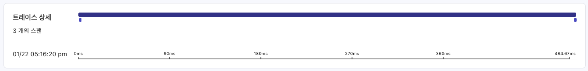
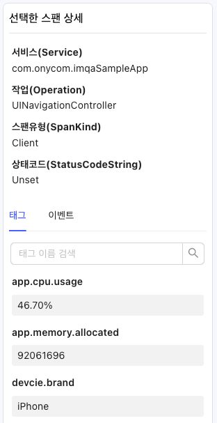
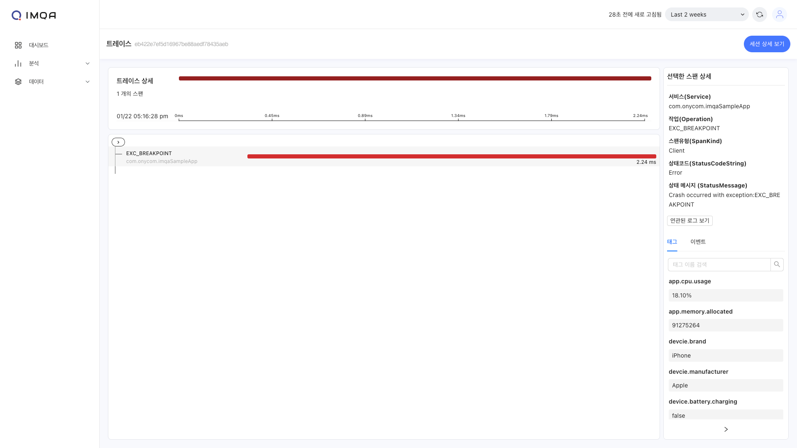
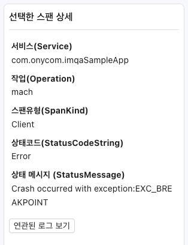
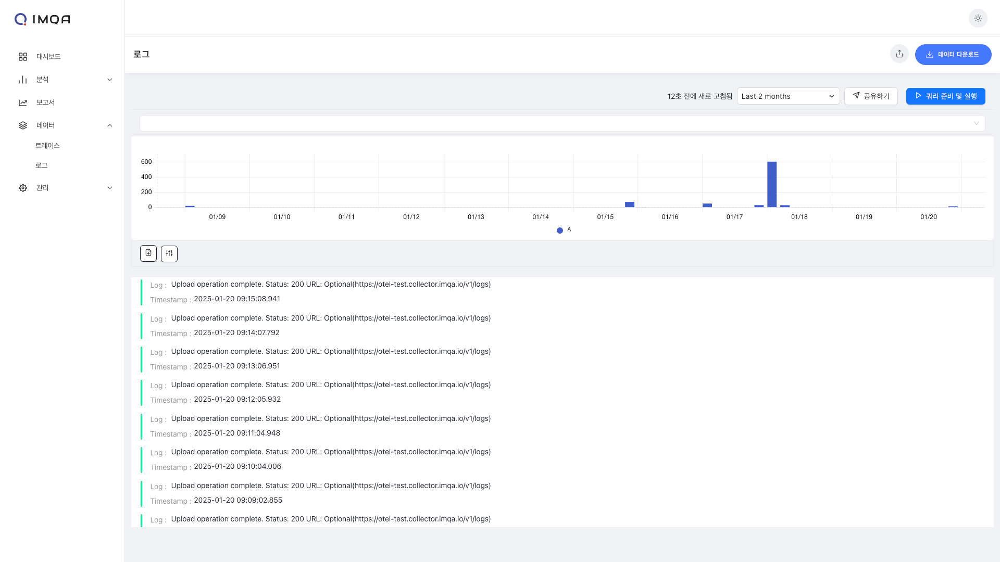

## 트레이스

IMQA 트레이스는 앱 내에서 발생한 다양한 행동 (이하 액션) 데이터를 탐색하고 분석할 수 있습니다.
화면 로딩, 앱 상태(Foreground, Background), 네트워크 요청/응답, 사용자 이벤트, 로그, 에러 등 다양한 액션 유형을 확인할 수 있으며, 트레이스에서 있었던 작업 단위도 확인할 수 있습니다. 트레이스와 스팬 데이터를 사용자의 세션 분석으로 연계하여 분석할 수 있습니다.

IMQA 트레이스는 다음과 같이 구성됩니다.

❶ **툴바(트레이스 분석)**

❷ **필터**

❸ **트레이스 목록**

❹ **스팬 목록**

---

## 1. 툴 바

❶ **조회 조건:** 조회하고자 하는 기간을 선택할 수 있습니다. '최근 5분' 부터 '오늘' 등 빠른 버튼을 활용해 기간을 선택할 수 있으며, 'Custom' 으로 시작일시와 종료일시를 설정할 수 있습니다.

❷ **새로고침:** 현재 화면에 표시된 조회 결과 데이터를 새로고침합니다.

## 2. 필터

❶ 원하는 사용자 ID 정보로 트레이스와 스팬을 조회할 수 있습니다. 조회하고자 하는 특정 사용자가 있을 경우 사용자 ID에 포함된 3글자 이상의 검색어를 입력합니다.

<Gha keyword="TIP" title="사용자 ID 설정">IMQA는 SDK, WebAgent를 통한 데이터 수집시 특정 사용자를 식별하기 위한 사용자 ID 정보를 설정할 수 있습니다. 사용자 ID 정보 설정은 'SDK Agent 설치 가이드 > Custom User ID 설정' 을 참고하세요.</Gha>

❷ 상태 필터를 통해 문제가 발생한 트레이스만 조회할 수 있습니다. 기본 '전체'로 설정되어 있습니다.

- **에러**: Crash, ANR, Error, XHR(4xx, 5xx 응답)
- **정상**: 그 외

❸ 그 외 다양한 필터를 설정할 수 있습니다.

❹ [적용]을 클릭하면 선택한 필터 기준으로 데이터가 조회됩니다.

## 3. 트레이스 목록

사용자의 행동 흐름에서 발생한 여러 액션을 트레이스로 확인할 수 있습니다. 트레이스 유형, 소요 시간 등을 표시합니다. 이를 통해 사용자의 서비스 이용 중 어떤 일들이 있었는지를 한눈에 확인할 수 있습니다. 기본은 최근 트레이스 순으로 정렬 됩니다.

- **Root Service Name(서비스 명)**: 서비스 이름을 표시합니다.
- **Root Operation Name(트레이스 명)**: 해당 트레이스를 대표하는 정보를 표시합니다.
- **Root Duration(소요 시간)**: 해당 트레이스의 소요시간을 표시합니다.
- **No of Spans(포함 스팬 수)**: 해당 트레이스에 포함된 스팬(이하 작업 단위)수를 카운트합니다.
- **TraceID(트레이스 ID)**: IMQA가 특정 액션을 식별하기 위해 부여한 고유 키를 표시합니다.

트레이스 목록에서 특정 트레이스를 클릭하면 **트레이스 상세** 페이지로 이동할 수 있습니다.

## 4. 일반 트레이스 상세

특정 액션을 기준으로, 시작 시점부터 종료 시점까지 상세 분석이 가능합니다. 하나의 트레이스는 여러 스팬(트레이스에서 발생한 특정 작업 단위. 데이터를 표현하는 최소 단위) 트리로 구성됩니다. 해당 트레이스가 발생한 사용자의 세션으로 연계하여 이동할 수 있습니다.

- 원하는 스팬 단위를 선택하면 **스팬 상세** 정보가 표시됩니다.
- [세션 상세 보기]를 클릭하면 해당 트레이스가 수집된 사용자의 **세션 상세(트레이스 목록)**으로 이동할 수 있습니다.
  

### 트레이스 요약

트레이스 요약을 통해 해당 트레이스에서 발생한 작업 단위의 시작 종료 시점을 빠르게 파악할 수 있습니다.

### 스팬 상세 정보

선택한 스팬과 함께 수집된 다양한 속성 정보를 확인할 수 있습니다. 속성 정보를 통해 해당 사용자의 상태를 정확하게 파악할 수 있습니다.

## 5. 이슈 트레이스 상세

Crash, ANR, Error, XHR(4xx, 5xx 응답) 문제나 커스텀 로그가 발생한 트레이스의 상세 정보를 통해 로그까지 분석할 수 있습니다.

- 원하는 스팬 단위를 선택하면 **스팬 상세** 정보가 표시됩니다.
- [세션 상세 보기]를 클릭하면 해당 트레이스가 수집된 사용자의 **세션 상세(트레이스 목록)**으로 이동할 수 있습니다.
- [연관된 로그 보기]를 클릭하면 해당 트레이스와 같이 수집된 **로그 상세**로 이동할 수 있습니다.

### 이슈 스팬 상세 정보

선택한 에러 상태 스팬과 함께 수집된 다양한 속성 정보를 확인할 수 있습니다. 속성 정보를 통해 해당 사용자의 상태를 정확하게 파악할 수 있습니다.

---

## 로그

IMQA 로그는 애플리케이션 내부 동작에 대해 보다 상세하게 분석할 수 있는 정보를 제공합니다. Crash, ANR, Error, XHR(4xx, 5xx 응답) 문제가 발생했거나, 비즈니스 로직 상에서 추가 정보를 수집하기 위한 커스텀 로그 정보를 확인할 수 있습니다.

<Gha keyword="TIP" title="커스텀 로그 설정">IMQA는 SDK, WebAgent를 통한 데이터 수집시 비즈니스 로직 상에서 추가 정보를 수집하기 위한 로그 정보를 추가 수집 설정할 수 있습니다. 커스텀 로그 설정은 SDK / Agent 설치 가이드를 참고하세요.</Gha>
