<Gha keyword="NOTE" title="글로벌 관리 메뉴 접근 권한">

IMQA의 글로벌 관리 메뉴는 `MANAGER` 이상의 권한 사용자에게만 제공됩니다.

  <ul>
    <li>- **사용자 관리**는 `ADMIN`, `SUPER_USER` 역할 사용자만 접근할 수 있습니다.</li>
    <li>- **서비스 관리**는 `MANAGER`, `ADMIN`, `SUPER_USER` 역할 사용자만 접근할 수 있습니다.</li>
  </ul>
</Gha>

# 사용자 관리

IMQA 사용자 관리를 통해 IMQA 사용자를 조회하고 관리할 수 있습니다. 사용자별 권한을 소속 팀과 역할에 따라 기본 설정할 수 있습니다.

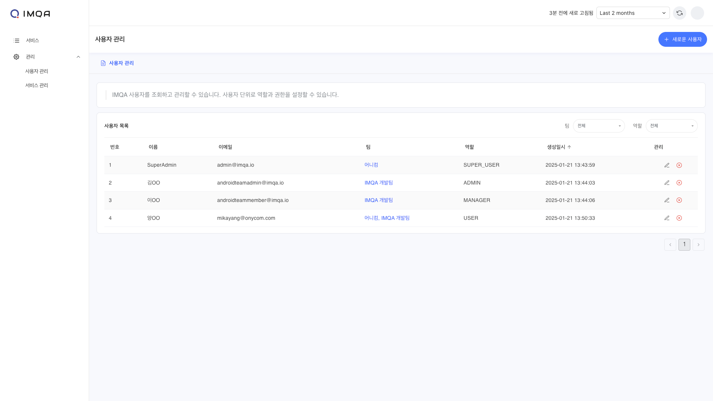

IMQA 사용자 관리는 다음과 같이 구성됩니다.

❶ **툴바(사용자 관리)**

❷ **사용자 목록**

---

## 1. 툴 바

❶ **조회 조건**: 조회하고자 하는 기간을 선택할 수 있습니다. '최근 5분' 부터 '오늘' 등 빠른 버튼을 활용해 기간을 선택할 수 있으며, 'Custom' 으로 시작일시와 종료일시를 설정할 수 있습니다.

❷ **새로고침**: 현재 화면에 표시된 조회 결과 데이터를 새로고침합니다.

❸ **새로운 사용자**: 새 사용자를 등록합니다.

## 2. 사용자 추가

사용자 관리 페이지 오른쪽 상단의 [+ 새로운 사용자] 버튼을 클릭하면 사용자를 추가할 수 있는 팝업이 표시됩니다.
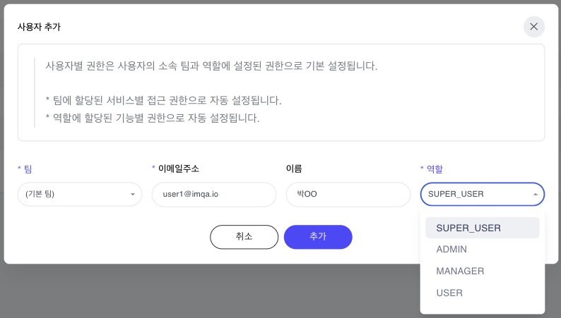

<Gha keyword="IMPORTANT" title="사용자 권한">IMQA에는 **서비스 접근 권한**과 **기능 접근 권한**으로 구분된 권한 체계가 있습니다. 서비스 사용자는 소속 팀과 역할을 기반으로 각 권한을 상속받습니다. 팀은 서비스 접근 권한을 사용자에게 부여합니다. 역할은 기능 접근 권한을 사용자에게 부여합니다.</Gha>

<Gha keyword="CAUTION" title="팀">**팀 관리** 기능은 업데이트 예정입니다. 현재 사용자는 기본 '(기본 팀)' 으로 소속되며, 모든 서비스의 접근 권한을 가질 수 있습니다.</Gha>

❶ 사용자의 소속 **팀**을 설정합니다. 기본은 '(기본 팀)'으로 설정되어 있습니다.

❷ **이메일 주소**와 **이름**을 입력합니다. 이메일 주소는 로그인 ID로 사용됩니다.

❸ 사용자의 **역할**을 설정합니다. 역할에 따라 할당된 기능별 권한이 자동 설정됩니다.

- **SUPER_USER**: 최고 관리자 계정은 모든 리소스와 기능에 접근 및 사용이 가능합니다.
- **ADMIN**: 대부분의 리소스와 관리 메뉴 접근 및 기능 사용이 가능합니다.
- **MANAGER**: 서비스별 관리 메뉴에 접근및 기능 사용이 가능합니다.
- **USER**: 모든 관리 기능에 접근 및 기능 사용이 불가능합니다.

❹ 정보 작성이 완료되면 [추가] 버튼을 클릭합니다.

## 📌 사용자 권한

사용자별 권한은 사용자의 소속 팀과 역할에 설정된 권한으로 기본 설정됩니다.

<Gha keyword="NOTE" title="팀-역할-사용자 권한 요약">
  <ul>
    <li>&nbsp;**1. 팀 단위로 서비스 접근 권한을 설정할 수 있습니다.** - ⚠️ 팀 단위에는 기능 접근에 대한 설정 기능을 제공하지 않습니다.</li>
    <li>&nbsp;**2. 역할 단위에는 기능 접근 권한이 사전 정의되어 있습니다.** - ⚠️ 역할 단위에는 서비스 접근에 대한 설정 기능을 제공하지 않습니다. - ⚠️ 현재 역할을 새로 생성하거나 역할별 권한은 수정이 되지 않습니다.</li>
    <li>&nbsp;**3. 사용자 단위로 팀과 역할을 설정할 수 있습니다.** - 사용자는 기본 '(기본 팀)'으로 소속되며, '(기본 팀)'은 모든 서비스의 접근 권한을 가지고 있습니다. - 사용자의 소속 팀을 설정하면 팀에 설정된 서비스 접근 권한을 자동 설정합니다. - 사용자가 복수의 팀에 설정된 경우 각 팀에 설정된 서비스 접근 권한을 병합합니. - 사용자의 역할을 설정하면 역할에 설정된 기능 접근 권한을 자동 설정합니다.</li>
    <li>&nbsp;**4. 사용자 단위로 소속 팀과 역할에 지정된 권한을 상속받아야 합니다.** - ⚠️ 현재 사용자에게 별도 서비스 접근 권한과 기능 접근 권한을 설정할 수 없습니다.</li>
</ul>
</Gha>

### 팀에 따른 서비스 접근 권한

IMQA는 여러 사용자를 팀으로 관리할 수 있습니다. 팀 단위로 서비스 접근 권한을 설정하여 같은 소속 사용자들의 권한을 일괄 관리하기 용이합니다.

### 역할별 기능 권한

IMQA는 역할에 따라 메뉴 및 기능 접근 권한을 구분하여 제공하고 있습니다. 아래의 역할별 기능 권한을 참고하세요.

| 구분        | 리소스      | USER |   MANAGER    |    ADMIN     |
| ----------- | ----------- | :--: | :----------: | :----------: |
| 분석        | 세션 분석   | READ |     READ     |     READ     |
|             | 크래시 분석 | READ |     READ     |     READ     |
|             | 화면 분석   | READ |     READ     |     READ     |
| 데이터      | 트레이스    | READ |     READ     |     READ     |
|             | 로그        | READ |     READ     |     READ     |
| 관리        | 알림 관리   | READ | READ / WRITE | READ / WRITE |
|             | 화면 관리   | READ | READ / WRITE | READ / WRITE |
| 글로벌 관리 | 사용자 관리 |      |              | READ / WRITE |
|             | 서비스 관리 |      |     READ     | READ / WRITE |
|             | 감사 로그   |      |              |     READ     |

## 3. 사용자 목록

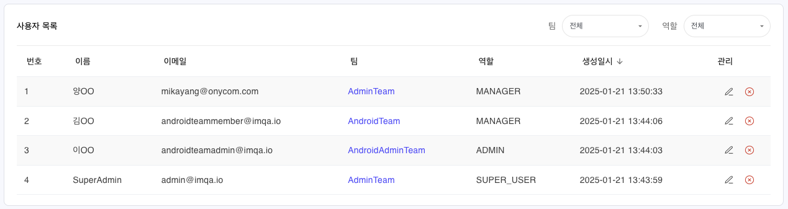

### 필터

- **팀**: 전체, 소속 팀으로사용자 목록을 필터링합니다.
- **역할**: 체, SUPER_USER, ADMIN 등 역할로 사용자 목록을 필터링합니다.

### 사용자 목록

현재 등록된 IMQA 서비스 사용자를 확인할 수 있습니다. 기본은 최근 생성일시 순으로 정렬 됩니다.

- **관리**: 사용자를 수정하거나 삭제할 수 있습니다.
  - [수정] 아이콘 클릭 시, 해당 **사용자 정보** 팝업이 표시됩니다. 정보 확인 후 [수정]하거나 [삭제]할 수 있습니다.
  - [삭제] 아이콘 클릭 시, 해당 사용자를 삭제할 수 있습니다.

## 4. 사용자 정보

사용자의 기본 정보와 사용자의 현재 권한을 확인할 수 있습니다. 사용자 정보를 수정하거나 삭제할 수 있습니다.

### 툴바

- [닫기] 아이콘 클릭 및 바깥 영역을 클릭하면 사용자 정보 팝업을 닫습니다.
- [수정] 버튼 클릭 시, 해당 사용자의 정보를 수정할 수 있습니다.
- [삭제] 버튼 클릭 시, 해당 사용자를 삭제할 수 있습니다.

### 기본 정보

사용자 추가 시 입력한 이메일주소, 이름, 팀, 역할 정보가 표시됩니다.

### 사용자 권한

사용자의 소속 팀과 역할에서 상속받은 사용자 권한 정보가 표시됩니다.

- **구분**: 메뉴 또는 기능의 분류
- **리소스**: 서비스 또는 메뉴 이름
- **액션**: 해당 리소스의 권한 정보
  - (없음): 권한이 없음
  - READ: 메뉴 또는 서비스 보기 권한
  - WRITE: 관리 기능 사용 권한 (예: 생성/수정/삭제)

## 5. 사용자 수정

사용자의 기본 정보를 수정할 수 있습니다. 팀과 역할 변경 시 변경되는 사용자 권한을 미리 확인할 수 있습니다.
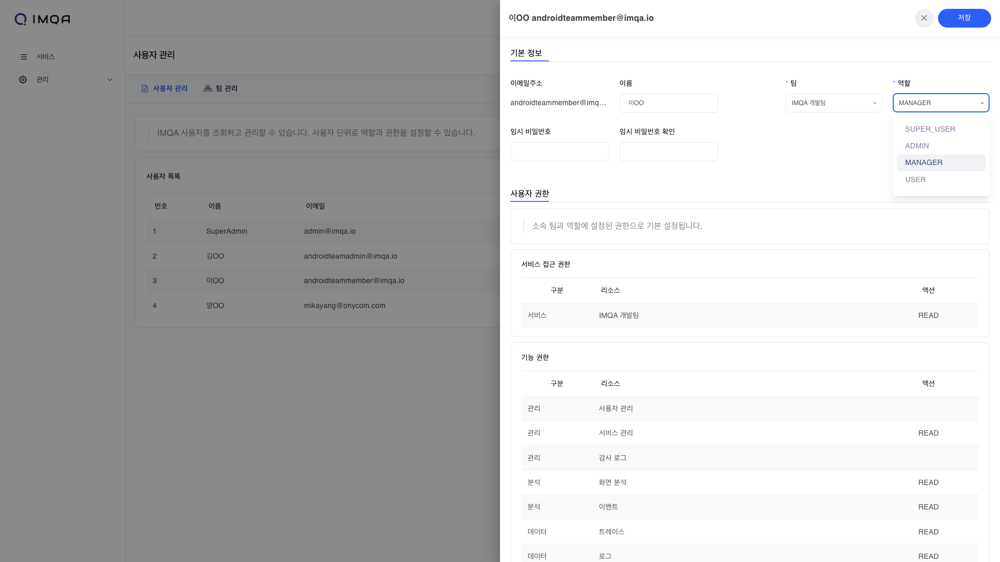

❶ 사용자의 **이름**을 변경할 수 있습니다. **이메일 주소**는 변경이 불가합니다.

❷ 사용자의 **비밀번호**를 변경할 수 있습니다.

❸ 사용자의 **팀**을 설정합니다. 소속 팀에 따라 할당된 서비스 접근 권한을 미리 확인할 수 있습니다.

❹ 사용자의 **역할**을 설정합니다. 역할에 따라 할당된 기능별 권한을 미리 확인할 수 있습니다.

❺ 정보 수정이 완료되면 [저장] 버튼을 클릭합니다.

---

# 서비스 관리

IMQA 서비스 관리를 통해 IMQA에서 분석할 새로운 서비스를 등록하고 관리할 수 있습니다. 서비스 유 사용자별 권한을 소속 팀과 역할에 따라 기본 설정할 수 있습니다.
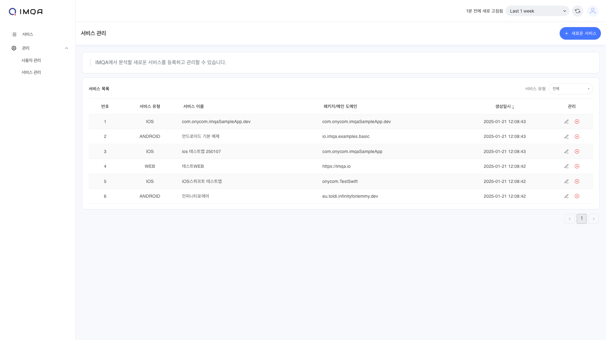

IMQA 서비스 관리는 다음과 같이 구성됩니다.

❶ **툴바(서비스 관리)**

❷ **서비스 목록**

---

## 1. 툴 바

❶ **조회 조건**: 조회하고자 하는 기간을 선택할 수 있습니다. '최근 5분' 부터 '오늘' 등 빠른 버튼을 활용해 기간을 선택할 수 있으며, 'Custom' 으로 시작일시와 종료일시를 설정할 수 있습니다.

❷ **새로고침:** 현재 화면에 표시된 조회 결과 데이터를 새로고침합니다.

❸ **새로운 서비스:** 새 서비스를 등록합니다.

## 2. 서비스 등록

서비스 관리 페이지 오른쪽 상단의 [+ 새로운 서비스] 버튼을 클릭하면 서비스를 추가할 수 있는 팝업이 표시됩니다.

### | Android / iOS

❶ **서비스 이름**과 **패키지 이름**을 입력합니다. 패키지 이름은 `Application ID` 또는 `Bundle ID` 로 입력할 수 있습니다.

❷ 서비스 버전을 입력합니다.

<Gha keyword="TIP" title="서비스 버전">
IMQA에서는 서비스 버전을 구분하여 데이터를 관리할 수 있습니다. 모바일 앱의 릴리즈 버전, 테스트 버전 등 여러 서비스 버전을 기준으로 데이터를 그룹화하고, 집계/분석할 수 있습니다.
</Gha>

❸ 정보 작성이 완료되면 [서비스 등록] 버튼을 클릭합니다.

### | Web

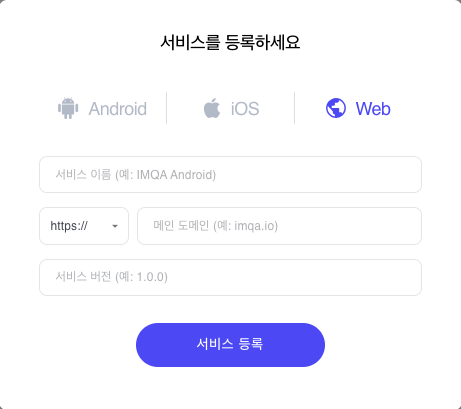

❶ **서비스 이름**과 프로토콜을 선택하고 **메인 도메인**을 입력합니다.

❷ 서비스 버전을 입력합니다.

<Gha keyword="TIP" title="서비스 버전">
IMQA에서는 서비스 버전을 구분하여 데이터를 관리할 수 있습니다. 웹 서비스의 릴리즈 버전, 테스트 버전 등 여러 서비스 버전을 기준으로 데이터를 그룹화하고, 집계/분석할 수 있습니다.
</Gha>

❸ 정보 작성이 완료되면 [서비스 등록] 버튼을 클릭합니다.

## 3. 서비스 목록

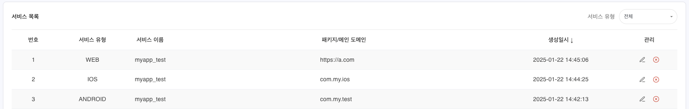

### 필터

- **서비스 유형**: 전체, Android, iOS, Web 유형으로 서비스 목록을 필터링합니다.

### 서비스 목록

현재 등록된 IMQA 서비스를 확인할 수 있습니다. 기본은 최근 생성일시 순으로 정렬 됩니다.

- **관리**: 서비스를 수정하거나 삭제할 수 있습니다.
  - [수정] 아이콘 클릭 시, 해당 **서비스 정보** 팝업이 표시됩니다. 정보 확인 후 [수정]하거나 [삭제]할 수 있습니다.
  - [삭제] 아이콘 클릭 시, 해당 서비스를 삭제할 수 있습니다.

## 4. 서비스 정보

서비스의 기본 정보와 서비스 키, 현재 추가된 서비스 버전을 확인할 수 있습니다. 서비스 정보를 수정하거나 삭제할 수 있습니다.

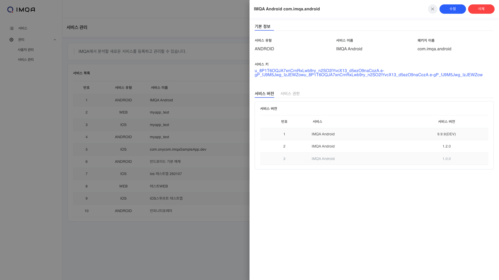

### 툴 바

- [닫기] 아이콘 클릭 및 바깥 영역을 클릭하면 서비스 정보 팝업을 닫습니다.
- [수정] 버튼 클릭 시, 해당 서비스의 정보를 수정할 수 있습니다.
- [삭제] 버튼 클릭 시, 해당 서비스를 삭제할 수 있습니다.

### 기본 정보

- 서비스 등록 시 설정한 서비스 유형, 입력한 서비스 이름, 패키지 이름 및 메인 도메인 정보가 표시됩니다.
- 서비스 등록 시 생성된 서비스 키 정보가 표시됩니다.

### 서비스 버전

해당 서비스에 등록된 서비스 버전을 확인할 수 있습니다. 현재 사용하고 있는 서비스 버전과 사용하지 않는 서비스 버전을 구분할 수 있습니다.

<Gha keyword="TIP" title="서비스 버전 관리">서비스 수정 단계 에서 서비스 버전을 [추가/수정/삭제] 할 수 있습니다.</Gha>

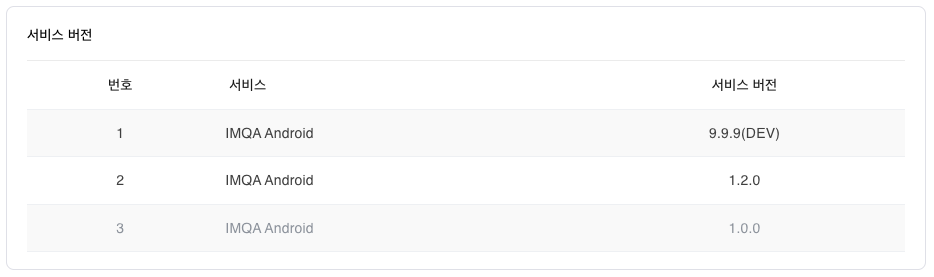

### 서비스 권한

해당 서비스에 접근 권한을 가진 팀을 확인할 수 있습니다. 현재 어떤 팀이 서비스에 접근할 수 있는지를 파악할 수 있습니다. `(기본 팀)`은 모든 서비스의 접근 권한을 가지고 있습니다.

<Gha keyword="TIP" title="서비스 접근 권한 관리">
팀 수정 단계 에서 서비스 접근 권한을 [추가/수정/삭제] 할 수 있습니다.
</Gha>

<Gha keyword="NOTE" title="팀 관리">
팀 관리 기능은 업데이트 예정입니다. 현재 사용자는 기본 '(기본 팀)' 으로 소속되며, 모든 서비스의 접근 권한을 가질 수 있습니다.
</Gha>

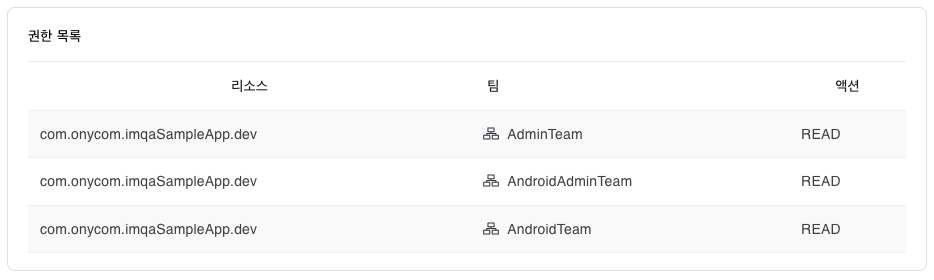

## 5. 서비스 수정

서비스의 기본 정보를 수정하거나 서비스 버전을 관리할 수 있습니다.

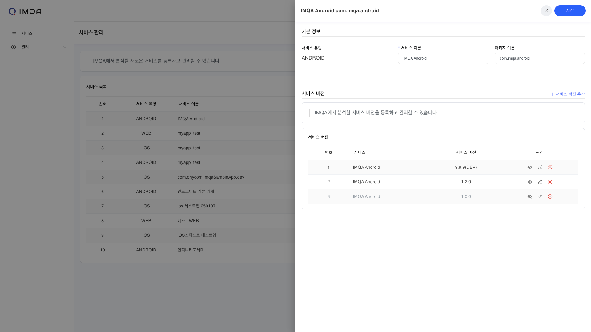

❶ **서비스의 이름**과 **패키지 이름** 또는 **메인 도메인** 정보를 변경할 수 있습니다. **서비스 유형**은 변경이 불가합니다.

❷ 서비스 버전을 추가하거나 수정, 삭제할 수 있습니다.

❸ 정보 수정이 완료되면 [저장] 버튼을 클릭합니다.

### 서비스 버전 관리

서비스 수정 단계에서 IMQA에서 분석할 서비스 버전을 등록하고 관리할 수 있습니다.

❶ [+ 서비스 버전 추가] 버튼을 클릭하면 서비스 버전을 추가할 수 있는 팝업이 표시됩니다.

❷ 등록한 서비스 버전을 수정, 삭제할 수 있습니다.

❸ 등록한 서비스 버전을 숨길 수 있습니다.

<Gha keyword="TIP" title="서비스 버전 보기/숨김 설정">IMQA에서는 등록된 서비스 버전 중 더 이상 관리 하지 않을 버전을 숨길 수 있습니다. 지원이 끝난 서비스 버전 또는 개발 버전 등의 비활성화에 활용할 수 있습니다.</Gha>

<Gha keyword="WARNING" title="서비스 버전 숨김 설정">서비스 버전 숨김 설정에 따른 데이터 수집, 집계, 서비스 목록에서 표시/숨김 기능은 추후 업데이트 예정입니다.</Gha>
