## IMQA 3단계로 시작하기 

1. **IMQA 사용 계정의 로그인 ID**와 **비밀번호**를 입력 후 [로그인] 합니다.

<Gha keyword="TIP" title="IMQA 사용자 로그인">
IMQA는 기본 로그인 ID로 '이메일 주소'를 사용하고, 새로운 IMQA 사용자를 추가하고 관리할 수 있는 **사용자 관리** 기능을 제공합니다. 또한 기업 도입 환경에 따라 **인사정보 및 SSO 연동** 하여 로그인 방식이 다를 수 있습니다. 자세한 내용은 IMQA 담당자에게 문의하세요.
</Gha>

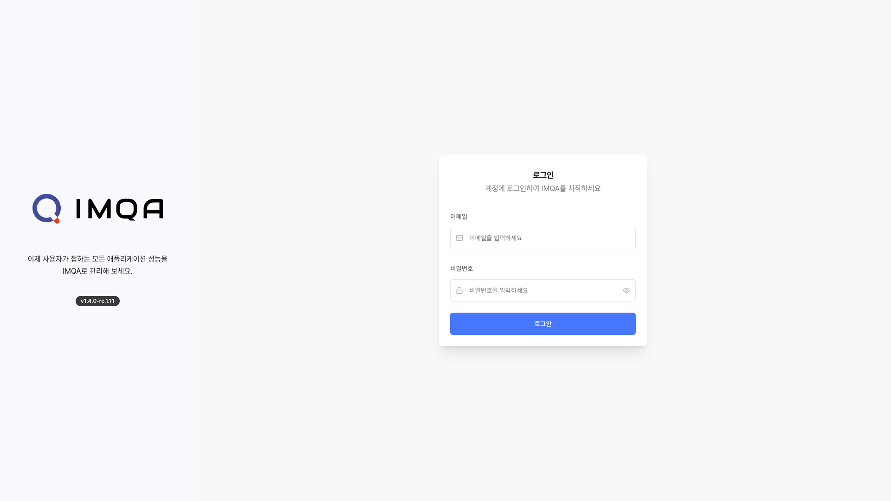

2. **기업 환경에 추가된 서비스 기준으로 통합 대시보드를 확인할 수 있습니다.**

<Gha keyword="TIP" title="통합 대시보드 표시 데이터, 상세 데이터 접근 권한">
IMQA 통합 대시보드는 기업 환경에 추가된 서비스 기준으로 실시간 통합 모니터링 기능을 제공합니다. 통합 대시보드에 표시되는 데이터의 경우 기업 도입 환경에 따라 IMQA 사용자 권한 체계와 별개로 모든 사용자에게 표시 허용될 수 있습니다. 다만 통합 대시보드의 상세 데이터 접근은 IMQA 사용자가 보유한 권한으로 제어됩니다. 자세한 내용은 관리자에게 문의해 주세요.
</Gha>

3. **서비스 접근 권한이 있는 서비스를 기준으로 서비스 대시보드를 확인할 수 있습니다.**

<Gha keyword="TIP" title="사용자 권한">
IMQA에는 앱 접근 권한과 기능 접근 권한으로 구분된 권한 체계가 있습니다. 사용자는 소속 팀과 역할을 기반으로 각 권한을 상속받습니다. 사용자 권한에 대한 자세한 내용은 **IMQA 관리자 가이드 > 사용자 권한**을 참고하시거나, 관리자에게 문의해주세요.
</Gha>

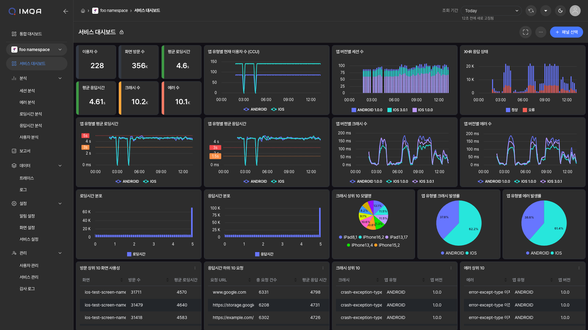

---

## 1. 통합 대시보드
---

IMQA 통합 대시보드에서 최근 5분간 여러 서비스의 성능을 5초 간격으로 새로고침하여 실시간 통합 모니터링할 수 있습니다. 기업 환경의 주요 업무 단위인 서비스를 기준으로 주요 관리 지표와 시계열 성능 현황, 통합 성능 하위 목록을 파악할 수 있으며, 이슈 포인트를 파악하고 각 서비스의 상세 분석 메뉴로 이동할 수 있습니다.

<Gha keyword="TIP" title="통합 대시보드 표시 데이터, 상세 데이터 접근 권한">
IMQA 통합 대시보드는 기업 환경에 추가된 서비스 기준으로 실시간 통합 모니터링 기능을 제공합니다. 통합 대시보드에 표시되는 데이터의 경우 기업 도입 환경에 따라 IMQA 사용자 권한 체계와 별개로 모든 사용자에게 표시 허용될 수 있습니다. 다만 통합 대시보드의 상세 데이터 접근은 IMQA 사용자가 보유한 권한으로 제어됩니다. 자세한 내용은 관리자에게 문의해 주세요.
</Gha>

<Gha keyword="TIP" title="통합 대시보드 임계치 설정">
현재 IMQA 통합 대시보드의 일부 지표는 대시보드 설정 임계치에 따라 색상 표시됩니다. IMQA 권고 임계치로 기본 표시되며, 원하는 **임계치 설정**은 '통합 대시보드 > 툴 바 > 대시보드 설정 수정' 을 참고하세요.
</Gha>

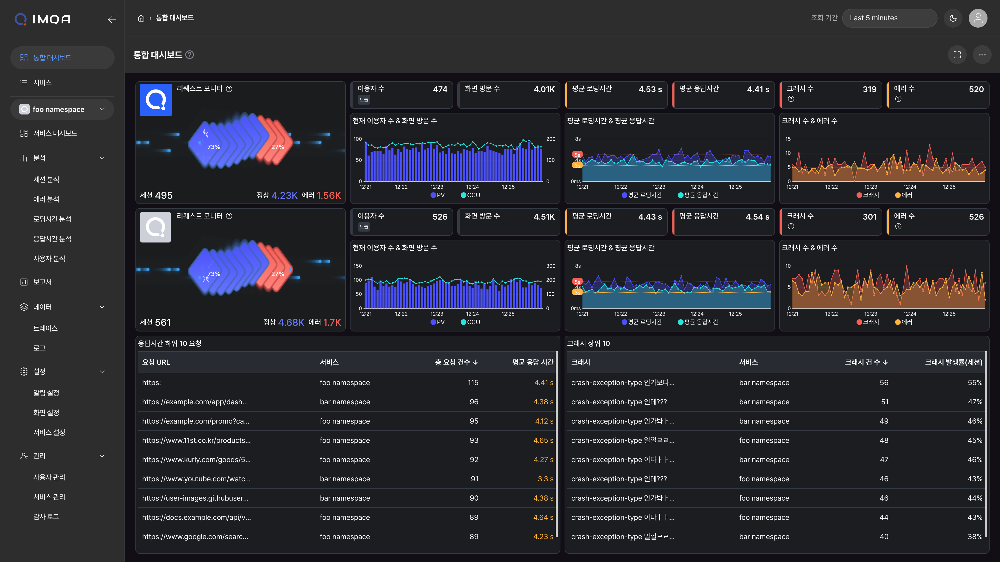

IMQA 통합 대시보드는 다음과 같이 구성됩니다.

❶ **툴바(통합 대시보드)**

❷ **서비스별 리퀘스트 모니터**

❸ **서비스별 주요 관리 지표**

❹ **서비스별 시계열 성능 정보**

❺ **통합 성능 하위 목록**

---

### 툴 바

<Gha keyword="TIP" title="통합 대시보드의 조회 조건">
현재 IMQA 통합 대시보드는 '최근 생성된 서비스 2개' 기준으로, 조회 기간은 '최근 5분' 으로 고정 제공됩니다. 이용자 수 `오늘` 의 경우 '오늘 날짜 00시부터 ~ 현재 시간까지' 로  집계 제공됩니다.
</Gha>

❶ **화면 모드 변경**: 통합 대시보드 화면을 light 모드 또는 dark 모드로 표시할 수 있습니다. 기본 dark 모드로 설정되어 있습니다.

❷ **전체 화면**: 통합 대시보드를 브라우저 전체 화면으로 표시할 수 있습니다. `esc` 키로 전체 화면을 해제합니다.

❸ **대시보드 설정(통합 대시보드)**: 현재 위치한 대시보드에 색상 표시되는 임계치(성능 평가 기준)을 확인할 수 있습니다. 통합 관리자(SUPER_USER) 역할 사용자의 경우, 임계치를 수정할 수 있습니다.

#### 대시보드 설정 정보

현재 위치한 대시보드에 색상 표시되는 임계치(성능 평가 기준)를 확인할 수 있습니다. 

<Gha keyword="TIP" title="통합 대시보드 임계치 설정">
현재 IMQA 통합 대시보드에서는 로딩시간, 응답시간 지표를 하나의 그래프로 제공하고 있습니다. 통합 대시보드에서는 로딩시간, 응답시간 구분없이 1개의 임계치 설정값을 각 지표에 동일하게 사용합니다. 서비스 대시보드, MY 대시보드에서는 로딩시간과 응답시간 지표를 구분하고 있으며, 각 지표별 임계치 설정이 가능합니다.
</Gha>

- [닫기] 아이콘 클릭 및 바깥 영역을 클릭하면 대시보드 설정 팝업을 닫습니다.
- [수정] 버튼 클릭 시, 해당 대시보드의 임계치를 수정할 수 있습니다.

#### 대시보드 설정 수정

통합 관리자(SUPER_USER) 역할 사용자의 경우, 임계치를 수정할 수 있습니다.

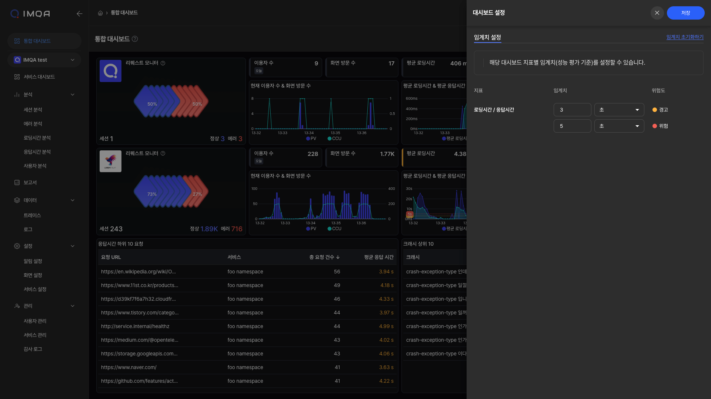

❶ **로딩시간 및 응답시간** 지표의 임계치를 변경할 수 있습니다. 기본 IMQA 권고 임계치로 설정되어 있습니다.

❷ 지표별 경고(노란색), 위험(빨간색) 위험도에 따른 임계치 값과 단위를 설정할 수 있습니다. 

<Gha keyword="TIP" title="임계치(성능 평가 기준)">
임계치 설정의 경우, **위험도별 입력값 이상** 으로 설정됩니다. (예: 5초 이상 경고, 10초 이상 위험)
</Gha>

❸ [임계치 초기화하기] 버튼을 클릭하면 IMQA 권고 임계치로 초기화할 수 있습니다.

| 성능 지표/위험도   | 🟩 정상(초록색) | 🟨 경고(노란색)    | 🟥 위험(빨간색) |
| ----------- | ---------- | ------------- | ---------- |
| 로딩시간 / 응답시간 | 3초 미만      | 3초 이상 5초 미만   | 5초 이상      |

❹ 정보 수정이 완료되면 [저장] 버튼을 클릭합니다. 임계치 설정값은 환경 단위 레벨로 저장/관리 됩니다.

### 서비스별 리퀘스트 모니터

최근 5분간 서비스별 사용자의 HTTP 요청(XHR, Fetch) 데이터 수집량과 각 요청에 대한 정상 응답 여부를 표시합니다. 서비스 대표 이미지 또는 그래프 영역을 클릭하면 각 메뉴로 연계 분석할 수 있습니다.

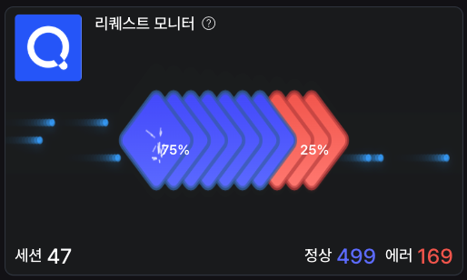

- **서비스 대표 이미지 영역**: 서비스에 설정된 대표 이미지를 표시합니다.

<Gha keyword="TIP" title="서비스 대표 이미지">
IMQA에서는 브랜드의 로고나 앱 서비스 아이콘 등의 이미지로 서비스 대표 이미지를 설정할 수 있습니다. 설정하지 않았을 경우 기본 IMQA 이미지로 표시됩니다. 서비스 대표 이미지 설정에 대한 자세한 내용은 **IMQA 관리자 가이드 > 서비스 관리**를 참고하시거나, 관리자에게 문의해주세요.
</Gha>

- **동적 그래프 영역**
	- **왼쪽 요청 불릿**: 사용자의 HTTP 요청(XHR, Fetch) 데이터를 의미합니다. 현재 설정된 새로고침 간격(기본 5초)마다, 수집량에 비례하여 최대 100개까지 새로 생성합니다. 요청 불릿은 '정상' 색상으로 고정되어 있으며, 모두 동일한 속도로 표시됩니다.
	- **가운데 레이어**: 생성된 각 요청 불릿의 정상 응답 비율을 10개의 레이어로 시각화합니다. 레이어는 '정상' 또는 '에러' 비율에 따라 색상 표시되며, 비율 수치를 각 레이어 영역에 표시합니다.
		- 기본(흰색): (최근 5분간 수집된 기준 데이터 없음)
		- 정상(파란색): 0 제외 400미만 응답 비율
		- 에러(빨간색): 0 또는 400이상 응답 비율
	- **오른쪽 응답 불릿**: 사용자의 HTTP 요청(XHR, Fetch)에 응답한 데이터를 의미합니다. 처리된 응답 불릿은 '정상' 또는 '에러' 여부에 따라 색상 표시 되며, 모두 동일한 속도로 표시됩니다.
		- 정상(파란색): 0 제외 400미만 응답
		- 에러(빨간색): 0 또는 400이상 응답

<Gha keyword="TIP" title="리퀘스트 모니터에서의 에러 기준">
IMQA 리퀘스트 모니터에서는 사용자(프론트엔드)에서 받은 HTTP 응답코드가 `0`(알 수 없는 오류), `4xx`(클라이언트 오류), `5xx`(서버 오류) 와 같이 **문제가 있었던 경우를 '에러'로 집계, 표시**합니다. 응답코드가 `0`인 경우는 CORS 이슈, 방화벽 차단, 네트워크 문제, 요청 취소 등에 의해 서버와 클라이언트 간의 통신 자체가 실패할 때 기본값인`0`이 반환되는 것으로 알려져 있습니다.
</Gha>

- **집계 영역**
	- **세션**: 최근 5분간 해당 서비스의 사용자 세션 수(실행 수)를 카운트합니다. 사용자가 서비스와 상호작용 중인 연결 상태를 비유합니다.   
	- **정상**: 최근 5분간 해당 서비스의 0 제외 400미만 응답 건 수를 카운트합니다.
	- **에러**: 최근 5분간 해당 서비스의 0 또는 400이상 응답 건 수를 카운트합니다.

서비스 대표 이미지를 클릭하면 해당 서비스의 **서비스 대시보드**로 이동할 수 있습니다. 그래프 영역을 클릭하면 **응답시간 분석** 메뉴로 연계 분석할 수 있습니다.

<Gha keyword="NOTE" title="응답시간 분석 가이드">
**응답시간 분석**에 대한 내용은 '분석 > 응답시간 분석' 을 참고하세요.
</Gha>

### 서비스별 주요 관리 지표

최근 5분간 서비스의 상태를 수치로 빠르게 파악할 수 있습니다. 일부 지표의 경우 '오늘' 등의 조회 기간으로 제공되며, 위험도에 따라 색상 표시 됩니다. 지표 패널을 클릭하면 각 메뉴로 연계 분석할 수 있습니다.

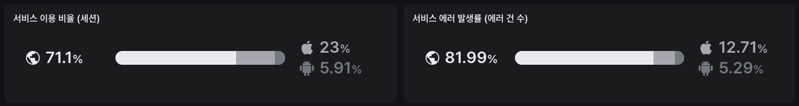

- **이용자 수 `오늘`**: 오늘 날짜 00시부터 ~ 현재 시간까지의 사용자 ID를 카운트합니다. 중복을 제외한 순 사용자를 의미합니다. 
- **화면 방문 수**: 최근 5분간 사용자가 방문한 화면 수를 카운트합니다. 화면 조회 수(PV)를 의미합니다.
- **평균 로딩시간**: 최근 5분간 화면 로딩시간의 평균입니다. 대시보드 설정 임계치(성능 평가 기준)에 따라 색상 표시됩니다.
- **평균 응답시간**: 최근 5분간 응답시간의 평균입니다. 대시보드 설정 임계치(성능 평가 기준)에 따라 색상 표시됩니다.
- **크래시 수**: 최근 5분간 발생한 크래시(앱 비정상 종료 또는 예외) 발생 수를 카운트합니다. 현재 '위험' 색상으로 고정 표시 됩니다.
- **에러 수**: 최근 5분간 발생한 웹 에러 발생 수를 카운트합니다. 현재 '경고' 색상으로 고정 표시 됩니다.

**평균 로딩시간**과 **평균 응답시간** 지표의 경우, 대시보드 설정 임계치(성능 평가 기준)에 따라 색상 표시됩니다. 

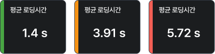

각 주요 관리 지표 패널을 클릭하면 해당 서비스의 메뉴로 연계 분석할 수 있습니다.
- **이용자 수**: 해당 서비스의 '분석 > 세션 분석' 메뉴로 이동할 수 있습니다.
- **화면 방문 수 / 평균 로딩시간**: 해당 서비스의 '분석 > 화면 분석' 메뉴로 이동할 수 있습니다.
- **평균 응답시간**: 해당 서비스의 '분석 > 응답시간 분석' 메뉴로 이동할 수 있습니다.
- **크래시 수 / 에러 수**: 해당 서비스의 '분석 > 에러 분석' 메뉴로 이동할 수 있습니다.

<Gha keyword="NOTE" title="연계 분석 가이드">
**각 분석 메뉴**에 대한 내용은 '분석 > 세션 분석, 화면 분석, 응답시간 분석, 에러 분석' 을 참고하세요.
</Gha>

### 서비스별 시계열 성능 정보

최근 5분간 서비스 상태를 시계열 데이터로 확인하고, 변동 발생 시점을 감지할 수 있습니다. 평균 로딩시간 & 평균 응답시간 지표의 경우, 임계치(성능 평가 기준)가 표시됩니다. 지표 패널을 클릭하면 각 메뉴로 연계 분석할 수 있습니다.

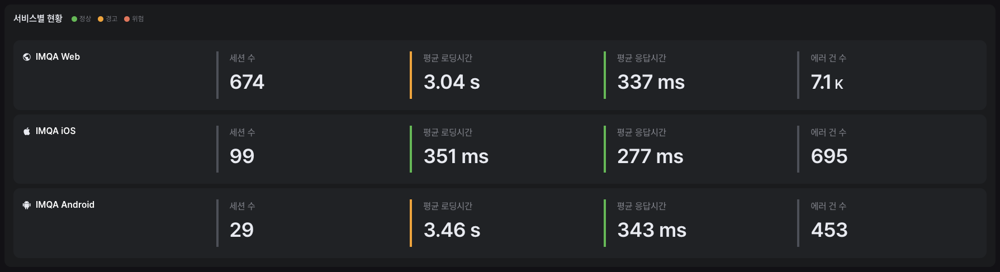

- **현재 이용자 수 & 화면 방문 수**: 사용자 ID와 화면 방문 수를 시간대별 카운트합니다. 현재 활성화 ID 수와 화면 조회 수를 비교할 수 있습니다.
	- 현재 이용자 수(CCU): 사용자 ID를 시간대별 카운트합니다. 중복을 제외한 순 사용자를 의미합니다. 
	- 화면 방문 수(PV): 사용자가 방문한 화면 수를 시간대별 카운트합니다. 
- **평균 로딩시간 & 평균 응답시간**: 화면 로딩시간과 응답시간의 평균을 시간대별 집계합니다. 화면 로딩시간과 응답시간의 연관성을 파악하거나 비교할 수 있습니다. 대시보드 설정 임계치(성능 평가 기준)가 색상 표시됩니다.
	- 평균 로딩시간: 해당 시간대에 수집된 화면 로딩시간 수치의 평균입니다.
	- 평균 응답시간: 해당 시간대에 수집된 응답시간 수치의 평균입니다.
- **크래시 수 & 에러 수**: 크래시(앱 비정상 종료 또는 예외)와 웹 에러 발생 수를 시간대별 카운트합니다. 현재 이용자 수 & 방문 수와의 상관성을 파악하거나 변동 발생 시점을 확인할 수 있습니다.
	- 크래시 수: 해당 시간대에 수집된 크래시를 시간대별 카운트합니다.
	- 에러 수: 해당 시간대에 수집된 웹 에러를 시간대별 카운트합니다.

각 시계열 성능 패널을 클릭하면 해당 서비스의 메뉴로 연계 분석할 수 있습니다.
- **현재 이용자 수 & 화면 방문 수**: 해당 서비스의 '분석 > 화면 분석' 메뉴로 이동할 수 있습니다.
- **평균 로딩시간 & 평균 응답시간**: 해당 서비스의 '분석 > 화면 분석' 메뉴로 이동할 수 있습니다.
- **크래시 수 & 에러 수**: 해당 서비스의 '분석 > 에러 분석' 메뉴로 이동할 수 있습니다.

<Gha keyword="NOTE" title="연계 분석 가이드">
**각 분석 메뉴**에 대한 내용은 '분석 > 화면 분석, 에러 분석' 을 참고하세요.
</Gha>

### 통합 성능 하위 목록
최근 5분간 통합 성능 하위 목록을 통해 우선순위가 높은 서비스 이슈 포인트를 파악할 수 있습니다. 평균 응답시간 지표의 경우, 대시보드 설정 임계치(성능 평가 기준)으로 색상 표시됩니다. 성능 하위 목록에 표시된 항목을 클릭하면 각 분석 메뉴로 연계 분석할 수 있습니다.

#### | 응답시간 하위 10 요청

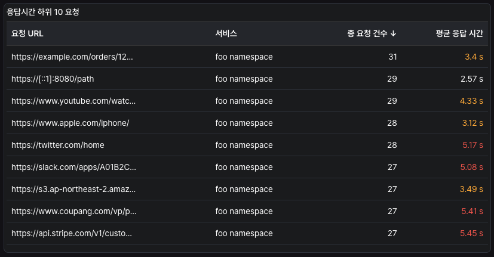

최근 5분간 가장 평균 응답시간이 느린 요청 URL 10개와 요청한 서비스 정보를 표시합니다. 기본은 평균 응답시간 높은 순으로 정렬 됩니다.

- **요청 URL**: 요청된 URL을 표시합니다. `http.url`을 의미합니다.
- **서비스**: 해당 URL을 요청한 서비스 정보를 표시합니다.
- **총 요청 건 수**: 해당 URL을 사용자가 요청한 수를 카운트합니다. URL 호출 수를 의미합니다.
- **평균 응답시간**: 해당 URL의 응답시간 평균입니다. 대시보드 설정 임계치(성능 평가 기준)에 따라 색상 표시됩니다.

응답시간 하위 10 요청 목록에서 특정 항목을 클릭하면 해당 서비스의 **응답시간 분석** 페이지로 이동할 수 있습니다.

<Gha keyword="NOTE" title="응답시간 분석 가이드">
**응답시간 분석**에 대한 내용은 '분석 > 응답시간 분석' 을 참고하세요.
</Gha>

#### | 크래시 상위 10

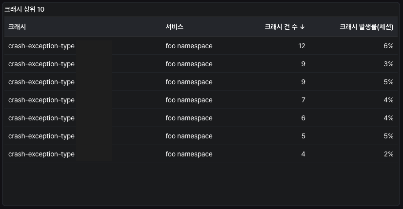

최근 5분간 가장 많이 발생한 크래시 10개와 발생한 서비스 정보를 표시합니다. 기본은 크래시 건 수 높은 순으로 정렬 됩니다.

- **크래시**: 발생한 크래시의 유형 정보를 표시합니다. 동일 크래시 유형으로 집계합니다.
- **서비스**: 해당 크래시가 발생한 서비스 정보를 표시합니다.
- **크래시 건 수**: 해당 크래시가 발생한 수를 카운트합니다.
- **크래시 발생률(세션)**: 전체 사용자 세션(실행) 수 대비 해당 크래시 발생 비율입니다. (예: 전체 100 세션(실행) 중 해당 크래시 발생 수 1건 = 크래시 발생률 1%) 

크래시 상위 10에서 특정 항목을 클릭하면 **에러 상세 (로그 목록)** 페이지로 이동할 수 있습니다.

<Gha keyword="NOTE" title="에러 상세 (로그 목록) 가이드">
**에러 상세 (로그 목록)**에 대한 내용은 '분석 > 에러 분석 > 에러 상세 (로그 목록)' 를 참고하세요.
</Gha>

---

## 2. MY 대시보드
---

IMQA MY 대시보드에서 기업 환경 서비스에서 수집된 다양한 데이터로, 분석 목적에 맞는 나만의 분석 대시보드를 구성할 수 있습니다. 

<Gha keyword="WARNING" title="MY 대시보드">
MY 대시보드 기능은 빠른 시일 내 업데이트 예정입니다.
</Gha>

---

## 3. 서비스
---

IMQA 서비스에서 접근 권한이 있는 서비스와 앱 목록을 확인할 수 있습니다. 기업 환경의 주요 업무 단위인 서비스의 성능과 각 서비스에 속한 애플리케이션의 버전 별 성능을 실시간 또는 원하는 기간으로 파악할 수 있습니다. 서비스는 기업 환경의 주요 업무 단위입니다. 각 애플리케이션의 버전은 데이터를 집계하고 분석하기 위한 관리 단위입니다. 즉, 업무 단위 현황, 각 애플리케이션의 버전별 현황 파악을 한눈에 할 수 있으며, 각 서비스의 대시보드 메뉴로 이동할 수 있습니다.

<Gha keyword="TIP" title="사용자 권한">
IMQA에는 앱 접근 권한과 기능 접근 권한으로 구분된 권한 체계가 있습니다. 사용자가 소속 팀에서 접근 가능한 앱을 아무것도 상속받지 못했을 경우, '서비스' 메뉴가 표시되지 않을 수 있습니다. 사용자 권한에 대한 자세한 내용은 **IMQA 관리자 가이드 > 사용자 권한**을 참고하시거나, 관리자에게 문의해주세요.
</Gha>

<Gha keyword="WARNING" title="서비스">
서비스 기능은 빠른 시일 내 업데이트 예정입니다.
</Gha>

---

## 4. 서비스 대시보드
---

IMQA 서비스 대시보드는 주요 업무 단위인 서비스를 기준으로 주요 관리 지표, 서비스 사용성 지표, 시계열 성능 현황, 성능 하위 목록을 기본 구성으로 제공합니다. 서비스 대시보드를 통해 실시간 또는 원하는 기간으로 서비스의 현황, 앱 유형(OS)별 비교, 성능 하위 목록 등을 통해 이슈 포인트를 파악하는 것이 가능합니다. 서비스 대시보드는 각 서비스(업무)별 목표에 맞게 재구성이 가능합니다. 

<Gha keyword="NOTE" title="서비스 대시보드 기본 구성">

현재 IMQA 서비스 대시보드는 아래의 기본 구성으로 제공됩니다. 

<ul>
  <li>- **주요 관리 지표**: 이용자 수, 화면 방문 수, 평균 로딩시간, 평균 응답시간, 크래시 수, 에러 수</li>
  <li>- **사용성 지표**: 앱 유형별 현재 이용자 수, 앱 버전별 세션 수, XHR 응답 상태</li>
  <li>- **평균 성능 / 분포 / 목록**: 앱 유형별 평균 로딩시간, 앱 유형별 평균 응답시간, ㅇㅇㅇ, ㅇㅇㅇ, 방문 상위 10 화면 사용성, 응답시간 하위 10 요청</li>
  <li>- **크래시&에러 / 패턴 / 목록**: 앱 버전별 크래시 수, 앱 버전별 에러 수, 크래시 상위 10 모델명, 앱 유형별 크래시 발생률, 앱 유형별 에러 발생률, 크래시 상위 10, 에러 상위 10</li>
</ul>
</Gha>

<Gha keyword="TIP" title="서비스 대시보드 임계치 설정">
현재 IMQA 서비스 대시보드의 일부 지표는 대시보드 설정 임계치에 따라 색상 표시됩니다. IMQA 권고 임계치로 기본 표시되며, 원하는 **임계치 설정**은 '서비스 대시보드 > 툴 바 > 대시보드 설정 수정' 을 참고하세요.
</Gha>

IMQA 서비스 대시보드는 다음과 같이 기본 구성됩니다.

❶ **툴바(서비스 대시보드)**

❷ **서비스 주요 관리 지표**

❸ **서비스 사용성 지표**

❹ **평균 성능 / 분포 / 목록**

❺ **크래시&에러 / 환경 / 목록**

---

### 툴 바

❶ **조회 조건**: 조회하고자 하는 기간을 선택할 수 있습니다. '최근 5분' 부터 '오늘' 등 빠른 버튼을 활용해 기간을 선택할 수 있으며, 'Custom' 으로 시작일시와 종료일시를 설정할 수 있습니다.

❷ **새로고침**: 현재 화면에 표시된 조회 결과 데이터를 새로고침합니다.

❸ **새로고침 간격**: 데이터의 새로고침 간격을 설정할 수 있습니다. 기본 '5초'로 설정되어 있으며, '1일' 까지 간격을 선택할 수 있습니다. '자동 새로고침' 을 선택하면 설정한 간격으로 데이터를 새로고침 합니다.

❹ **화면 모드 변경**: 서비스 대시보드 화면을 light 모드 또는 dark 모드로 표시할 수 있습니다. 기본 dark 모드로 설정되어 있습니다.

❺ **전체 화면**: 서비스 대시보드를 브라우저 전체 화면으로 표시할 수 있습니다. `esc` 키로 전체 화면을 해제합니다.

❺ [...] 버튼을 클릭하면 하단에 **기타 대시보드 설정** 메뉴를 표시합니다.

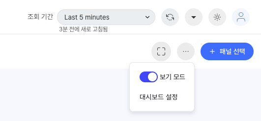

- **보기 모드/편집 모드**: ADMIN 역할 이상 사용자의 경우에만 표시되며, **편집 모드**에서 현재 위치한 대시보드 패널의 위치와 크기를 변경할 수 있습니다. 모든 사용자에게는 기본 보기 모드로 제공됩니다.
- **대시보드 설정(서비스 대시보드)**: 현재 위치한 대시보드에 색상 표시되는 임계치(성능 평가 기준)을 확인할 수 있습니다. 관리자(ADMIN) 역할 이상 사용자의 경우, 임계치를 수정할 수 있습니다.

❻ **패널 선택**: ADMIN 역할 이상 사용자의 경우에만 표시되며, 현재 위치한 대시보드에 표시되는 패널을 ON/OFF할 수 있습니다.

#### 대시보드 설정 정보

현재 위치한 서비스 기준으로 대시보드에 표시되는 지표별 임계치(성능 평가 기준)를 확인할 수 있습니다. ADMIN 역할 이상 사용자의 경우, 지표별 임계치를 수정할 수 있습니다.

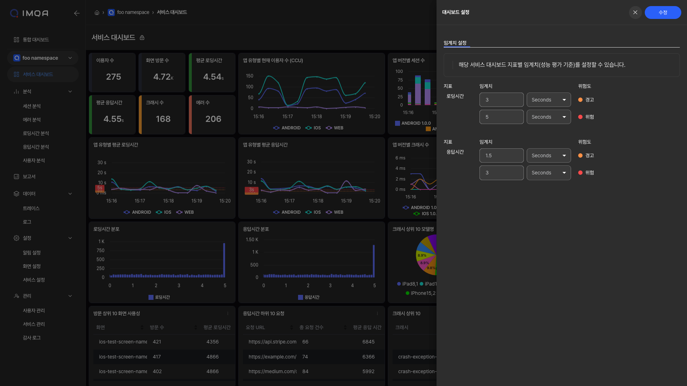

<Gha keyword="NOTE" title="대시보드 설정 수정 접근 권한">
서비스 대시보드 수정 기능은 ADMIN 이상의 권한 사용자에게만 제공됩니다.
</Gha>

- [닫기] 아이콘 클릭 및 바깥 영역을 클릭하면 대시보드 설정 팝업을 닫습니다.
- [수정] 버튼 클릭 시, 해당 서비스의 임계치를 수정할 수 있습니다.

#### 대시보드 설정 수정

ADMIN 역할 사용자의 경우, 현재 위치한 서비스의 지표별 임계치를 수정할 수 있습니다.

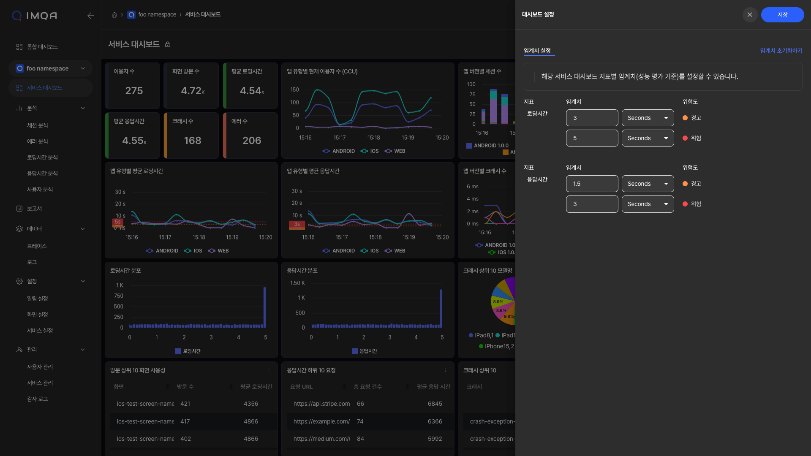

❶ **로딩시간** 지표와 **응답시간** 지표의 임계치를 변경할 수 있습니다.

❷ 지표별 경고(노란색), 위험(빨간색) 위험도에 따른 임계치 값과 단위를 설정할 수 있습니다. 

<Gha keyword="TIP" title="임계치(성능 평가 기준)">
임계치 설정의 경우, **위험도별 입력값 이상** 으로 설정됩니다. (예: 5초 이상 경고, 10초 이상 위험)
</Gha>

❸ [임계치 초기화하기] 버튼을 클릭하면 IMQA 권고 임계치로 초기화할 수 있습니다.

| 성능 지표/위험도 | 🟩 정상(초록색) | 🟨 경고(노란색)    | 🟥 위험(빨간색) |
| --------- | ---------- | ------------- | ---------- |
| 로딩시간      | 3초 미만      | 3초 이상 5초 미만   | 5초 이상      |
| 응답시간      | 1.5초 미만    | 1.5초 이상 3초 미만 | 3초 이상      |

❹ 정보 수정이 완료되면 [저장] 버튼을 클릭합니다. 임계치 설정값은 해당 서비스 단위 레벨로 저장/관리 됩니다.

#### 패널 선택

ADMIN 역할 사용자의 경우, 업무별 목표에 맞게 서비스 대시보드 패널을 표시 ON/OFF 할 수 있습니다. 툴바 오른쪽 상단의 [+ 패널 선택] 버튼을 클릭하면 대시보드 패널을 선택할 수 있는 팝업이 표시됩니다.

<Gha keyword="WARNING" title="대시보드 패널 선택시 주의사항">
안정적인 IMQA 서비스 운영을 위해 하나의 대시보드에 배치할 패널은 **20개 내외로 선택**하는 것을 권고합니다. 데이터 수집량에 따라 다수의 대시보드 패널을 배치한 후 데이터 조회 시 성능 저하가 있을 수 있습니다.
</Gha>

<Gha keyword="NOTE" title="대시보드 패널 목록">
현재 서비스 대시보드에서 선택 가능한 패널 목록은 **기본 구성에 한정**하여 제공되고 있습니다. 빠른 시일 내 다양한 패널이 업데이트 될 예정입니다.
</Gha>

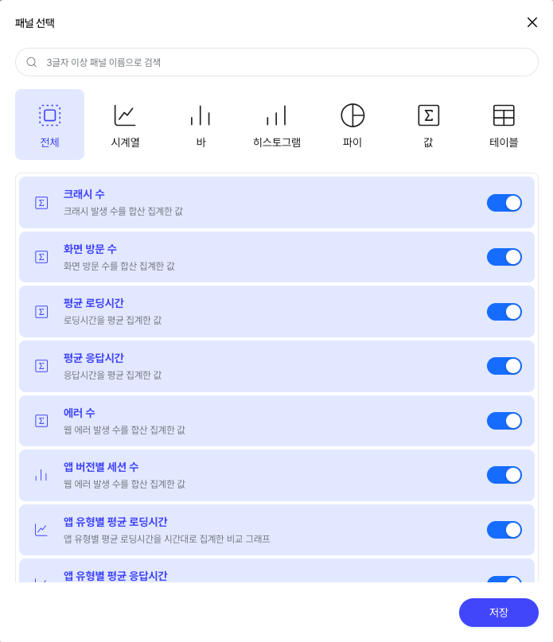

❶ 현재 위치한 서비스 대시보드에 선택되어 있는 패널과 선택 가능한 패널 목록이 표시됩니다.

❷ 상단 시각화 유형 탭을 선택해서 특정 시각화 유형으로 필터링할 수 있습니다.

<Gha keyword="TIP" title="대시보드 패널 시각화 유형">
현재 IMQA는 네이티브와 웹 영역에서 수집한 다양한 데이터를 기반으로 가장 효과적으로 분석할 수 있는 시각화 유형으로 패널을 구성하여 제공하고 있습니다. 동일한 지표가 여러 시각화 유형으로 제공될 수 있으며, 특정 시각화 유형으로만 제공될 수 있습니다.
</Gha>

❸ 조회하고자 하는 특정 지표가 있을 경우 패널 이름에 포함된 3글자 이상의 검색어를 입력합니다.

❹ 원하는 패널 선택이 완료되면 [저장] 버튼을 클릭합니다. 대시보드 패널 설정값은 해당 서비스 단위 레벨로 저장/관리 됩니다.

선택한 패널은 패널별 기본 크기로 하단 빈 공간에 자동 배치됩니다. 툴바 > [...] 버튼 > **편집 모드**에서 대시보드에 배치된 패널을 원하는 위치로 이동하거나 크기를 조정할 수 있습니다. 

### 서비스 주요 관리 지표

조회 기간 동안의 서비스의 상태를 수치로 빠르게 파악할 수 있습니다. 일부 지표의 경우 위험도에 따라 색상 표시 됩니다. 

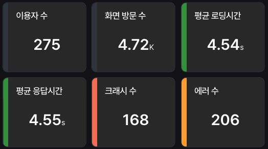

- **이용자 수**: 조회 기간 동안 사용자 ID를 카운트합니다. 중복을 제외한 순 사용자를 의미합니다. 
- **화면 방문 수**: 조회 기간 동안 사용자가 방문한 화면 수를 카운트합니다. 화면 조회 수(PV)를 의미합니다.
- **평균 로딩시간**: 조회 기간 동안 화면 로딩시간의 평균입니다. 대시보드 설정 임계치(성능 평가 기준)에 따라 색상 표시됩니다.
- **평균 응답시간**: 조회 기간 동안 응답시간의 평균입니다. 대시보드 설정 임계치(성능 평가 기준)에 따라 색상 표시됩니다.
- **크래시 수**: 조회 기간 동안 발생한 크래시(앱 비정상 종료 또는 예외) 발생 수를 카운트합니다. '위험' 색상으로 고정 표시 됩니다.
- **에러 수**: 조회 기간 동안 발생한 웹 에러 발생 수를 카운트합니다. '경고' 색상으로 고정 표시 됩니다.

**평균 로딩시간**과 **평균 응답시간** 지표의 경우, 대시보드 설정 임계치(성능 평가 기준)에 따라 색상 표시됩니다. 

### 서비스 사용성 지표 

조회 기간 동안의 서비스의 사용성을 시계열 데이터로 확인하고, 변동 발생 시점을 감지할 수 있습니다. 평균 로딩시간 & 평균 응답시간 지표의 경우, 임계치(성능 평가 기준)가 표시됩니다. 

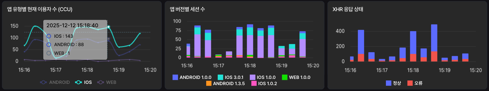

- **앱 유형별 현재 이용자 수 (CCU)**: 앱 유형별 이용자 수(사용자 ID)를 시간대로 집계한 비교 그래프입니다. 같은 시간대에 어떤 앱 유형(OS) 이용자가 많은지 확인 가능합니다.  
- **앱 버전별 세션 수**: 앱 버전별 세션 수(실행 수)를 시간대로 집계한 비교 그래프입니다. 앱 유형과 앱 버전을 함께 표시하며, 같은 시간대에 어떤 앱 버전 실행이 많은지 확인 가능합니다.
- **XHR / Fetch 응답 상태**: HTTP 요청(XHR, Fetch)별 정상 응답 여부를 시간대로 집계한 그래프입니다. '정상' 또는 '에러' 로 집계됩니다.
	- 정상(파란색): 0 제외 400미만 응답
	- 에러(빨간색): 0 또는 400이상 응답

<Gha keyword="TIP" title="응답 상태의 에러 기준">
응답 상태 지표에서는 사용자(프론트엔드)에서 받은 HTTP 응답코드가 `0`(알 수 없는 오류), `4xx`(클라이언트 오류), `5xx`(서버 오류) 와 같이 **문제가 있었던 경우를 '에러'로 집계, 표시**합니다. 응답코드가 `0`인 경우는 CORS 이슈, 방화벽 차단, 네트워크 문제, 요청 취소 등에 의해 서버와 클라이언트 간의 통신 자체가 실패할 때 기본값인`0`이 반환되는 것으로 알려져 있습니다.
</Gha>

### 평균 성능 / 분포 / 목록

조회 기간 동안의 서비스의 성능을 다각도로 확인하고, 변동 발생 시점과 이슈 포인트를 함께 파악할 수 있습니다. 평균 로딩시간과 평균 응답시간 지표의 경우, 임계치(성능 평가 기준)로 색상 표시됩니다.

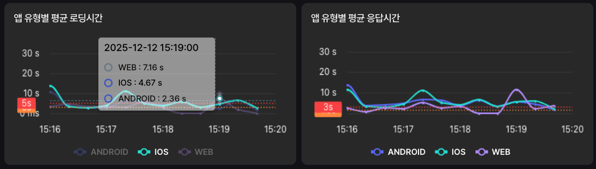

- **앱 유형별 평균 로딩시간**: 앱 유형별 평균 로딩시간을 시간대로 집계한 비교 그래프입니다. 대시보드 설정 임계치(성능 평가 기준)가 표시됩니다.
- **앱 유형별 평균 응답시간**: 앱 유형별 평균 응답시간을 시간대로 집계한 비교 그래프입니다. 대시보드 설정 임계치(성능 평가 기준)가 표시됩니다.

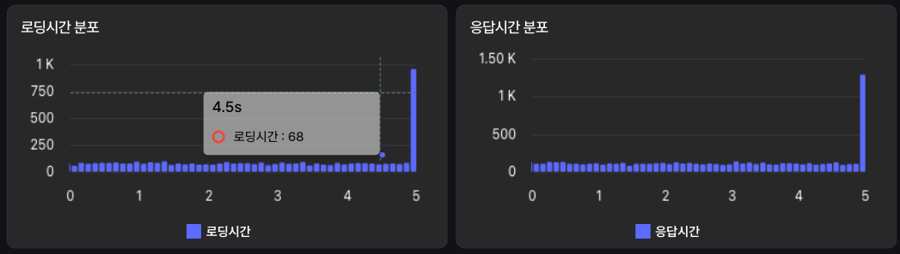
- **로딩시간 분포**: 조회 기간 내 수집된 로딩시간 수치를 구간별로 집계한 분포 그래프입니다. 0초 이상~5초 미만의 계급과, 5초 이상 계급으로 표시됩니다.
- **응답시간 분포**: 조회 기간 내 수집된 응답시간 수치를 구간별로 집계한 분포 그래프입니다. 0초 이상~5초 미만의 계급과, 5초 이상 계급으로 표시됩니다.

<Gha keyword="TIP" title="성능 분포 그래프">
분포 그래프(히스토그램)은 계급을 가로축에, 도수를 세로축에 나타낸 뒤, 집계된 데이터를 여러 구간을 정해 계급을 만들고, 각 계급에 속하는 데이터 수로 도수를 표시합니다. 히스토그램은 전체 집단의 분포 상태를 파악하거나 비교할 때 유용합니다. 목표 수치 구간에 대부분의 데이터가 분포되어 있다면 서비스 사용이 원활하다고 판단할 수 있으며, 넓게 분포되어 있다면 서비스가 여러 상황에 최적화되어 있지 않음을 의미합니다. 서비스의 목표 성능을 설정하기 위한 개선 지표로 활용해보세요.
</Gha>

#### | 방문 상위 10 화면 사용성

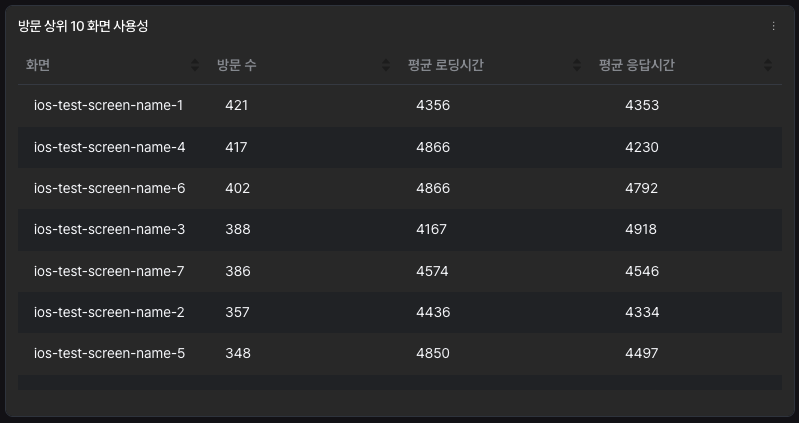

조회 기간동안 가장 방문이 많은 화면 10개와 평균 성능을 표시합니다. 기본은 방문 수 높은 순으로 정렬 됩니다.

- **화면**: 해당 화면의 고유 화면 이름을 표시합니다.
- **방문 수**: 해당 화면을 사용자가 요청한 수를 카운트합니다.
- **평균 로딩시간**: 해당 화면의 로딩시간 평균입니다. 대시보드 설정 임계치(성능 평가 기준)에 따라 색상 표시됩니다.
- **평균 응답시간**: 해당 화면의 응답시간 평균입니다. 대시보드 설정 임계치(성능 평가 기준)에 따라 색상 표시됩니다.

#### | 응답시간 하위 10 요청

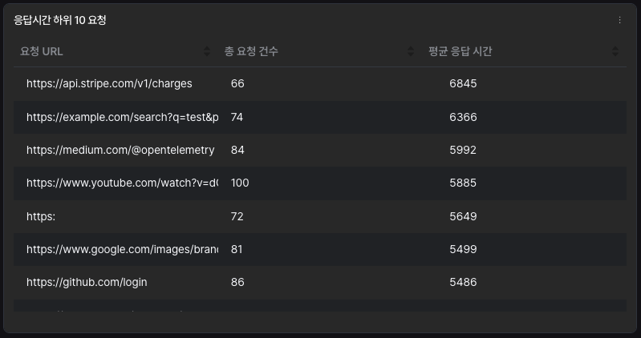

조회 기간동안 가장 평균 응답시간이 느린 요청 URL 10개와 요청 건 수를 표시합니다. 기본은 평균 응답시간 높은 순으로 정렬 됩니다.

- **요청 URL**: 요청된 URL을 표시합니다. `http.url`을 의미합니다.
- **총 요청 건 수**: 해당 URL을 사용자가 요청한 수를 카운트합니다. URL 호출 수를 의미합니다.
- **평균 응답시간**: 해당 URL의 응답시간 평균입니다. 대시보드 설정 임계치(성능 평가 기준)에 따라 색상 표시됩니다.

### 크래시&에러 / 환경 / 목록

조회 기간 동안의 서비스에서 발생한 문제를 다각도로 확인하고, 이슈 발생 시점과 발생 패턴, 이슈 포인트를 함께 파악할 수 있습니다. 

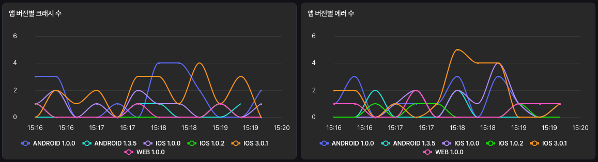

- **앱 버전별 크래시 수**: 앱 버전별 크래시(앱 비정상 종료 또는 예외) 발생 수를 시간대로 집계한 비교 그래프입니다. 앱 유형과 앱 버전을 함께 표시합니다.
- **앱 버전별 에러 수**: 앱 버전별 웹 에러 발생 수를 시간대로 집계한 비교 그래프입니다. 앱 유형과 앱 버전을 함께 표시합니다.

조회 기간 동안의 문제 발생 상황에서 **앱 유형(OS) 또는 사용자 환경에 특이사항**이 있는지 파악할 수 있습니다.

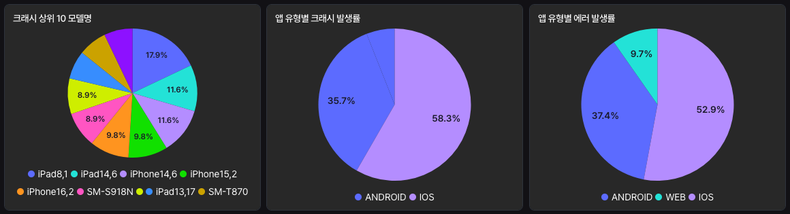

- **크래시 상위 10 모델명**: 크래시가 가장 많이 발생한 10개 디바이스 모델명을 대상으로, 상대 비율로 표시한 그래프입니다. 크래시가 많이 발생하는 특정 디바이스 모델명을 확인할 수 있습니다. 
- **앱 유형별 크래시 발생률**: 앱 유형별 크래시 수를 비율로 표시한 그래프입니다.
- **앱 유형별 에러 발생률**: 앱 유형별 에러 수를 비율로 표시한 그래프입니다.

#### | 크래시 상위 10

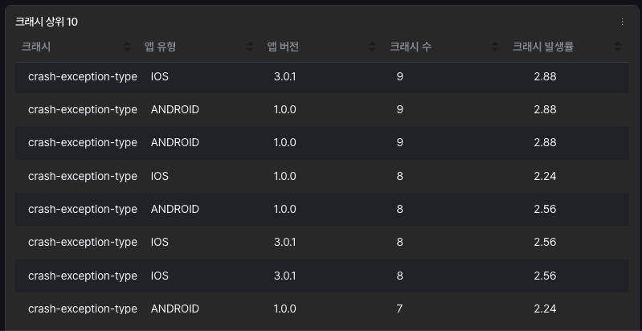

조회 기간동안 가장 많이 발생한 크래시 10개와 발생한 앱 버전 정보를 표시합니다. 기본은 크래시 수 높은 순으로 정렬 됩니다.

- **크래시**: 발생한 크래시의 예외 유형 정보를 표시합니다. 동일 크래시 유형으로 집계합니다.
- **앱 유형**: 해당 크래시가 발생한 앱 유형 정보를 표시합니다. Android, iOS 유형으로 구분됩니다.
- **앱 버전**: 해당 크래시가 발생한 앱 버전 정보를 표시합니다. 
- **크래시 수**: 해당 크래시가 발생한 수를 카운트합니다.
- **크래시 발생률(세션)**: 전체 사용자 세션(실행) 수 대비 해당 크래시 발생 비율입니다. (예: 전체 100 세션(실행) 중 해당 크래시 발생 수 1건 = 크래시 발생률 1%) 

#### | 에러 상위 10

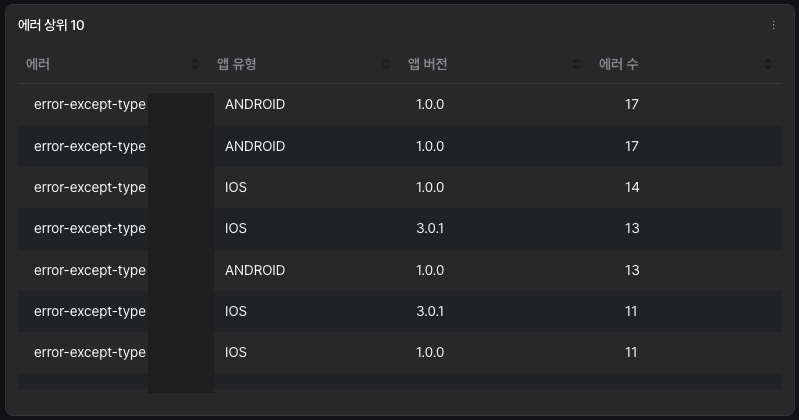

조회 기간동안 가장 많이 발생한 웹 에러 10개와 발생한 버전 정보를 표시합니다. 기본은 에러 수 높은 순으로 정렬 됩니다.

- **에러**: 발생한 에러 유형 정보를 표시합니다. 동일 에러 유형으로 집계합니다.
- **앱 유형**: 해당 에러가 발생한 앱 유형 정보를 표시합니다. Android, iOS 유형으로 구분됩니다.
- **앱 버전**: 해당 에러가 발생한 앱 버전 정보를 표시합니다. 
- **웹 버전**: 해당 에러가 발생한 웹 버전 정보를 표시합니다. WebAgent에서 설정한 모바일 앱 내 웹 버전 구분 정보가 수집되었을 경우 추가 표시됩니다.
- **에러 수**: 해당 에러가 발생한 수를 카운트합니다.

---

## 5. 분석
---

## 5-1. 세션 분석

IMQA 세션 분석은 사용자의 앱 실행 시작 시점부터 종료 시점까지의 흐름을 추적할 수 있는 다양한 지표 구성을 제공합니다. 하나의 세션은 여러 개의 트레이스로 구성되며, 트레이스는 앱 내에서 발생한 특정 액션을 나타내는 단위입니다. 화면 로딩, 앱 상태(Foreground, Background), 네트워크 요청/응답, 사용자 이벤트, 로그, 에러 등 다양한 유형을 제공합니다.

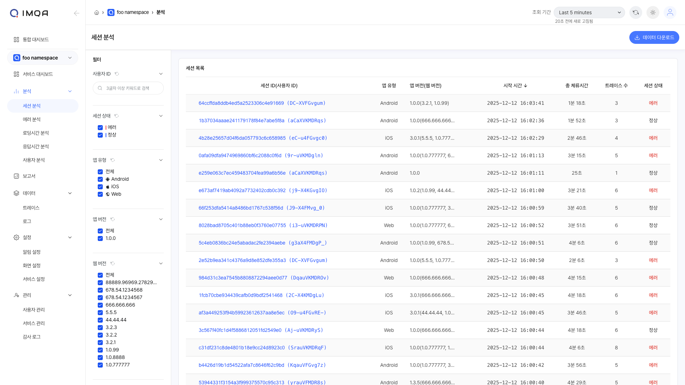

IMQA 세션 분석은 다음과 같이 구성됩니다.

❶ **툴바(세션 분석)**

❷ **필터**

❸ **세션 목록**

---

### 툴 바

❶ **조회 조건**: 조회하고자 하는 기간을 선택할 수 있습니다. '최근 5분' 부터 '오늘' 등 빠른 버튼을 활용해 기간을 선택할 수 있으며, 'Custom' 으로 시작일시와 종료일시를 설정할 수 있습니다.

❷ **새로고침**: 현재 화면에 표시된 조회 결과 데이터를 새로고침합니다.

❸ **데이터 다운로드**: 조회 결과를 `.csv`로 다운로드할 수 있습니다. 세션 목록은 한 번에 최대 100만건까지 다운로드할 수 있습니다.

### 필터

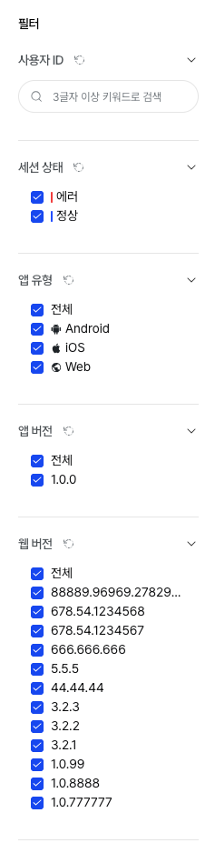

❶ 원하는 사용자 ID 정보로 세션을 조회할 수 있습니다. 조회하고자 하는 특정 사용자가 있을 경우 사용자 ID에 포함된 3글자 이상의 검색어를 입력합니다.

<Gha keyword="TIP" title="사용자 ID 설정">
IMQA는 SDK, WebAgent를 통한 데이터 수집시 특정 사용자를 식별하기 위한 **사용자 ID** 정보를 설정할 수 있습니다. **사용자 ID 정보 설정**은 'SDK Agent 설치 가이드 > Custom User ID 설정' 을 참고하세요.
</Gha>

❷ 세션 상태 필터를 통해 문제가 발생한 세션만 조회할 수 있습니다. 기본 '전체'로 설정되어 있습니다.

- **에러**: 해당 세션에 에러 트레이스(Crash, ANR, Error 등)가 1건 이상
- **정상**: 그 외

❸ 그 외 다양한 필터를 설정할 수 있습니다.

❹ [적용]을 클릭하면 선택한 필터 기준으로 데이터가 조회됩니다.

### 세션 목록

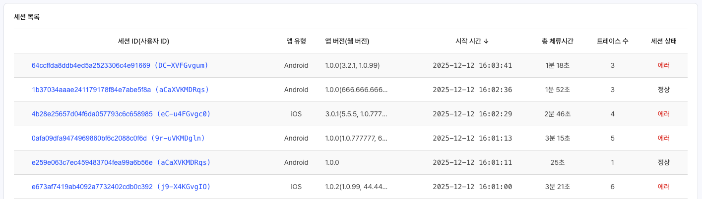

서비스를 이용했던 사용자의 행동 흐름을 확인할 수 있습니다. 수집된 사용자 식별 정보, 앱 시작 시간, 총 체류 시간, 서비스 내에서 발생한 특정 액션 수, 세션 상태 등을 표시합니다. 이를 통해 이슈가 있었던 사용자의 행동 흐름을 빠르게 파악 가능하며, '세션 상세'로 이동하여 분석할 수 있습니다. 기본은 최근 시작 순으로 정렬 됩니다. 페이지 당 표시 항목을 50건(기본값)/100건/200건 으로 설정할 수 있습니다.

- **세션 ID(사용자 ID)**: IMQA가 특정 세션을 식별하기 위해 부여한 고유 키를 표시합니다. SDK, WebAgent에서 설정한 사용자의 ID 정보가 수집되었을 경우 추가 표시합니다.
- **앱 유형**: 해당 세션이 수집된 앱 유형 정보를 표시합니다. Android, iOS, Web 유형으로 구분됩니다.
- **앱 버전(웹 버전)**: 해당 세션이 수집된 앱 버전 정보를 표시합니다. 하나의 세션에서 WebAgent에서 설정한 모바일 앱 내 웹 버전 구분 정보가 수집되었을 경우 추가 표시합니다.
- **시작 시간**: 해당 세션의 시작 시간을 표시합니다.
- **총 체류시간**: 해당 세션의 시작 시간부터 마지막 액션까지를 체류 시간으로 표시합니다.
- **트레이스 수**: 해당 세션에서 발생한 액션 수를 카운트합니다.
- **세션 상태**: 해당 세션의 문제 발생 여부를 표시합니다.
  - 에러: 해당 세션에 에러 상태 트레이스(Crash, ANR, Error 등)가 1건 이상
  - 정상: 그 외

<Gha keyword="NOTE" title="하나의 세션에 두 개 이상의 사용자 ID, 웹 버전 정보가 표시되는 경우">
예외적으로, 하나의 세션에 '사용자 ID'와 '웹 버전'이두 개 이상의 정보로 표시될 수 있습니다. 
IMQA SDK에서 설정한 사용자 ID와 WebAgent에서 설정한 사용자 ID가 다르게 수집되었을 경우, 사용자의 연속적인 앱 이용 중, 웹 버전 릴리즈 등에 의해 WebAgent에서 설정한 웹 버전이다르게 수집되었을 경우 등이 있습니다.
</Gha>

**세션 ID** 컬럼에 마우스를 올리면 [복사] 버튼이 표시되며, [복사] 버튼 클릭 시 클립보드에 복사됩니다. 데이터 조회 키워드로 활용할 수 있습니다.

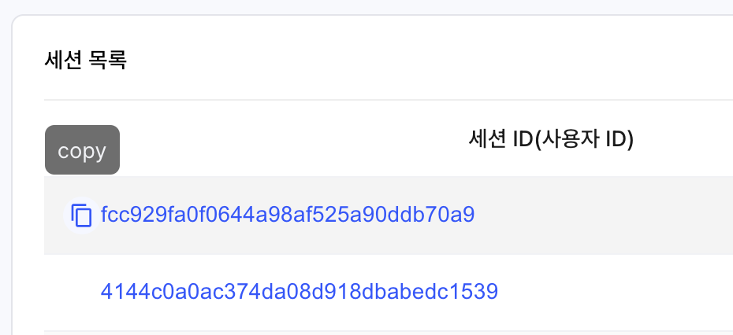

세션 목록에서 특정 세션을 클릭하면 **세션 상세 (트레이스 목록)** 페이지로 이동할 수 있습니다.

### 세션 상세 (트레이스 목록)

특정 세션을 기준으로, 해당 사용자의 접속 환경 정보와 앱 실행 시작 시점부터 종료 시점까지 발생한 여러 액션을 트레이스 목록으로 확인할 수 있습니다. 세션 타임라인에서는 해당 사용자의 앱 이용 중 각 액션의 발생 시점, 문제 및 병목 구간 등을 한눈에 확인할 수 있습니다. 

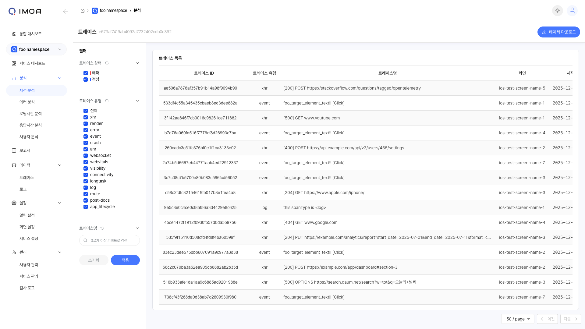

#### 필터

❶ 트레이스 상태 필터를 통해 문제가 발생한 트레이스만 조회할 수 있습니다. 기본 '전체'로 설정되어 있습니다.

- **에러**: Crash, ANR, Error 등
- **정상**: 그 외

❷ 트레이스 유형 필터를 통해 원하는 트레이스 유형만 조회할 수 있습니다. 기본 '전체'로 설정되어 있습니다.

- **xhr** `Android` `iOS` `Web` 네트워크 요청 응답시간
- **fetch** `Web` 브라우저 API
- **render** `Android` `iOS` `Web`: 화면 로딩시간 
- **error** `Web`: 웹 에러
- **event** `Android` `iOS` `Web`: 사용자 이벤트 (클릭, 마우스업 등)
- **log** `Android` `iOS` `Web`: 로그 레벨 기준으로 로깅 (커스텀 로그 포함)
- **crash** `Android` `iOS`: 앱 비정상 종료 또는 예외
- **anr** `Android`: 특정 시간동안 앱 응답 없음 
- **websocket** `Web`: 웹 소켓 통신
- **webvitals** `Web`: 웹 성능 지표 (Google Web Vitals)
- **visibility** `Web`: 브라우저 탭 활성화 여부
- **connectivity** `Web`: 네트워크 상태
- **longtask** `Web`: 성능 저하 작업
- **route** `Web`: 라우트 이동 정보
- **post-docs** `Web`: 컴포넌트 갱신 정보
- **app_lifecycle** `Android` `iOS`: 앱 실행 상태 (background/foreground)

❸ 원하는 트레이스 이름을 조회할 수 있습니다. 조회하고자 하는 특정 정보가 있을 경우 트레이스 이름에 포함된 3글자 이상의 검색어를 입력합니다.

❹ [적용]을 클릭하면 선택한 필터 기준으로 데이터가 조회됩니다.

#### 트레이스 목록

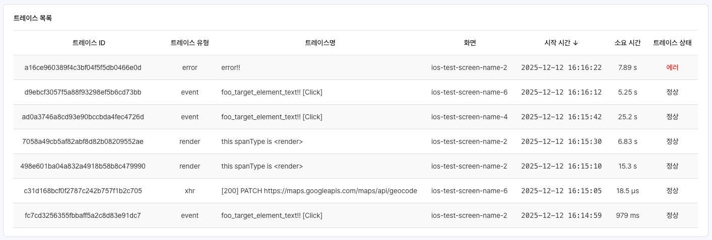

선택한 세션에서 발생한 여러 액션을 트레이스로 확인할 수 있습니다. 트레이스 유형, 트레이스 이름, 액션이 발생한 화면, 액션 시작 시간, 액션이 수행된 시간, 상태를 표시합니다. 이를 통해 사용자의 서비스 이용 중 어떤 일들이 있었는지를 한눈에 확인할 수 있습니다. 기본은 최근 트레이스 순으로 정렬 됩니다. 페이지 당 표시 항목을 50건(기본값)/100건/200건 으로 설정할 수 있습니다.

- **트레이스 ID**: IMQA가 특정 액션을 식별하기 위해 부여한 고유 키를 표시합니다.
- **트레이스 유형**: 해당 트레이스의 유형을 표시합니다.
- **트레이스 명**: 해당 트레이스를 대표하는 정보를 표시합니다.
- **화면**: 해당 트레이스가 발생한 화면을 표시합니다.
- **시작 시간**: 해당 트레이스가 시작된 시간을 표시합니다.
- **소요 시간**: 해당 트레이스가 수행된 시간을 표시합니다.
- **트레이스 상태**: 해당 트레이스의 문제 발생 여부를 표시합니다.
  - 에러: Crash, ANR, Error 등
  - 정상: 그 외

**트레이스 ID** 컬럼에 마우스를 올리면 [복사] 버튼이 표시되며, [복사] 버튼 클릭 시 클립보드에 복사됩니다. 데이터 조회 키워드로 활용할 수 있습니다.

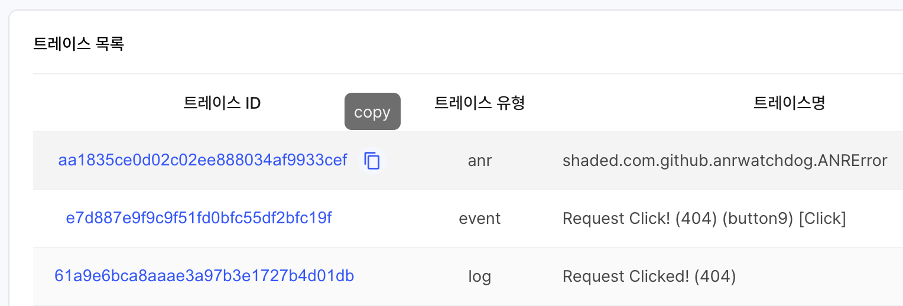

트레이스 목록에서 특정 트레이스를 클릭하면 **트레이스 상세** 페이지로 이동할 수 있습니다.

<Gha keyword="NOTE" title="트레이스 상세 가이드">
**트레이스 상세**에 대한 내용은 '데이터 > 트레이스 > 트레이스 상세' 를 참고하세요.
</Gha>

---

## 5-2. 에러 분석

IMQA 에러 분석은 기간 내 서비스에서 발생한 크래시, ANR, 웹 에러 등의 문제를 통합적 관점에서 확인할 수 있습니다. 하나의 항목은 동일한 예외 유형, 메시지일 경우 같은 항목으로 그룹핑 됩니다. 해당 에러가 발생한 버전, 건 수와 발생한 사용자 세션 수를 확인하여 서비스 영향도를 파악할 수 있습니다. Crash, ANR, Error, XHR 유형을 제공하며, 특정 에러를 기준으로 로그 분석 화면과 연결됩니다.

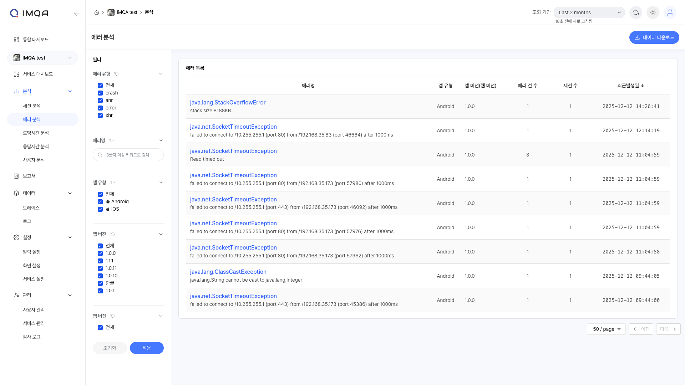

IMQA 에러 분석은 다음과 같이 구성됩니다.

❶ **툴바(에러 분석)**

❷ **필터**

❸ **에러 목록**

---

### 툴 바

❶ **조회 조건**: 조회하고자 하는 기간을 선택할 수 있습니다. '최근 5분' 부터 '오늘' 등 빠른 버튼을 활용해 기간을 선택할 수 있으며, 'Custom' 으로 시작일시와 종료일시를 설정할 수 있습니다.

❷ **새로고침**: 현재 화면에 표시된 조회 결과 데이터를 새로고침합니다.

❸ **데이터 다운로드**: 현재 화면에 표시된 조회 결과를 `.csv`로 다운로드할 수 있습니다. 에러 목록은 한 번에 최대 100만건까지 다운로드할 수 있습니다.

### 필터

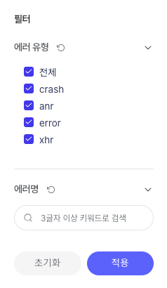

❶ 에러 유형 필터를 통해 원하는 에러 유형만 조회할 수 있습니다. 기본 '전체'로 설정되어 있습니다.
- **crash** `Android` `iOS`
- **anr** `Android`
- **error** `Web`
- **xhr** `iOS`

❷ 원하는 예외 유형을 조회할 수 있습니다. 조회하고자 하는 특정 예외 정보가 있을 경우 에러명에 포함된 3글자 이상의 검색어를 입력합니다.

❸ 그 외 다양한 필터를 설정할 수 있습니다.

❹ [적용]을 클릭하면 선택한 필터 기준으로 데이터가 조회됩니다.

### 에러 목록

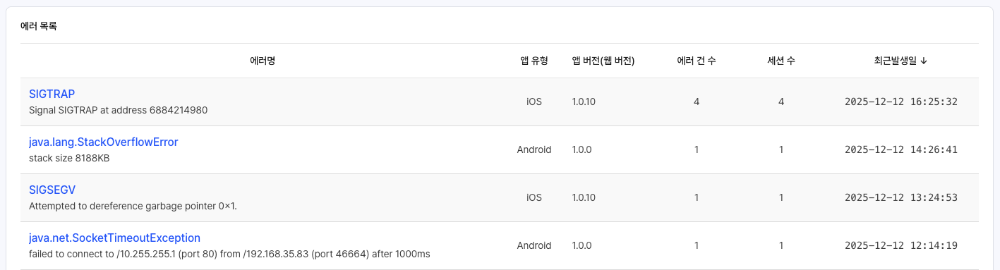

서비스에서 발생한 에러를 확인할 수 있습니다. 에러명(예외 유형, 메시지), 에러 건 수, 세션 수, 최근발생일 등을 표시합니다. 이를 통해 서비스 영향도가 높은 에러를 빠르게 파악 가능하며, '에러 상세'로 이동하여 분석할 수 있습니다. 기본은 최근 발생일시 순으로 정렬 됩니다. 페이지 당 표시 항목을 50건(기본값)/100건/200건 으로 설정할 수 있습니다.

- **에러명**: 예외 유형과 메시지를 조합하여 집계 표시합니다. 동일한 예외 유형, 메시지일 경우 같은 에러로 그룹핑 됩니다.
- **앱 유형**: 해당 에러가 수집된 앱 유형 정보를 표시합니다. Android, iOS, Web 유형으로 구분됩니다.
- **앱 버전(웹 버전)**: 해당 에러가 수집된 앱 버전 정보를 표시합니다. WebAgent에서 설정한 모바일 앱 내 웹 버전 구분 정보가 수집되었을 경우 추가 표시합니다.
- **에러 건 수**: 해당 에러가 발생한 수를 카운트합니다.
- **세션 수**: 해당 에러가 발생한 사용자 세션 수를 카운트합니다. 세션은 사용자의 앱 실행 시작 부터 종료 까지의 단위입니다.
- **최근발생일**: 해당 에러의 마지막 발생 일시를 표시합니다.

에러 목록에서 특정 에러를 클릭하면 **에러 상세 (로그 목록)** 페이지로 이동할 수 있습니다.

### 에러 상세 (로그 목록)

특정 에러를 기준으로, 발생 내역을 로그로 확인할 수 있습니다.

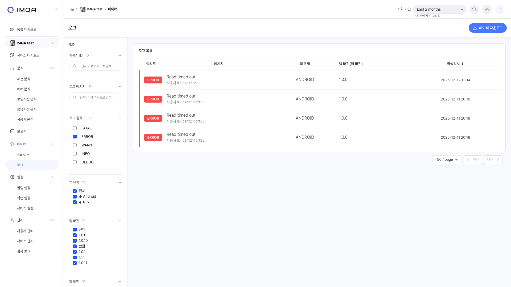

<Gha keyword="NOTE" title="로그 상세 가이드">
**로그 목록**과 **로그 상세**에 대한 내용은 '데이터 > 로그' 를 참고하세요.
</Gha>

---
## 5-3. 화면 분석

IMQA 화면 분석은 기간 내 사용자가 서비스에서 방문한 여러 화면의 성능을 통합적 관점에서 확인할 수 있습니다. 해당 화면의 방문 수와 평균 성능, 발생한 에러 건 수를 확인하여 화면별 성능 현황과 방문율에 따른 사용자 영향도를 파악할 수 있습니다.

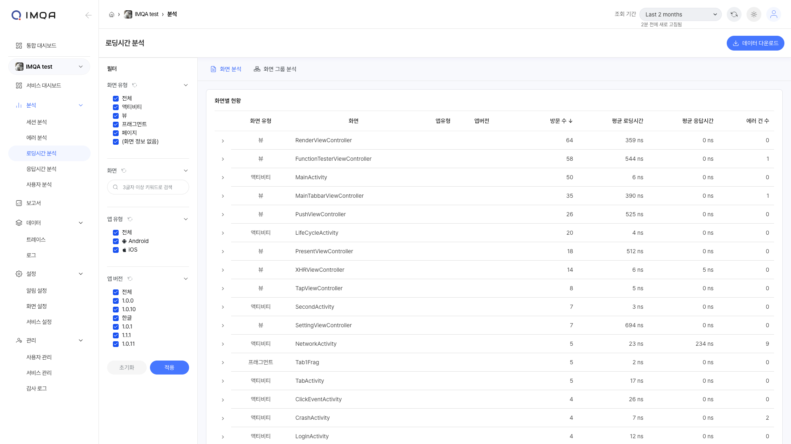

IMQA 화면 분석은 다음과 같이 구성됩니다.

❶ **툴바(화면 분석)**

❷ **필터**

❸ **화면별 현황**

---

### 툴 바

❶ **조회 조건**: 조회하고자 하는 기간을 선택할 수 있습니다. '최근 5분' 부터 '오늘' 등 빠른 버튼을 활용해 기간을 선택할 수 있으며, 'Custom' 으로 시작일시와 종료일시를 설정할 수 있습니다.

❷ **새로고침:** 현재 화면에 표시된 조회 결과 데이터를 새로고침합니다.

❸ **데이터 다운로드:** 현재 화면에 표시된 조회 결과를 `.csv`로 다운로드할 수 있습니다. 화면별 현황 목록은 한 번에 최대 100만건까지 다운로드할 수 있습니다.

### 필터

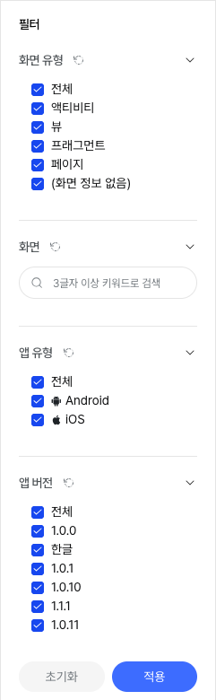

❶ 화면 유형 필터를 통해 원하는 화면 유형만 조회할 수 있습니다. 기본 '전체'로 설정되어 있습니다.

- **액티비티** `Android`
- **뷰** `iOS`
- **프래그먼트** `Android`
- **페이지** `Web`
- **(화면 정보 없음)**

<Gha keyword="NOTE" title="(화면 정보 없음)과 'No Screen'">
IMQA는 SDK, WebAgent를 통한 데이터 수집시, 네이티브 화면과 웹 페이지 정보를 자동으로 수집합니다. `(화면 정보 없음)`은 성능 데이터 등이 수집되었으나, 화면의 정보를 수집하지 못한 경우 `No Screen`으로 구분한 화면을 의미합니다.
</Gha>

❷ 조회하고자 하는 특정 화면이 있을 경우 표시 이름 또는 화면 이름에 포함된 3글자 이상의 검색어를 입력합니다.

<Gha keyword="NOTE" title="화면 필터'">
'화면' 키워드 검색은 화면의 고유 이름 (예: MainActivity) 과 화면 관리에서 설정한 표시 이름 (예: 메인 화면)을 대상으로 조회됩니다. 
</Gha>

❸ 그 외 다양한 필터를 설정할 수 있습니다.

❹ [적용]을 클릭하면 선택한 필터 기준으로 데이터가 조회됩니다.

### 화면별 현황

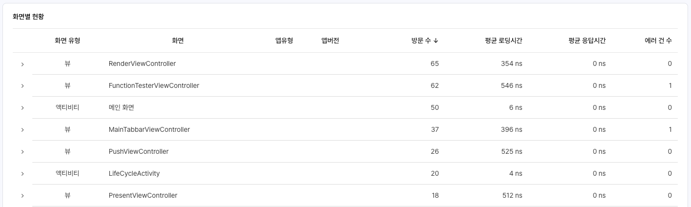

서비스에서 수집된 화면별 현황을 확인할 수 있습니다. 화면 유형, 화면 이름, 방문 수, 평균 로딩시간과 응답시간, 에러 건 수 등을 표시합니다. 이를 통해 사용자 영향도가 높은 화면을 빠르게 파악 가능합니다. 기본은 방문 수 높은 순으로 정렬 됩니다. 페이지 당 표시 항목을 50건(기본값)/100건/200건 으로 설정할 수 있습니다.

- **화면 유형**: 해당 화면의 유형을 표시합니다.
- **화면**: 해당 화면의 표시 이름 또는 고유 화면 이름을 표시합니다. 화면에 설정된 표시 이름이 있을 경우, 우선 표시됩니다.
- **방문 수**: 해당 화면을 사용자가 요청한 수를 카운트합니다.
- **평균 로딩시간**: 해당 화면의 로딩시간 평균입니다.
- **평균 응답시간**: 해당 화면의 응답시간 평균입니다.
- **에러 건 수**: 해당 화면에서 발생한 전체 에러(Crash, ANR, Error 등)를 카운트합니다.

특정 화면 항목 앞 [펼침] 아이콘을 클릭하면 화면 하위에 앱 버전 단위 목록을 추가 표시합니다.

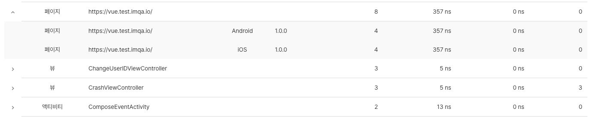

- **앱 유형**: 앱 유형 정보를 표시합니다. Android, iOS, Web 유형으로 구분됩니다.
- **앱 버전**: 앱 버전 단위를 표시합니다.
- **방문 수**: 해당 앱 버전의 화면을 사용자가 요청한 수를 카운트합니다. 
- **평균 로딩시간**: 해당 앱 버전의 화면 로딩시간 평균입니다.
- **평균 응답시간**: 해당 앱 버전의 응답시간 평균입니다.
- **에러 건 수**: 해당 앱 버전에서 발생한 전체 에러(Crash, ANR, Error 등)를 카운트합니다. 

<Gha keyword="NOTE" title="화면 표시 이름 설정">
화면에 표시 이름(별명)으로 표시하고 싶은 경우, 화면 관리를 통해 화면에 표시 이름(별명)을 설정할 수 있습니다. 화면 관리에 대한 내용은 **설정 > 화면 관리** 를 참고하세요.
</Gha>

<Gha keyword="WARNING" title="화면의 중복 집계 표시">
IMQA는 빠른 데이터 조회를 위해 데이터 수집 시 화면 정보와 화면 그룹 정보를 함께 저장합니다. 조회 기간 내 화면 관리 정보가 변경되었을 경우, 하나의 항목으로 그룹핑 집계/표시 되지 않을 수 있습니다. 
</Gha>

<Gha keyword="WARNING" title="화면 연계 분석">
화면 기준으로 상세 분석 연계 기능은 추후 업데이트 예정입니다.
</Gha>

---
## 5-4. 화면 그룹 분석

IMQA 화면 그룹 분석은 기간 내 서비스의 주요 업무 단위 또는 메뉴 단위 등 화면 그룹 관점에서 확인할 수 있습니다. 해당 화면 그룹의 방문 수와 평균 성능, 발생한 에러 건 수를 확인하여 화면 그룹별 성능 현황과 방문율에 따른 사용자 영향도를 파악할 수 있습니다.

<Gha keyword="NOTE" title="화면 그룹 가이드">
화면 그룹 단위로 집계하는 경우, 화면 그룹 생성 및 설정이 필요합니다. 화면 그룹 관리에 대한 내용은 **설정 > 화면 그룹 관리** 를 참고하세요.
</Gha>

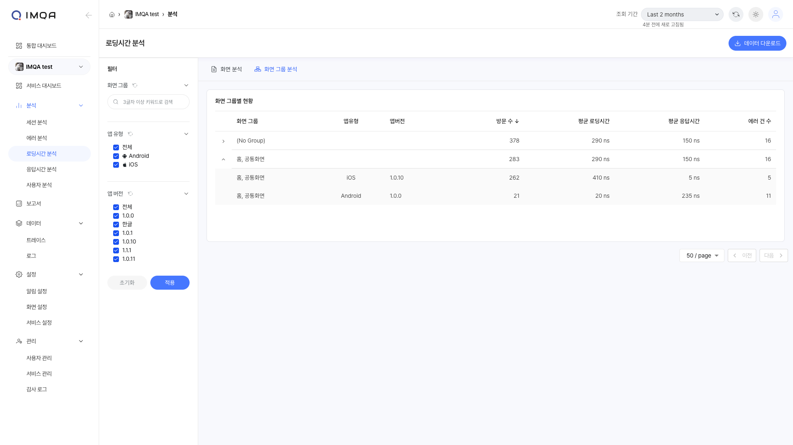

IMQA 화면 그룹 분석은 다음과 같이 구성됩니다.

❶ **툴바(화면 그룹 분석)**

❷ **필터**

❸ **화면 그룹별 현황**

---

### 툴 바

❶ **조회 조건:** 조회하고자 하는 기간을 선택할 수 있습니다. '최근 5분' 부터 '오늘' 등 빠른 버튼을 활용해 기간을 선택할 수 있으며, 'Custom' 으로 시작일시와 종료일시를 설정할 수 있습니다.

❷ **새로고침:** 현재 화면에 표시된 조회 결과 데이터를 새로고침합니다.

**❸ 데이터 다운로드:** 현재 화면에 표시된 조회 결과를 `.csv`로 다운로드할 수 있습니다. 화면 그룹별 현황 목록은 한 번에 최대 100만건까지 다운로드할 수 있습니다.

### 필터

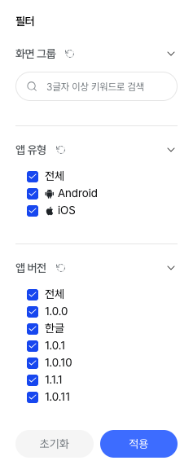

❶ 조회하고자 하는 특정 화면 그룹이 있을 경우 화면 그룹 이름에 포함된 3글자 이상의 검색어를 입력합니다.

❷ 그 외 다양한 필터를 설정할 수 있습니다.

❸ [적용]을 클릭하면 선택한 필터 기준으로 데이터가 조회됩니다.

### 화면 그룹별 현황

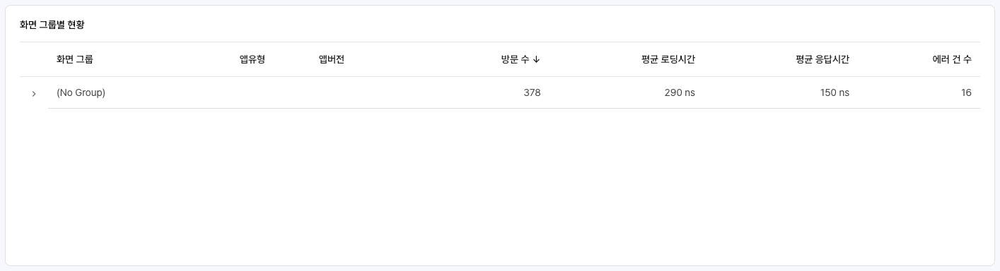

화면 그룹별 현황을 확인할 수 있습니다. 화면 그룹 이름, 방문 수, 평균 로딩시간과 응답시간, 에러 건 수 등 표시합니다. 이를 통해 사용자 영향도가 높은 화면 그룹을 빠르게 파악 가능합니다. 기본은 방문 수 높은 순으로 정렬 됩니다. 페이지 당 표시 항목을 50건(기본값)/100건/200건 으로 설정할 수 있습니다.

- **화면 그룹**: IMQA에서 설정한 화면 그룹 이름을 표시합니다. 화면 그룹에 속하지 않은 화면은 `No Group`으로 집계됩니다.
- **방문 수**: 해당 화면 그룹에 속한 화면을 사용자가 요청한 수를 카운트합니다. 
- **평균 로딩시간**: 해당 화면 그룹에 속한 화면의 로딩시간 평균입니다.
- **평균 응답시간**: 해당 화면 그룹에 속한 화면의 응답시간 평균입니다.
- **에러 건 수**: 해당 화면 그룹에 속한 화면에서 발생한 전체 에러(Crash, ANR, Error 등)를 카운트합니다.

특정 화면 그룹 항목 앞 [펼침] 아이콘을 클릭하면 화면 그룹 하위에 앱 버전 단위 목록을 추가 표시합니다.

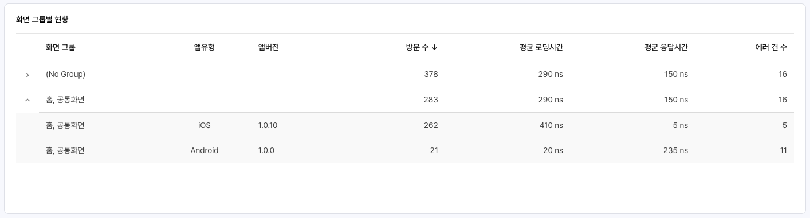

- **앱 유형**: 앱 유형 정보를 표시합니다. Android, iOS, Web 유형으로 구분됩니다.
- **앱 버전**: 앱 버전 단위를 표시합니다.
- **방문 수**: 해당 앱 버전의 화면을 사용자가 요청한 수를 카운트합니다. 
- **평균 로딩시간**: 해당 앱 버전의 화면 로딩시간 평균입니다.
- **평균 응답시간**: 해당 앱 버전의 응답시간 평균입니다.
- **에러 건 수**: 해당 앱 버전에서 발생한 전체 에러(Crash, ANR, Error 등)를 카운트합니다. 

<Gha keyword="WARNING" title="화면 그룹 집계 표시">
IMQA는 빠른 데이터 조회를 위해 데이터 수집 시 화면 정보와 화면 그룹 정보를 함께 저장합니다. 화면 그룹별 현황은 데이터 수집 당시의 화면 그룹 정보로 집계/표시 됩니다. 
</Gha>

<Gha keyword="WARNING" title="화면 그룹 연계 분석">
화면 그룹 기준으로 상세 분석 연계 기능은 추후 업데이트 예정입니다.
</Gha>

---
## 5-5. 응답시간 분석

IMQA 응답시간 분석은 기간 내 서버로 데이터를 요청하고 응답받은 XHR/Fetch 성능을 확인 할 수 있습니다. 트레이스 데이터를 사용자의 세션 분석으로 연계하여 분석할 수 있습니다.

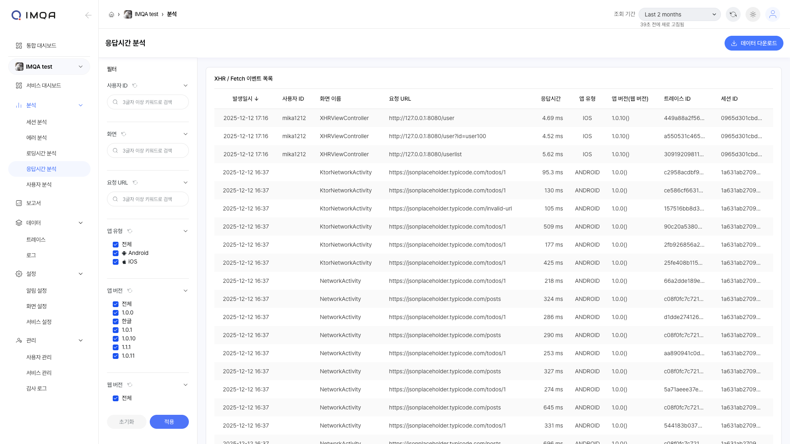

IMQA 응답시간 분석은 다음과 같이 구성됩니다.

❶ **툴바(응답시간 분석)**

❷ **필터**

❸ **XHR / Fetch 이벤트 목록**

---

### 툴 바

❶ **조회 조건:** 조회하고자 하는 기간을 선택할 수 있습니다. '최근 5분' 부터 '오늘' 등 빠른 버튼을 활용해 기간을 선택할 수 있으며, 'Custom' 으로 시작일시와 종료일시를 설정할 수 있습니다.

❷ **새로고침:** 현재 화면에 표시된 조회 결과 데이터를 새로고침합니다.

**❸ 데이터 다운로드:** 현재 화면에 표시된 조회 결과를 `.csv`로 다운로드할 수 있습니다. XHR / Fetch 이벤트 목록은 한 번에 최대 100만건까지 다운로드할 수 있습니다.

### 필터

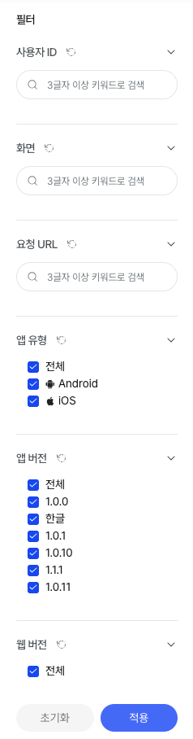

❶ 원하는 사용자 ID 정보로 API 요청을 조회할 수 있습니다. 조회하고자 하는 특정 사용자가 있을 경우 사용자 ID에 포함된 3글자 이상의 검색어를 입력합니다.

<Gha keyword="TIP" title="사용자 ID 설정">
IMQA는 SDK, WebAgent를 통한 데이터 수집시 특정 사용자를 식별하기 위한 사용자 ID 정보를 설정할 수 있습니다. 사용자 ID 정보 설정은 'SDK Agent 설치 가이드 > Custom User ID 설정' 을 참고하세요.
</Gha>

❷ 조회하고자 하는 특정 화면이 있을 경우 화면 이름에 포함된 3글자 이상의 검색어를 입력합니다.

❸ 조회하고자 하는 특정 요청 URL이 있을 경우 URL에 포함된 3글자 이상의 검색어를 입력합니다.

❹ 그 외 다양한 필터를 설정할 수 있습니다.

❺ [적용]을 클릭하면 선택한 필터 기준으로 데이터가 조회됩니다.

### XHR / Fetch 이벤트 목록

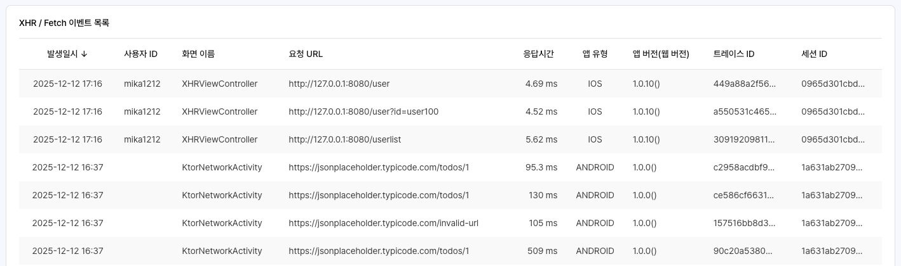

서비스에서 수집된 XHR / Fetch 이벤트 성능 현황을 확인할 수 있습니다. 사용자 ID, 발생일시, 화면, 요청 URL, 응답시간 등을 표시합니다. 이를 통해 성능 저하가 발생한 요청을 빠르게 파악 가능합니다. 기본은 최근 발생일시 순으로 정렬 됩니다. 페이지 당 표시 항목을 50건(기본값)/100건/200건 으로 설정할 수 있습니다.

- **발생일시**: 해당 요청의 발생시간을 표시합니다.
- **사용자 ID**: SDK, WebAgent에서 설정한 사용자의 ID 정보가 수집되었을 경우 추가 표시합니다.
- **화면**: 해당 요청이 발생한 화면 정보를 표시합니다.
- **요청 URL**: 요청 URL을 표시합니다. `http.url`을 의미합니다.
- **응답시간**: 해당 요청의 응답까지 걸린 시간을 표시합니다.
- **앱 유형**: 해당 요청이 수집된 앱 유형 정보를 표시합니다. Android, iOS, Web 유형으로 구분됩니다.
- **앱 버전(웹 버전)**: 해당 요청이 수집된 앱 버전 정보를 표시합니다. WebAgent에서 설정한 모바일 앱 내 웹 버전 구분 정보가 수집되었을 경우 추가 표시합니다.
- **트레이스 ID**: IMQA가 특정 액션을 식별하기 위해 부여한 고유 키를 표시합니다.
- **세션 ID**: IMQA가 특정 세션을 식별하기 위해 부여한 고유 키를 표시합니다.

XHR / Fetch 이벤트 목록에서 특정 항목을 클릭하면 **트레이스 상세** 페이지를 표시합니다.

### XHR / Fetch 이벤트 상세 (트레이스 상세)
특정 XHR / Fetch 이벤트를 기준으로, 시작 시점부터 종료 시점까지 상세 분석이 가능합니다.

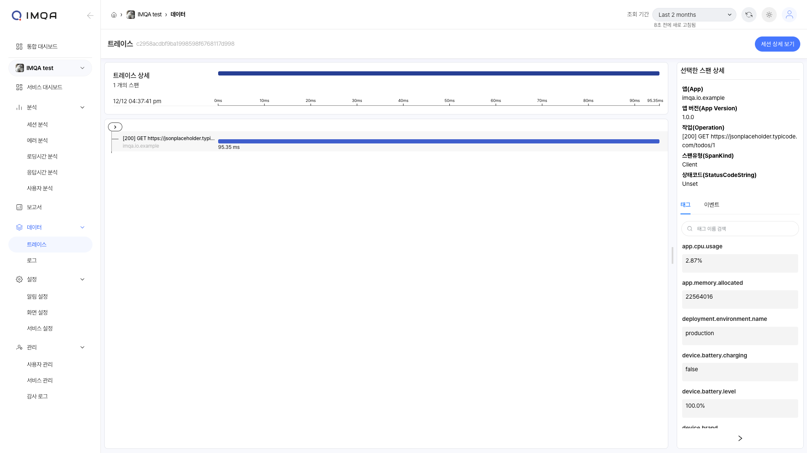

<Gha keyword="NOTE" title="트레이스 상세 가이드">
**트레이스 상세**에 대한 내용은 '데이터 > 트레이스 > 트레이스 상세' 를 참고하세요.
</Gha>

---
## 5-6. 사용자 분석

IMQA 사용자 분석은 기간 내 서비스를 이용한 사용자 ID를 기준으로 사용자 디바이스 환경 정보를 확인할 수 있습니다. 네트워크 구분, 모델명, OS 비율 요약 정보를 통해 이용 빈도가 높은 사용자 환경을 파악할 수 있습니다.

<Gha keyword="TIP" title="사용자 ID 기준 집계">
IMQA는 SDK, WebAgent를 통한 데이터 수집시 특정 사용자를 식별하기 위한 사용자 ID 정보를 설정할 수 있습니다. 사용자 ID 정보 설정은 'SDK Agent 설치 가이드 > Custom User ID 설정' 을 참고하세요.
</Gha>

<Gha keyword="WARNING" title="사용자 분석 지표">
현재 사용자 분석 메뉴는 Android와 iOS SDK에서 수집한 데이터 기반 지표로 제공됩니다. WebAgent 데이터 지표는 추후 업데이트 예정입니다.
</Gha>

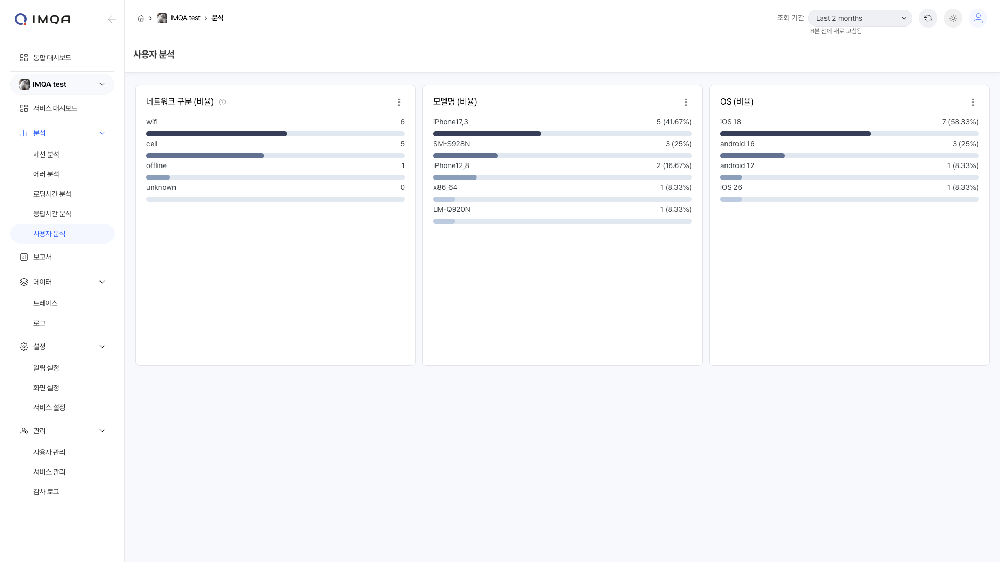

IMQA 사용자 분석은 다음과 같이 구성됩니다.

❶ **사용자 환경 요약 정보**

---

### | Android / iOS 사용자 환경 요약 정보
사용자 환경 요약 정보를 통해 기간 내 이용 빈도가 높은 사용자 환경을 파악할 수 있습니다.

#### 네트워크 구분
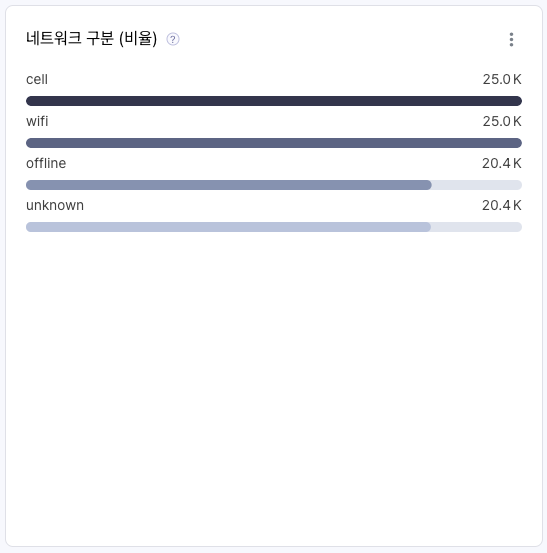

조회 기간 동안 사용자 ID별 네트워크 이용 비율 정보를 표시합니다. cell, wifi, offline, unknown 4개 항목으로 집계되며, 가장 비율이 높은 항목 순으로 표시됩니다.

- **네트워크 구분**: 이용 네트워크 정보를 표시합니다.
	- **cell**: 셀룰러를 사용한 사용자  
	- **wifi**: Wi-Fi를 사용한 사용자  
	- **offilne**: 네트워크 정보가 없는 사용자  
	- **unknown**: 네트워크를 계측하지 못한 사용자
- **건 수**: 해당 네트워크를 이용한 사용자 ID 수를 카운트합니다.

<Gha keyword="WARNING" title="네트워크 구분 (비율) 집계">
사용자는 하나의 사용자 세션에서 셀룰러, Wi-Fi 등 여러 가지 네트워크 접속 방식으로 앱을 이용할 수 있습니다. 현재 네트워크 구분 지표는 **사용자 ID를 기준으로, 수집된 데이터가 어떤 네트워크 환경이었는지**를 집계하고 있습니다. (예: 'mikayang' 사용자 기준, cell 1건, wifi 1건) 전체 사용자 이용 데이터 중 특정 네트워크 방식으로 접속한 데이터로의 비율 집계는 추후 업데이트 예정입니다.
</Gha>

#### 모델명 (비율)
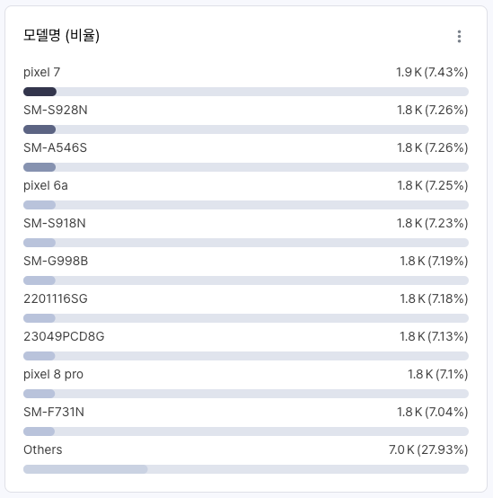

조회 기간 동안 사용자 ID별 디바이스 이용 비율 정보를 표시합니다. 모델명으로 집계되며, 가장 비율이 높은 항목 10개 순으로 표시됩니다. 나머지 항목은 'Others'로 집계하여 표시합니다.

- **모델명**: 이용 디바이스 정보를 표시합니다.
- **건 수 (비율)**: 해당 디바이스를 이용한 사용자 ID 수를 카운트합니다. 전체 디바이스 대비 비율입니다.

#### OS (비율)
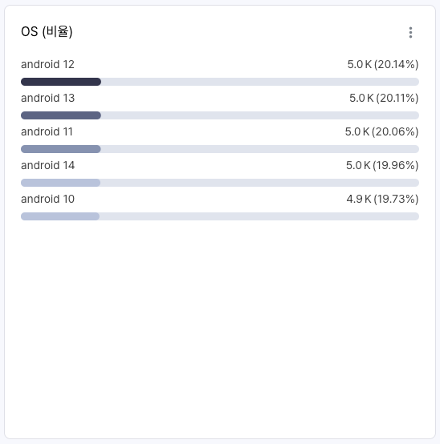

조회 기간 동안 사용자 ID별 OS 이용 비율 정보를 표시합니다. OS + OS 버전으로 집계되며, 가장 비율이 높은 항목 10개 순으로 표시됩니다. 나머지 항목은 'Others'로 집계하여 표시합니다.

- **OS**: 이용 OS 및 OS 버전 정보를 표시합니다.
- **건 수 (비율)**: 해당 OS를 이용한 사용자 ID 수를 카운트합니다. 전체 OS 대비 비율입니다.

### 위젯 메뉴
- **사용자 환경 요약** 지표 > 위젯 메뉴에서, CSV 다운로드가 가능합니다.

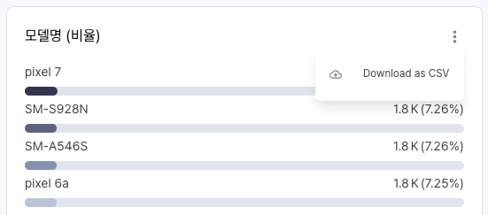

---

## 6. 보고서
---

## 6-1. 보고서 템플릿
---

IMQA 보고서 템플릿은 서비스의 일간, 주간, 월간 정기적인 기간으로 집계된 양식 보고서를 제공하여 내부 업무 공유 및 성과 보고 등에 활용할 수 있습니다. 집계 결과를 `.pdf` 로 다운로드할 수 있으며, 일부 보고서 양식의 경우 별첨 자료를 추가 제공합니다.

<Gha keyword="TIP" title="보고서 템플릿 양식 및 조회 가능 기간">
IMQA 보고서 템플릿은 기업 환경에 추가된 서비스 기준으로, **통계 데이터 보관 기간**에 따른 양식 보고서를 제공합니다. 제공되는 보고서 양식 및 생성된 보고서 파일 보관 기간의 경우 기업 도입 환경에 따라 상이할 수 있습니다. 자세한 내용은 관리자에게 문의해 주세요.
</Gha>

<Gha keyword="WARNING" title="보고서 템플릿">
서비스별 일간, 주간, 월간 보고서 기능은 빠른 시일 내 업데이트 예정입니다.
</Gha>

## 6-2. 보고서 데이터
---

IMQA 보고서 데이터로 원하는 조회 기간과 집계 지표를 선택하여 CSV로 다운로드할 수 있습니다. 정기적인 기간 데이터 집계로 내부 업무 공유 및 성과 보고 등에 활용할 수 있습니다. 집계 결과를 `.csv` 로 제공하며 `.zip` 로 다운로드 됩니다.

<Gha keyword="NOTE" title="보고서 데이터(CSV) 생성 기준">
현재 보고서 데이터는 안정적인 시스템 운영을 위해 특정 앱의 특정 앱 버전 기준으로 제공됩니다. 자세한 내용은 관리자에게 문의해주세요.
</Gha>

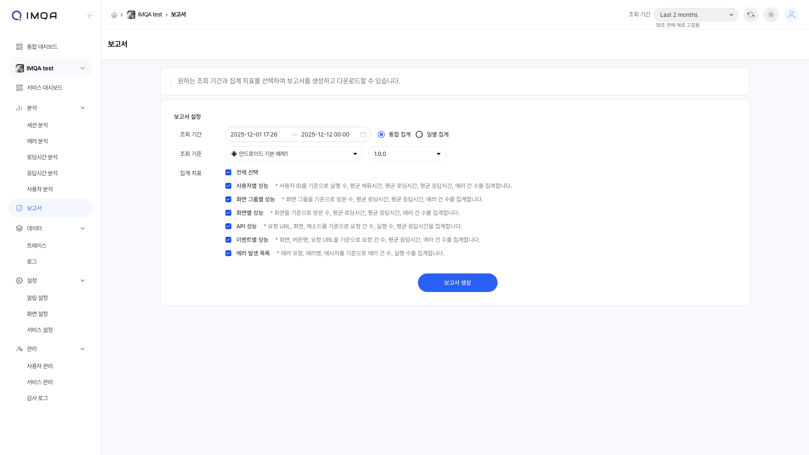

IMQA 보고서 데이터는 다음과 같이 구성됩니다.

❶ **보고서 설정**

---

### 보고서 설정
보고서 데이터 조회 기간을 시작일시~종료일시로 설정할 수 있습니다. 집계한 데이터를 통합된  `.csv` 파일로 생성하거나, 일자별로 분리된  `.csv` 파일로 생성할 수 있습니다.

❶ **조회 기간:** 조회하고자 하는 기간을 선택할 수 있습니다. 시작일시와 종료일시를 설정할 수 있으며, 시간의 경우 '시작시간 이상 종료시간 미만'으로 동작됩니다.

❷ **통합 집계/일별 집계:** 보고서 생성 시, 통합 또는 일별 집계로 설정할 수 있습니다.
- **통합 집계**: 선택한 기간의 데이터를 하나의 `.csv` 파일로 통합하여 생성합니다. `.zip` 으로 다운로드 됩니다.
- **일별 집계**: 선택한 기간의 데이터를 일별 `.csv` 파일로 분리하여 생성합니다. `.zip` 으로 다운로드 됩니다.

**❸ 조회 기준:** 조회하고자 하는 앱과 앱 버전을 선택합니다. 

❹ **집계 지표:** 집계할 지표를 선택합니다. 사용자 ID, 화면 그룹 등 다양한 기준을 선택할 수 있습니다. 

❺ 보고서 설정이 완료되면 [보고서 생성] 버튼을 클릭합니다.

<Gha keyword="TIP" title="보고서 생성">
보고서 생성 시, 약 1~2분 이내 또는 조회 기간에 따라 그 이상의 시간이 소요될 수 있습니다. 페이지를 이동하는 경우, 보고서 생성이 취소되므로 잠시만 기다려 주세요.
</Gha>

#### | 집계 지표
OS별, 디바이스별, 통신사별, 사용자 별 등 여러 집계 지표를 설정할 수 있습니다.

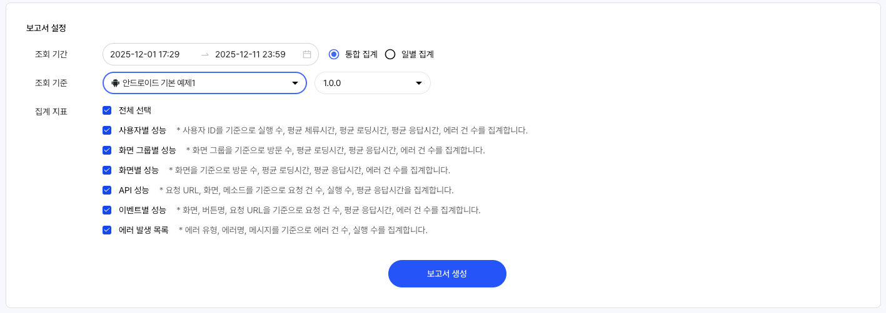
<Gha keyword="TIP" title="사용자 ID 기준 집계">
IMQA는 SDK, WebAgent를 통한 데이터 수집시 특정 사용자를 식별하기 위한 사용자 ID 정보를 설정할 수 있습니다. 사용자 ID 정보 설정은 'SDK Agent 설치 가이드 > Custom User ID 설정' 을 참고하세요.
</Gha>

<Gha keyword="TIP" title="화면 그룹 기준 집계">
IMQA에서 서비스 별 **화면 그룹 관리**를 통해 여러 화면을 주요 업무 단위 또는 메뉴 단위 등으로 그룹화하고, 집계/분석할 수 있습니다.
</Gha>

### 보고서 다운로드
보고서 생성이 완료되면 `.zip` 파일이 자동으로 다운로드 됩니다.

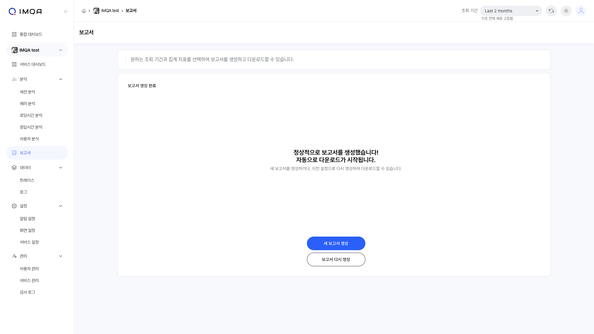

- [새 보고서 생성] 버튼 클릭 시, 다시 보고서 설정 화면으로 이동합니다.
- [보고서 다시 생성] 버튼 클릭 시, 이전 보고서 설정을 유지하여 다시 보고서 설정 화면으로 이동합니다.

---

## 7. 데이터
---

## 7-1. 트레이스

IMQA 트레이스는 앱 내에서 발생한 다양한 행동(이하 액션) 데이터를 탐색하고 분석할 수 있습니다.
화면 로딩, 앱 상태(Foreground, Background), 네트워크 요청/응답, 사용자 이벤트, 로그, 에러 등 다양한 액션 유형을 확인할 수 있으며, 트레이스에서 있었던 작업 단위도 확인할 수 있습니다. 트레이스와 스팬 데이터를 사용자의 세션 분석으로 연계하여 분석할 수 있습니다.

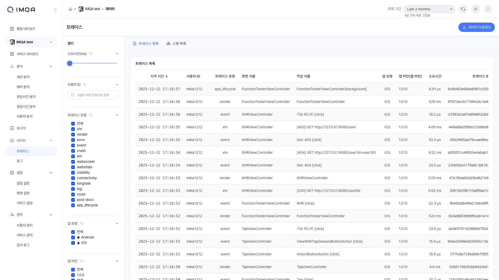

IMQA 트레이스는 다음과 같이 구성됩니다.

❶ **툴바(트레이스 분석)**

❷ **필터**

❸ **트레이스 목록**

---

### 툴 바

❶ **조회 조건:** 조회하고자 하는 기간을 선택할 수 있습니다. '최근 5분' 부터 '오늘' 등 빠른 버튼을 활용해 기간을 선택할 수 있으며, 'Custom' 으로 시작일시와 종료일시를 설정할 수 있습니다.

❷ **새로고침:** 현재 화면에 표시된 조회 결과 데이터를 새로고침합니다.

**❸ 데이터 다운로드:** 조회 결과를 `.csv`로 다운로드할 수 있습니다. 트레이스 목록은 한 번에 최대 50만건까지 다운로드할 수 있습니다.

### 필터

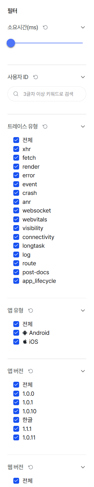

❶ 트레이스와 스팬의 소요시간 범위를 선택할 수 있습니다. 기본은 '전체'로 설정되어 있으며, 0ms 부터 최대 10,000ms 까지 범위를 설정할 수 있습니다.

❷ 원하는 사용자 ID 정보로 트레이스와 스팬을 조회할 수 있습니다. 조회하고자 하는 특정 사용자가 있을 경우 사용자 ID에 포함된 3글자 이상의 검색어를 입력합니다.

<Gha keyword="TIP" title="사용자 ID 설정">
IMQA는 SDK, WebAgent를 통한 데이터 수집시 특정 사용자를 식별하기 위한 사용자 ID 정보를 설정할 수 있습니다. 사용자 ID 정보 설정은 'SDK Agent 설치 가이드 > Custom User ID 설정' 을 참고하세요.
</Gha>

❸ 트레이스 유형 필터를 통해 원하는 트레이스 유형만 조회할 수 있습니다. 기본 '전체'로 설정되어 있습니다.

- **xhr** `Android` `iOS` `Web` 네트워크 요청 응답시간
- **fetch** `Web` 브라우저 API
- **render** `Android` `iOS` `Web`: 화면 로딩시간 
- **error** `Web`: 웹 에러
- **event** `Android` `iOS` `Web`: 사용자 이벤트 (클릭, 마우스업 등)
- **log** `Android` `iOS` `Web`: 로그 레벨 기준으로 로깅 (커스텀 로그 포함)
- **crash** `Android` `iOS`: 앱 비정상 종료 또는 예외
- **anr** `Android`: 특정 시간동안 앱 응답 없음 
- **websocket** `Web`: 웹 소켓 통신
- **webvitals** `Web`: 웹 성능 지표 (Google Web Vitals)
- **visibility** `Web`: 브라우저 탭 활성화 여부
- **connectivity** `Web`: 네트워크 상태
- **longtask** `Web`: 성능 저하 작업
- **route** `Web`: 라우트 이동 정보
- **post-docs** `Web`: 컴포넌트 갱신 정보
- **app_lifecycle** `Android` `iOS`: 앱 실행 상태 (background/foreground)

❹ 원하는 작업 이름을 조회할 수 있습니다. 조회하고자 하는 특정 정보가 있을 경우 작업 이름에 포함된 3글자 이상의 검색어를 입력합니다.

❺ 그 외 다양한 필터를 설정할 수 있습니다.

❻ [적용]을 클릭하면 선택한 필터 기준으로 데이터가 조회됩니다.

### 트레이스 목록

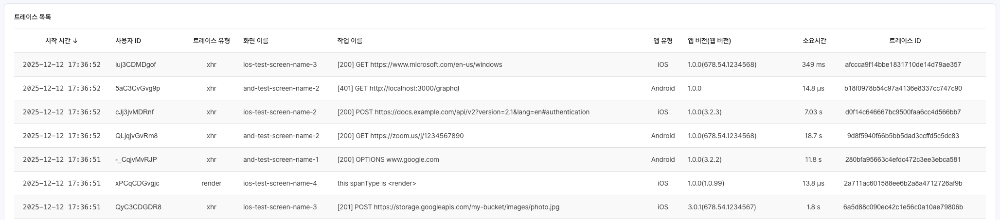

사용자의 행동 흐름에서 발생한 여러 액션을 트레이스로 확인할 수 있습니다. 트레이스별 소요 시간 등을 표시합니다. 이를 통해 사용자의 서비스 이용 중 어떤 일들이 있었는지를 한눈에 확인할 수 있습니다. 기본은 최근 시작 된 트레이스 순으로 정렬 됩니다. 페이지 당 표시 항목을 50건(기본값)/100건/200건 으로 설정할 수 있습니다.

- **시작 시간**: 해당 트레이스의 시작시간을 표시합니다.
- **사용자 ID**: SDK, WebAgent에서 설정한 사용자의 ID 정보가 수집되었을 경우 표시합니다.
- **트레이스 유형**: 해당 트레이스의 유형을 표시합니다.
- **화면 이름**: 해당 트레이스가 발생한 화면을 표시합니다.
- **작업 이름**: 해당 트레이스를 대표하는 정보를 표시합니다.
- **소요시간**: 해당 트레이스의 소요시간을 표시합니다.
- **앱 유형**: 해당 트레이스가 수집된 앱 유형 정보를 표시합니다. Android, iOS, Web 유형으로 구분됩니다.
- **앱 버전(웹 버전)**: 해당 트레이스가 수집된 앱 버전 정보를 표시합니다. WebAgent에서 설정한 모바일 앱 내 웹 버전 구분 정보가 수집되었을 경우 추가 표시합니다.
- **트레이스 ID**: IMQA가 특정 액션을 식별하기 위해 부여한 고유 키를 표시합니다.

**트레이스 ID, 사용자 ID** 컬럼에 마우스를 올리면 [복사] 버튼이 표시되며, [복사] 버튼 클릭 시 클립보드에 복사됩니다. 데이터 조회 키워드로 활용할 수 있습니다.

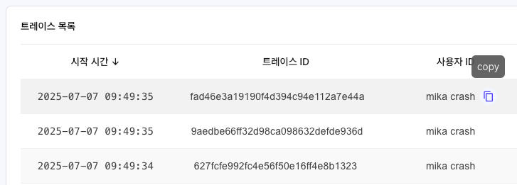

트레이스 목록에서 특정 트레이스를 클릭하면 **트레이스 상세** 페이지로 이동할 수 있습니다.

### 일반 트레이스 상세

특정 액션을 기준으로, 시작 시점부터 종료 시점까지 상세 분석이 가능합니다. 하나의 트레이스는 여러 스팬(트레이스에서 발생한 특정 작업 단위. 데이터를 표현하는 최소 단위) 트리로 구성됩니다. 해당 트레이스가 발생한 사용자의 세션으로 연계하여 이동할 수 있습니다.

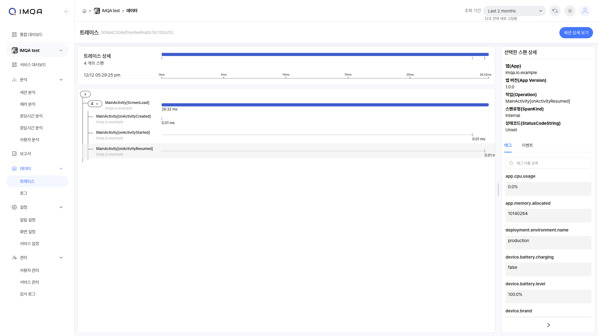

- 원하는 스팬 단위를 선택하면 **스팬 상세** 정보가 표시됩니다.
- [세션 상세 보기]를 클릭하면 해당 트레이스가 수집된 사용자의 **세션 상세(트레이스 목록)** 으로 이동할 수 있습니다.

#### 트레이스 요약

트레이스 요약을 통해 해당 트레이스에서 발생한 작업 단위의 시작 종료 시점을 빠르게 파악할 수 있습니다.

#### 스팬 상세 정보

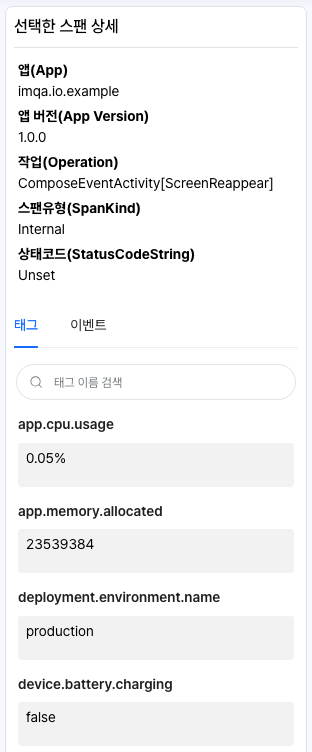

선택한 스팬과 함께 수집된 다양한 속성 정보를 확인할 수 있습니다. 속성 정보를 통해 해당 사용자의 상태를 정확하게 파악할 수 있습니다.

### 이슈 트레이스 상세

Crash, ANR, Error 문제가 발생한 트레이스의 상세 정보를 통해 로그까지 분석할 수 있습니다.

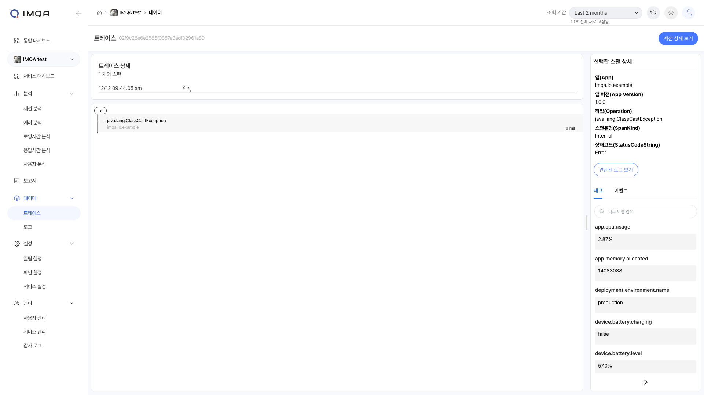

- 원하는 스팬 단위를 선택하면 **스팬 상세** 정보가 표시됩니다.
- [세션 상세 보기]를 클릭하면 해당 트레이스가 수집된 사용자의 **세션 상세(트레이스 목록)** 으로 이동할 수 있습니다.
- [연관된 로그 보기]를 클릭하면 해당 트레이스와 같이 수집된 **로그 상세**로 이동할 수 있습니다.
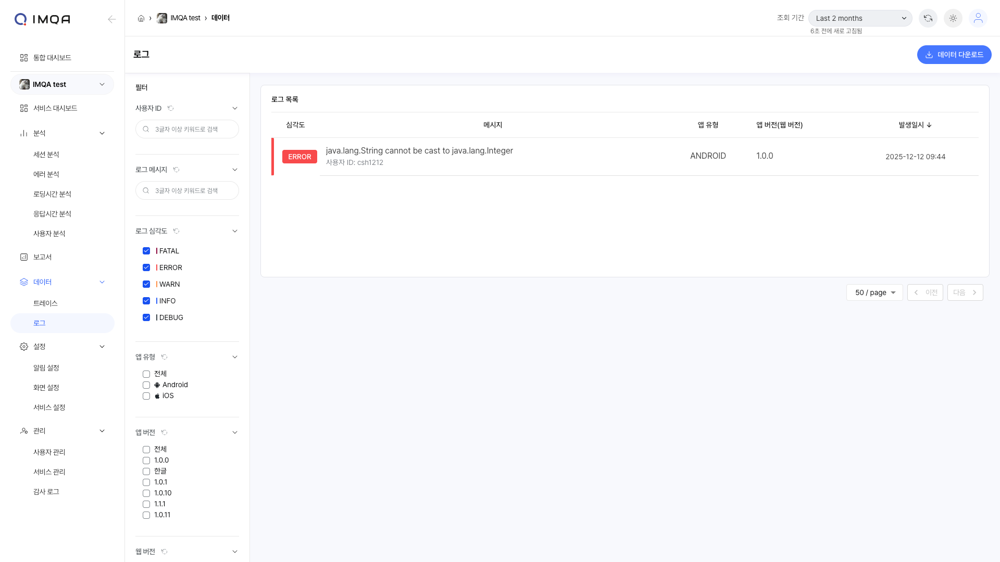

#### 이슈 스팬 상세 정보

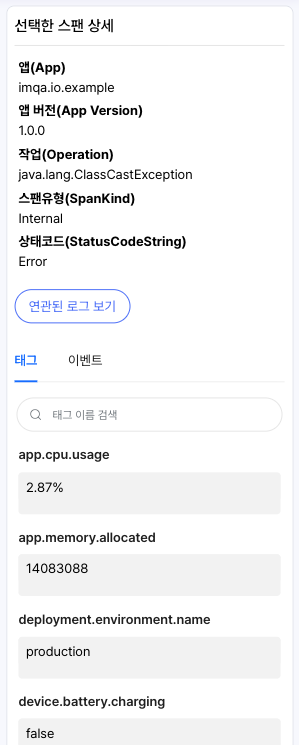

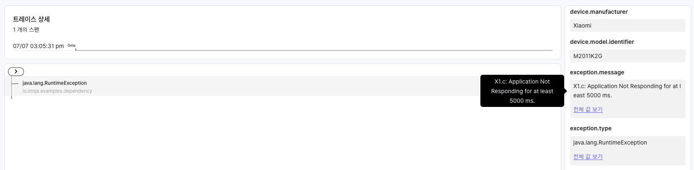

선택한 에러 상태 스팬과 함께 수집된 다양한 속성 정보를 확인할 수 있습니다. 속성 정보를 통해 해당 사용자의 상태를 정확하게 파악할 수 있습니다.

---
## 7-2. 스팬

IMQA 스팬은 앱 내에서 발생한 다양한 트레이스를 스팬(작업) 단위로 확인할 수 있습니다. 트레이스와 스팬 데이터를 사용자의 세션 분석으로 연계하여 분석할 수 있습니다.

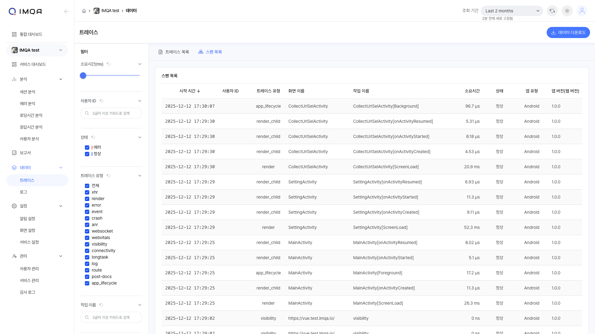

IMQA 스팬은 다음과 같이 구성됩니다.

❶ **툴바(스팬 분석)**

❷ **필터**

❸ **스팬 목록**

---

### 툴 바

❶ **조회 조건:** 조회하고자 하는 기간을 선택할 수 있습니다. '최근 5분' 부터 '오늘' 등 빠른 버튼을 활용해 기간을 선택할 수 있으며, 'Custom' 으로 시작일시와 종료일시를 설정할 수 있습니다.

❷ **새로고침:** 현재 화면에 표시된 조회 결과 데이터를 새로고침합니다.

**❸ 데이터 다운로드:** 조회 결과를 `.csv`로 다운로드할 수 있습니다. 스팬 목록은 한 번에 최대 50만건까지 다운로드할 수 있습니다.

### 필터

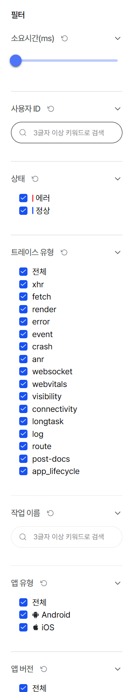

❶ 트레이스와 스팬의 소요시간 범위를 선택할 수 있습니다. 기본은 '전체'로 설정되어 있으며, 0ms 부터 최대 10,000ms 까지 범위를 설정할 수 있습니다.

❷ 원하는 사용자 ID 정보로 트레이스와 스팬을 조회할 수 있습니다. 조회하고자 하는 특정 사용자가 있을 경우 사용자 ID에 포함된 3글자 이상의 검색어를 입력합니다.

<Gha keyword="TIP" title="사용자 ID 설정">
IMQA는 SDK, WebAgent를 통한 데이터 수집시 특정 사용자를 식별하기 위한 사용자 ID 정보를 설정할 수 있습니다. 사용자 ID 정보 설정은 'SDK Agent 설치 가이드 > Custom User ID 설정' 을 참고하세요.
</Gha>

❸ 상태 필터를 통해 문제가 발생한 스팬만 조회할 수 있습니다. 기본 '전체'로 설정되어 있습니다.

- **에러**: Crash, ANR, Error
- **정상**: 그 외

❹ 트레이스 유형 필터를 통해 원하는 스팬 유형만 조회할 수 있습니다. 기본 '전체'로 설정되어 있습니다.

- **xhr** `Android` `iOS` `Web` 네트워크 요청 응답시간
- **fetch** `Web` 브라우저 API
- **render** `Android` `iOS` `Web`: 화면 로딩시간 
- **error** `Web`: 웹 에러
- **event** `Android` `iOS` `Web`: 사용자 이벤트 (클릭, 마우스업 등)
- **log** `Android` `iOS` `Web`: 로그 레벨 기준으로 로깅 (커스텀 로그 포함)
- **crash** `Android` `iOS`: 앱 비정상 종료 또는 예외
- **anr** `Android`: 특정 시간동안 앱 응답 없음 
- **websocket** `Web`: 웹 소켓 통신
- **webvitals** `Web`: 웹 성능 지표 (Google Web Vitals)
- **visibility** `Web`: 브라우저 탭 활성화 여부
- **connectivity** `Web`: 네트워크 상태
- **longtask** `Web`: 성능 저하 작업
- **route** `Web`: 라우트 이동 정보
- **post-docs** `Web`: 컴포넌트 갱신 정보
- **app_lifecycle** `Android` `iOS`: 앱 실행 상태 (background/foreground)

❺ 원하는 작업 이름을 조회할 수 있습니다. 조회하고자 하는 특정 정보가 있을 경우 작업 이름에 포함된 3글자 이상의 검색어를 입력합니다.

❻ 그 외 다양한 필터를 설정할 수 있습니다.

❼ [적용]을 클릭하면 선택한 필터 기준으로 데이터가 조회됩니다.

### 스팬 목록

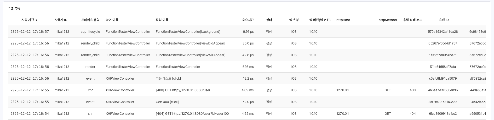

사용자의 행동 흐름에서 발생한 여러 액션을 스팬(작업) 단위로 확인할 수 있습니다. 스팬별 소요 시간 등을 표시합니다. 이를 통해 사용자의 서비스 이용 중 어떤 일들이 있었는지를 한눈에 확인할 수 있습니다. 기본은 최근 시작 된 스팬 순으로 정렬 됩니다. 페이지 당 표시 항목을 50건(기본값)/100건/200건 으로 설정할 수 있습니다.

- **시작 시간**: 해당 스팬의 시작시간을 표시합니다.
- **사용자 ID**: SDK, WebAgent에서 설정한 사용자의 ID 정보가 수집되었을 경우 표시합니다.
- **트레이스 유형**: 해당 스팬(작업)의 유형을 표시합니다.
- **화면 이름**: 해당 스팬(작업)이 발생한 화면을 표시합니다.
- **작업 이름**: 해당 스팬(작업)을 대표하는 정보를 표시합니다.
- **소요시간**: 해당 스팬의 소요시간을 표시합니다.
- **상태**: 해당 스팬의 문제 발생 여부를 표시합니다.
  - 에러: Crash, ANR, Error
  - 정상: 그 외
- **앱 유형**: 해당 스팬(작업)이 수집된 앱 유형 정보를 표시합니다. Android, iOS, Web 유형으로 구분됩니다.
- **앱 버전(웹 버전)**: 해당 스팬(작업)이 수집된 앱 버전 정보를 표시합니다. WebAgent에서 설정한 모바일 앱 내 웹 버전 구분 정보가 수집되었을 경우 추가 표시합니다.
- **httpHost**: (해당 스팬이 XHR인 경우) 호스트 정보를 표시합니다.
- **httpMethod**: (해당 스팬이 XHR인 경우) 메소드 정보를 표시합니다.
- **응답 상태 코드**: (해당 스팬이 XHR인 경우) 응답 코드 정보를 표시합니다.
- **스팬 ID**: IMQA가 특정 작업을 식별하기 위해 부여한 고유 키를 표시합니다.
- **트레이스 ID**: IMQA가 특정 액션을 식별하기 위해 부여한 고유 키를 표시합니다.

**스팬 ID, 트레이스 ID, 사용자 ID** 컬럼에 마우스를 올리면 [복사] 버튼이 표시되며, [복사] 버튼 클릭 시 클립보드에 복사됩니다. 데이터 조회 키워드로 활용할 수 있습니다.

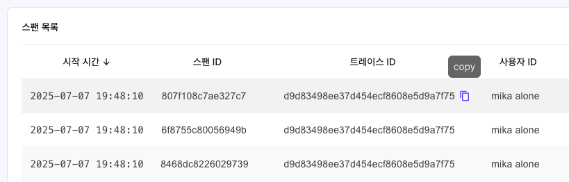

스팬 목록에서 특정 스팬을 클릭하면 **트레이스 상세** 페이지로 이동할 수 있습니다.
<Gha keyword="NOTE" title="트레이스 상세 가이드">
**트레이스 상세**에 대한 내용은 '데이터 > 트레이스 > 트레이스 상세' 를 참고하세요.
</Gha>

---
## 7-3. 로그

IMQA 로그는 애플리케이션 내부 동작에 대해 보다 상세하게 분석할 수 있는 정보를 제공합니다. Crash, ANR, Error 와 같은 문제가 발생했거나, 비즈니스 로직 상에서 추가 분석을 위해 수집한 커스텀 로그 정보를 확인할 수 있습니다. 로그 데이터를 사용자의 **세션 분석으로 연계하여 분석**할 수 있습니다.

<Gha keyword="TIP" title="커스텀 로그 설정">
IMQA는 SDK, WebAgent를 통한 데이터 수집시 비즈니스 로직 상에서 분석을 위해 로그 정보를 추가 수집 설정할 수 있습니다. 커스텀 로그 설정은 **SDK, Agent 설치 가이드**를 참고하세요.
</Gha>

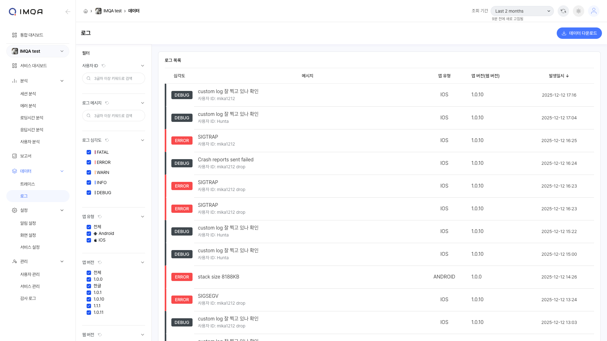

IMQA 로그는 다음과 같이 구성됩니다.

**❶ 툴바(로그)**

**❷ 필터** 

**❸ 로그 목록**

---
### 툴 바

**❶ 조회 조건:** 조회하고자 하는 기간을 선택할 수 있습니다. '최근 5분' 부터 '오늘' 등 빠른 버튼을 활용해 기간을 선택할 수 있으며, 'Custom' 으로 시작일시와 종료일시를 설정할 수 있습니다.

**❷ 새로고침:** 현재 화면에 표시된 조회 결과 데이터를 새로고침합니다. 

**❸ 데이터 다운로드:** 현재 화면에 표시된 조회 결과를 `.csv`로 다운로드할 수 있습니다. 로그 목록은 한 번에 최대 50만건까지 다운로드할 수 있습니다.

### 필터

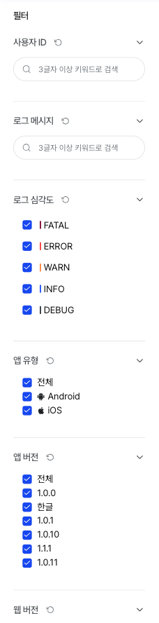

❶ 원하는 사용자 ID 정보로 로그를 조회할 수 있습니다. 조회하고자 하는 특정 사용자가 있을 경우 사용자 ID에 포함된 3글자 이상의 검색어를 입력합니다.

<Gha keyword="TIP" title="사용자 ID 설정">
IMQA는 SDK, WebAgent를 통한 데이터 수집시 특정 사용자를 식별하기 위한 사용자 ID 정보를 설정할 수 있습니다. 사용자 ID 정보 설정은 '**SDK / Agent 설치 가이드 > Custom User ID 설정**' 을 참고하세요.
</Gha>

❷ 조회하고자 하는 특정 메시지가 있을 경우 메시지에 포함된 3글자 이상의 검색어를 입력합니다.

❸ 그 외 다양한 필터를 설정할 수 있습니다.

❹ [적용]을 클릭하면 선택한 필터 기준으로 데이터가 조회됩니다.

### 로그 목록

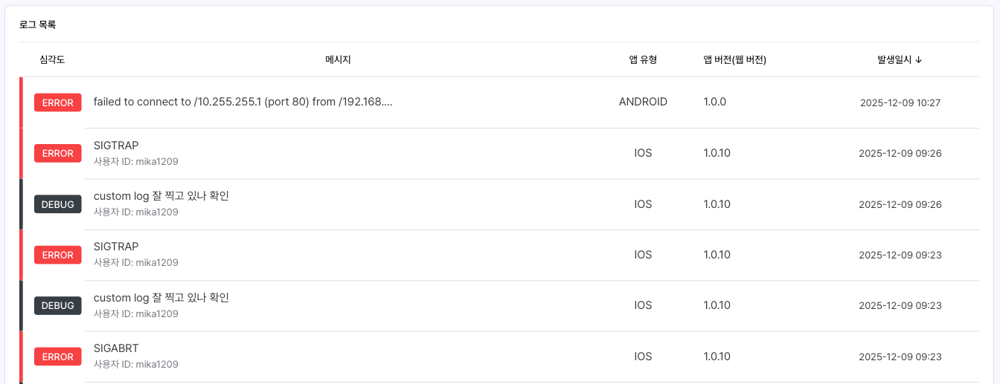

서비스와 사용자의 환경에서 수집한 여러 로그 정보를 확인할 수 있습니다. 기본은 최근 발생일시 순으로 정렬 됩니다. 페이지 당 표시 항목을 50건(기본값)/100건/200건 으로 설정할 수 있습니다.

- **심각도**: 해당 로그의 심각도를 표시합니다. SDK, WebAgent에서 로그 수집시 지정됩니다.
	- `DEBUG`: 디버깅을 위한 로그 레벨을 의미하며, SDK 커스텀 로그 수집시 지정할 수 있습니다.
	- `INFO`: 정보 확인에 사용하는 로그 레벨을 의미하며, SDK 커스텀 로그 수집시 지정할 수 있습니다. 현재 WebAgent에서는 커스텀 로그를 `INFO` 로 고정 합니다.
	- `WARN`: 오류는 아니지만 경고를 위한 로그 레벨을 의미하며, SDK, WebAgent 커스텀 로그 수집시 지정할 수 있습니다.
	- `ERROR`: 오류와 같은 문제 발생 로그 레벨을 의미하며, Crash, ANR, Error 등 문제가 발생했을 때 SDK, WebAgent에서 `ERROR` 로 고정하여 자동으로 오류 로그를 수집합니다. 또한 SDK 커스텀 로그 수집시 지정할 수도 있습니다.
	- `FATAL`: 시스템 충돌과 같은 치명적인 로그 레벨을 의미합니다. 

<Gha keyword="TIP" title="SDK, WebAgent 커스텀 로그 수집시의 `ERROR`">
커스텀 로그 수집 시 지정한 `ERROR` 로그 레벨은 "중요도 표시"에 한정되며,IMQA 에서 '크래시 수'나 '에러 수' 등으로 집계되지 않습니다.
</Gha>

<Gha keyword="WARNING" title="현재 SDK, WebAgent 커스텀 로그 수집시 제한 사항">
현재 로그 레벨 `FATAL` 지정 기능은 제공되고 있지 않습니다. 현재 커스텀 로그 수집시 심각도 지정은 SDK에서만 제공됩니다. 현재 WebAgent에서는 커스텀 로그를 `INFO` 로 고정 합니다.
</Gha>

- **앱 유형**: 해당 로그가 수집된 앱 유형 정보를 표시합니다. Android, iOS, Web 유형으로 구분됩니다.
- **앱 버전(웹 버전)**: 해당 로그가 수집된 앱 버전 정보를 표시합니다. WebAgent에서 설정한 모바일 앱 내 웹 버전 구분 정보가 수집되었을 경우 추가 표시합니다.
- **메시지**: 에러 유형과 메시지를 조합하여 표시합니다. 사용자 ID가 설정된 환경에서 수집된 로그일 경우 사용자 ID 정보를 함께 표시합니다.
- **발생일시**: 해당 로그의 발생 일시를 표시합니다.

로그 목록에서 특정 로그를 클릭하면 **로그 상세** 페이지로 이동할 수 있습니다.

### 로그 상세 정보

수집된 로그 메시지와 다양한 속성 정보 확인이 가능합니다. 해당 로그가 수집된 사용자의 세션으로 연계하여 이동할 수 있습니다.

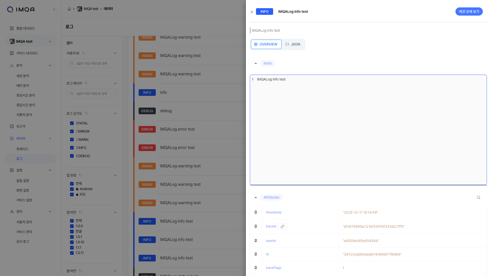

- **Overview**: 수집된 로그 메시지와 Attribute 정보를 확인할 수 있습니다.
- **Attributes(속성 정보)**: 로그와 함께 수집된 다양한 속성의 값들을 확인할 수 있습니다.

- [세션 상세 보기]를 클릭하면 해당 트레이스가 수집된 사용자의 **세션 상세(트레이스 목록)** 으로 이동할 수 있습니다.

#### 네이티브 에러 스택 트레이스

네이티브 앱 오류 및 예외의 경우, **스택 트레이스 탭**이 추가로 표시됩니다. 문제 발생 시점까지의 함수 호출 과정과 다양한 속성 정보를 함께 확인이 가능합니다. 해당 로그가 수집된 사용자의 세션으로 연계하여 이동할 수 있습니다.

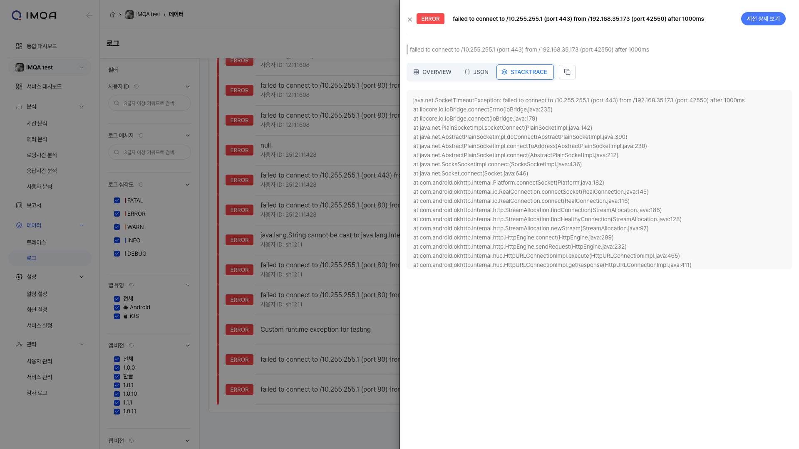

- **Overview**: 수집된 로그 메시지와 Attribute 정보를 확인할 수 있습니다.
- **Attributes(속성 정보)**: 로그와 함께 수집된 다양한 속성의 값들을 확인할 수 있습니다.
- **stacktrace(스택 트레이스 정보)**: 오류 및 예외의 경우, 스택 트레이스 정보를 확인할 수 있습니다.

<Gha keyword="TIP" title="매핑 파일을 통한 난독화된 정보 가독화(Decoding)">
IMQA 매핑 파일 관리를 통해 앱 버전별 매핑 파일을 업로드하여 ProGuard, Symbolication 등이 적용된 서비스에서 클래스 명과 함수 명을 가독화할 수 있습니다. 매핑 파일 관리에 대한 자세한 내용은 **설정 > 매핑 파일 관리**를 참고하시거나, 관리자에게 문의해주세요.
</Gha>

- [세션 상세 보기]를 클릭하면 해당 트레이스가 수집된 사용자의 **세션 상세(트레이스 목록)** 으로 이동할 수 있습니다.

#### 웹 에러 스택 트레이스

웹 에러의 경우, **스택 트레이스 탭**이 추가로 표시됩니다. 문제 발생 시점까지의 함수 호출 과정과 다양한 속성 정보를 함께 확인이 가능합니다. 웹 Bundler 로 생성한 js.map 파일을 업로드 해 두었을 경우, 소스맵 파일을 통해 원본 소스 코드 위치를 파악할 수 있습니다.
해당 로그가 수집된 사용자의 세션으로 연계하여 이동할 수 있습니다.

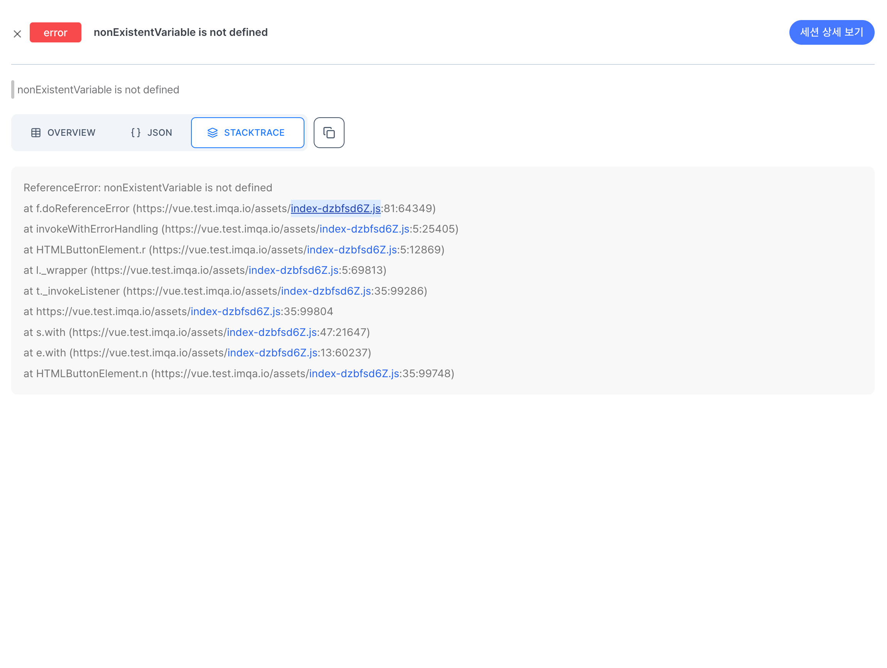

- **Overview**: 수집된 로그 메시지와 Attribute 정보를 확인할 수 있습니다.
- **Attributes(속성 정보)**: 로그와 함께 수집된 다양한 속성의 값들을 확인할 수 있습니다.
- **stacktrace(스택 트레이스 정보)**: 오류 및 예외의 경우, 스택 트레이스 정보를 확인할 수 있습니다. 

스택 트레이스 정보에 링크 텍스트로 표시된 [파일명] 을 클릭하면 하단 영역에 원본 소스 코드 블럭을 표시합니다. 
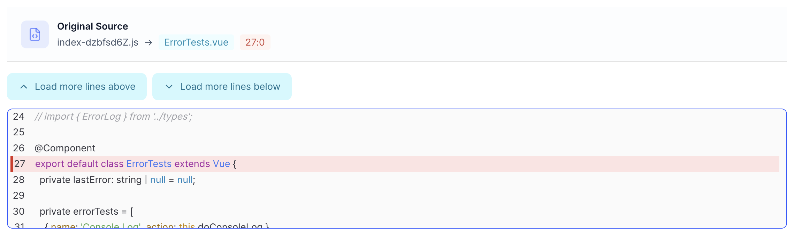
- `스택 트레이스로 수집한 파일명`  → `소스맵 적용한 원본 파일명` `line:column` 정보가 표시됩니다.
- 에러 발생 라인을 기준으로,  [▲], [▼] 버튼을 통해 추가 라인을 표시할 수있습니다.

<Gha keyword="TIP" title="매핑 파일을 통한 난독화된 정보 가독화(Decoding)">
IMQA 매핑 파일 관리를 통해 앱 버전별 매핑 파일을 업로드하여 ProGuard, Symbolication 등이 적용된 서비스에서 클래스 명과 함수 명을 가독화할 수 있습니다. 매핑 파일 관리에 대한 자세한 내용은 **설정 > 매핑 파일 관리**를 참고하시거나, 관리자에게 문의해주세요.
</Gha>

- [세션 상세 보기]를 클릭하면 해당 트레이스가 수집된 사용자의 **세션 상세(트레이스 목록)** 으로 이동할 수 있습니다.

---

## 8. 설정
---
<Gha keyword="NOTE" title="(특정 서비스) 설정 메뉴 접근 권한">

IMQA의 특정 서비스 설정 메뉴는 `MANAGER` 역할 이상의 권한 사용자에게만 제공됩니다.

<ul>
  <li>- **알림 관리**: `MANAGER` 이상 역할 사용자에게만 표시, 접근할 수 있습니다. 서비스 단위 또는 앱 단위 알림을 설정할 수 있습니다.</li>
  <li>- **화면 관리**: `MANAGER` 이상 역할 사용자에게만 표시, 접근할 수 있습니다. 서비스로 수집된 여러 화면 정보 중 IMQA에서 표시할 이름(별명)과 화면 그룹 단위를 관리할 수 있습니다.</li>
  <li>- **서비스 설정**: `MANAGER` 이상 역할 사용자에게만 표시, 접근할 수 있습니다. 서비스에 등록된 앱 관리와 매핑 파일을 관리할 수 있습니다.</li>
</ul>
</Gha>
<Gha keyword="TIP" title="통합 관리 기능 제공">

서비스 관리는 통합 관리 기능으로만 제공되며, 서비스별 설정 메뉴인 앱 관리, 매핑 파일 관리 기능은 **통합 관리 기능으로도 제공** 됩니다. 전체 리소스에 대한 접근 권한과 `SUPER_USER` 이상의 권한이 있는 담당자가 여러 서비스를 일괄로 관리할 수도 있습니다.

</Gha>

---
## 8-1. 알림 설정

IMQA 알림 설정을 통해 서비스 지표에 따른 임계치를 설정하여 서비스의 상태와 위험 상황을 인지할 수 있습니다. IMQA 알림 발생 시, Webhook 방식 등을 설정하여 원하는 수신처에서 알림을 받을 수 있습니다.

<Gha keyword="TIP" title="IMQA 알림 방법">
기본 IMQA에서 등록한 알림 정책에 의한 알림 발생시, Webhook 방식으로 알림을 받을 수 있으며, 기업 환경에 따라 사내 메신저를 연동하여 알림을 받을 수 있습니다.
</Gha>

<Gha keyword="WARNING" title="알림 설정">
알림 설정 기능은 빠른 시일 내 업데이트 예정입니다.
</Gha>

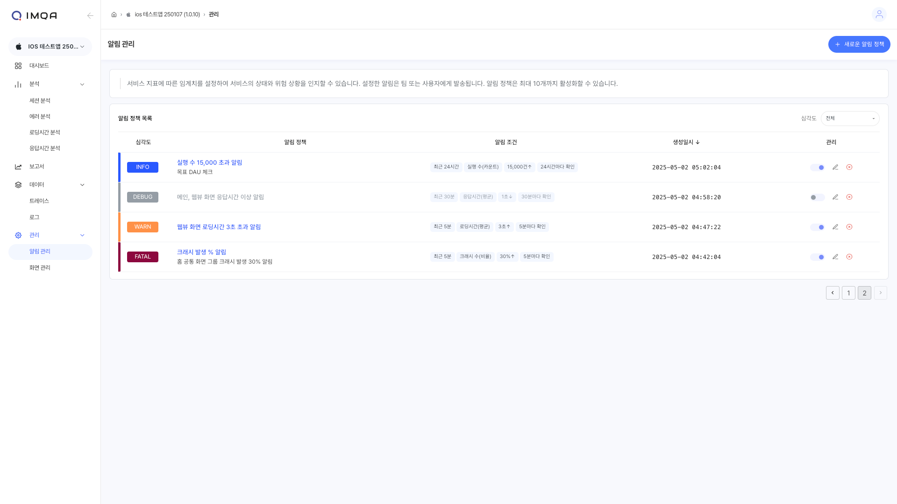

---
## 8-2. 화면 관리

IMQA로 수집된 여러 화면 정보 중, IMQA 화면 관리를 통해 IMQA에서 표시할 이름(별명)을 설정하거나, 화면 그룹으로 묶어 집계 기준으로 사용하도록 관리할 수 있습니다.

<Gha keyword="TIP" title="화면 관리에서의 화면 목록">
화면 관리 페이지에서 화면 목록은 표시 이름(별명) 또는 화면 그룹을 설정한 **관리된 화면 목록이 표시**됩니다. **CSV로 화면 관리** 기능을 사용하여 화면 관리를 시작할 수 있습니다.
</Gha>

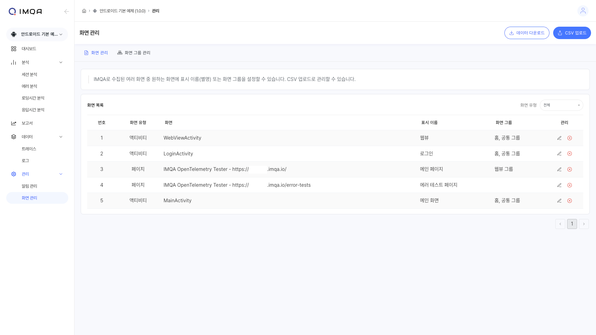

IMQA 화면 관리는 다음과 같이 구성됩니다.

**❶ 툴바(화면 관리)**

**❷ 화면 목록**

---

### 툴 바

**❶** 데이터 다운로드: 현재 화면에 표시된 조회 결과를 `.csv`로 다운로드할 수 있습니다. 

❷ CSV로 화면 관리: CSV 파일 업로드를 통해 수집된 전체 화면을 대상으로, 관리할 화면의 표시 이름과 화면 그룹을 일괄 관리할 수 있습니다.

### CSV로 화면 관리

화면 관리 페이지 오른쪽 상단의 [+ CSV로 화면 관리] 버튼을 클릭하면 CSV 파일을 업로드할 수 있는 팝업이 표시됩니다.

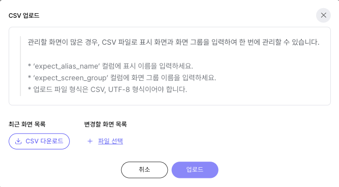

❶ **최근 화면 목록** [CSV 다운로드]를 클릭하면 `.csv` 파일을 저장합니다.

❷ CSV 파일을 열면 현재까지 IMQA로 수집된 전체 화면 목록이 표시됩니다.

❸ 이미 설정된 정보가 있는 화면의 경우, CSV 파일 내 `current_alias_name` 컬럼에 현재 표시 이름과 `current_screen_group` 컬럼에 현재 화면 그룹명이 표시됩니다.

❹ CSV 파일 내 `expect_alias_name`에 표시할 화면 이름과 `expect_screen_group`에 설정할 화면 그룹명을 입력합니다.
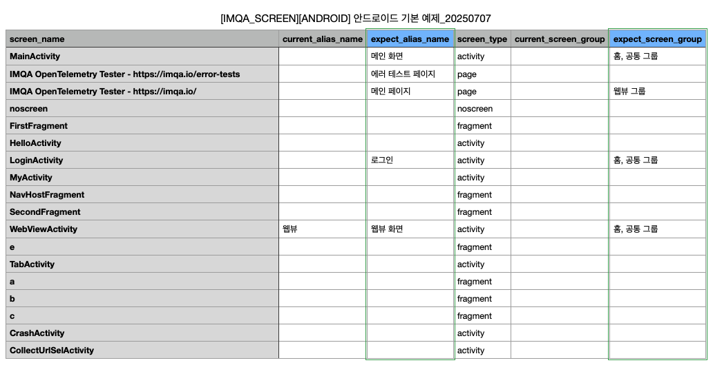
❺ 정보 작성이 완료되면 `CSV UTF-8` 형식으로 저장합니다. CSV로 화면 관리 팝업에서 [파일 선택] 후, [업로드] 버튼을 클릭합니다.

<Gha keyword="NOTE" title="CSV로 화면 관리를 통해 화면을 관리하는 경우, 아래의 내용을 참고해 주세요.">

1. 기존 생성한 화면 그룹이 있고, 해당 화면 그룹에 설정하려는 경우 **동일한 화면 그룹명**으로 입력해 주세요. 기존 화면 그룹명과 일치하지 않을 경우, 새로운 화면 그룹이 생성됩니다.

2. `expect_alias_name` 컬럼과 `expect_screen_group` 컬럼에 변경 내용이 있을 경우에만 화면에 적용 되며, 다른 정보성 컬럼의 변경 내용은 적용되지 않습니다.

3. 각 화면 행을 비교하여 적용되므로, CSV 파일 내 정렬 변경 또는 행 삭제 등으로 인한 영향은 없습니다.

</Gha>
<Gha keyword="NOTE" title="CSV로 화면 관리에 문제가 있을 경우">
CSV 파일 업로드 과정에서 문제가 있을 경우 (예: [업로드] 버튼을 클릭해도 업로드 되지 않는 경우), CSV 파일에 DRM(Digital Rights Management) 적용이 되어있을 수 있습니다. 내부 환경을 다시 확인하시거나, 문제가 있으실 경우 관리자에게 문의해 주세요.
</Gha>

### 화면 목록

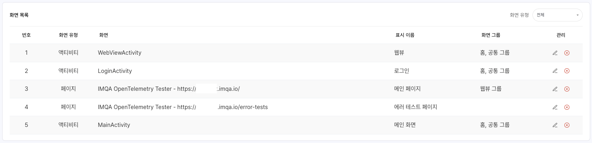

#### 필터

- **화면 유형**: 전체, 화면 유형에 따라 화면 목록을 필터링합니다.

#### 화면 목록

현재 관리된 화면의 표시 이름과 화면 그룹 정보를 확인할 수 있습니다. 기본은 최근 생성일시 순으로 정렬 됩니다.

- **관리**: 화면 표시 이름을 수정하거나 화면 관리 정보를 삭제할 수 있습니다.
    - [수정] 아이콘 클릭 시, 해당 **화면 관리 정보** 팝업이 표시됩니다. 정보 확인 후 [수정]할 수 있습니다.
    - [삭제] 아이콘 클릭 시, 해당 화면의 관리 정보(표시 이름, 소속 화면 그룹 정보)를 삭제할 수 있습니다. 

### 화면 수정

화면의 관리 정보를 수정할 수 있습니다. 표시 이름을 재설정하거나, 소속 화면 그룹을 재설정할 수 있습니다.

---
## 8-3. 화면 그룹 관리

IMQA 화면 그룹 관리를 통해 주요 업무 단위 또는 메뉴 단위 등 여러 화면을 그룹으로 관리할 수 있습니다. 화면 그룹 단위로 소속 화면을 설정할 수 있습니다.

<Gha keyword="TIP" title="화면 그룹 관리 시작">
화면 그룹 관리는 미리 사용할 화면 그룹을 생성하거나, **CSV로 화면 관리** 기능으로 시작하실 수 있습니다. **CSV로 화면 관리**에 대한 내용은 '화면 관리 > CSV로 화면 관리' 를 참고하세요.
</Gha>

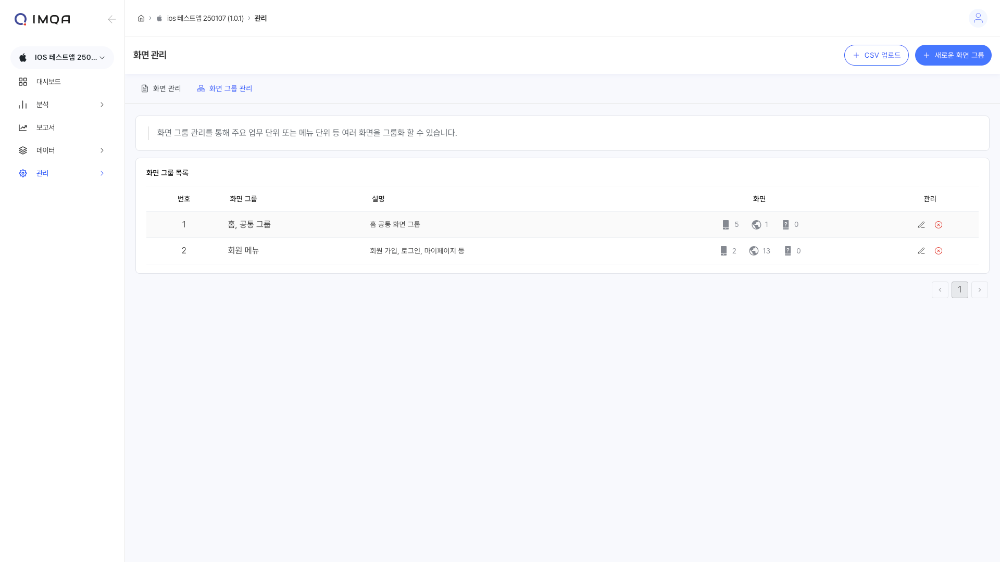

IMQA 화면 그룹 관리는 다음과 같이 구성됩니다.

**❶ 툴바(화면 그룹 관리)**

**❷ 화면 그룹 목록**

---

### 툴 바

**❶ CSV로 화면 관리:** CSV 파일 업로드를 통해 수집된 전체 화면을 대상으로, 관리할 화면의 표시 이름과 화면 그룹을 일괄 관리할 수 있습니다.

<Gha keyword="NOTE" title="CSV 파일 업로드">
**CSV로 화면 관리**에 대한 내용은 '화면 관리 > CSV로 화면 관리' 를 참고하세요.
</Gha>

❷ **새로운 화면 그룹**: 새 화면 그룹을 등록합니다.

### 화면 그룹 추가

화면 관리> 화면 그룹 관리 페이지 오른쪽 상단의 [+ 새로운 화면 그룹] 버튼을 클릭하면 화면 그룹을 추가할 수 있는 팝업이 표시됩니다.

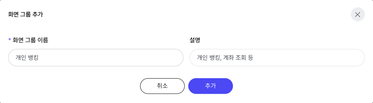

❶ 화면 그룹 이름과 설명을 입력합니다.

❷ 정보 작성이 완료되면 [추가] 버튼을 클릭합니다.

### 화면 그룹 목록

<Gha keyword="WARNING" title="(No Group)의 표시">
`(No Group)`은 화면 그룹 목록에 표시되지 않습니다.
</Gha>

#### 화면 그룹 목록

현재 등록된 화면 그룹과 소속 화면 수를 확인할 수 있습니다. 기본은 최근 생성일시 순으로 정렬 됩니다.

- **화면**: 해당 화면 그룹에 속한 화면 수를 화면 유형별 아이콘으로 구분하여 표시합니다.
- (아이콘 구분 설명 이미지)
- **관리**: 화면 그룹을 수정하거나 삭제할 수 있습니다.
    - [수정] 아이콘 클릭 시, 해당 **화면 그룹 정보** 팝업이 표시됩니다. 정보 확인 후 [수정]하거나 [삭제]할 수 있습니다.
    - [삭제] 아이콘 클릭 시, 해당 화면 그룹을 삭제할 수 있습니다.

### 화면 그룹 정보

화면 그룹의 기본 정보와 소속 화면 목록을 확인할 수 있습니다. 화면 그룹 정보를 수정하거나 삭제할 수 있습니다.

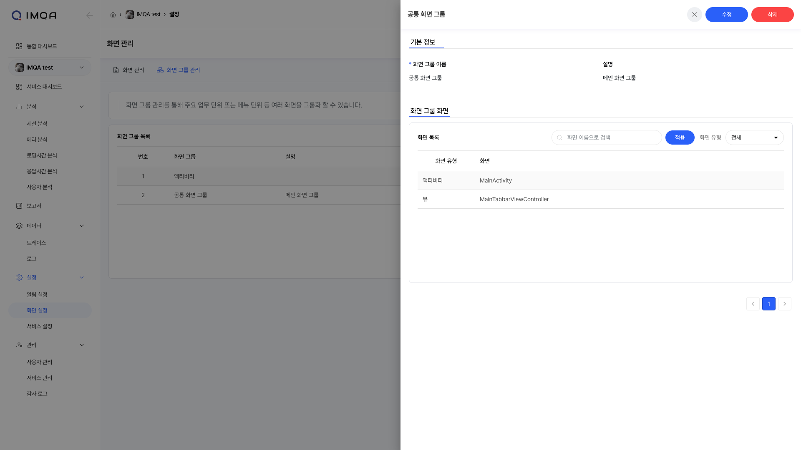

#### 툴 바

- [닫기] 아이콘 클릭 및 바깥 영역을 클릭하면 팀 정보 팝업을 닫습니다.
- [수정] 버튼 클릭 시, 해당 화면 그룹의 정보를 수정할 수 있습니다.
- [삭제] 버튼 클릭 시, 해당 화면 그룹을 삭제할 수 있습니다.

#### 기본 정보

화면 그룹 이름, 설명 정보가 표시됩니다.

#### 화면 그룹 화면

화면 그룹에 속한 화면 목록이 표시됩니다. 각 화면은 하나의 화면 그룹에만 속할 수 있습니다.

### 화면 그룹 수정

화면 그룹의 기본 정보를 수정할 수 있습니다. 소속 화면을 설정할 수 있습니다.

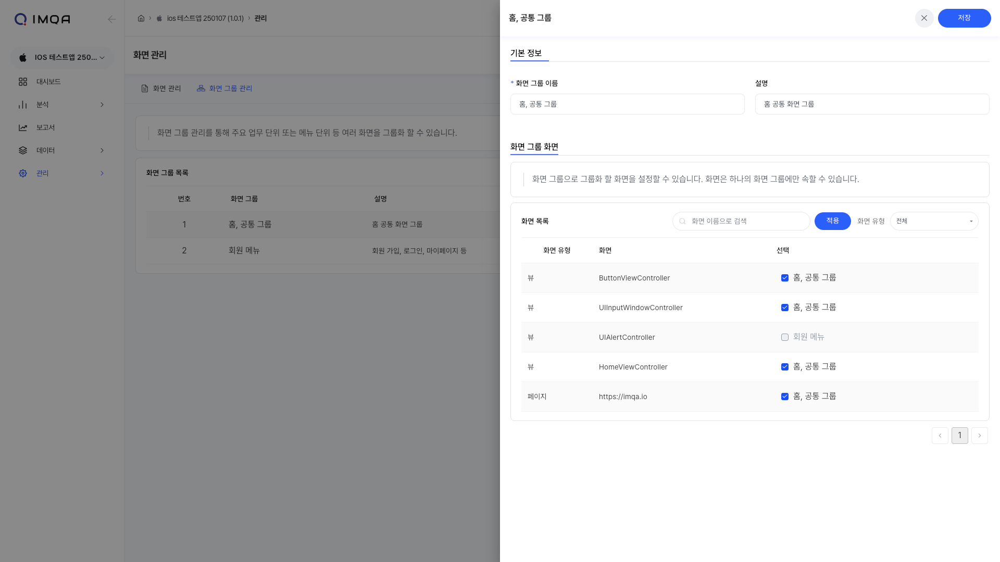

❶ **화면 그룹** **이름**과 **설명**을 변경할 수 있습니다.

❷ 화면 그룹 화면을 설정합니다. 화면 이름으로 검색하거나, 화면 유형으로 필터링할 수 있습니다. 이미 다른 화면 그룹에 속한 화면은 설정할 수 없습니다.

<Gha keyword="TIP" title="화면 그룹 화면 목록">
화면 그룹 수정 페이지에서의 화면 목록은 표시 이름(별명) 또는 화면 그룹을 설정한 **관리된 화면 목록이 표시**됩니다. **CSV로 화면 관리** 기능을 사용하여 새로운 화면을 해당 그룹에 소속시킬 수 있습니다. **CSV로 화면 관리**에 대한 내용은 '화면 관리 > CSV로 화면 관리' 를 참고하세요.
</Gha>

❸ 정보 수정이 완료되면 [저장] 버튼을 클릭합니다.

---

## 8-4. 앱 관리

IMQA 앱 관리를 통해 IMQA에서 분석할 관리할 수 있습니다. 앱 단위로 앱 버전을 관리할 수 있으며, 전체 또는 특정 앱 버전의 데이터 수집을 ON/OFF 할 수 있는 SDK 수집 설정 기능을 제공합니다.

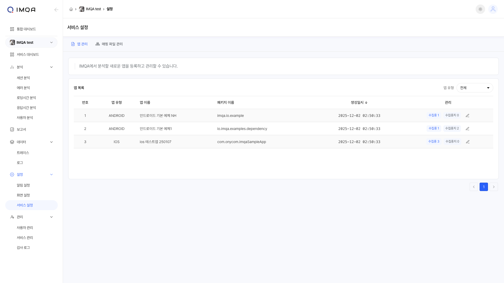

---

### 앱 목록

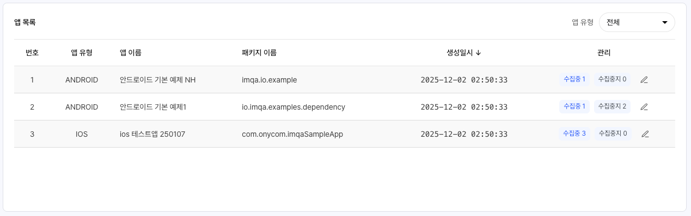

#### 필터

- **앱 유형**: 전체, Android, iOS, Web 유형으로 앱 목록을 필터링합니다.

#### 앱 목록

현재 등록된 IMQA 앱을 확인할 수 있습니다. 기본은 최근 생성일시 순으로 정렬 됩니다.

- **관리**: 해당 앱의 데이터 수집 상태를 표시합니다. 앱을 수정하거나 삭제할 수 있습니다.
	- `수집중 #`: 해당 앱에 추가된 앱 버전 중, 데이터 수집 ON 앱 버전의 수를 표시합니다.
	- `수집중지 #`: 해당 앱에 추가된 앱 버전 중, 데이터 수집 OFF 앱 버전의 수를 표시합니다.
	- [수정] 아이콘 클릭 시, 해당 **앱 정보** 팝업이 표시됩니다. 정보 확인 후 [수정]할 수 있습니다.

### 앱 정보

앱의 기본 정보와 앱 키, 현재 추가된 앱 버전과 데이터 수집 상태를 확인할 수 있습니다. 앱 정보를 수정할 수 있습니다.

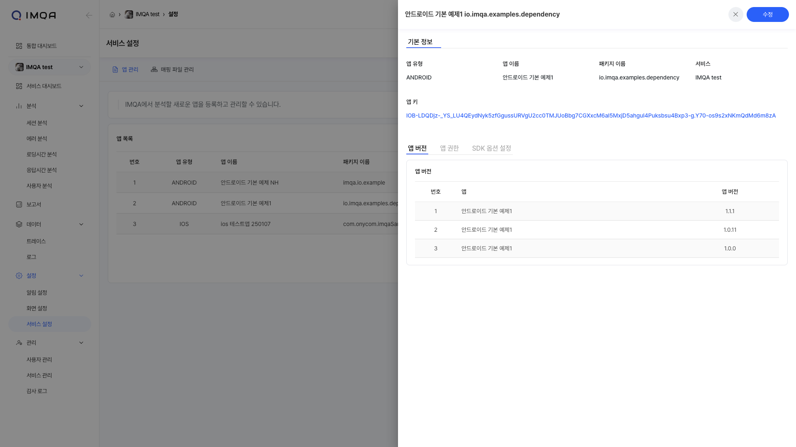

#### 툴 바

- [닫기] 아이콘 클릭 및 바깥 영역을 클릭하면 앱 정보 팝업을 닫습니다.
- [수정] 버튼 클릭 시, 해당 앱의 정보를 수정할 수 있습니다.

#### 기본 정보

- 앱 등록 시 설정한 앱 유형, 입력한 앱 이름, 패키지 이름 정보가 표시됩니다.
- 앱 등록 시 생성된 앱 키 정보가 표시됩니다.

#### 앱 버전

해당 앱에 등록된 앱 버전을 확인할 수 있습니다. 현재 사용하고 있는 앱 버전과 사용하지 않는 앱 버전을 구분할 수 있습니다.

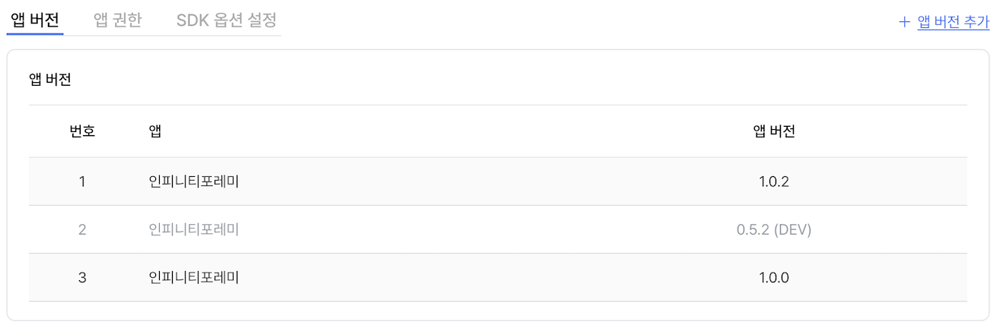

❶ [+ 앱 버전 추가] 버튼을 클릭하면 앱 버전을 추가할 수 있는 팝업이 표시됩니다.

❷ 앱 이름을 확인하고 앱 버전을 입력합니다.

<Gha keyword="NOTE" title="앱 버전">
IMQA에서는 앱 버전을 구분하여 데이터를 관리할 수 있습니다. 모바일, 웹 앱의 릴리즈 버전, 테스트 버전 등 여러 앱 버전을 기준으로 데이터를 그룹화하고, 집계/분석할 수 있습니다.
</Gha>

❸ 정보 작성이 완료되면 [추가] 버튼을 클릭합니다.

❹ 등록한 앱 버전을 확인할 수 있습니다.

#### 앱 권한

해당 앱에 접근 권한을 가진 팀을 확인할 수 있습니다. 현재 어떤 팀이 앱에 접근할 수 있는지를 파악할 수 있습니다. `(기본 팀)`은 모든 앱의 접근 권한을 가지고 있습니다.

<Gha keyword="TIP" title="앱 접근 권한 관리">
**사용자 관리 > 팀 관리 > 팀 수정** 에서 앱 접근 권한을 [추가/수정/삭제] 할 수 있습니다. 자세한 내용은 관리자에게 문의해주세요.
</Gha>

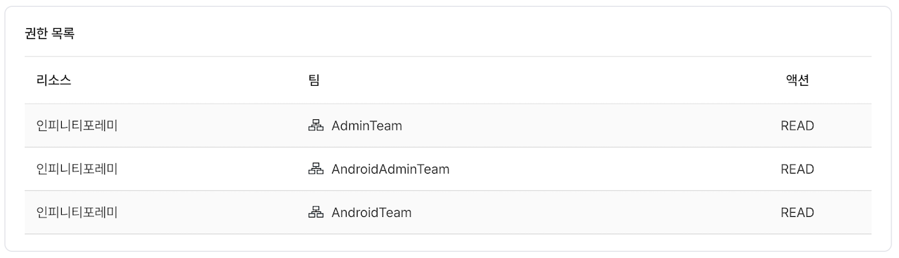

#### SDK 옵션 설정

해당 앱에 등록된 앱 버전별 데이터 수집 상태를 확인할 수 있습니다. 최근 설정 일시와 현재 어떤 앱 버전 데이터를 수집하고 있는지를 파악할 수 있습니다. 특정 앱 버전에 데이터 드롭 정책이 사용 중인지도 확인 가능합니다.

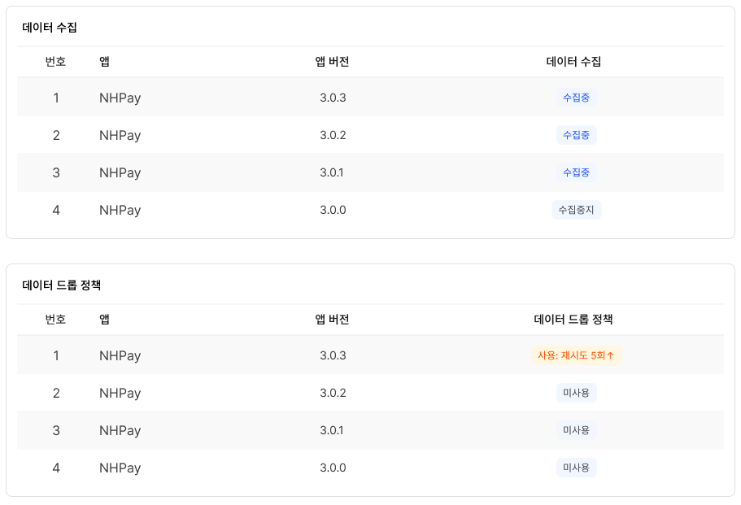

### 앱 수정

앱의 기본 정보를 수정하거나 앱 버전을 관리할 수 있습니다. 전체 또는 특정 앱 버전의 데이터 수집을 ON/OFF 할 수 있습니다.

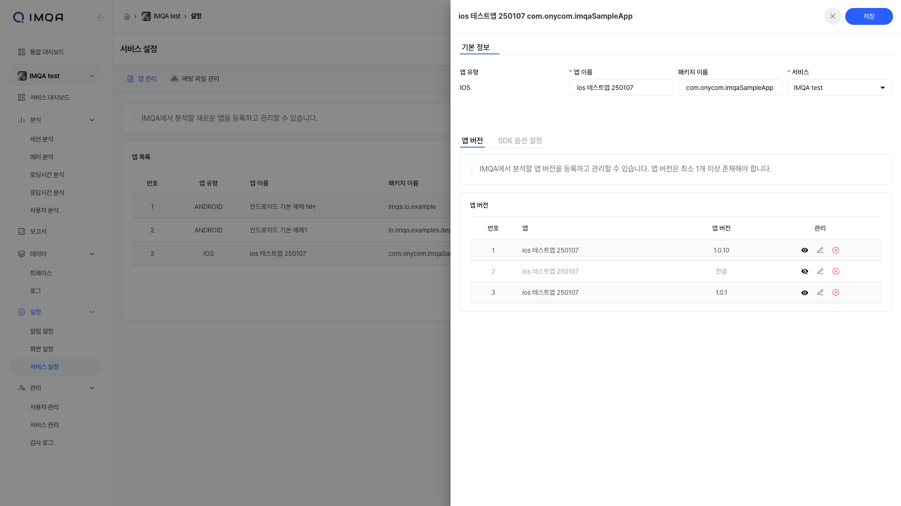

❶ **앱의 이름**과 **패키지 이름** 정보를 변경할 수 있습니다. **앱 유형**은 변경이 불가합니다.
<Gha keyword="WARNING" title="패키지 이름 변경">
IMQA는 모바일 앱과 웹 브라우저에서 수집한 데이터를 식별하기 위해 패키지 이름을 사용합니다. 패키지 이름을 변경하면 이전 패키지 이름으로 저장된 데이터가 조회되지 않을 수 있습니다. **실제 앱 패키지 이름** 및 **WebAgent 설치시 `serviceName`으로 사용할 이름**으로 변경해 주세요. 패키지 이름에는 a-z, A-Z, 0-9, -, _, .만 입력할 수 있습니다.
</Gha>

❷ 앱 버전을 추가하거나 수정, 삭제할 수 있습니다.

❸ 앱 버전별 데이터 수집을 ON/OFF 할 수 있습니다.

❸ 정보 수정이 완료되면 [저장] 버튼을 클릭합니다.

#### 앱 버전 관리

앱 수정 단계에서 IMQA에서 분석할 앱 버전을 등록하고 관리할 수 있습니다.

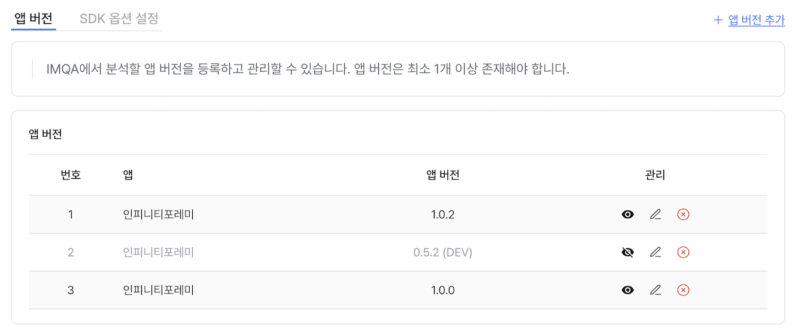

❶ [+ 앱 버전 추가] 버튼을 클릭하면 앱 버전을 추가할 수 있는 팝업이 표시됩니다.

❷ 등록한 앱 버전을 수정, 삭제할 수 있습니다. 

❸ 등록한 앱 버전을 숨길 수 있습니다.

<Gha keyword="NOTE" title="앱 버전 보기/숨김 설정">
IMQA에서는 등록된 앱 버전 중 더 이상 관리하지 않을 버전을 숨길 수 있습니다. 지원이 끝난 앱 버전 또는 개발 버전 등의 비활성화에 활용할 수 있습니다. 앱 버전 숨김 설정시, 앱 목록 등에서 표시되지 않습니다. 현재 앱 버전 보기/숨김 처리는 앱 버전의 “표시여부” 설정 기능이며, 해당 앱 버전의 데이터 수집 비활성화 등의 기능으로 동작하지 않습니다.
</Gha>

#### SDK 옵션 설정

앱 수정 단계에서 SDK/Agent 데이터 수집을 ON/OFF 하거나, 데이터 드롭 정책을 설정하고 제어할 수 있습니다. 서비스 안정화 또는 데이터 수집량 제어 등에 활용할 수 있습니다.

<Gha keyword="TIP" title="SDK 옵션 설정 변경 기록의 확인">
앱 버전별 SDK 옵션 설정 변경 기록은 **관리 > 감사로그**에 기록됩니다.
</Gha>

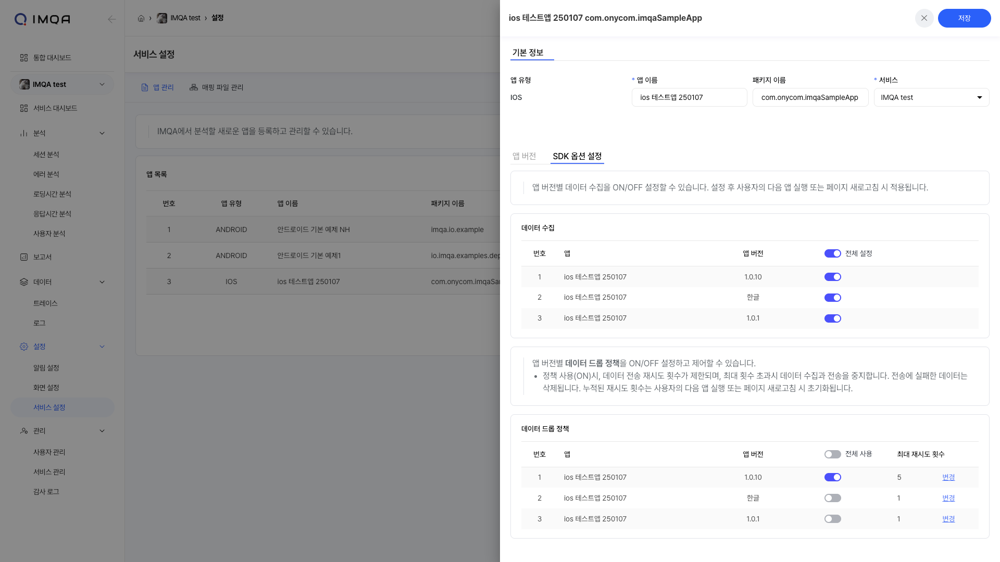

##### | 데이터 수집

앱 버전별 데이터 수집을 ON/OFF 할 수 있습니다. 서비스 안정화 또는 데이터 수집량 제어 등에 활용할 수 있습니다. 설정 후 사용자의 다음 앱 실행 또는 페이지 새로고침 시 적용됩니다.

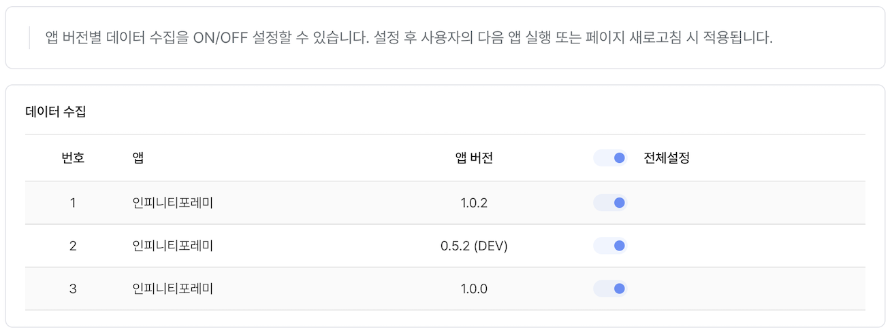

❶ 전체 앱 버전의 데이터 수집을 ON/OFF 할 수 있습니다. 기본은 전체 `ON` 으로 설정되어 있습니다. 

❷ 특정 앱 버전의 데이터 수집만 ON/OFF 할 수 있습니다. 

<Gha keyword="WARNING" title="데이터 수집 ON/OFF 적용 시점">
앱 버전별 데이터 수집 ON/OFF 설정이 사용자에게 적용되는 시점은 사용자마다 다를 수 있습니다. 해당 앱 버전을 사용하는 사용자의 다음 앱 실행 또는 페이지 새로고침 시 데이터가 수집 제어됩니다.
사용자의 접속 환경에서 IMQA SDK, WebAgent가 처음 실행될 때 데이터 수집 ON/OFF 상태를 확인, 저장 후 사용자의 다음 앱 실행 시점에 적용하므로, 모든 사용자에게 즉시 반영되지 않습니다. 자세한 내용은 IMQA 담당자에게 문의해 주세요.
</Gha>

##### | 데이터 드롭 정책

앱 버전별 데이터 드롭 정책을 ON/OFF 설정하고 제어할 수 있습니다. 특정 앱 버전에 데이터 드롭 정책 사용을 설정하면, 최대 재시도 횟수를 설정할 수 있습니다. 예기치 못한 서버 문제가 발생한 경우 서비스 안정성 확보 또는 무분별한 데이터 재전송 시도 제어 등에 활용할 수 있습니다. 

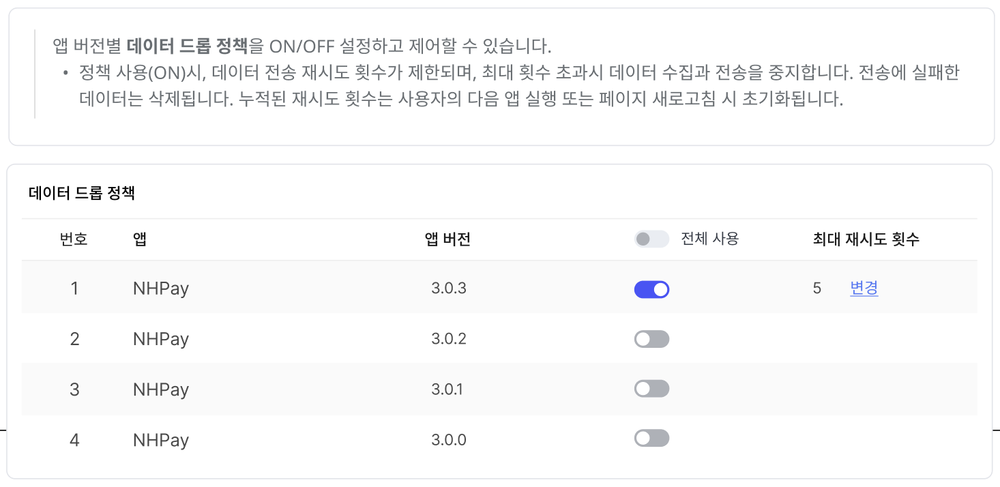

❶ 전체 앱 버전의 데이터 드롭 정책을 ON/OFF 할 수 있습니다. 기본은 전체 `OFF` 로 설정되어 있습니다. 

❷ 특정 앱 버전의 데이터 드롭 정책만 ON/OFF 할 수 있습니다. 

❸ 특정 앱 버전에 데이터 드롭 정책 사용시, 데이터 전송 재시도 최대 횟수를 제한할 수 있습니다. 기본은 `5` 로 설정되어 있습니다. 

<Gha keyword="TIP" title="데이터 드롭 정책 ON/OFF 적용 시점">
앱 버전별 데이터 드롭 정책 ON/OFF 설정이 사용자에게 적용되는 시점은 사용자마다 다를 수 있습니다. 
사용자의 접속 환경에서 IMQA SDK, WebAgent가 처음 실행될 때 데이터 드롭 정책 ON/OFF 상태를 확인, 저장 후 해당 세션(실행) 동안 데이터 전송 실패 횟수를 누적하여 제어합니다. 자세한 내용은 IMQA 담당자에게 문의해 주세요.
</Gha>

<Gha keyword="WARNING" title="데이터 드롭 정책 사용시 주의 사항">
데이터 드롭 정책 사용은 현재 수집 서버가 모든 데이터를 정상적으로 수신할 수 없는 상태인 경우에 활용될 수 있습니다. 일반적으로 운영 환경에서 사용자의 네트워크 상태에 따라 데이터 전송이 실패하는 경우가 다수 발생할 수 있습니다 (예: 엘리베이터 탑승 중). 데이터 드롭 정책은 해당 세션(실행) 동안의 재시도 횟수 초과 시 전송에 실패한 데이터를 삭제하므로 1개 세션에서 일부 데이터가 유실되는 데이터 정합성 이슈가 발생할 수 있습니다. 정책 사용시, 최대 재시도 횟수를 점진적으로 조정하며 관리하는 것을 권고합니다. 자세한 내용은 IMQA 담당자에게 문의해 주세요.
</Gha>

---

## 8-5. 매핑 파일 관리

IMQA 매핑 파일 관리를 통해 앱 버전별 매핑 파일을 업로드하여 ProGuard, Symbolication 등이 적용된 앱에서 클래스 명과 함수 명을 가독화할 수 있습니다. 

<Gha keyword="NOTE" title="지원되는 난독화 종류 및 업로드 파일 크기 제한">

IMQA는 현재 앱 유형별 아래의 역난독화를 지원하고 있습니다. 난독화 종류는 지속적으로 업데이트 예정입니다.

<ul>
  <li>- **Android**: ProGuard, Allatori, Source Map(웹뷰)</li>
  <li>- **iOS**: dSYM, Source Map(웹뷰)</li>
  <li>- **Web**: Source Map</li>
</ul>

매핑 파일 업로드 시, 200MB 이하의 매핑 파일만 업로드할 수 있습니다. 제한 용량 이상의 파일 업로드는 IMQA 담당자에게 문의해 주세요.

</Gha>
<Gha keyword="TIP" title="매핑 파일의 적용 시점">
ProGuard, dSYM 등의 경우, 매핑 파일 업로드 이후부터 수집되는 난독화 정보를 가독화 하여 저장합니다. 업로드 한 매핑 파일 적용에 다소 시간이 소요될 수 있으며, 스택 트레이스 조회 시점에 난독화 정보로 보여질 수 있습니다. 
Source Map의 경우, 수집된 웹 에러 스택 트레이스 정보 조회 시 먼저 웹 버전이 일치하는 소스맵 파일을 즉시 적용합니다. 일치하는 웹 버전 소스맵 파일이 없을 경우 앱 버전이 일치하는 소스맵 파일을 즉시 적용합니다.
</Gha>

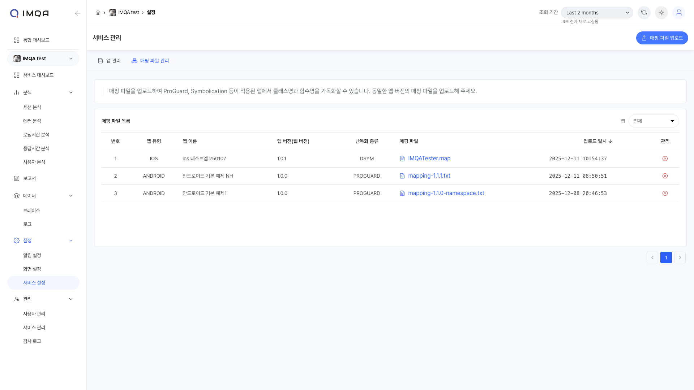

IMQA 매핑 파일 관리는 다음과 같이 구성됩니다.

❶ **툴바(매핑 파일 관리)**

**❷ 매핑 파일 목록**

---
### 툴 바

**❶ 매핑 파일 업로드:** 새 매핑 파일을 업로드할 수 있습니다. 

### 매핑 파일 업로드

앱 관리 > 매핑 파일 관리 페이지 오른쪽 상단의 [+ 매핑 파일 업로드] 버튼을 클릭하면 매핑 파일을 업로드할 수 있는 팝업이 표시됩니다.

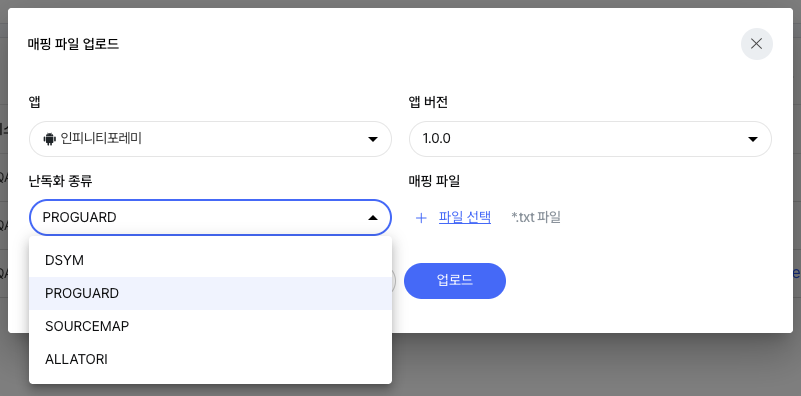

❶ **앱**과 **앱 버전**을 선택합니다.

❷ **난독화 종류**를 선택합니다.

<Gha keyword="TIP" title="난독화 종류">
IMQA에서는 난독화 종류를 구분하여 매핑 파일을 관리할 수 있습니다. 모바일 앱의 버전에 사용한 난독화 종류(솔루션)의 매핑 파일을 업로드 해야 하며, 동일한 앱 버전에 같은 종류의 여러 매핑 파일이 업로드 되어있을 경우, **가장 최신 매핑 파일을 가독화(Decoding) 로직에 사용**합니다.
</Gha>

❸ 난독화 종류에 맞는 **매핑 파일**을 선택합니다.

#### | Android ProGuard

Android의 Build 과정에서 생성된 ProGuard 매핑 파일을 업로드할 수 있습니다. ‘mapping.txt’, ‘map.txt’ 등 `.txt` 파일을 업로드해 주세요.

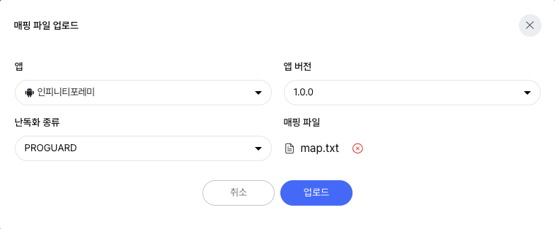
<Gha keyword="WARNING" title="매핑 파일을 통한 난독화된 정보 가독화(Decoding)">
매핑 파일 업로드 이후부터 수집되는 난독화 정보를 가독화 하여 저장합니다. 업로드 한 매핑 파일 적용에 다소 시간이 소요될 수 있으며, 스택 트레이스 조회 시점에 난독화 정보로 보여질 수 있습니다. 
</Gha>

#### | Android Allatori

Android의 Build 과정에서 생성된 Allatori 매핑 파일을 업로드할 수 있습니다. ‘mapping.xml’ 등 `.xml` 파일을 업로드해 주세요.

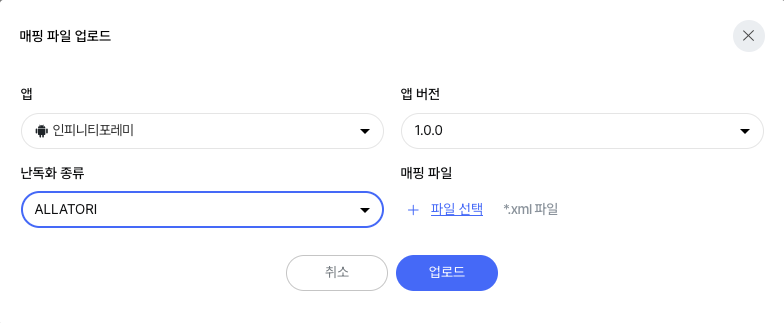
<Gha keyword="WARNING" title="매핑 파일을 통한 난독화된 정보 가독화(Decoding)">
매핑 파일 업로드 이후부터 수집되는 난독화 정보를 가독화 하여 저장합니다. 업로드 한 매핑 파일 적용에 다소 시간이 소요될 수 있으며, 스택 트레이스 조회 시점에 난독화 정보로 보여질 수 있습니다. 
</Gha>

#### | iOS dSYM

iOS의 Build 과정에서 생성된 dSYM 파일을 업로드할 수 있습니다. ‘dSYM’ 패키지 안의 `바이너리 파일` 에 `.map` 확장자를 붙여 업로드해 주세요.
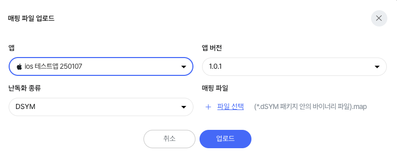
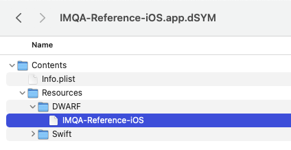
- `.dSYM` 파일 [패키지 내용 보기] → Contents > Resources > DWARF > `(바이너리 파일)` > (사본생성) > `(바이너리 파일)` 이름 수정 > `(바이너리 파일).map` 업로드

<Gha keyword="NOTE" title="(바이너리 파일).map">
IMQA에서는 정보 보안을 위해 허용되는 확장자 외 파일 업로드를 제한하고 있습니다. dSYM 바이너리 파일의 경우, `(바이너리 파일).map` 로 확장자를 확인하고 있습니다.
</Gha>

<Gha keyword="WARNING" title="매핑 파일을 통한 난독화된 정보 가독화(Decoding)">
매핑 파일 업로드 이후부터 수집되는 난독화 정보를 가독화 하여 저장합니다. 업로드 한 매핑 파일 적용에 다소 시간이 소요될 수 있으며, 스택 트레이스 조회 시점에 난독화 정보로 보여질 수 있습니다. 
</Gha>

#### | 공통 Source Map

Android, iOS 하이브리드 앱(웹뷰) 또는 Web 에서 수집된 웹 에러 스택 트레이스에서, 원본 소스 코드 위치를 파악할 수 있습니다.   

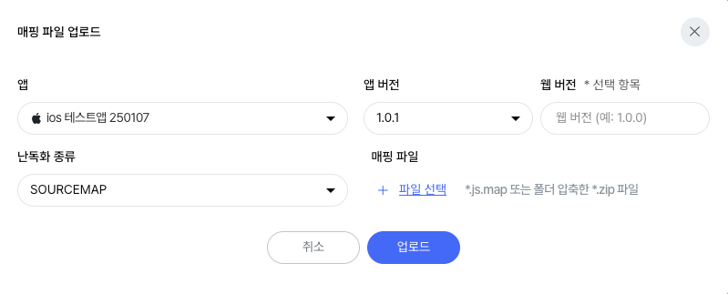
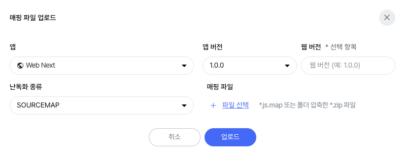

웹 Bundler 로 생성한 js.map 파일을 단일 업로드 또는 압축한 zip 파일로 업로드할 수 있습니다. ‘index.js.map’, ‘vue-js-map_100.zip’ 과 같이 `.map` 또는 `.zip`  파일을 업로드해 주세요.

<Gha keyword="TIP" title="Source Map 웹 버전으로 관리">
Source Map(웹뷰)의 경우, 앱 버전과 구분하여 웹 버전으로도 매핑 파일을 관리할 수 있습니다. (IMQA WebAgent에서 **웹 버전 설정** 하여 데이터 수집 필요) 자세한 내용은 **IMQA WebAgent 설치 가이드**를 참고해주세요.  
</Gha>

- `*.js.map`  업로드
-  `*.zip`  업로드

<Gha keyword="NOTE" title="매핑 파일을 통한 난독화된 정보 가독화(Decoding)">
Source Map의 경우, 수집된 웹 에러 스택 트레이스 정보 조회 시 먼저 웹 버전이 일치하는 소스맵 파일을 즉시 적용합니다. 일치하는 웹 버전 소스맵 파일이 없을 경우 앱 버전이 일치하는 소스맵 파일을 즉시 적용합니다.
</Gha>

### 매핑 파일 목록

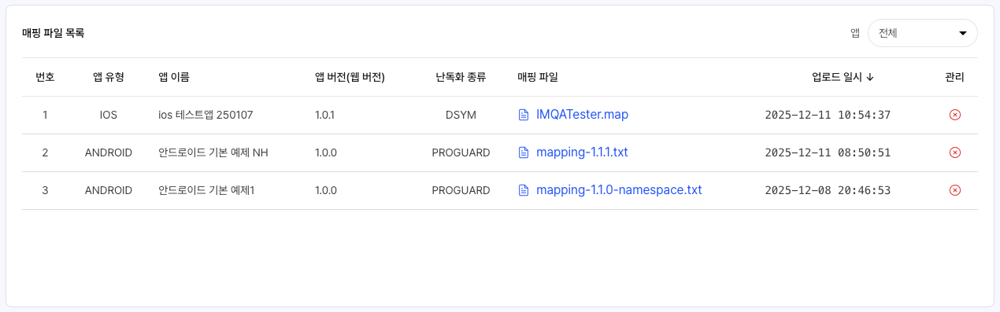

#### 필터

- **앱**: 전체, 특정 앱으로 매핑 파일 목록을 필터링합니다.

#### 매핑 파일 목록

현재 등록된 매핑 파일 목록을 확인할 수 있습니다. 기본은 최근 업로드 일시 순으로 정렬 됩니다.

- **매핑 파일**: 매핑 파일명을 클릭 시, 해당 파일을 로컬에 저장할 수 있습니다.
- **관리**: 매핑 파일을 삭제할 수 있습니다.
    - [삭제] 아이콘 클릭 시, 해당 매핑 파일을 삭제할 수 있습니다.

---

## 9. (통합) 관리
---
<Gha keyword="NOTE" title="통합 관리 메뉴 접근 권한">

IMQA의 통합 관리 메뉴는 `SUPER_USER` 권한 사용자에게만 제공됩니다.

<ul>
  <li>- **사용자 관리**: `SUPER_USER` 역할 사용자에게만 표시, 접근할 수 있습니다. **사용자 관리**와 **팀 관리**를 할 수 있습니다.</li>
  <li>- **서비스 관리**: `SUPER_USER` 역할 사용자에게만 표시, 접근할 수 있습니다. **서비스 관리**와 **앱 관리**, **매핑 파일 관리**를 할 수 있습니다.</li>
  <li>- **감사 로그**: `SUPER_USER` 역할 사용자에게만 표시, 접근할 수 있습니다.</li>
</ul>
</Gha>

<Gha keyword="TIP" title="통합 관리">
통합 관리 기능에 대한 자세한 내용은 **IMQA 관리자 가이드**를 참고하시거나, 관리자에게 문의해주세요.
</Gha>