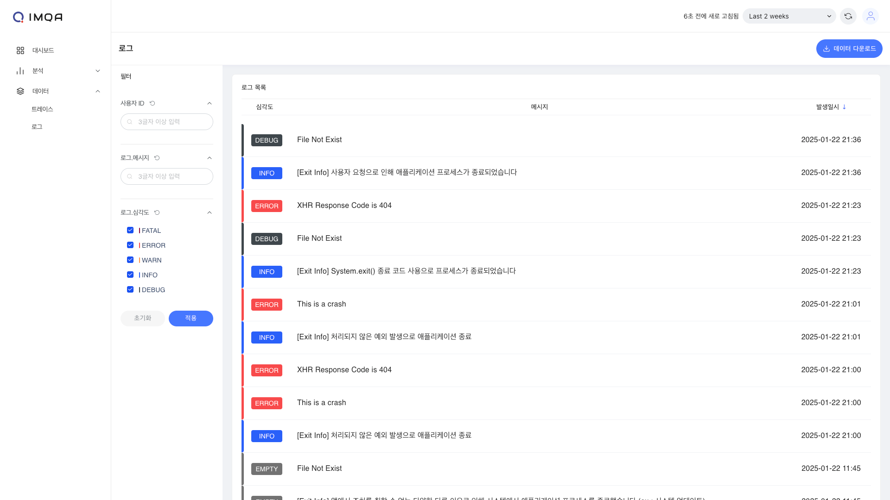

## IMQA 사용자 가이드

v1.0.0 `2025-01-24`

---

- [서비스](#서비스)
- [성능 대시보드](#성능-대시보드)
- [분석](#분석)
- [데이터 탐색기](#데이터-탐색기)
- [글로벌 관리](#글로벌-관리)

---

## 서비스

IMQA 서비스에서 모바일 앱과 웹 서비스의 버전 별 성능을 실시간 또는 원하는 기간으로 파악할 수 있습니다.
서비스는 Android 앱, iOS 앱, Web 앱 등 애플리케이션 그룹 단위입니다. 각 애플리케이션의 버전은 데이터를 집계하고 분석하기 위한 최소 단위입니다. 즉, 모든 앱, 웹 애플리케이션의 버전 별 현황 파악을 한눈에 할 수 있습니다.

IMQA 서비스는 다음과 같이 구성됩니다.

❶ **툴바(서비스)**

❷ **서비스 목록**

---

### 1. 툴 바

❶ **조회 조건**: 조회하고자 하는 기간을 선택할 수 있습니다. '최근 5분' 부터 '오늘' 등 빠른 버튼을 활용해 기간을 선택할 수 있으며, 'Custom' 으로 시작일시와 종료일시를 설정할 수 있습니다.

❷ **새로고침**: 현재 화면에 표시된 조회 결과 데이터를 새로고침합니다.

❸ **검색**: 원하는 키워드로 서비스를 조회할 수 있습니다. 조회하고자 하는 특정 서비스가 있을 경우 서비스 이름에 포함된 검색어를 입력합니다.

❹ **데이터 다운로드**: 현재 화면에 표시된 조회 결과를 `.xlsx`로 다운로드할 수 있습니다.

### 2. 서비스 목록

#### 필터

- **서비스 유형**: 전체, Android, iOS, WEB 유형으로 서비스 목록을 필터링합니다.

#### 서비스 목록

서비스 버전별 상태를 수치로 빠르게 파악할 수 있습니다. 기본은 실행 수 높은 순으로 정렬 됩니다.

- **서비스 명**: 등록한 서비스의 이름을 표시합니다.
- **서비스 버전**: 등록한 서비스의 버전을 표시합니다.
- **실행 수**: 조회 기간 동안 특정 서비스 버전이 실행된 수를 카운트합니다.
- **평균 로딩시간**: 조회 기간 동안 특정 서비스 버전의 화면 로딩시간 평균입니다.
- **평균 응답시간**: 조회 기간 동안 특정 서비스 버전의 응답시간 평균입니다.
- **크래시 수**: 조회 기간 동안 특정 서비스 버전에서 발생한 크래시를 카운트합니다.

서비스 항목 클릭 시, 해당 서비스의 버전을 기준으로 **성능 대시보드**로 이동할 수 있습니다.

---

## 성능 대시보드

IMQA 성능 대시보드는 다양한 성능 지표 구성을 제공합니다. 대시보드를 통해 모바일 앱과 웹 서비스의 버전 별 성능을 실시간 또는 원하는 기간으로 파악할 수 있습니다. 애플리케이션 요약 정보와 주 성능 현황을 시계열 데이터로 확인할 수 있으며, 성능 하위 목록을 통해 빠르게 이슈 포인트를 파악할 수 있습니다.

IMQA 성능 대시보드는 다음과 같이 구성됩니다.

❶ **툴바(성능 대시보드)**

❷ **앱 요약 정보**

❸ **시계열 성능 정보**

❹ **성능 하위 목록**

---

### 1. 툴 바

❶ **조회 조건**: 조회하고자 하는 기간을 선택할 수 있습니다. '최근 5분' 부터 '오늘' 등 빠른 버튼을 활용해 기간을 선택할 수 있으며, 'Custom' 으로 시작일시와 종료일시를 설정할 수 있습니다.

❷ **새로고침 간격**: 데이터의 새로고침 간격을 설정할 수 있습니다. '5초' 부터 '1일' 등 간격을 선택할 수 있으며, '자동 새로고침' 을 선택하면 설정한 간격으로 데이터를 새로고침 합니다.

❸ **전체 화면**: 대시보드를 브라우저 전체 화면으로 표시할 수 있습니다. `esc` 키로 전체 화면을 해제합니다.

### 2. 앱 요약 정보

선택한 서비스 버전의 상태를 수치로 빠르게 파악할 수 있습니다.

- **트레이스 수**: 조회 기간 동안 발생한 특정 행동(액션)을 카운트합니다.
- **에러 발생률 (세션)**: 조회 기간 동안 전체 사용자 세션 중 에러가 있었던 세션의 비율입니다.
- **평균 로딩시간**: 조회 기간 동안 화면 로딩시간의 평균입니다.
- **평균 응답시간**: 조회 기간 동안 응답시간의 평균입니다.
- **크래시**: 조회 기간 동안 발생한 크래시를 카운트합니다.

### 3. 시계열 성능 정보

선택한 서비스 버전의 상태를 조회 기간 동안의 시계열 데이터로 확인하고, 변동 발생 시점을 감지할 수 있습니다.

- **세션 수**: 서비스 내에서 발생한 사용자의 서비스 실행 수를 시간대별 카운트합니다.
- **로딩시간**: 서비스 내 화면 로딩시간의 시간대별 평균입니다.
  - P95: 해당 시간대의 하위 5%의 평균
  - 평균: 해당 시간대의 전체 평균
- **응답시간**: 서비스 내 응답시간(XHR/Fetch)의 시간대별 평균입니다.
  - P95: 해당 시간대의 하위 5%의 평균
  - 평균: 해당 시간대의 전체 평균

### 4. 성능 하위 목록

성능 하위 목록을 통해 빠르게 이슈 포인트를 파악할 수 있습니다.

#### 크래시 상위 10

조회 기간 동안 가장 많이 발생한 크래시 10개를 표시합니다. 기본은 크래시 수 높은 순으로 정렬 됩니다.

- **에러**: 발생한 크래시의 유형 정보를 표시합니다. 동일 에러 유형으로 집계합니다.
- **에러 건 수**: 해당 에러가 발생한 수를 카운트합니다.
- **세션 수**: 해당 에러가 발생한 사용자의 세션 수를 카운트 합니다.

#### 로딩시간 하위 10 화면 그룹

<Gha keyword="TIP" title="화면 그룹 기준 집계">IMQA에서 서비스 별 **화면 그룹 관리**를 통해 여러 화면을 주요 업무 단위 또는 메뉴 단위 등으로 그룹화하고, 집계/분석할 수 있습니다.</Gha>

<Gha keyword="CAUTION" title="화면 그룹 관리">**화면 그룹 관리** 기능은 업데이트 예정입니다. 현재 모든 화면은 하나의 화면 그룹으로 매핑됩니다.</Gha>

- **화면 그룹**: IMQA에서 설정한 화면 그룹 이름을 표시합니다. 화면 그룹에 속하지 않은 화면은 `공백`으로 집계됩니다.
- **방문 수**: 해당 화면 그룹에 속한 화면을 사용자가 요청한 수를 카운트합니다. 화면 조회 수를 의미합니다.
- **평균 로딩시간**: 해당 화면 그룹에 속한 화면의 로딩시간 평균입니다.

#### 응답시간 하위 10 요청

조회 기간 동안 가장 평균 응답시간이 느린 요청 URL 10개를 표시합니다. 기본은 평균 응답시간 높은 순으로 정렬 됩니다.

- **요청 URL**: 요청된 URL을 표시합니다. `http.url`을 의미합니다.
- **요청 건 수**: 해당 URL을 사용자가 요청한 수를 카운트합니다. URL 호출 수를 의미합니다.
- **평균 응답시간**: 해당 URL의 응답시간 평균입니다.

---

## 분석

### 세션 분석

IMQA 세션 분석은 사용자의 앱 실행 시작 시점부터 종료 시점까지의 흐름을 추적하고 다양한 지표 구성을 제공합니다. 하나의 세션은 여러 개의 트레이스로 구성되며, 트레이스는 앱 내에서 발생한 특정 행동 (이하 액션)을 나타내는 단위입니다.
화면 로딩, 앱 상태(Foreground, Background), 네트워크 요청/응답, 사용자 이벤트, 로그, 에러 등 다양한 액션 유형을 제공합니다. 특히, 에러 액션은 크래시 로그 분석 화면과 연결됩니다.

IMQA 세션 분석은 다음과 같이 구성됩니다.

❶ **툴바(세션 분석)**

❷ **필터**

❸ **세션 목록**

---

#### 1. 툴 바

❶ **조회 조건**: 조회하고자 하는 기간을 선택할 수 있습니다. '최근 5분' 부터 '오늘' 등 빠른 버튼을 활용해 기간을 선택할 수 있으며, 'Custom' 으로 시작일시와 종료일시를 설정할 수 있습니다.

❷ **새로고침**: 현재 화면에 표시된 조회 결과 데이터를 새로고침합니다.

❸ **데이터 다운로드**: 현재 화면에 표시된 조회 결과를 `.xlsx`로 다운로드할 수 있습니다.

#### 2. 필터

❶ 원하는 사용자 ID 정보로 세션을 조회할 수 있습니다. 조회하고자 하는 특정 사용자가 있을 경우 사용자 ID에 포함된 3글자 이상의 검색어를 입력합니다.

<Gha keyword="TIP" title="사용자 ID 설정">IMQA는 SDK, WebAgent를 통한 데이터 수집시 특정 사용자를 식별하기 위한 **사용자 ID** 정보를 설정할 수 있습니다. **사용자 ID 정보 설정**은 =='SDK Agent 설치 가이드 > Custom User ID 설정'== 을 참고하세요.</Gha>

❷ 세션 상태 필터를 통해 문제가 발생한 세션만 조회할 수 있습니다. 기본 '전체'로 설정되어 있습니다.

- **에러**: 해당 세션에 에러 트레이스(Crash, ANR, Error, 4xx 5xx 응답 XHR)가 1건 이상
- **정상**: 그 외

❸ [적용]을 클릭하면 선택한 필터 기준으로 데이터가 조회됩니다.

#### 3. 세션 목록

선택한 서비스 버전을 실행했던 사용자의 행동 흐름을 확인할 수 있습니다. 수집된 사용자 식별 정보, 앱 시작 시간, 총 체류 시간, 서비스 내에서 발생한 특정 액션 수, 세션 상태를 표시합니다. 이를 통해 이슈가 있었던 사용자의 행동 흐름을 빠르게 파악 가능하며, '세션 상세'로 이동하여 분석할 수 있습니다. 기본은 최근 시작 순으로 정렬 됩니다.

- **세션 ID(사용자 ID)**: IMQA가 특정 세션을 식별하기 위해 부여한 고유 키를 표시합니다. SDK, WebAgent에서 설정한 사용자의 ID 정보가 수집되었을 경우 추가 표시합니다.
- **시작 시간**: 해당 세션의 시작 시간을 표시합니다.
- **총 체류시간**: 해당 세션의 시작 시간부터 마지막 액션까지를 체류 시간으로 표시합니다.
- **트레이스 수**: 해당 세션에서 발생한 액션 수를 카운트합니다.
- **세션 상태**: 해당 세션의 문제 발생 여부를 표시합니다.
  - 에러: 해당 세션에 에러 트레이스(Crash, ANR, Error, 4xx 5xx 응답 XHR)가 1건 이상
  - 정상: 그 외

세션 목록에서 특정 세션을 클릭하면 **세션 상세 (트레이스 목록)** 페이지로 이동할 수 있습니다.

#### 4. 세션 상세 (트레이스 목록)

특정 세션을 기준으로, 앱 실행 시작 시점부터 종료 시점까지 발생한 여러 액션을 트레이스로 확인할 수 있습니다.

##### 필터

❶ 트레이스 상태 필터를 통해 문제가 발생한 트레이스만 조회할 수 있습니다. 기본 '전체'로 설정되어 있습니다.

- **에러**: Crash, ANR, Error, 4xx 5xx 응답 XHR
- **정상**: 그 외

❷ 트레이스 유형 필터를 통해 원하는 트레이스 유형만 조회할 수 있습니다. 기본 '전체'로 설정되어 있습니다.

- **session** `Android` `iOS`
- **render** `Android` `iOS`
- **xhr**
- **event** `Android` `iOS`
- **crash** `Android` `iOS`
- **anr** `Android`
- **log**
- **app_lifecycle** `Android` `iOS`
- **documentLoad** `Web`
- **fetch** `Web`
- **visibility** `Web`
- **long-task** `Web`
- **error** `Web`
- **user-interaction** `Web`

❸ 원하는 트레이스 이름을 조회할 수 있습니다. 조회하고자 하는 특정 정보가 있을 경우 트레이스 이름에 포함된 3글자 이상의 검색어를 입력합니다.

❹ [적용]을 클릭하면 선택한 필터 기준으로 데이터가 조회됩니다.

##### 트레이스 목록

선택한 세션에서 발생한 여러 액션을 트레이스로 확인할 수 있습니다. 트레이스 유형, 트레이스 이름, 액션이 발생한 화면, 액션 시작 시간, 액션이 수행된 시간, 상태를 표시합니다. 이를 통해 사용자의 서비스 이용 중 어떤 일들이 있었는지를 한눈에 확인할 수 있습니다. 기본은 최근 트레이스 순으로 정렬 됩니다.

- **트레이스 ID**: IMQA가 특정 액션을 식별하기 위해 부여한 고유 키를 표시합니다.
- **트레이스 유형**: 해당 트레이스의 유형을 표시합니다.
- **트레이스 명**: 해당 트레이스를 대표하는 정보을 표시합니다.
- **화면**: 해당 트레이스가 발생한 화면을 표시합니다.
- **시작 시간**: 해당 트레이스가 시작된 시간을 표시합니다.
- **소요 시간**: 해당 트레이스가 수행된 시간을 표시합니다.
- **트레이스 상태**: 해당 트레이스의 문제 발생 여부를 표시합니다.
  - 에러: Crash, ANR, Error, 4xx 5xx 응답 XHR
  - 정상: 그 외

트레이스 목록에서 특정 트레이스를 클릭하면 **트레이스 상세** 페이지로 이동할 수 있습니다.

<Gha keyword="NOTE" title="트레이스 상세 가이드">**트레이스 상세**에 대한 내용은 '데이터 > 트레이스 > 트레이스 상세' 를 참고하세요.</Gha>

---

### 크래시 분석

IMQA 크래시 분석은 기간 내 서비스에서 발생한 비정상 종료, ANR, 에러를 통합적 관점에서 확인할 수 있습니다. 하나의 항목은 동일한 에러 유형, 메시지일 경우 같은 에러로 그룹핑 됩니다. 해당 에러가 발생한 건 수와 발생한 사용자 세션 수를 확인하여 서비스 영향도를 파악할 수 있습니다.
Exception, ANR, consoleError, 4xx 5xx 응답 XHR 에러 유형을 제공하며, 특정 크래시 기준 로그 분석 화면과 연결됩니다.

IMQA 크래시 분석은 다음과 같이 구성됩니다.

❶ **툴바(크래시 분석)**

❷ **필터**

❸ **에러 목록**

---

#### 1. 툴 바

❶ **조회 조건**: 조회하고자 하는 기간을 선택할 수 있습니다. '최근 5분' 부터 '오늘' 등 빠른 버튼을 활용해 기간을 선택할 수 있으며, 'Custom' 으로 시작일시와 종료일시를 설정할 수 있습니다.

❷ **새로고침**: 현재 화면에 표시된 조회 결과 데이터를 새로고침합니다.

❸ **데이터 다운로드**: 현재 화면에 표시된 조회 결과를 `.xlsx`로 다운로드할 수 있습니다.

#### 2. 필터

❶ 에러 유형 필터를 통해 원하는 에러 유형만 조회할 수 있습니다. 기본 '전체'로 설정되어 있습니다.

- **crash**
- **anr** `Android`
- **error**
- **xhr**

❷ 원하는 에러명을 조회할 수 있습니다. 조회하고자 하는 특정 정보가 있을 경우 에러명에 포함된 3글자 이상의 검색어를 입력합니다.

❸ [적용]을 클릭하면 선택한 필터 기준으로 데이터가 조회됩니다.

#### 3. 에러 목록

선택한 서비스 버전에서 발생한 에러를 확인할 수 있습니다. 에러명(에러 유형, 메시지), 에러 건 수, 세션 수, 최근발생일을 표시합니다. 이를 통해 서비스 영향도가 높은 에러를 빠르게 파악 가능하며, '에러 상세'로 이동하여 분석할 수 있습니다. 기본은 최근 발생일시 순으로 정렬 됩니다.

- **에러명**: 에러 유형과 메시지를 조합하여 집계 표시합니다. 동일한 에러 유형, 메시지일 경우 같은 에러로 그룹핑 됩니다.
- **에러 건 수**: 해당 에러가 발생한 수를 카운트합니다.
- **세션 수**: 해당 에러가 발생한 사용자 세션 수를 카운트합니다. 세션은 사용자의 앱 실행 시작 부터 종료 까지의 단위입니다.
- **최근발생일**: 해당 에러의 마지막 발생 일시를 표시합니다.

에러 목록에서 특정 에러를 클릭하면 **에러 상세 (로그 목록)** 페이지로 이동할 수 있습니다.

#### 4. 에러 상세 (로그 목록)

특정 에러를 기준으로, 발생 내역을 로그로 확인할 수 있습니다.

<Gha keyword="NOTE" title="로그 상세 가이드">**로그 상세**에 대한 내용은 '데이터 > 로그 > 로그 상세' 를 참고하세요.로그에 대한 내용은 '데이터 > 로그' 를 참고하세요.</Gha>

#### 화면 분석

IMQA 화면 분석은 기간 내 사용자가 방문한 여러 화면의 성능을 통합적 관점에서 확인할 수 있습니다. 해당 화면의 방문 수와 평균 성능, 발생한 에러 건 수를 확인하여 화면별 성능 현황과 방문율에 따른 사용자 영향도를 파악할 수 있습니다.

IMQA 화면 분석은 다음과 같이 구성됩니다.

❶ 툴바(화면 분석)

❷ 필터

❸ 화면별 현황

#### 1. 툴 바

❶ **조회 조건**: 조회하고자 하는 기간을 선택할 수 있습니다. '최근 5분' 부터 '오늘' 등 빠른 버튼을 활용해 기간을 선택할 수 있으며, 'Custom' 으로 시작일시와 종료일시를 설정할 수 있습니다.

❷ **새로고침:** 현재 화면에 표시된 조회 결과 데이터를 새로고침합니다.

❸ **데이터 다운로드:** 현재 화면에 표시된 조회 결과를 `.xlsx`로 다운로드할 수 있습니다.

#### 2. 필터

##### 필터

❶ 화면 유형 필터를 통해 원하는 화면 유형만 조회할 수 있습니다. 기본 '전체'로 설정되어 있습니다.

- **액티비티** `Android`
- **뷰** `iOS`
- **프래그먼트** `Android`
- **페이지**
- **(화면 정보 없음)**

<Gha keyword="CAUTION" title="(화면 정보 없음)과 'No Screen'">IMQA는 SDK, WebAgent를 통한 데이터 수집시, 네이티브 화면과 웹 페이지 정보를 자동으로 수집합니다. `(화면 정보 없음)`은 성능 데이터 등이 수집되었으나, 화면의 정보를 수집하지 못한 경우 'No Screen'으로 구분한 화면을 의미합니다.</Gha>

❷ 원하는 화면명을 조회할 수 있습니다. 조회하고자 하는 특정 화면이 있을 경우 화면 이름에 포함된 3글자 이상의 검색어를 입력합니다.

❸ [적용]을 클릭하면 선택한 필터 기준으로 데이터가 조회됩니다.

#### 3. 화면별 현황

선택한 서비스 버전에서 수집된 화면별 현황을 확인할 수 있습니다. 화면 유형, 화면 이름, 방문 수, 평균 로딩시간과 응답시간, 에러 건 수를 표시합니다. 이를 통해 사용자 영향도가 높은 화면을 빠르게 파악 가능합니다. 기본은 방문 수 높은 순으로 정렬 됩니다.

- **화면 유형**: 해당 화면의 유형을 표시합니다.
- **방문 수**: 해당 화면을 사용자가 요청한 수를 카운트합니다. 화면 조회 수를 의미합니다.
- **평균 로딩시간**: 해당 화면의 로딩시간 평균입니다.
- **평균 응답시간**: 해당 화면의 응답시간 평균입니다.
- **에러 건 수**: 해당 화면에서 발생한 에러 수를 카운트합니다.

---

## 데이터 탐색기

### 트레이스

IMQA 트레이스는 앱 내에서 발생한 다양한 행동 (이하 액션) 데이터를 탐색하고 분석할 수 있습니다.
화면 로딩, 앱 상태(Foreground, Background), 네트워크 요청/응답, 사용자 이벤트, 로그, 에러 등 다양한 액션 유형을 확인할 수 있으며, 트레이스에서 있었던 작업 단위도 확인할 수 있습니다. 트레이스와 스팬 데이터를 사용자의 세션 분석으로 연계하여 분석할 수 있습니다.

IMQA 트레이스는 다음과 같이 구성됩니다.

❶ **툴바(트레이스 분석)**

❷ **필터**

❸ **트레이스 목록**

❹ **스팬 목록**

---

#### 1. 툴 바

❶ **조회 조건:** 조회하고자 하는 기간을 선택할 수 있습니다. '최근 5분' 부터 '오늘' 등 빠른 버튼을 활용해 기간을 선택할 수 있으며, 'Custom' 으로 시작일시와 종료일시를 설정할 수 있습니다.

❷ **새로고침:** 현재 화면에 표시된 조회 결과 데이터를 새로고침합니다.

#### 2. 필터

❶ 원하는 사용자 ID 정보로 트레이스와 스팬을 조회할 수 있습니다. 조회하고자 하는 특정 사용자가 있을 경우 사용자 ID에 포함된 3글자 이상의 검색어를 입력합니다.

<Gha keyword="TIP" title="사용자 ID 설정">IMQA는 SDK, WebAgent를 통한 데이터 수집시 특정 사용자를 식별하기 위한 사용자 ID 정보를 설정할 수 있습니다. 사용자 ID 정보 설정은 'SDK Agent 설치 가이드 > Custom User ID 설정' 을 참고하세요.</Gha>

❷ 상태 필터를 통해 문제가 발생한 트레이스만 조회할 수 있습니다. 기본 '전체'로 설정되어 있습니다.

- **에러**: Crash, ANR, Error, XHR(4xx, 5xx 응답)
- **정상**: 그 외

❸ 그 외 다양한 필터를 설정할 수 있습니다.

❹ [적용]을 클릭하면 선택한 필터 기준으로 데이터가 조회됩니다.

#### 3. 트레이스 목록

사용자의 행동 흐름에서 발생한 여러 액션을 트레이스로 확인할 수 있습니다. 트레이스 유형, 소요 시간 등을 표시합니다. 이를 통해 사용자의 서비스 이용 중 어떤 일들이 있었는지를 한눈에 확인할 수 있습니다. 기본은 최근 트레이스 순으로 정렬 됩니다.

- **Root Service Name(서비스 명)**: 서비스 이름을 표시합니다.
- **Root Operation Name(트레이스 명)**: 해당 트레이스를 대표하는 정보를 표시합니다.
- **Root Duration(소요 시간)**: 해당 트레이스의 소요시간을 표시합니다.
- **No of Spans(포함 스팬 수)**: 해당 트레이스에 포함된 스팬(이하 작업 단위)수를 카운트합니다.
- **TraceID(트레이스 ID)**: IMQA가 특정 액션을 식별하기 위해 부여한 고유 키를 표시합니다.

트레이스 목록에서 특정 트레이스를 클릭하면 **트레이스 상세** 페이지로 이동할 수 있습니다.

#### 4. 일반 트레이스 상세

특정 액션을 기준으로, 시작 시점부터 종료 시점까지 상세 분석이 가능합니다. 하나의 트레이스는 여러 스팬(트레이스에서 발생한 특정 작업 단위. 데이터를 표현하는 최소 단위) 트리로 구성됩니다. 해당 트레이스가 발생한 사용자의 세션으로 연계하여 이동할 수 있습니다.

- 원하는 스팬 단위를 선택하면 **스팬 상세** 정보가 표시됩니다.
- [세션 상세 보기]를 클릭하면 해당 트레이스가 수집된 사용자의 **세션 상세(트레이스 목록)**으로 이동할 수 있습니다.
  

##### 트레이스 요약

트레이스 요약을 통해 해당 트레이스에서 발생한 작업 단위의 시작 종료 시점을 빠르게 파악할 수 있습니다.

##### 스팬 상세 정보

선택한 스팬과 함께 수집된 다양한 속성 정보를 확인할 수 있습니다. 속성 정보를 통해 해당 사용자의 상태를 정확하게 파악할 수 있습니다.

#### 5. 이슈 트레이스 상세

Crash, ANR, Error, XHR(4xx, 5xx 응답) 문제나 커스텀 로그가 발생한 트레이스의 상세 정보를 통해 로그까지 분석할 수 있습니다.

- 원하는 스팬 단위를 선택하면 **스팬 상세** 정보가 표시됩니다.
- [세션 상세 보기]를 클릭하면 해당 트레이스가 수집된 사용자의 **세션 상세(트레이스 목록)**으로 이동할 수 있습니다.
- [연관된 로그 보기]를 클릭하면 해당 트레이스와 같이 수집된 **로그 상세**로 이동할 수 있습니다.

##### 이슈 스팬 상세 정보

선택한 에러 상태 스팬과 함께 수집된 다양한 속성 정보를 확인할 수 있습니다. 속성 정보를 통해 해당 사용자의 상태를 정확하게 파악할 수 있습니다.

---

### 로그

IMQA 로그는 애플리케이션 내부 동작에 대해 보다 상세하게 분석할 수 있는 정보를 제공합니다. Crash, ANR, Error, XHR(4xx, 5xx 응답) 문제가 발생했거나, 비즈니스 로직 상에서 추가 정보를 수집하기 위한 커스텀 로그 정보를 확인할 수 있습니다.

<Gha keyword="TIP" title="커스텀 로그 설정">IMQA는 SDK, WebAgent를 통한 데이터 수집시 비즈니스 로직 상에서 추가 정보를 수집하기 위한 로그 정보를 추가 수집 설정할 수 있습니다. 커스텀 로그 설정은 SDK / Agent 설치 가이드를 참고하세요.</Gha>

---

## 글로벌 관리

<Gha keyword="NOTE" title="글로벌 관리 메뉴 접근 권한">

IMQA의 글로벌 관리 메뉴는 `MANAGER` 이상의 권한 사용자에게만 제공됩니다.

  <ul>
    <li>- **사용자 관리**는 `ADMIN`, `SUPER_USER` 역할 사용자만 접근할 수 있습니다.</li>
    <li>- **서비스 관리**는 `MANAGER`, `ADMIN`, `SUPER_USER` 역할 사용자만 접근할 수 있습니다.</li>
  </ul>
</Gha>

### 사용자 관리

IMQA 사용자 관리를 통해 IMQA 사용자를 조회하고 관리할 수 있습니다. 사용자별 권한을 소속 팀과 역할에 따라 기본 설정할 수 있습니다.

IMQA 사용자 관리는 다음과 같이 구성됩니다.

❶ **툴바(사용자 관리)**

❷ **사용자 목록**

---

#### 1. 툴 바

❶ **조회 조건**: 조회하고자 하는 기간을 선택할 수 있습니다. '최근 5분' 부터 '오늘' 등 빠른 버튼을 활용해 기간을 선택할 수 있으며, 'Custom' 으로 시작일시와 종료일시를 설정할 수 있습니다.

❷ **새로고침**: 현재 화면에 표시된 조회 결과 데이터를 새로고침합니다.

❸ **새로운 사용자**: 새 사용자를 등록합니다.

#### 2. 사용자 추가

사용자 관리 페이지 오른쪽 상단의 [+ 새로운 사용자] 버튼을 클릭하면 사용자를 추가할 수 있는 팝업이 표시됩니다.

<Gha keyword="IMPORTANT" title="사용자 권한">IMQA에는 **서비스 접근 권한**과 **기능 접근 권한**으로 구분된 권한 체계가 있습니다. 서비스 사용자는 소속 팀과 역할을 기반으로 각 권한을 상속받습니다. 팀은 서비스 접근 권한을 사용자에게 부여합니다. 역할은 기능 접근 권한을 사용자에게 부여합니다.</Gha>

<Gha keyword="CAUTION" title="팀">**팀 관리** 기능은 업데이트 예정입니다. 현재 사용자는 기본 '(기본 팀)' 으로 소속되며, 모든 서비스의 접근 권한을 가질 수 있습니다.</Gha>

❶ 사용자의 소속 **팀**을 설정합니다. 기본은 '(기본 팀)'으로 설정되어 있습니다.

❷ **이메일 주소**와 **이름**을 입력합니다. 이메일 주소는 로그인 ID로 사용됩니다.

❸ 사용자의 **역할**을 설정합니다. 역할에 따라 할당된 기능별 권한이 자동 설정됩니다.

- **SUPER_USER**: 최고 관리자 계정은 모든 리소스와 기능에 접근 및 사용이 가능합니다.
- **ADMIN**: 대부분의 리소스와 관리 메뉴 접근 및 기능 사용이 가능합니다.
- **MANAGER**: 서비스별 관리 메뉴에 접근및 기능 사용이 가능합니다.
- **USER**: 모든 관리 기능에 접근 및 기능 사용이 불가능합니다.

❹ 정보 작성이 완료되면 [추가] 버튼을 클릭합니다.

#### 📌 사용자 권한

사용자별 권한은 사용자의 소속 팀과 역할에 설정된 권한으로 기본 설정됩니다.

<Gha keyword="NOTE" title="팀-역할-사용자 권한 요약">
  <ul>
    <li>&nbsp;**1. 팀 단위로 서비스 접근 권한을 설정할 수 있습니다.** - ⚠️ 팀 단위에는 기능 접근에 대한 설정 기능을 제공하지 않습니다.</li>
    <li>&nbsp;**2. 역할 단위에는 기능 접근 권한이 사전 정의되어 있습니다.** - ⚠️ 역할 단위에는 서비스 접근에 대한 설정 기능을 제공하지 않습니다. - ⚠️ 현재 역할을 새로 생성하거나 역할별 권한은 수정이 되지 않습니다.</li>
    <li>&nbsp;**3. 사용자 단위로 팀과 역할을 설정할 수 있습니다.** - 사용자는 기본 '(기본 팀)'으로 소속되며, '(기본 팀)'은 모든 서비스의 접근 권한을 가지고 있습니다. - 사용자의 소속 팀을 설정하면 팀에 설정된 서비스 접근 권한을 자동 설정합니다. - 사용자가 복수의 팀에 설정된 경우 각 팀에 설정된 서비스 접근 권한을 병합합니. - 사용자의 역할을 설정하면 역할에 설정된 기능 접근 권한을 자동 설정합니다.</li>
    <li>&nbsp;**4. 사용자 단위로 소속 팀과 역할에 지정된 권한을 상속받아야 합니다.** - ⚠️ 현재 사용자에게 별도 서비스 접근 권한과 기능 접근 권한을 설정할 수 없습니다.</li>
</ul>
</Gha>

##### 팀에 따른 서비스 접근 권한

IMQA는 여러 사용자를 팀으로 관리할 수 있습니다. 팀 단위로 서비스 접근 권한을 설정하여 같은 소속 사용자들의 권한을 일괄 관리하기 용이합니다.

##### 역할별 기능 권한

IMQA는 역할에 따라 메뉴 및 기능 접근 권한을 구분하여 제공하고 있습니다. 아래의 역할별 기능 권한을 참고하세요.

| 구분        | 리소스      | USER |   MANAGER    |    ADMIN     |
| ----------- | ----------- | :--: | :----------: | :----------: |
| 분석        | 세션 분석   | READ |     READ     |     READ     |
|             | 크래시 분석 | READ |     READ     |     READ     |
|             | 화면 분석   | READ |     READ     |     READ     |
| 데이터      | 트레이스    | READ |     READ     |     READ     |
|             | 로그        | READ |     READ     |     READ     |
| 관리        | 알림 관리   | READ | READ / WRITE | READ / WRITE |
|             | 화면 관리   | READ | READ / WRITE | READ / WRITE |
| 글로벌 관리 | 사용자 관리 |      |              | READ / WRITE |
|             | 서비스 관리 |      |     READ     | READ / WRITE |
|             | 감사 로그   |      |              |     READ     |

#### 3. 사용자 목록

##### 필터

- **팀**: 전체, 소속 팀으로사용자 목록을 필터링합니다.
- **역할**: 체, SUPER_USER, ADMIN 등 역할로 사용자 목록을 필터링합니다.

##### 사용자 목록

현재 등록된 IMQA 서비스 사용자를 확인할 수 있습니다. 기본은 최근 생성일시 순으로 정렬 됩니다.

- **관리**: 사용자를 수정하거나 삭제할 수 있습니다.
  - [수정] 아이콘 클릭 시, 해당 **사용자 정보** 팝업이 표시됩니다. 정보 확인 후 [수정]하거나 [삭제]할 수 있습니다.
  - [삭제] 아이콘 클릭 시, 해당 사용자를 삭제할 수 있습니다.

#### 4. 사용자 정보

사용자의 기본 정보와 사용자의 현재 권한을 확인할 수 있습니다. 사용자 정보를 수정하거나 삭제할 수 있습니다.

##### 툴바

- [닫기] 아이콘 클릭 및 바깥 영역을 클릭하면 사용자 정보 팝업을 닫습니다.
- [수정] 버튼 클릭 시, 해당 사용자의 정보를 수정할 수 있습니다.
- [삭제] 버튼 클릭 시, 해당 사용자를 삭제할 수 있습니다.

##### 기본 정보

사용자 추가 시 입력한 이메일주소, 이름, 팀, 역할 정보가 표시됩니다.

##### 사용자 권한

사용자의 소속 팀과 역할에서 상속받은 사용자 권한 정보가 표시됩니다.

- **구분**: 메뉴 또는 기능의 분류
- **리소스**: 서비스 또는 메뉴 이름
- **액션**: 해당 리소스의 권한 정보
  - (없음): 권한이 없음
  - READ: 메뉴 또는 서비스 보기 권한
  - WRITE: 관리 기능 사용 권한 (예: 생성/수정/삭제)

#### 5. 사용자 수정

사용자의 기본 정보를 수정할 수 있습니다. 팀과 역할 변경 시 변경되는 사용자 권한을 미리 확인할 수 있습니다.

❶ 사용자의 **이름**을 변경할 수 있습니다. **이메일 주소**는 변경이 불가합니다.

❷ 사용자의 **비밀번호**를 변경할 수 있습니다.

❸ 사용자의 **팀**을 설정합니다. 소속 팀에 따라 할당된 서비스 접근 권한을 미리 확인할 수 있습니다.

❹ 사용자의 **역할**을 설정합니다. 역할에 따라 할당된 기능별 권한을 미리 확인할 수 있습니다.

❺ 정보 수정이 완료되면 [저장] 버튼을 클릭합니다.

---

### 서비스 관리

IMQA 서비스 관리를 통해 IMQA에서 분석할 새로운 서비스를 등록하고 관리할 수 있습니다. 서비스 유 사용자별 권한을 소속 팀과 역할에 따라 기본 설정할 수 있습니다.

IMQA 서비스 관리는 다음과 같이 구성됩니다.

❶ **툴바(서비스 관리)**

❷ **서비스 목록**

---

#### 1. 툴 바

❶ **조회 조건**: 조회하고자 하는 기간을 선택할 수 있습니다. '최근 5분' 부터 '오늘' 등 빠른 버튼을 활용해 기간을 선택할 수 있으며, 'Custom' 으로 시작일시와 종료일시를 설정할 수 있습니다.

❷ **새로고침:** 현재 화면에 표시된 조회 결과 데이터를 새로고침합니다.

❸ **새로운 서비스:** 새 서비스를 등록합니다.

#### 2. 서비스 등록

서비스 관리 페이지 오른쪽 상단의 [+ 새로운 서비스] 버튼을 클릭하면 서비스를 추가할 수 있는 팝업이 표시됩니다.

##### | Android / iOS

❶ **서비스 이름**과 **패키지 이름**을 입력합니다. 패키지 이름은 `Application ID` 또는 `Bundle ID` 로 입력할 수 있습니다.

❷ 서비스 버전을 입력합니다.

<Gha keyword="TIP" title="서비스 버전">
IMQA에서는 서비스 버전을 구분하여 데이터를 관리할 수 있습니다. 모바일 앱의 릴리즈 버전, 테스트 버전 등 여러 서비스 버전을 기준으로 데이터를 그룹화하고, 집계/분석할 수 있습니다.
</Gha>

❸ 정보 작성이 완료되면 [서비스 등록] 버튼을 클릭합니다.

##### | Web

❶ **서비스 이름**과 프로토콜을 선택하고 **메인 도메인**을 입력합니다.

❷ 서비스 버전을 입력합니다.

<Gha keyword="TIP" title="서비스 버전">
IMQA에서는 서비스 버전을 구분하여 데이터를 관리할 수 있습니다. 웹 서비스의 릴리즈 버전, 테스트 버전 등 여러 서비스 버전을 기준으로 데이터를 그룹화하고, 집계/분석할 수 있습니다.
</Gha>

❸ 정보 작성이 완료되면 [서비스 등록] 버튼을 클릭합니다.

#### 3. 서비스 목록

##### 필터

- **서비스 유형**: 전체, Android, iOS, Web 유형으로 서비스 목록을 필터링합니다.

##### 서비스 목록

현재 등록된 IMQA 서비스를 확인할 수 있습니다. 기본은 최근 생성일시 순으로 정렬 됩니다.

- **관리**: 서비스를 수정하거나 삭제할 수 있습니다.
  - [수정] 아이콘 클릭 시, 해당 **서비스 정보** 팝업이 표시됩니다. 정보 확인 후 [수정]하거나 [삭제]할 수 있습니다.
  - [삭제] 아이콘 클릭 시, 해당 서비스를 삭제할 수 있습니다.

#### 4. 서비스 정보

서비스의 기본 정보와 서비스 키, 현재 추가된 서비스 버전을 확인할 수 있습니다. 서비스 정보를 수정하거나 삭제할 수 있습니다.

##### 툴 바

- [닫기] 아이콘 클릭 및 바깥 영역을 클릭하면 서비스 정보 팝업을 닫습니다.
- [수정] 버튼 클릭 시, 해당 서비스의 정보를 수정할 수 있습니다.
- [삭제] 버튼 클릭 시, 해당 서비스를 삭제할 수 있습니다.

##### 기본 정보

- 서비스 등록 시 설정한 서비스 유형, 입력한 서비스 이름, 패키지 이름 및 메인 도메인 정보가 표시됩니다.
- 서비스 등록 시 생성된 서비스 키 정보가 표시됩니다.

##### 서비스 버전

해당 서비스에 등록된 서비스 버전을 확인할 수 있습니다. 현재 사용하고 있는 서비스 버전과 사용하지 않는 서비스 버전을 구분할 수 있습니다.

<Gha keyword="TIP" title="서비스 버전 관리">서비스 수정 단계 에서 서비스 버전을 [추가/수정/삭제] 할 수 있습니다.</Gha>

##### 서비스 권한

해당 서비스에 접근 권한을 가진 팀을 확인할 수 있습니다. 현재 어떤 팀이 서비스에 접근할 수 있는지를 파악할 수 있습니다. `(기본 팀)`은 모든 서비스의 접근 권한을 가지고 있습니다.

<Gha keyword="TIP" title="서비스 접근 권한 관리">
팀 수정 단계 에서 서비스 접근 권한을 [추가/수정/삭제] 할 수 있습니다.
</Gha>

<Gha keyword="NOTE" title="팀 관리">
팀 관리 기능은 업데이트 예정입니다. 현재 사용자는 기본 '(기본 팀)' 으로 소속되며, 모든 서비스의 접근 권한을 가질 수 있습니다.
</Gha>

#### 5. 서비스 수정

서비스의 기본 정보를 수정하거나 서비스 버전을 관리할 수 있습니다.

❶ **서비스의 이름**과 **패키지 이름** 또는 **메인 도메인** 정보를 변경할 수 있습니다. **서비스 유형**은 변경이 불가합니다.

❷ 서비스 버전을 추가하거나 수정, 삭제할 수 있습니다.

❸ 정보 수정이 완료되면 [저장] 버튼을 클릭합니다.

##### 서비스 버전 관리

서비스 수정 단계에서 IMQA에서 분석할 서비스 버전을 등록하고 관리할 수 있습니다.

❶ [+ 서비스 버전 추가] 버튼을 클릭하면 서비스 버전을 추가할 수 있는 팝업이 표시됩니다.

❷ 등록한 서비스 버전을 수정, 삭제할 수 있습니다.

❸ 등록한 서비스 버전을 숨길 수 있습니다.

<Gha keyword="TIP" title="서비스 버전 보기/숨김 설정">IMQA에서는 등록된 서비스 버전 중 더 이상 관리 하지 않을 버전을 숨길 수 있습니다. 지원이 끝난 서비스 버전 또는 개발 버전 등의 비활성화에 활용할 수 있습니다.</Gha>

<Gha keyword="WARNING" title="서비스 버전 숨김 설정">서비스 버전 숨김 설정에 따른 데이터 수집, 집계, 서비스 목록에서 표시/숨김 기능은 추후 업데이트 예정입니다.</Gha>
